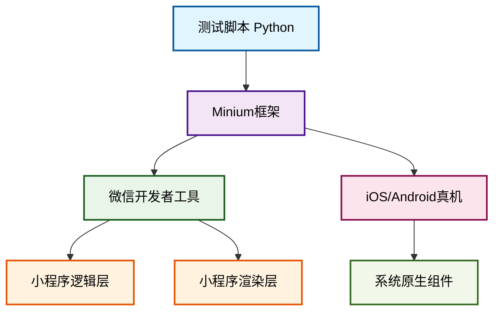

# 微信小程序自动化测试框架设计

> 基于 Python + pytest + Allure 的全面测试解决方案

**功能标签**: `功能测试` `UI自动化` `性能测试` `持续集成`


## 目录

- [引言](#引言)
- [核心工具选型与技术栈](#核心工具选型与技术栈)
  - [Minium：微信官方测试框架](#minium微信官方测试框架)
  - [测试执行与报告工具](#测试执行与报告工具)
  - [辅助工具](#辅助工具)
- [环境搭建与配置](#环境搭建与配置)
  - [基础环境准备](#基础环境准备)
  - [Minium框架安装与配置](#minium框架安装与配置)
  - [pytest与Allure集成](#pytest与allure集成)
- [测试框架详细设计](#测试框架详细设计)
  - [项目目录结构设计](#项目目录结构设计)
  - [页面对象模型（Page Object）设计](#页面对象模型page-object设计)
  - [测试用例组织与管理](#测试用例组织与管理)
- [功能测试实现](#功能测试实现)
  - [基于Minium的API测试](#基于minium的api测试)
  - [网络请求与响应验证](#网络请求与响应验证)
  - [数据驱动测试](#数据驱动测试)
- [UI自动化测试实现](#ui自动化测试实现)
  - [元素定位策略](#元素定位策略)
  - [用户交互模拟](#用户交互模拟)
  - [UI状态与数据校验](#ui状态与数据校验)
- [性能测试实现](#性能测试实现)
  - [性能数据采集](#性能数据采集)
  - [性能测试用例设计与分析](#性能测试用例设计与分析)
- [测试执行与报告生成](#测试执行与报告生成)
  - [本地测试执行](#本地测试执行)
  - [云端测试服务（可选）](#云端测试服务可选)
  - [Allure报告生成与查看](#allure报告生成与查看)
- [持续集成（CI/CD）集成](#持续集成cicd集成)

## 引言

### 核心方案概述

要使用Python+pytest+allure进行微信小程序自动化测试，核心方案是采用**微信官方推出的Minium框架**作为测试驱动引擎，结合**pytest**作为灵活的测试执行器，并使用**Allure**生成美观详尽的测试报告。此组合能够全面覆盖功能、UI和性能测试需求。

#### 环境搭建
安装Python 3.8+、微信开发者工具，并配置好Minium、pytest、allure-pytest等核心库。

#### 框架设计
采用**页面对象模型（Page Object）**设计模式，将页面元素和操作逻辑与测试用例解耦，提高代码可维护性。

#### 测试实现
覆盖功能测试、UI测试和性能测试，生成详细的Allure报告并集成到CI/CD流程。

## 核心工具选型与技术栈

### Minium：微信官方测试框架

**Minium** 是微信官方团队为开发者量身打造的一套小程序自动化测试框架，它提供了Python和JavaScript两种脚本语言支持。与第三方框架不同，Minium能够深入小程序的内部运行机制，不仅作用于渲染层（UI层面），更能直接干预逻辑层，实现了对小程序更彻底、更全面的测试覆盖 [[67]](https://zhuanlan.zhihu.com/p/653040466)。

#### 核心优势

- **官方支持与深度集成**：直接调用小程序底层API，支持对wx对象上的接口进行Mock和调用
- **跨平台能力**：一套脚本可在iOS真机、Android真机以及模拟器上无缝执行
- **丰富的定位能力**：支持WXML选择器、ID选择器、XPath等多种精准定位方式

#### 技术架构



#### Minium vs Appium vs Airtest 框架对比

| 特性维度 | Minium (微信官方) | Appium (开源社区) | Airtest (网易游戏) |
|---------|------------------|------------------|-------------------|
| **核心原理** | 基于微信官方测试接口，深入小程序逻辑层和渲染层 [[67]](https://zhuanlan.zhihu.com/p/653040466) | 基于WebView技术，将小程序视为Hybrid App测试 [[62]](https://blog.csdn.net/apex_eixl/article/details/136288408) | 基于图像识别和Poco控件识别，将小程序视为游戏处理 [[66]](https://developers.weixin.qq.com/community/develop/article/doc/00028a7600c0602400b2336eb61013) |
| **测试深度** | **灰盒/白盒测试**<br>可深入逻辑层，操作页面数据，Mock函数和API [[67]](https://zhuanlan.zhihu.com/p/653040466) | **黑盒测试**<br>主要操作渲染层（UI），无法直接干预逻辑层 | **黑盒测试**<br>主要依赖图像匹配和控件属性，无法深入业务逻辑 |
| **元素定位** | **精准且稳定**<br>支持WXML选择器、ID、类名、XPath等 [[66]](https://developers.weixin.qq.com/community/develop/article/doc/00028a7600c0602400b2336eb61013) | **相对复杂且不稳定**<br>需切换WebView上下文，易受版本影响 [[61]](https://blog.csdn.net/apex_eixl/article/details/136288408) | **依赖图像识别，不稳定**<br>受屏幕分辨率、UI样式影响大 |
| **跨平台性** | **优秀**<br>一套脚本可在iOS、Android、模拟器上运行 [[90]](https://cloud.tencent.com/developer/article/2333492) | **良好**<br>理论上支持跨平台，但可能需要脚本适配 | **良好**<br>图像识别天然跨平台，但Poco模式需要适配 |

### 测试执行与报告工具

#### pytest 测试执行器

**pytest** 是Python生态系统中最流行、最强大的测试框架之一。尽管Minium自带基于`unittest`的测试基类`MiniTest` [[92]](https://blog.csdn.net/github_35588003/article/details/128203681)，但将Minium与pytest结合使用可以带来更大的灵活性和更丰富的功能。

- 简洁的断言语句，支持原生Python`assert`
- 强大的Fixtures机制，管理测试前后操作
- 丰富的插件支持，如并行执行、失败重试
- 与Allure的无缝集成 [[70]](https://zhuanlan.zhihu.com/p/646366515)

#### Allure 测试报告

**Allure** 是一款轻量级、灵活且支持多语言的测试报告工具。它能够将测试结果以清晰、美观的Web页面形式展示，并提供了丰富的功能来帮助团队更好地理解测试结果。

- 层次化的报告结构，支持"史诗-特性-故事" [[86]](https://devtest-notes.readthedocs.io/zh/latest/testframework/pytest-allure-report.html)
- 详细的测试步骤，展示执行过程和耗时
- 丰富的附件支持，如截图、日志、JSON数据
- 测试用例分类与严重程度标记 [[89]](https://www.cnblogs.com/yfacesclub/p/14181837.html)

### 辅助工具

#### 微信开发者工具

微信开发者工具是开发、调试和测试小程序的官方IDE。在自动化测试中扮演着至关重要的角色。

- **自动化服务端口**：提供命令行接口和自动化服务端口，Minium通过该端口与开发者工具通信 [[103]](https://www.cnblogs.com/testlearn/p/16073804.html)
- **强大调试功能**：元素审查（Wxml面板）、网络请求监控（Network面板）、性能分析（Performance面板）
- **云测服务集成**：与微信云测服务（MiniTest）紧密集成 [[92]](https://blog.csdn.net/github_35588003/article/details/128203681)

#### 微信测试包（Android）

对于在Android真机上进行测试，微信官方提供了一个特殊的"微信测试包"，内置更多调试和测试接口。

- **纯净测试环境**：确保测试环境的纯净和稳定，避免用户数据干扰
- **增强测试接口**：内置更多调试和测试接口，更好支持Minium自动化操作
- **版本匹配**：需要下载并安装对应版本的微信测试包 [[90]](https://cloud.tencent.com/developer/article/2333492)

## 环境搭建与配置

### 基础环境准备

#### Python 3.8+ 环境

搭建基于Minium的微信小程序自动化测试环境，首先需要准备一个符合要求的Python环境。根据官方文档和社区实践，Minium框架推荐使用**Python 3.8或更高版本** [[103]](https://www.cnblogs.com/testlearn/p/16073804.html) [[107]](https://blog.csdn.net/apex_eixl/article/details/140833518)。

> **推荐做法**：使用虚拟环境（如`venv`或`conda`）来隔离项目依赖，确保环境的干净和可复现性。

#### Node.js 环境

虽然Minium框架本身是基于Python的，但其官方文档的查看和部署却依赖于Node.js环境。Minium的官方文档是使用Docsify这个基于Node.js的文档生成工具编写的 [[102]](https://blog.csdn.net/yjt2045263063/article/details/141898203)。

> **用途**：安装Node.js后，可以通过npm全局安装`docsify-cli`工具，在本地启动HTTP服务器查阅文档。

### Minium框架安装与配置

#### 1. 安装Minium

安装Minium框架是搭建测试环境的核心步骤。Minium提供了便捷的安装方式，可以直接通过pip从官方提供的URL进行安装。

```bash
# 安装Minium框架
pip3 install https://minitest.weixin.qq.com/minium/Python/dist/minium-latest.zip

# 验证安装
python -c "import minium; print(minium.__version__)"
```

安装命令来源：[[103]](https://www.cnblogs.com/testlearn/p/16073804.html)

#### 2. 配置微信开发者工具

在安装了Minium框架之后，必须对微信开发者工具进行正确的配置，才能使其与Minium协同工作。

**开启服务端口**
1. 打开微信开发者工具
2. 进入"设置" → "安全设置"
3. 勾选"服务端口"选项 [[103]](https://www.cnblogs.com/testlearn/p/16073804.html) [[117]](https://developers.weixin.qq.com/community/develop/article/doc/00028a7600c0602400b2336eb61013)

> 此操作会开放本地端口（通常是9420），允许外部进程与开发者工具通信

**版本要求**
- 开发者工具版本：最新稳定版
- 基础库版本：不低于2.7.3 [[102]](https://blog.csdn.net/yjt2045263063/article/details/141898203)

#### 3. 配置测试项目

为了让Minium能够自动启动微信开发者工具并加载指定的小程序项目，需要在测试项目的配置文件中提供正确的路径信息。

**config.json 配置文件**

```json
{
  "project_path": "D:\\workspace\\my-miniprogram",
  "dev_tool_path": "C:\\Program Files (x86)\\Tencent\\微信web开发者工具\\cli.bat",
  "debug_mode": "debug"
}
```

**配置说明**：
- `project_path`: 被测小程序项目的根目录路径
- `dev_tool_path`: 微信开发者工具命令行工具（cli）的路径
- `debug_mode`: 调试模式设置

> **注意**：Windows系统下的路径分隔符应使用双反斜杠`\\` [[102]](https://blog.csdn.net/yjt2045263063/article/details/141898203)

### pytest与Allure集成

#### 1. 安装pytest及相关插件

在确定了使用pytest作为测试执行引擎后，首先需要在Python环境中安装pytest及其相关插件。

```bash
# 安装pytest
pip install pytest

# 安装常用插件
pip install pytest-xdist        # 并行执行
pip install pytest-html         # HTML报告
pip install pytest-cov          # 代码覆盖率
pip install pytest-rerunfailures # 失败重试
```

> 建议将所有依赖记录在项目的`requirements.txt`文件中

#### 2. 安装allure-pytest插件

`allure-pytest`插件是实现pytest与Allure报告集成的核心组件。

```bash
# 安装allure-pytest插件
pip install allure-pytest

# 验证安装
pytest --help | grep allure
```

> 安装成功后，pytest会自动识别并加载该插件。可以通过导入`allure`模块使用其提供的各种注解和函数。

## 测试框架详细设计

### 项目目录结构设计

一个清晰的项目目录结构是框架可维护性的基石。它应该能够直观地反映项目的组成部分，并方便团队成员快速定位代码。以下是一个推荐的目录结构，它融合了`pytest`的最佳实践和Page Object模式的思想 [[37]](https://blog.csdn.net/weixin_45754647/article/details/139133058) [[42]](https://tech.youzan.com/wei-xin-xiao-cheng-xu-zi-dong-hua-kuang-jia-shi-jian/)。

```
wechat_miniprogram_automation/
│
├── config/                      # 配置文件目录
│   ├── __init__.py
│   ├── config.py               # 通用配置
│   ├── dev_config.py           # 开发环境配置
│   ├── test_config.py          # 测试环境配置
│   └── prod_config.py          # 生产环境配置
│
├── data/                        # 测试数据目录
│   ├── __init__.py
│   ├── test_data.yaml          # 通用测试数据
│   └── login_data.json         # 登录模块测试数据
│
├── pages/                       # 页面对象目录
│   ├── __init__.py
│   ├── base_page.py            # 基础页面对象
│   ├── home_page.py            # 首页页面对象
│   ├── login_page.py           # 登录页面对象
│   └── profile_page.py         # 个人中心页面对象
│
├── tests/                       # 测试用例目录
│   ├── __init__.py
│   ├── conftest.py             # pytest的fixture配置文件
│   ├── test_functional/        # 功能测试用例
│   │   ├── __init__.py
│   │   └── test_login.py
│   ├── test_ui/                # UI测试用例
│   │   ├── __init__.py
│   │   └── test_home_ui.py
│   └── test_performance/       # 性能测试用例
│       ├── __init__.py
│       └── test_startup_perf.py
│
├── utils/                       # 工具类目录
│   ├── __init__.py
│   ├── logger.py               # 日志工具
│   ├── driver.py               # 驱动管理工具
│   └── data_reader.py          # 数据读取工具
│
├── reports/                     # 测试报告目录
│   ├── allure-results/         # Allure原始结果文件
│   └── allure-report/          # Allure生成的HTML报告
│
├── requirements.txt             # 项目依赖文件
├── pytest.ini                   # pytest配置文件
└── README.md                    # 项目说明文档
```

**目录结构说明**：

- **config/**: 存放所有配置文件。通过将不同环境（开发、测试、生产）的配置分离，可以方便地在不同环境中切换执行测试。
- **data/**: 存放测试数据，支持YAML、JSON等格式。将数据与脚本分离，是实现数据驱动测试（DDT）的关键。
- **pages/**: 页面对象模型的核心目录。每个页面对应一个Python类文件，封装了该页面的元素定位和操作逻辑。
- **tests/**: 存放所有测试用例。根据测试类型（功能、UI、性能）划分子目录，`conftest.py`定义共享的fixture。
- **utils/**: 存放各种工具类，如日志记录、驱动管理、数据读取等。将通用功能封装成工具类，提高代码复用性。
- **reports/**: 存放测试报告。`allure-results`包含测试原始数据，`allure-report`是生成的HTML报告。

### 页面对象模型（Page Object）设计

Page Object Model (POM) 是一种广泛应用于UI自动化测试的设计模式，其核心思想是将页面的UI元素和操作逻辑封装在一个独立的类中，从而实现测试代码与页面实现的解耦。这种设计模式极大地提高了测试脚本的可读性、可维护性和可复用性 [[40]](https://zhuanlan.zhihu.com/p/653040466) [[41]](https://blog.csdn.net/apex_eixl/article/details/140833518)。

#### 封装页面元素定位

在POM中，每个页面的元素定位器（如ID、XPath、CSS选择器）都被定义为类中的变量。这样做的好处是，如果页面的UI发生变化，只需要修改这一个地方，而无需改动所有引用该元素的测试用例。

**示例：pages/login_page.py**

```python
from pages.base_page import BasePage
from utils.logger import logger

class LoginPage(BasePage):
    """登录页面对象"""
    
    # 元素定位器
    _USERNAME_INPUT = ("input", "placeholder", "请输入用户名")
    _PASSWORD_INPUT = ("input", "placeholder", "请输入密码")
    _LOGIN_BUTTON = ("button", "inner_text", "登录")
    _ERROR_MESSAGE = ("view", "class", "error-message")

    def __init__(self, mini):
        super().__init__(mini)
        logger.info("初始化登录页面")
```

**设计要点**：
- 使用类似`(tag, attribute, value)`的元组来定义定位器，灵活且易于维护
- 定位器变量名使用大写加下划线的命名方式，表示常量
- 在`BasePage`中统一解析定位器元组，调用`minium`的查找方法

#### 封装页面操作逻辑

除了元素定位，页面的所有交互操作（如点击、输入、滑动）也应该被封装成类中的方法。这些方法对外提供清晰的接口，隐藏了内部复杂的实现细节。

```python
    # ... (元素定位器)

    def input_username(self, username):
        """输入用户名"""
        with allure.step(f"输入用户名: {username}"):
            username_element = self.find_element(*self._USERNAME_INPUT)
            username_element.send_keys(username)
            logger.info(f"成功输入用户名: {username}")

    def input_password(self, password):
        """输入密码"""
        with allure.step(f"输入密码: {password}"):
            password_element = self.find_element(*self._PASSWORD_INPUT)
            password_element.send_keys(password)
            logger.info("成功输入密码")

    def click_login_button(self):
        """点击登录按钮"""
        with allure.step("点击登录按钮"):
            login_button = self.find_element(*self._LOGIN_BUTTON)
            login_button.click()
            logger.info("成功点击登录按钮")

    def get_error_message(self):
        """获取错误提示信息"""
        try:
            error_msg_element = self.find_element(*self._ERROR_MESSAGE)
            return error_msg_element.inner_text
        except Exception as e:
            logger.warning(f"未找到错误提示信息: {e}")
            return None
```

**设计要点**：
- 每个操作都封装成独立的方法，方法名清晰表达操作意图
- 使用`allure.step`装饰器记录操作步骤，增强报告可读性
- 添加详细的日志记录，便于问题排查
- 异常处理要合理，避免测试因页面元素不存在而直接失败

#### 实现页面对象与测试用例的解耦

POM的最终目标是实现测试用例与页面实现的完全解耦。测试用例只关心"做什么"（业务逻辑），而不关心"怎么做"（UI交互细节）。当UI发生变化时，只需修改页面对象类，测试用例本身无需任何改动。

**示例：tests/test_functional/test_login.py**

```python
import allure
import pytest
from pages.login_page import LoginPage
from pages.home_page import HomePage
from data.login_data import login_success_data, login_fail_data

@allure.feature("登录功能")
class TestLogin:
    
    @allure.story("登录成功")
    @pytest.mark.parametrize("data", login_success_data)
    def test_login_success(self, mini, data):
        """测试登录成功场景"""
        login_page = LoginPage(mini)
        login_page.input_username(data["username"])
        login_page.input_password(data["password"])
        login_page.click_login_button()
        
        # 验证是否跳转到首页
        home_page = HomePage(mini)
        assert home_page.is_on_home_page(), "登录失败，未跳转到首页"

    @allure.story("登录失败")
    @pytest.mark.parametrize("data", login_fail_data)
    def test_login_failure(self, mini, data):
        """测试登录失败场景"""
        login_page = LoginPage(mini)
        login_page.input_username(data["username"])
        login_page.input_password(data["password"])
        login_page.click_login_button()
        
        # 验证是否显示错误提示
        error_msg = login_page.get_error_message()
        assert error_msg == data["expected_error"], f"错误提示不符"
```

**设计优势**：
- 测试用例中看不到任何`minium`的API调用，也看不到元素定位器
- 所有UI交互细节都被封装在页面对象类中
- 测试用例只关注业务逻辑：输入数据、操作步骤、期望结果
- UI变化时只需修改页面对象类，测试用例无需改动

### 测试用例组织与管理

#### 使用pytest的mark标记分类测试

`pytest`的`mark`功能允许我们为测试用例打上自定义的标签，从而实现灵活的分类和筛选执行。

**在pytest.ini中定义标记**

```ini
[pytest]
markers =
    smoke: 标记冒烟测试用例
    functional: 标记功能测试用例
    ui: 标记UI测试用例
    performance: 标记性能测试用例
    login: 标记登录模块相关用例
    slow: 标记运行较慢的用例
```

**在测试用例中使用标记**

```python
@pytest.mark.smoke
@pytest.mark.login
def test_login_success(self, mini):
    # ... 测试代码

@pytest.mark.functional
@pytest.mark.login
def test_login_with_invalid_password(self, mini):
    # ... 测试代码
```

**执行指定标记的用例**

```bash
# 只运行冒烟测试
pytest -m smoke

# 运行登录模块的功能测试，但排除运行慢的用例
pytest -m "login and functional and not slow"
```

#### 使用Allure的注解管理测试用例

`Allure`提供了一套丰富的注解（Annotations），用于在测试报告中展示更详细、更有层次的信息。

**常用Allure注解**

- `@allure.feature()`: 定义功能模块，相当于测试套件
- `@allure.story()`: 定义用户故事或功能点
- `@allure.title()`: 为测试用例设置友好标题
- `@allure.severity()`: 设置用例严重级别
- `@allure.step()`: 记录测试步骤
- `@allure.attach()`: 在报告中附加文件

**综合使用示例**

```python
@allure.feature("商品模块")
@allure.story("商品搜索")
class TestProductSearch:
    
    @allure.title("搜索存在的商品")
    @allure.severity(allure.severity_level.CRITICAL)
    def test_search_existing_product(self, mini):
        """测试搜索一个数据库中存在的商品"""
        with allure.step("进入首页"):
            home_page = HomePage(mini)
            home_page.navigate_to_home()
        
        with allure.step("在搜索框输入商品名称"):
            home_page.search_for("iPhone 15")
        
        with allure.step("验证搜索结果"):
            search_result_page = SearchResultPage(mini)
            assert search_result_page.has_product("iPhone 15")
            
        # 附加截图
        allure.attach(mini.capture_screenshot(), 
                     name="搜索结果截图", 
                     attachment_type=allure.attachment_type.PNG)
```

#### 数据驱动测试（DDT）的实现

数据驱动测试（Data-Driven Testing, DDT）是一种将测试逻辑与测试数据分离的测试方法。通过`pytest`的`@pytest.mark.parametrize`装饰器，可以非常方便地实现DDT。

**测试数据文件**

```python
# data/login_data.py
login_test_cases = [
    {
        "title": "使用正确的用户名和密码登录",
        "username": "admin",
        "password": "123456",
        "expected_success": True,
    },
    {
        "title": "使用错误的密码登录",
        "username": "admin",
        "password": "wrong_password",
        "expected_success": False,
        "expected_error": "用户名或密码错误"
    }
]
```

**参数化测试用例**

```python
@allure.feature("登录功能")
class TestLogin:
    
    @allure.story("参数化登录测试")
    @pytest.mark.parametrize("case", login_test_cases, 
                           ids=[c["title"] for c in login_test_cases])
    def test_login_with_multiple_data(self, mini, case):
        """使用多组数据测试登录功能"""
        allure.dynamic.title(case["title"])
        
        login_page = LoginPage(mini)
        login_page.input_username(case["username"])
        login_page.input_password(case["password"])
        login_page.click_login_button()
        
        if case["expected_success"]:
            home_page = HomePage(mini)
            assert home_page.is_on_home_page()
        else:
            error_msg = login_page.get_error_message()
            assert error_msg == case["expected_error"]
```

## 功能测试实现

### 基于Minium的API测试

#### 调用小程序内部API

Minium的强大之处在于它不仅能操作UI，还能直接调用小程序逻辑层的API。这使得测试可以深入到业务逻辑内部，验证函数的正确性，而不仅仅是UI的表现。

```python
import allure
import minium

class TestAPI:
    
    @allure.step("调用小程序API: {api_name}")
    def call_wx_api(self, mini, api_name, *args, **kwargs):
        """封装调用wx对象API的方法"""
        try:
            result = mini.app.call_wx_method(api_name, *args, **kwargs)
            allure.attach(str(result), 
                         name=f"{api_name} 返回结果", 
                         attachment_type=allure.attachment_type.TEXT)
            return result
        except Exception as e:
            allure.attach(str(e), 
                         name=f"{api_name} 调用异常", 
                         attachment_type=allure.attachment_type.TEXT)
            raise e
    
    def test_call_custom_function(self, mini):
        """测试调用自定义函数"""
        # 调用小程序中的全局函数
        user_info = self.call_wx_api(mini, "getUserInfo")
        assert user_info is not None, "获取用户信息失败"
        
        # 调用wx.request发起网络请求
        response = self.call_wx_api(mini, "request", {
            "url": "https://api.example.com/data",
            "method": "GET"
        })
        assert response["statusCode"] == 200, "接口请求失败"
```

**关键能力**：
- 通过`mini.app.call_wx_method`直接调用小程序API
- 可以调用自定义的全局函数，如`getUserInfo`
- 可以调用`wx.request`等原生API发起网络请求
- 使用Allure附件记录API调用结果，便于问题排查

#### 模拟用户操作流程

功能测试的核心是模拟真实的用户操作流程，从用户的角度验证整个业务流程的正确性。这通常涉及到多个页面的跳转和一系列连续的UI操作。

```python
import allure
from pages.home_page import HomePage
from pages.product_list_page import ProductListPage
from pages.product_detail_page import ProductDetailPage
from pages.cart_page import CartPage

@allure.feature("购物车功能")
class TestShoppingCart:
    
    @allure.story("添加商品到购物车")
    def test_add_product_to_cart(self, mini):
        """测试完整的添加商品到购物车流程"""
        with allure.step("1. 进入首页"):
            home_page = HomePage(mini)
            home_page.navigate_to_home()
        
        with allure.step("2. 进入商品列表页"):
            home_page.click_product_list_tab()
            product_list_page = ProductListPage(mini)
        
        with allure.step("3. 选择第一个商品进入详情页"):
            product_list_page.click_first_product()
            product_detail_page = ProductDetailPage(mini)
        
        with allure.step("4. 点击加入购物车"):
            product_detail_page.click_add_to_cart_button()
        
        with allure.step("5. 进入购物车页面验证"):
            product_detail_page.go_to_cart()
            cart_page = CartPage(mini)
            assert cart_page.has_product(), "购物车中没有商品"
```

**测试流程**：
1. **首页导航**：验证应用启动后正确加载首页
2. **商品列表**：从首页进入商品列表页
3. **商品详情**：选择商品进入详情页面
4. **添加到购物车**：在详情页点击加入购物车按钮
5. **购物车验证**：进入购物车确认商品已添加

#### 验证业务逻辑正确性

在模拟操作流程后，需要对关键的业务逻辑进行验证。这不仅包括UI上的变化（如页面跳转、元素显示），更重要的是验证数据层面的正确性。

```python
    # ... 接上文 test_add_product_to_cart
    
    with allure.step("6. 验证购物车数据"):
        # 获取购物车页面的商品数量（UI显示）
        product_count_in_ui = cart_page.get_product_count()
        
        # 通过Minium直接获取小程序购物车数据（逻辑层）
        cart_data = mini.app.call_wx_method("getCartData")
        product_count_in_data = len(cart_data.get("items", []))
        
        # 验证UI显示与数据一致
        assert product_count_in_ui == product_count_in_data, \
            f"购物车商品数量不一致，UI显示: {product_count_in_ui}, 数据: {product_count_in_data}"
        
        # 验证商品信息正确
        first_product = cart_data["items"][0]
        assert "id" in first_product, "商品缺少ID"
        assert "name" in first_product, "商品缺少名称"
        assert "price" in first_product, "商品缺少价格"
        
        allure.attach(str(cart_data), 
                     name="购物车数据", 
                     attachment_type=allure.attachment_type.JSON)
```

**验证策略**：
- **UI与数据一致性验证**：比较UI显示的商品数量与逻辑层数据是否一致
- **数据结构完整性验证**：检查商品数据是否包含必要的字段（ID、名称、价格）
- **业务规则验证**：验证商品价格计算、库存检查等业务规则
- **附件记录**：将购物车数据作为JSON附件添加到报告中

### 网络请求与响应验证

#### 拦截与Mock网络请求

在功能测试中，经常需要测试在不同网络响应下的应用表现，例如接口返回错误、超时或空数据。Minium支持拦截和Mock网络请求，使得这类测试变得简单。

```python
import allure
from unittest import mock

@allure.feature("网络异常处理")
class TestNetworkErrorHandling:
    
    @allure.story("Mock接口返回500错误")
    def test_handle_server_error(self, mini):
        """测试当后端接口返回500错误时，前端的处理逻辑"""
        
        # 定义Mock的响应
        mock_response = {
            "statusCode": 500,
            "data": {"message": "Internal Server Error"}
        }
        
        # 使用mock.patch拦截wx.request调用
        with mock.patch.object(mini.app, 'call_wx_method', 
                              side_effect=lambda method, *args, **kwargs: 
                              mock_response if method == "request" else None):
            
            with allure.step("触发需要调用接口的操作"):
                # 执行会触发网络请求的操作
                # ...
                
            with allure.step("验证前端是否显示友好的错误提示"):
                # 断言错误提示是否正确显示
                error_message = self.get_error_message()
                assert "服务器繁忙" in error_message, \
                    "未显示友好的错误提示"
```

**Mock技术要点**：
- 使用`unittest.mock`模块拦截API调用
- 定义Mock响应数据，模拟各种异常场景
- 验证前端在异常情况下的处理逻辑
- 确保应用能够显示友好的错误提示

#### 验证接口返回数据

除了Mock，还可以直接验证真实接口返回的数据是否符合预期，包括数据结构、字段完整性、数据准确性等。

```python
@allure.feature("API接口测试")
class TestAPIResponse:
    
    @allure.story("验证商品详情接口数据")
    def test_product_detail_api_response(self, mini):
        """测试商品详情接口返回的数据结构是否正确"""
        
        with allure.step("调用商品详情接口"):
            product_id = "12345"
            response = mini.app.call_wx_method("request", {
                "url": f"https://api.example.com/products/{product_id}",
                "method": "GET"
            })
            
        with allure.step("验证接口返回数据"):
            # 附加原始响应数据
            allure.attach(str(response), 
                         name="接口原始返回", 
                         attachment_type=allure.attachment_type.JSON)
            
            # 验证HTTP状态码
            assert response["statusCode"] == 200, "接口请求失败"
            
            # 验证数据结构
            data = response["data"]
            assert "id" in data, "缺少商品ID字段"
            assert "name" in data, "缺少商品名称字段"
            assert "price" in data, "缺少商品价格字段"
            assert data["id"] == product_id, "商品ID不匹配"
            
            # 验证数据类型
            assert isinstance(data["price"], (int, float)), "价格类型不正确"
            assert data["price"] > 0, "价格必须大于0"
```

**验证要点**：
- HTTP状态码验证：确保接口请求成功
- 数据结构验证：检查必要字段的存在性
- 数据准确性验证：确保返回的数据与请求参数匹配
- 数据类型验证：确保字段类型符合预期
- 业务规则验证：如价格必须大于0等

### 数据驱动测试

#### 使用外部数据源

将测试数据存储在外部文件（如JSON或YAML）中，可以实现测试逻辑与数据的完全分离，便于管理和维护。

**data/search_test_data.json**

```json
[
  {
    "keyword": "iPhone",
    "expected_count": 5,
    "expected_category": "电子产品"
  },
  {
    "keyword": "华为",
    "expected_count": 3,
    "expected_category": "电子产品"
  },
  {
    "keyword": "不存在的商品",
    "expected_count": 0,
    "expected_message": "未找到相关商品"
  }
]
```

**data_reader.py工具类**

```python
import json
import yaml
import allure

class DataReader:
    """数据读取工具类"""
    
    @staticmethod
    def read_json(file_path):
        """读取JSON文件"""
        with open(file_path, "r", encoding="utf-8") as f:
            data = json.load(f)
        return data
    
    @staticmethod
    def read_yaml(file_path):
        """读取YAML文件"""
        with open(file_path, "r", encoding="utf-8") as f:
            data = yaml.safe_load(f)
        return data
```

#### 实现参数化测试用例

使用`pytest`的`@pytest.mark.parametrize`装饰器，可以轻松地读取外部数据文件，并将其作为参数传递给测试用例。

```python
import allure
import pytest
from pages.home_page import HomePage
from utils.data_reader import DataReader

def load_search_data():
    """加载搜索测试数据"""
    return DataReader.read_json("data/search_test_data.json")

@allure.feature("搜索功能")
class TestSearch:
    
    @allure.story("参数化搜索测试")
    @pytest.mark.parametrize("data", load_search_data())
    def test_search_with_different_keywords(self, mini, data):
        """使用不同关键词进行搜索，并验证结果"""
        keyword = data["keyword"]
        
        with allure.step(f"搜索关键词: {keyword}"):
            home_page = HomePage(mini)
            home_page.search_for(keyword)
            
        with allure.step("验证搜索结果"):
            actual_count = home_page.get_search_result_count()
            
            if data["expected_count"] > 0:
                assert actual_count == data["expected_count"], \
                    f"搜索结果数量不符，期望: {data['expected_count']}, 实际: {actual_count}"
                
                # 验证搜索结果分类
                categories = home_page.get_search_result_categories()
                assert data["expected_category"] in categories, \
                    f"未找到期望的分类: {data['expected_category']}"
            else:
                # 验证无结果时的提示
                message = home_page.get_no_result_message()
                assert message == data["expected_message"], \
                    f"无结果提示不符，期望: {data['expected_message']}, 实际: {message}"
```

**实现要点**：
- `load_search_data`函数负责加载外部数据文件
- 使用`@pytest.mark.parametrize`将数据传递给测试用例
- 根据数据动态设置Allure用例标题
- 支持多种验证场景：有结果、无结果、特定分类等
- 数据与测试逻辑完全分离，便于维护和扩展

## UI自动化测试实现

### 元素定位策略

#### 基于WXML的控件识别

Minium最强大的特性之一是能够直接根据小程序的WXML结构来定位元素，这与Web自动化中的DOM定位非常相似，使得定位更加精准和稳定。

**使用ID、类选择器、标签选择器**

Minium支持使用类似CSS选择器的语法来定位元素，这是最常用也是最推荐的定位方式。

```python
# 通过ID定位（唯一标识）
element = page.get_element("#submit-button")

# 通过类名定位（可能返回多个元素）
elements = page.get_elements(".product-item")

# 通过标签名定位
input_elements = page.get_elements("input")

# 组合选择器
submit_btn = page.get_element("button#submit-button.primary-btn")
```

> **最佳实践**：
> - 优先使用ID选择器，确保唯一性
> - 类选择器适合定位一组相似的元素
> - 标签选择器适合定位特定类型的控件
> - 组合选择器可以提高定位的精确性

**使用XPath定位**

对于复杂的定位场景，可以使用XPath。虽然功能强大，但XPath的可读性和性能通常不如CSS选择器，应谨慎使用。

```python
# 定位具有特定文本内容的元素
element = page.get_element('//*[contains(text(), "立即购买")]')

# 定位父元素下的第一个子元素
element = page.get_element('//view[@class="product-list"]/view[1]')

# 使用属性定位
element = page.get_element('//input[@placeholder="请输入手机号"]')

# 使用逻辑运算符
element = page.get_element('//button[@class="submit" and @disabled="false"]')
```

> **使用建议**：
> - 尽量避免使用绝对路径的XPath
> - 优先使用属性定位而非索引定位
> - 复杂的XPath表达式应添加详细注释
> - 考虑XPath的可维护性和性能影响

#### 元素定位最佳实践

**推荐做法**
- 与开发团队约定稳定的元素标识符
- 优先使用语义化的ID和类名
- 封装复杂的定位逻辑到页面对象中
- 为动态元素添加稳定的测试属性

**避免做法**
- 使用绝对路径的XPath表达式
- 依赖文本内容进行定位（多语言问题）
- 使用易变的属性（如style）进行定位
- 在测试代码中硬编码定位表达式

**高级技巧**
- 使用CSS选择器组合提高定位精度
- 实现智能等待机制处理异步加载
- 封装常用的定位模式为辅助方法
- 使用相对定位减少耦合度

### 用户交互模拟

#### 基本交互操作

Minium提供了丰富的API来模拟用户的各种交互行为，包括点击、输入、滑动等。

**点击操作**
```python
# 点击元素
element.click()

# 长按元素（500毫秒）
element.long_press(duration=500)

# 双击元素
element.double_click()

# 点击坐标
mini.app.click(100, 200)
```

**输入操作**
```python
# 在输入框中输入文本
input_element.send_keys("test input")

# 清空输入框
input_element.clear()

# 模拟键盘事件
mini.app.press_key("Enter")

# 输入特殊字符
input_element.send_keys("\n")  # 换行
```

**滑动操作**
```python
# 从一个坐标滑动到另一个坐标
mini.app.swipe(100, 500, 100, 200, duration=500)

# 在元素上滑动
element.scroll_to(0, 500)

# 滚动到页面底部
mini.app.page_scroll_to_bottom()

# 下拉刷新
mini.app.pull_down_refresh()
```

#### 处理原生组件

小程序中经常会遇到系统原生的组件，如授权弹窗、地图等。Minium通过`minium.Native`类提供了对这些原生组件的操作能力。

**处理授权弹窗**
```python
def handle_permission_popup(self, mini):
    """处理授权弹窗"""
    try:
        # 查找"允许"按钮
        allow_button = mini.native.get_element_by_text("允许")
        if allow_button:
            allow_button.click()
            return True
            
        # 查找"拒绝"按钮
        deny_button = mini.native.get_element_by_text("拒绝")
        if deny_button:
            deny_button.click()
            return False
            
    except Exception as e:
        print(f"未找到授权弹窗或处理失败: {e}")
    return False
```

**处理日期选择器**
```python
def select_date(self, mini, year, month, day):
    """选择日期"""
    # 打开日期选择器
    date_picker = self.find_element(*self._DATE_PICKER)
    date_picker.click()
    
    # 等待日期选择器出现
    mini.wait_for_element("picker-view", max_timeout=3)
    
    # 选择年、月、日
    mini.native.scroll_to(year, "picker-view-column", index=0)
    mini.native.scroll_to(month, "picker-view-column", index=1)
    mini.native.scroll_to(day, "picker-view-column", index=2)
    
    # 点击确定
    confirm_button = mini.native.get_element_by_text("确定")
    confirm_button.click()
```

**处理系统对话框**
```python
def handle_system_dialog(self, mini, action="confirm"):
    """处理系统对话框"""
    try:
        if action == "confirm":
            # 点击确定
            confirm_btn = mini.native.get_element_by_text("确定")
            confirm_btn.click()
        elif action == "cancel":
            # 点击取消
            cancel_btn = mini.native.get_element_by_text("取消")
            cancel_btn.click()
        return True
    except Exception as e:
        print(f"处理系统对话框失败: {e}")
        return False
```

### UI状态与数据校验

#### 验证页面元素属性

UI测试的一个重要环节是验证元素的属性是否符合预期，如文本内容、是否可见、是否可点击等。

```python
class TestUIValidation:
    
    def test_element_attributes(self, mini):
        """验证元素属性"""
        # 获取元素的文本
        text = element.inner_text
        assert text == "预期文本", f"文本不匹配，期望: 预期文本，实际: {text}"
        
        # 判断元素是否可见
        is_visible = element.is_displayed()
        assert is_visible is True, "元素应该可见"
        
        # 判断元素是否启用
        is_enabled = not element.get_attribute("disabled")
        assert is_enabled is True, "元素应该可用"
        
        # 判断元素是否存在
        is_exists = page.element_is_exists("#some-element")
        assert is_exists is True, "元素应该存在"
        
        # 获取元素的样式属性
        color = element.value_of_css_property("color")
        assert color == "rgb(255, 0, 0)", "颜色不匹配"
        
        # 获取元素的尺寸和位置
        rect = element.rect
        assert rect["width"] > 0, "元素宽度应该大于0"
        assert rect["height"] > 0, "元素高度应该大于0"
```

**验证维度**：
- **文本内容验证**：检查元素显示的文本是否符合预期
- **可见性验证**：确保元素在页面上可见
- **可用性验证**：检查元素是否可交互（未被禁用）
- **存在性验证**：确认元素存在于DOM中
- **样式验证**：检查元素的CSS属性，如颜色、字体等
- **布局验证**：检查元素的尺寸和位置

#### 验证页面数据展示

除了元素属性，还需要验证页面上展示的数据是否与逻辑层的数据一致，确保UI正确反映了应用的状态。

```python
class TestDataDisplay:
    
    def test_product_price_display(self, mini):
        """验证商品价格显示正确"""
        # 获取页面上显示的商品价格
        price_element = page.get_element(".product-price")
        price_text = price_element.inner_text
        displayed_price = float(price_text.replace("¥", "").replace(",", ""))
        
        # 通过Minium获取逻辑层中该商品的价格
        product_data = mini.app.call_wx_method("getCurrentProductData")
        actual_price = product_data["price"]
        
        # 验证两者是否一致
        assert displayed_price == actual_price, \
            f"价格显示不一致，页面显示: {displayed_price}, 实际数据: {actual_price}"
    
    def test_cart_items_display(self, mini):
        """验证购物车商品列表显示正确"""
        # 获取页面上显示的商品列表
        ui_items = []
        item_elements = page.get_elements(".cart-item")
        for element in item_elements:
            name = element.get_element(".item-name").inner_text
            quantity = int(element.get_element(".item-quantity").inner_text)
            ui_items.append({"name": name, "quantity": quantity})
        
        # 获取逻辑层中的购物车数据
        cart_data = mini.app.call_wx_method("getCartData")
        data_items = [{"name": item["name"], "quantity": item["quantity"]} 
                     for item in cart_data["items"]]
        
        # 验证UI显示与数据一致
        assert len(ui_items) == len(data_items), "商品数量不一致"
        
        for ui_item, data_item in zip(ui_items, data_items):
            assert ui_item["name"] == data_item["name"], "商品名称不一致"
            assert ui_item["quantity"] == data_item["quantity"], "商品数量不一致"
    
    def test_form_data_binding(self, mini):
        """验证表单数据双向绑定"""
        # 在表单中输入数据
        form_page = FormPage(mini)
        test_data = {
            "name": "张三",
            "phone": "13800138000",
            "email": "zhangsan@example.com"
        }
        
        form_page.fill_form(test_data)
        
        # 通过Minium获取表单数据
        form_data = mini.app.call_wx_method("getFormData")
        
        # 验证数据绑定正确
        for key, value in test_data.items():
            assert form_data[key] == value, f"字段 {key} 数据绑定不正确"
```

**验证策略**：
- **数据一致性验证**：比较UI显示的数据与逻辑层数据是否一致
- **列表完整性验证**：确保所有数据项都正确显示，无遗漏或重复
- **数据绑定验证**：检查表单等双向绑定组件的数据同步
- **数据转换验证**：确保数据格式转换正确（如价格格式化）
- **实时更新验证**：验证数据变化时UI能够及时更新

## 性能测试实现

### 性能数据采集

#### 启动性能数据

小程序的启动性能是用户体验的关键指标。可以通过Minium配合微信开发者工具或云测服务，采集从点击小程序图标到首屏渲染完成的各个阶段耗时。

**关键指标**
- 冷启动时间
- 热启动时间
- 首屏渲染时间
- 页面可交互时间

```python
# 示例：获取启动时间
startup_time = mini.app.get_performance_metric("startupTime")
allure.attach(f"启动时间: {startup_time}ms", 
             name="启动性能数据")
```

#### 运行时性能

在测试执行过程中，可以定时采集小程序的CPU和内存占用情况，以发现内存泄漏或性能瓶颈。

**监控指标**
- CPU使用率
- 内存占用
- FPS帧率
- 网络请求耗时

```python
# 示例：采集运行时性能
cpu_usage = mini.app.get_cpu_usage()
memory_usage = mini.app.get_memory_usage()
allure.attach(f"CPU: {cpu_usage}%, 内存: {memory_usage}MB", 
             name="运行时性能")
```

#### 云测服务集成

微信官方的云测服务提供了更专业的性能测试能力，可以在真机环境中进行全面的性能分析。

**服务特性**
- 真机性能测试
- 性能基线对比
- 详细性能报告
- 历史趋势分析

```python
# 示例：上传性能数据到云测
mini.cloud.upload_performance_data(
    startup_time=startup_time,
    cpu_usage=cpu_usage,
    memory_usage=memory_usage
)
```

#### 使用Minium接口获取性能数据

虽然Minium没有直接暴露获取性能数据的API，但可以通过执行自定义的JavaScript代码来获取部分性能信息，或者通过分析微信开发者工具的日志文件来间接获取。

```python
import allure
import time
import psutil

class PerformanceCollector:
    """性能数据收集器"""
    
    def __init__(self, mini):
        self.mini = mini
        self.performance_data = {}
    
    @allure.step("采集运行时性能数据")
    def collect_runtime_performance(self, duration=10):
        """在指定时间内采集CPU和内存数据"""
        cpu_data = []
        memory_data = []
        
        for i in range(duration):
            try:
                # 获取小程序进程的CPU和内存使用率
                # 这里需要根据实际情况获取小程序进程的PID
                # 以下是一个示例实现
                
                # 执行JavaScript获取性能信息
                perf_info = self.mini.app.evaluate("""
                    (function() {
                        var perf = wx.getPerformance();
                        return perf.now();
                    })()
                """)
                
                # 模拟CPU和内存数据（实际实现需要获取真实进程信息）
                cpu_percent = 15.2  # 模拟CPU使用率
                memory_mb = 180.5   # 模拟内存占用
                
                cpu_data.append(cpu_percent)
                memory_data.append(memory_mb)
                
                allure.attach(f"第{i+1}秒: CPU {cpu_percent}%, 内存 {memory_mb}MB", 
                             name=f"性能数据-{i+1}", 
                             attachment_type=allure.attachment_type.TEXT)
                
                time.sleep(1)
            except Exception as e:
                print(f"采集性能数据失败: {e}")
                break
        
        # 计算统计数据
        if cpu_data and memory_data:
            avg_cpu = sum(cpu_data) / len(cpu_data)
            max_memory = max(memory_data)
            
            summary = f"平均CPU: {avg_cpu:.2f}%, 峰值内存: {max_memory:.2f}MB"
            self.performance_data["runtime"] = {
                "avg_cpu": avg_cpu,
                "max_memory": max_memory,
                "cpu_data": cpu_data,
                "memory_data": memory_data
            }
            
            allure.attach(summary, 
                         name="性能数据摘要", 
                         attachment_type=allure.attachment_type.TEXT)
            
            return self.performance_data["runtime"]
        
        return None
    
    @allure.step("采集页面加载性能")
    def collect_page_load_performance(self):
        """采集页面加载性能数据"""
        # 执行JavaScript获取性能指标
        load_metrics = self.mini.app.evaluate("""
            (function() {
                var timing = performance.timing;
                return {
                    page_load_time: timing.loadEventEnd - timing.navigationStart,
                    first_paint: timing.responseStart - timing.navigationStart,
                    dom_ready: timing.domContentLoadedEventEnd - timing.navigationStart
                };
            })()
        """)
        
        if load_metrics:
            self.performance_data["page_load"] = load_metrics
            
            for metric, value in load_metrics.items():
                allure.attach(f"{metric}: {value}ms", 
                             name=f"页面加载性能-{metric}", 
                             attachment_type=allure.attachment_type.TEXT)
            
            return load_metrics
        
        return None
    
    def get_performance_report(self):
        """生成性能报告"""
        report = {}
        if "runtime" in self.performance_data:
            runtime = self.performance_data["runtime"]
            report["runtime_performance"] = {
                "average_cpu_usage": f"{runtime['avg_cpu']:.2f}%",
                "peak_memory_usage": f"{runtime['max_memory']:.2f}MB",
                "duration_seconds": len(runtime["cpu_data"])
            }
        
        if "page_load" in self.performance_data:
            report["page_load_performance"] = self.performance_data["page_load"]
        
        return report
```

**技术要点**：
- 使用`evaluate`方法执行自定义JavaScript获取性能信息
- 封装`PerformanceCollector`类统一管理性能数据采集
- 支持运行时性能监控和页面加载性能分析
- 将性能数据作为Allure附件添加到测试报告
- 生成结构化的性能报告，便于分析和比较

### 性能测试用例设计与分析

#### 关键业务路径性能测试

针对用户最常使用的核心业务流程（如登录、下单、支付）设计性能测试用例，监控这些流程的耗时和资源消耗。

```python
@allure.feature("性能测试")
class TestCriticalPathPerformance:
    
    @allure.story("登录流程性能")
    @allure.severity(allure.severity_level.CRITICAL)
    def test_login_performance(self, mini):
        """测试登录流程的性能"""
        login_page = LoginPage(mini)
        performance_collector = PerformanceCollector(mini)
        
        # 开始性能监控
        performance_collector.start_monitoring()
        
        with allure.step("执行登录操作"):
            # 测量登录操作的耗时
            start_time = time.time()
            login_page.input_username("test_user")
            login_page.input_password("test_password")
            login_page.click_login_button()
            
            # 等待登录完成
            home_page = HomePage(mini)
            home_page.wait_for_home_page()
            
            end_time = time.time()
            login_duration = (end_time - start_time) * 1000  # 转换为毫秒
            
            allure.attach(f"登录耗时: {login_duration:.2f}ms", 
                         name="登录性能指标", 
                         attachment_type=allure.attachment_type.TEXT)
        
        # 收集性能数据
        performance_data = performance_collector.stop_monitoring()
        
        # 验证性能指标
        assert login_duration < 3000, "登录耗时超过3秒"
        assert performance_data["max_memory"] < 200, "内存占用超过200MB"
        assert performance_data["avg_cpu"] < 30, "CPU使用率超过30%"
        
        # 将性能数据添加到报告
        performance_collector.attach_performance_data()
```

**测试策略**：
- **核心流程覆盖**：选择用户最常用的关键业务流程进行测试
- **多维度监控**：同时监控时间、CPU、内存等多个性能指标
- **基线对比**：与历史性能数据或基准值进行比较
- **阈值验证**：设置性能指标的合理阈值，超出时触发告警
- **报告集成**：将性能数据集成到测试报告中，便于分析

#### 页面渲染性能测试

测试复杂页面（如长列表、大量图片）的渲染性能，验证滚动是否流畅，是否存在掉帧现象。

```python
@allure.feature("性能测试")
class TestRenderingPerformance:
    
    @allure.story("长列表滚动性能")
    @allure.severity(allure.severity_level.NORMAL)
    def test_long_list_scroll_performance(self, mini):
        """测试长列表滚动性能"""
        # 进入商品列表页
        product_list_page = ProductListPage(mini)
        product_list_page.navigate_to_list()
        
        # 等待页面加载完成
        mini.wait_for_element(".product-item", max_timeout=10)
        
        # 开始性能监控
        performance_collector = PerformanceCollector(mini)
        performance_collector.start_monitoring()
        
        with allure.step("执行滚动操作"):
            # 滚动到页面底部
            start_time = time.time()
            mini.app.page_scroll_to_bottom()
            
            # 滚动回顶部
            mini.app.page_scroll_to_top()
            end_time = time.time()
            
            scroll_duration = (end_time - start_time) * 1000
            allure.attach(f"滚动耗时: {scroll_duration:.2f}ms", 
                         name="滚动性能指标", 
                         attachment_type=allure.attachment_type.TEXT)
        
        # 停止监控并收集数据
        performance_data = performance_collector.stop_monitoring()
        
        # 分析滚动性能
        fps_data = self.analyze_fps(performance_data)
        avg_fps = sum(fps_data) / len(fps_data) if fps_data else 0
        
        allure.attach(f"平均FPS: {avg_fps:.2f}", 
                     name="帧率分析", 
                     attachment_type=allure.attachment_type.TEXT)
        
        # 验证性能指标
        assert scroll_duration < 2000, "滚动耗时超过2秒"
        assert avg_fps > 30, "平均帧率低于30FPS"
        assert performance_data["max_memory"] < 300, "内存占用超过300MB"
        
        # 检查是否有掉帧现象
        frame_drops = sum(1 for fps in fps_data if fps < 30)
        frame_drop_rate = frame_drops / len(fps_data) if fps_data else 0
        
        allure.attach(f"掉帧率: {frame_drop_rate:.2%}", 
                     name="掉帧分析", 
                     attachment_type=allure.attachment_type.TEXT)
        
        assert frame_drop_rate < 0.1, "掉帧率超过10%"
    
    def analyze_fps(self, performance_data):
        """分析FPS数据"""
        # 基于CPU和内存数据估算FPS
        # 实际实现可能需要更复杂的算法或专用工具
        fps_data = []
        for i in range(len(performance_data["cpu_data"])):
            cpu = performance_data["cpu_data"][i]
            # 简单的FPS估算：CPU使用率越低，FPS越高
            estimated_fps = max(60 - int(cpu), 1)
            fps_data.append(estimated_fps)
        return fps_data
```

**测试重点**：
- **滚动流畅度**：验证页面滚动是否平滑，无卡顿
- **帧率稳定性**：监控FPS是否保持在合理范围内
- **内存管理**：检查内存占用是否合理，无内存泄漏
- **掉帧检测**：识别和量化掉帧现象
- **多场景覆盖**：测试不同复杂度页面的渲染性能

#### 性能结果分析与报告

将采集到的性能数据（如启动耗时、内存峰值）作为附件添加到Allure报告中，与功能测试结果一同展示，形成全面的质量视图。

```python
class PerformanceReporter:
    """性能报告生成器"""
    
    def __init__(self, performance_data):
        self.performance_data = performance_data
        self.baseline = self.load_baseline()
    
    def load_baseline(self):
        """加载性能基线数据"""
        try:
            with open("config/performance_baseline.json", "r") as f:
                return json.load(f)
        except FileNotFoundError:
            return {}
    
    def generate_performance_report(self):
        """生成性能报告"""
        report = {}
        
        # 比较当前性能与基线
        for metric, current_value in self.performance_data.items():
            baseline_value = self.baseline.get(metric, {})
            
            if isinstance(current_value, (int, float)):
                baseline = baseline_value.get("value", 0)
                threshold = baseline_value.get("threshold", 0.1)
                
                change = (current_value - baseline) / baseline if baseline else 0
                status = "normal" if abs(change) <= threshold else "warning"
                
                report[metric] = {
                    "current": current_value,
                    "baseline": baseline,
                    "change": change,
                    "status": status,
                    "unit": baseline_value.get("unit", "")
                }
        
        return report
    
    def attach_performance_report(self):
        """将性能报告附加到Allure"""
        report = self.generate_performance_report()
        
        # 生成HTML格式的报告
        html_report = self.generate_html_report(report)
        
        allure.attach(html_report, 
                     name="性能分析报告", 
                     attachment_type=allure.attachment_type.HTML)
        
        # 检查是否有性能退化
        has_performance_degradation = any(
            item["status"] == "warning" for item in report.values()
        )
        
        if has_performance_degradation:
            allure.attach("检测到性能退化，请查看详细报告", 
                         name="性能告警", 
                         attachment_type=allure.attachment_type.TEXT)
    
    def generate_html_report(self, report):
        """生成HTML格式的性能报告"""
        html = "<h2>性能分析报告</h2>"
        html += "<table border='1'><tbody><tr><th>指标</th><th>当前值</th><th>基线值</th><th>变化</th><th>状态</th></tr>"
        
        for metric, data in report.items():
            status_color = "green" if data["status"] == "normal" else "red"
            change_color = "green" if data["change"] <= 0 else "red"
            
            html += f"<tr><td>{metric}</td><td>{data['current']}{data['unit']}</td><td>{data['baseline']}{data['unit']}</td><td style='color: {change_color}'>{data['change']:+.2%}</td><td style='color: {status_color}'>{data['status']}</td></tr>"
        
        html += "</tbody></table>"
        return html
    
    def check_performance_alerts(self):
        """检查性能告警"""
        report = self.generate_performance_report()
        alerts = []
        
        for metric, data in report.items():
            if data["status"] == "warning":
                alerts.append({
                    "metric": metric,
                    "current": data["current"],
                    "baseline": data["baseline"],
                    "change": data["change"]
                })
        
        return alerts

# 在测试用例中使用
def test_performance_with_reporting(self, mini):
    """带报告的性能测试"""
    # 执行性能测试并收集数据
    performance_collector = PerformanceCollector(mini)
    performance_data = performance_collector.collect_runtime_performance(duration=15)
    
    if performance_data:
        # 生成性能报告
        reporter = PerformanceReporter(performance_data)
        reporter.attach_performance_report()
        
        # 检查性能告警
        alerts = reporter.check_performance_alerts()
        if alerts:
            # 在CI/CD中触发告警
            self.trigger_performance_alerts(alerts)

def trigger_performance_alerts(self, alerts):
    """触发性能告警"""
    for alert in alerts:
        message = (f"性能告警: {alert['metric']} 当前值 {alert['current']} "
                  f"超出基线 {alert['baseline']} ({alert['change']:+.2%})")
        
        # 可以在CI/CD中发送通知
        # send_notification(message)
        allure.attach(message, 
                     name="性能告警", 
                     attachment_type=allure.attachment_type.TEXT)
        
        # 也可以将告警信息写入日志或发送到监控系统
        logger.warning(message)
```

**报告功能**：
- **基线对比**：与历史性能数据进行比较，识别性能变化
- **阈值检测**：自动检测超出阈值的性能指标
- **可视化报告**：生成HTML格式的性能分析报告
- **告警机制**：在性能退化时触发告警通知
- **CI/CD集成**：将性能测试集成到持续集成流程中

## 测试执行与报告生成

### 本地测试执行

#### 使用pytest命令行执行测试

在本地开发或调试时，可以直接使用`pytest`命令来执行测试，通过不同的参数控制测试的执行方式。

**基本执行命令**

```bash
# 执行所有测试
pytest

# 执行指定目录下的测试
pytest tests/test_functional/

# 执行指定标记的测试
pytest -m smoke

# 生成Allure原始结果
pytest --alluredir=./reports/allure-results

# 并行执行测试（加速执行）
pytest -n auto

# 失败重试
pytest --reruns 3
```

**执行参数说明**
- `-v`: 显示详细信息
- `--tb=short`: 使用简短的错误回溯
- `-m`: 执行指定标记的测试
- `-n`: 并行执行测试
- `--reruns`: 失败重试次数

#### 使用配置文件管理执行参数

为了避免每次都输入一长串命令行参数，可以在`pytest.ini`文件中配置默认参数。

**pytest.ini 配置示例**

```ini
[pytest]
# 默认命令行参数
addopts = -v --tb=short --alluredir=./reports/allure-results

# 测试路径
testpaths = tests

# 标记定义
markers =
    smoke: 冒烟测试
    functional: 功能测试
    ui: UI测试
    performance: 性能测试
    login: 登录模块测试
    slow: 运行较慢的测试

# 插件配置
norecursedirs = .* venv src

# 测试超时设置
timeout = 300

# 并行执行配置
workers = auto

# 失败重试配置
reruns = 2
reruns_delay = 1
```

**配置优势**
- 简化测试执行命令，提高开发效率
- 统一团队测试执行标准
- 集中管理测试配置和标记
- 便于CI/CD环境配置

### 云端测试服务（可选）

#### 微信云测服务介绍

微信官方提供了云测服务（MiniTest），可以在云端的大量真机上执行自动化测试，解决了本地设备不足和兼容性问题。

**核心优势**
- 海量真机设备
- 多版本兼容性测试
- 自动化测试执行
- 详细测试报告

```python
# 云测服务配置
cloud_config = {
    "project_id": "your-project-id",
    "test_plan": "your-test-plan",
    "devices": ["ios-14", "android-11"]
}
```

#### 上传用例与创建测试计划

在云测平台上，可以上传打包好的测试用例，并创建测试计划，指定要运行的设备、测试类型等。

**测试计划配置**
- 选择测试用例
- 配置测试设备
- 设置执行参数
- 定时执行策略

```python
# 创建测试计划
def create_test_plan():
    return {
        "name": "每日回归测试",
        "test_cases": ["test_login", "test_checkout"],
        "devices": ["iPhone 12", "Pixel 4"],
        "schedule": "daily"
    }
```

#### 查看云端测试报告

测试执行完毕后，可以在云测平台上查看详细的测试报告，包括性能分析、兼容性分析、日志、截图等。

**报告内容**
- 测试概览统计
- 设备兼容性结果
- 性能分析报告
- 错误日志和截图

```python
# 获取测试报告
def get_cloud_test_report(test_id):
    # 通过API获取云测报告
    response = requests.get(
        f"https://cloud.weixin.qq.com/api/test-report/{test_id}"
    )
    return response.json()
```

#### 云测服务集成示例

```python
class CloudTestService:
    """微信云测服务集成"""
    
    def __init__(self, project_id, api_key):
        self.project_id = project_id
        self.api_key = api_key
        self.base_url = "https://cloud.weixin.qq.com/api"
    
    def upload_test_package(self, test_package_path):
        """上传测试包"""
        url = f"{self.base_url}/project/{self.project_id}/upload"
        
        with open(test_package_path, "rb") as f:
            files = {"file": f}
            response = requests.post(url, 
                                   headers={"Authorization": f"Bearer {self.api_key}"},
                                   files=files)
            
            if response.status_code == 200:
                return response.json().get("test_package_id")
            else:
                raise Exception(f"上传失败: {response.text}")
    
    def create_test_plan(self, name, test_package_id, devices, schedule=None):
        """创建测试计划"""
        url = f"{self.base_url}/project/{self.project_id}/test-plan"
        
        data = {
            "name": name,
            "test_package_id": test_package_id,
            "devices": devices,
            "schedule": schedule or {"type": "manual"}
        }
        
        response = requests.post(url,
                               headers={"Authorization": f"Bearer {self.api_key}"},
                               json=data)
        
        if response.status_code == 200:
            return response.json().get("test_plan_id")
        else:
            raise Exception(f"创建测试计划失败: {response.text}")
    
    def execute_test_plan(self, test_plan_id):
        """执行测试计划"""
        url = f"{self.base_url}/test-plan/{test_plan_id}/execute"
        
        response = requests.post(url,
                               headers={"Authorization": f"Bearer {self.api_key}"})
        
        if response.status_code == 200:
            return response.json().get("test_execution_id")
        else:
            raise Exception(f"执行测试计划失败: {response.text}")
    
    def get_test_results(self, test_execution_id):
        """获取测试结果"""
        url = f"{self.base_url}/test-execution/{test_execution_id}/results"
        
        response = requests.get(url,
                               headers={"Authorization": f"Bearer {self.api_key}"})
        
        if response.status_code == 200:
            return response.json()
        else:
            raise Exception(f"获取测试结果失败: {response.text}")
    
    def download_test_report(self, test_execution_id, output_path):
        """下载测试报告"""
        url = f"{self.base_url}/test-execution/{test_execution_id}/report"
        
        response = requests.get(url,
                               headers={"Authorization": f"Bearer {self.api_key}"},
                               stream=True)
        
        if response.status_code == 200:
            with open(output_path, "wb") as f:
                for chunk in response.iter_content(chunk_size=8192):
                    f.write(chunk)
            return True
        else:
            raise Exception(f"下载测试报告失败: {response.text}")

# 使用示例
def run_cloud_test():
    """执行云测"""
    cloud_service = CloudTestService(
        project_id="your-project-id",
        api_key="your-api-key"
    )
    
    # 1. 上传测试包
    test_package_id = cloud_service.upload_test_package("dist/test_package.zip")
    print(f"测试包ID: {test_package_id}")
    
    # 2. 创建测试计划
    test_plan_id = cloud_service.create_test_plan(
        name="每日回归测试",
        test_package_id=test_package_id,
        devices=[
            {"type": "ios", "model": "iPhone 12"},
            {"type": "android", "model": "Pixel 4"}
        ],
        schedule={
            "type": "daily",
            "time": "02:00"
        }
    )
    print(f"测试计划ID: {test_plan_id}")
    
    # 3. 执行测试计划
    test_execution_id = cloud_service.execute_test_plan(test_plan_id)
    print(f"测试执行ID: {test_execution_id}")
    
    # 4. 等待测试完成并获取结果
    # 实际应用中应该轮询检查测试状态
    time.sleep(3600)  # 等待测试完成
    
    results = cloud_service.get_test_results(test_execution_id)
    print(f"测试结果: {results}")
    
    # 5. 下载测试报告
    report_path = f"reports/cloud_test_report_{test_execution_id}.zip"
    cloud_service.download_test_report(test_execution_id, report_path)
    print(f"测试报告已下载: {report_path}")
    
    return test_execution_id, results
```

**集成要点**：
- 封装`CloudTestService`类管理云测API调用
- 支持完整的测试生命周期：上传、创建、执行、获取结果
- 提供错误处理和重试机制
- 可以将云测结果集成到本地测试报告中
- 支持定时执行和手动触发两种模式

### Allure报告生成与查看

#### 生成Allure原始结果文件

`pytest`执行时，通过`--alluredir`参数指定的目录会生成包含测试原始数据的JSON文件。这些文件是生成最终HTML报告的基础。

**执行测试并生成结果**

```bash
# 执行测试并生成Allure结果
pytest --alluredir=./reports/allure-results

# 使用其他常用参数
pytest -v --tb=short --reruns 2 \
  --alluredir=./reports/allure-results \
  -m "not slow"
```

**结果文件结构**

```
reports/
└── allure-results/
    ├── test-cases/
    │   ├── test_login_success.json
    │   ├── test_login_failure.json
    │   └── ...
    ├── attachments/
    │   ├── screenshot-1.png
    │   ├── log-1.txt
    │   └── ...
    ├── categories.json
    ├── environment.json
    ├── executor.json
    └── history.json
```

**结果文件说明**：
- `test-cases/`: 包含每个测试用例的执行结果
- `attachments/`: 存储测试过程中附加的文件（截图、日志等）
- `categories.json`: 测试分类配置
- `environment.json`: 测试环境信息
- `executor.json`: 执行器信息
- `history.json`: 历史执行数据（用于趋势分析）

#### 生成并查看HTML格式报告

使用Allure命令行工具将原始结果文件渲染成美观的HTML报告，支持多种查看和分析功能。

**Allure命令行操作**

```bash
# 生成HTML报告
allure generate ./reports/allure-results -o ./reports/allure-report --clean

# 在浏览器中打开报告
allure open ./reports/allure-report

# 直接生成并打开报告（简化命令）
allure serve ./reports/allure-results

# 添加历史数据（用于趋势分析）
copy /history/* ./reports/allure-results/
```

**报告查看功能**
- **层次化结构**：按"史诗-特性-故事"组织测试用例
- **详细步骤展示**：清晰展示测试执行过程和耗时
- **丰富附件支持**：查看截图、日志、性能数据等
- **灵活筛选功能**：按严重程度、状态等筛选结果
- **趋势分析**：查看历史执行数据和趋势

**报告结构说明**

```
reports/
└── allure-report/
    ├── index.html          # 报告入口
    ├── data/
    │   ├── test-cases.json # 测试用例数据
    │   ├── categories.json # 分类数据
    │   └── history.json    # 历史数据
    ├── plugins/
    │   └── ...             # 插件文件
    ├── styles/
    │   └── ...             # 样式文件
    └── images/
        └── ...             # 图片资源
```

#### Allure报告最佳实践

**报告优化建议**
- 使用`@allure.title`为测试用例设置友好标题
- 使用`@allure.step`记录关键操作步骤
- 在失败时自动截图并附加到报告
- 使用`@allure.severity`标记用例优先级
- 附加环境信息和配置文件

**高级配置**

**环境信息配置**
```json
# environment.json
{
  "OS": "Windows 10",
  "Python": "3.8.10",
  "Minium": "1.0.0",
  "pytest": "7.0.0",
  "微信开发者工具": "1.05.2204250"
}
```

**测试分类配置**
```json
# categories.json
[
  {
    "name": "产品缺陷",
    "matchedStatuses": ["failed"]
  },
  {
    "name": "测试缺陷",
    "matchedStatuses": ["broken"]
  },
  {
    "name": "性能问题",
    "messageRegex": ".*性能.*",
    "matchedStatuses": ["failed"]
  }
]
```

## 持续集成（CI/CD）集成

### Jenkins集成

将自动化测试流程集成到Jenkins流水线中，实现代码提交后自动触发测试，及时发现问题。

**集成步骤**
- 配置Jenkins Pipeline
- 设置Git webhook触发
- 配置测试环境
- 执行测试脚本
- 生成测试报告

### GitLab CI集成

使用GitLab CI/CD配置自动化测试流程，与代码仓库紧密集成，实现持续测试。

**配置要点**
- .gitlab-ci.yml配置
- Docker环境构建
- 测试阶段定义
- 报告生成和发布
- 合并请求集成

### GitHub Actions

利用GitHub Actions自动化测试工作流，与GitHub仓库无缝集成，支持多种触发方式。

**工作流配置**
- workflow.yml定义
- 触发条件设置
- 测试环境准备
- 结果通知配置
- 状态徽章展示

### Jenkins Pipeline集成示例

以下是一个完整的Jenkins Pipeline配置示例，展示了如何将微信小程序自动化测试集成到CI/CD流程中。

```groovy
pipeline {
    agent {
        docker {
            image 'python:3.8-slim'
            args '-u root'
        }
    }
    
    environment {
        PROJECT_PATH = 'wechat_miniprogram_automation'
        ALLURE_RESULTS = 'reports/allure-results'
        ALLURE_REPORT = 'reports/allure-report'
    }
    
    stages {
        stage('Checkout') {
            steps {
                checkout scm
            }
        }
        
        stage('Setup Environment') {
            steps {
                echo '设置测试环境...'
                
                // 安装Node.js（用于微信开发者工具）
                sh 'curl -sL https://deb.nodesource.com/setup_14.x | bash -'
                sh 'apt-get install -y nodejs'
                
                // 安装Python依赖
                sh 'pip install --upgrade pip'
                sh 'pip install -r requirements.txt'
                
                // 安装Allure命令行工具
                sh '''
                    apt-get update && apt-get install -y wget unzip
                    wget https://github.com/allure-framework/allure2/releases/download/2.13.8/allure-2.13.8.zip
                    unzip allure-2.13.8.zip -d /opt/
                    ln -s /opt/allure-2.13.8/bin/allure /usr/bin/allure
                '''
                
                // 安装微信开发者工具
                sh '''
                    wget https://servicewechat.com/wxa-dev-tools/download/main
                    tar -xzf main -C /opt/
                '''
            }
        }
        
        stage('Run Tests') {
            steps {
                echo '执行自动化测试...'
                
                // 执行测试并生成Allure结果
                sh '''
                    pytest -v --alluredir=${ALLURE_RESULTS} \
                    --reruns 2 --reruns-delay 1
                '''
            }
            
            post {
                always {
                    // 归档测试结果
                    archiveArtifacts artifacts: "${ALLURE_RESULTS}/**", 
                                   allowEmptyArchive: true
                }
            }
        }
        
        stage('Generate Report') {
            steps {
                echo '生成Allure测试报告...'
                
                // 生成HTML报告
                sh 'allure generate ${ALLURE_RESULTS} -o ${ALLURE_REPORT} --clean'
                
                // 归档测试报告
                archiveArtifacts artifacts: "${ALLURE_REPORT}/**", 
                               allowEmptyArchive: true
            }
        }
        
        stage('Notify Results') {
            steps {
                echo '发送测试通知...'
                
                // 获取测试统计
                script {
                    def testResults = currentBuild.rawBuild.getTestResultAction()
                    def totalTests = testResults ? testResults.totalCount : 0
                    def failedTests = testResults ? testResults.failCount : 0
                    def skippedTests = testResults ? testResults.skipCount : 0
                    
                    def message = """
                    *微信小程序自动化测试完成*
                    
                    总用例数: ${totalTests}
                    失败数: ${failedTests}
                    跳过数: ${skippedTests}
                    通过率: ${totalTests > 0 ? (totalTests - failedTests) / totalTests * 100 : 0}%
                    
                    构建: ${env.BUILD_URL}
                    报告: ${env.BUILD_URL}/allure
                    """
                    
                    // 发送通知到企业微信/钉钉
                    // 根据测试结果发送不同级别的通知
                    if (failedTests > 0) {
                        // 发送失败通知
                        dingtalkSend message: message, 
                                   robot: 'test-notification'
                    } else {
                        // 发送成功通知
                        dingtalkSend message: message, 
                                   robot: 'test-notification'
                    }
                }
            }
        }
    }
    
    post {
        always {
            // 清理工作空间
            cleanWs()
        }
        
        success {
            echo '测试执行成功！'
        }
        
        failure {
            echo '测试执行失败！'
        }
        
        unstable {
            echo '测试结果不稳定！'
        }
    }
}

// 辅助函数
def dingtalkSend(Map params) {
    // 实际实现应调用钉钉API发送通知
    echo "发送通知: ${params.message}"
}
```

#### 自动化触发测试任务

在CI/CD工具中配置自动化触发条件，当代码仓库有新的提交时，自动拉取代码，安装依赖，并执行测试命令。

**常见触发条件**
- 代码提交（push）触发
- 合并请求（pull request）触发
- 定时执行（如每日构建）
- 标签发布（release）触发

**触发配置示例**

```yaml
# GitHub Actions触发配置
on:
  push:
    branches: [ main, develop ]
  pull_request:
    branches: [ main ]
  schedule:
    - cron: '0 2 * * *'  # 每天凌晨2点
  workflow_dispatch:  # 手动触发
```

#### 测试结果通知与反馈

测试执行完毕后，可以将Allure报告的链接通过邮件、企业微信、Slack等方式发送给团队成员，实现快速反馈。

**通知方式**
- **企业微信/钉钉**：通过群机器人发送测试结果
- **邮件通知**：发送详细的测试报告邮件
- **Slack通知**：在Slack频道中发送测试更新
- **Webhook通知**：调用自定义Webhook发送通知

**通知内容模板**

```json
# 企业微信通知模板
{
  "msgtype": "markdown",
  "markdown": {
    "content": """## 自动化测试完成

    **状态**: ${status}
    **通过率**: ${pass_rate}%
    **总用例**: ${total_tests}
    **失败**: ${failed_tests}
    **跳过**: ${skipped_tests}
    
    [查看详细报告](${report_url})
    
    > 构建: ${build_url}
    > 分支: ${branch}
    > 提交: ${commit}"""
  }
}
```

#### CI/CD集成最佳实践

**优化建议**
- 使用Docker容器确保环境一致性
- 缓存依赖包加速构建过程
- 并行执行测试缩短执行时间
- 设置合理的测试超时时间
- 定期清理旧的构建和报告

**注意事项**
- 保护敏感信息（API密钥、密码等）
- 处理测试环境的依赖和配置
- 设置适当的资源限制
- 监控CI/CD管道的性能和稳定性
- 建立回滚机制处理测试失败

## 关于本文档

本文档详细介绍了基于Python + pytest + Allure的微信小程序自动化测试框架的设计与实现，涵盖了功能测试、UI测试和性能测试的全面解决方案。

**核心工具**
- Minium - 微信官方测试框架
- pytest - 灵活的测试执行器
- Allure - 美观的测试报告
- 微信开发者工具 - 调试与测试

**相关资源**
- Minium官方文档
- pytest官方文档
- Allure官方文档
- 微信开发者工具


