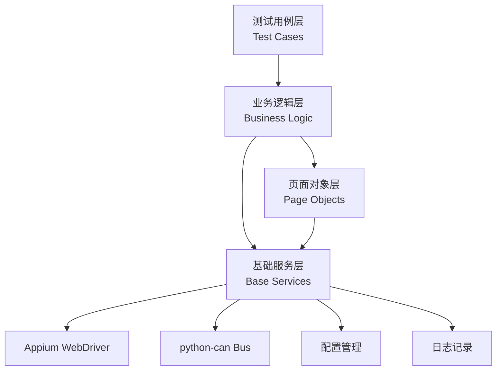
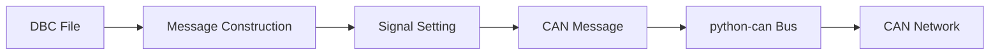
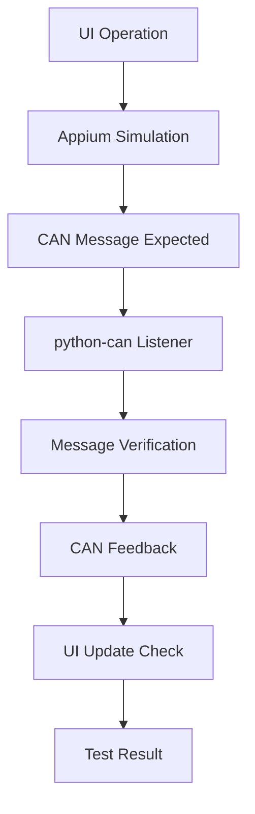

# 汽车智能中控平台自动化测试框架设计方案

> 基于Python+Allure的UI与CAN协议集成测试解决方案

---

## 目录导航

- [1. 总体架构设计](#architecture)
  - [1.1 技术栈选型](#tech-stack)
  - [1.2 框架分层结构](#framework-structure)
  - [1.3 核心配置文件](#config-files)
- [2. CAN协议报文处理测试](#can-testing)
  - [2.1 CAN消息模拟与发送](#can-simulation)
  - [2.2 CAN消息接收与验证](#can-reception)
  - [2.3 CAN总线场景模拟](#can-scenarios)
- [3. UI交互操作测试](#ui-testing)
  - [3.1 基于PageObject模式的UI自动化](#page-object)
  - [3.2 UI功能正确性验证](#ui-verification)
  - [3.3 用户体验性能测试](#performance-testing)
- [4. UI与CAN协议集成测试](#integration-testing)
  - [4.1 测试场景设计](#test-scenarios)
  - [4.2 测试用例实现](#test-implementation)
- [5. 测试执行与报告](#execution-report)
  - [5.1 测试执行策略](#execution-strategy)
  - [5.2 Allure报告集成](#allure-report)

---

## 框架概述

本方案旨在设计一个基于Python和Allure的汽车智能中控平台自动化测试框架。该框架通过集成Appium和python-can库，能够同时覆盖UI交互和CAN协议报文的处理测试。其核心设计采用分层架构，将测试逻辑、业务操作、页面元素和基础服务解耦，以提高代码的可维护性和可扩展性。

测试范围全面，不仅包括验证UI功能的正确性和用户体验性能，还深入测试了CAN消息的收发、解析以及在各种总线场景（如正常通信、错误注入、网络负载）下的系统鲁棒性。

---

## 1. 总体架构设计

采用分层架构模式，实现高内聚、低耦合的设计目标，确保框架的可维护性和可扩展性。

### 1.1 技术栈选型

| 技术        | 角色               | 特点 |
|-------------|--------------------|------|
| **Pytest**  | 核心测试框架       | 简洁语法、强大功能、丰富插件生态，支持fixture机制和参数化测试 [[187]](https://blog.csdn.net/weixin_59868574/article/details/135500904) [[199]](https://realpython.com/pytest-python-testing/) |
| **Appium**  | UI自动化工具       | 开源跨平台框架，支持原生应用、混合应用测试，无需修改被测应用 [[191]](https://blog.csdn.net/IT_LanTian/article/details/132699674) [[196]](https://www.cnblogs.com/zndxall/p/18151138) |
| **python-can** | CAN协议处理     | 统一抽象接口，支持多种CAN硬件，便于发送、接收和解析CAN报文 [[184]](https://wenku.csdn.net/answer/u15xfixz26) |
| **Allure**  | 测试报告生成       | 轻量级灵活框架，生成美观交互式HTML报告，支持详细测试信息收集 [[191]](https://blog.csdn.net/IT_LanTian/article/details/132699674) |

### 1.2 框架分层结构

#### 分层架构图（Mermaid流程图）



#### 各层说明

1. **测试用例层**
   框架最顶层，直接面向测试需求。包含所有具体测试脚本，每个脚本对应一个或多个测试场景。[[187]](https://blog.csdn.net/weixin_59868574/article/details/135500904)
2. **业务逻辑层**
   连接测试用例和底层操作的桥梁，封装与特定业务功能相关的操作序列。
3. **页面对象层**
   将每个UI页面抽象为Python类，包含页面元素的定位器和操作方法。[[154]](https://ones.cn/blog/knowledge/5-steps-mastering-automated-testing-framework-design) [[156]](https://www.testwo.com/article/2085)
4. **基础服务层**
   提供框架运行所需的各种底层通用功能，包括Driver管理、CAN总线管理、日志记录、配置管理等。[[170]](https://zhuanlan.zhihu.com/p/142126343)

### 1.3 核心配置文件

| 文件名               | 用途 |
|----------------------|------|
| `pytest.ini`         | Pytest全局配置文件，定义测试用例搜索路径、自定义标记等 [[153]](https://developer.aliyun.com/article/1229489) |
| `conftest.py`        | 共享Fixture与钩子函数定义，增强框架灵活性和可扩展性 [[186]](https://docs.pytest.org/en/4.6.x/explanation/fixtures.html) |
| `capabilities.yaml`  | Appium设备配置，包含平台名称、设备名称、应用包名等 [[158]](https://blog.csdn.net/2401_87378345/article/details/142421080) |
| `can_config.yaml`    | CAN总线配置，包含接口类型、通道号、比特率等参数 |

---

## 2. CAN协议报文处理测试模块

全面验证中控平台对CAN消息的接收、解析和显示逻辑，以及在各种总线场景下的系统鲁棒性。

### 2.1 CAN消息模拟与发送

- **DBC文件解析**：加载和解析DBC文件，通过信号名称访问和修改报文数据。
- **构造特定消息**：模拟车辆不同工况状态，如高速行驶、怠速、急加速、故障等。
- **python-can发送**：使用python-can库发送报文到CAN总线，支持多种CAN硬件接口。

#### CAN消息处理流程图



### 2.2 CAN消息接收与验证

- **监听接收**：使用`bus.recv()`方法监听总线报文，创建监听器线程持续捕获指令。
- **解析数据**：使用DBC文件解码报文数据，将原始字节转换为信号值字典。
- **内容验证**：通过Pytest的`assert`语句验证信号值与预期值是否一致。

### 2.3 CAN总线场景模拟

| 场景类型         | 描述 |
|------------------|------|
| **正常通信场景** | 验证中控平台在标准、无干扰的CAN总线通信环境下的基本功能 |
| **错误注入测试** | 验证中控平台鲁棒性和容错能力，模拟各种错误场景 |
| **网络负载测试** | 评估中控平台在高负载CAN总线通信条件下的性能表现 |

---

## 3. UI交互操作测试模块

基于PageObject模式的UI自动化测试，全面验证用户界面功能的正确性和用户体验性能。

### 3.1 基于PageObject模式的UI自动化

- **元素定位封装**：将页面元素定位方式封装在页面对象类中 [[147]](https://blog.csdn.net/weixin_45754647/article/details/139133058)
- **操作行为封装**：封装页面元素的操作行为（点击、输入、滑动）[[157]](https://blog.csdn.net/u010098760/article/details/104695427)
- **业务流程封装**：封装跨页面的业务流程，使测试用例代码更简洁

#### 页面对象示例

```python
class LoginPage:
    # 元素定位器
    username_input = (By.ID, "com.example:id/username")
    password_input = (By.ID, "com.example:id/password")
    login_button = (By.ID, "com.example:id/loginBtn")
    
    # 操作行为
    def input_username(self, username):
        self.driver.find_element(*self.username_input).send_keys(username)
    
    def input_password(self, password):
        self.driver.find_element(*self.password_input).send_keys(password)
    
    def click_login(self):
        self.driver.find_element(*self.login_button).click()
```

### 3.2 UI功能正确性验证

- **按钮点击与导航**：验证所有可点击元素正确响应用户操作
- **信息输入与显示**：验证用户输入信息正确接收处理，处理后结果正确显示
- **UI状态一致性**：验证UI界面显示信息与内部数据状态一致

### 3.3 用户体验性能测试

| 测试类型         | 测量方法 | 阈值 |
|------------------|----------|------|
| **界面响应时间** | t2 - t1  | 页面切换 ≤ 500ms |
| **界面流畅度**   | `adb shell dumpsys gfxinfo` | 平均帧率 ≥ 55 FPS |
| **资源占用监控** | `adb shell top / dumpsys meminfo` | 监控内存泄漏、CPU占用 |

---

## 4. UI与CAN协议集成测试

验证UI与CAN协议之间的联动，确保从用户输入到车辆控制指令发出的整个链路正确无误。

### 4.1 测试场景设计

| 场景类型               | 示例 |
|------------------------|------|
| **UI操作触发CAN通信**  | 用户点击“开启空调”按钮，验证是否发送正确的CAN指令 |
| **CAN消息驱动UI更新**  | CAN总线传来“车门打开”报文，UI是否正确显示 |
| **双向交互场景**       | 用户设置温度，中控发送指令，UI显示反馈温度 |

#### 集成测试流程图



### 4.2 测试用例实现

#### Pytest组织方式

```python
@pytest.mark.integration
def test_ac_control_ui_to_can():
    # 测试逻辑
```

#### Fixture管理

```python
@pytest.fixture(scope="function")
def driver_and_bus():
    # 初始化Driver和Bus
    yield driver, bus
    # 清理资源
```

#### UI操作与CAN报文同步实现

```python
def test_ac_control_integration(driver_and_bus):
    driver, bus = driver_and_bus
    
    # 启动CAN监听线程
    can_listener = CANListener(bus)
    can_listener.start_listening()
    
    # 执行UI操作
    ac_page = AirConditionPage(driver)
    ac_page.click_power_button()
    ac_page.set_temperature(22)
    
    # 获取CAN报文
    messages = can_listener.get_received_messages(timeout=1.0)
    
    # 验证报文内容
    assert len(messages) > 0
    decoded = decode_can_message(messages[0])
    assert decoded['AC_OnOff'] == 1
    assert decoded['AC_Temperature'] == 22
```

---

## 5. 测试执行与报告

灵活的测试执行策略和美观的Allure报告集成，提供清晰直观的测试结果展示。

### 5.1 测试执行策略

| 执行方式           | 说明 |
|--------------------|------|
| **编程方式运行**   | 通过`pytest.main()`以编程方式执行测试 |
| **命令行参数控制** | 使用`-k`、`-m`参数灵活控制测试范围 |
| **多设备并发测试** | 使用`pytest-xdist`插件支持多设备并发执行 |

#### 命令行执行示例

```bash
pytest -m "ui"           # 只运行UI测试
pytest -m "can"          # 只运行CAN测试
pytest -m "integration"  # 运行集成测试
pytest -k "login"        # 运行名称含login的测试
pytest -n 4              # 4个设备并发执行
```

### 5.2 Allure报告集成与定制

#### 插件集成

```bash
pip install allure-pytest
pytest --alluredir=./allure-results
```

#### 注解使用

```python
@allure.feature("空调控制")
@allure.story("温度调节")
@allure.step("设置温度")
```

#### 报告生成

```bash
allure generate ./allure-results
allure open ./allure-report
```

#### Allure报告特性

- **结构化展示**：按功能模块、用户故事组织测试结果
- **截图附件**：关键操作和失败时自动截图嵌入报告
- **性能数据**：展示测试执行时间、响应时间等性能指标
- **交互筛选**：支持按状态、严重级别、标签等多维度筛选

---

## 总结

本方案提供了完整的Python+Allure自动化测试解决方案，覆盖UI交互和CAN协议处理的全面测试需求。通过分层架构设计和集成测试策略，确保汽车智能中控平台的质量和可靠性。

---


