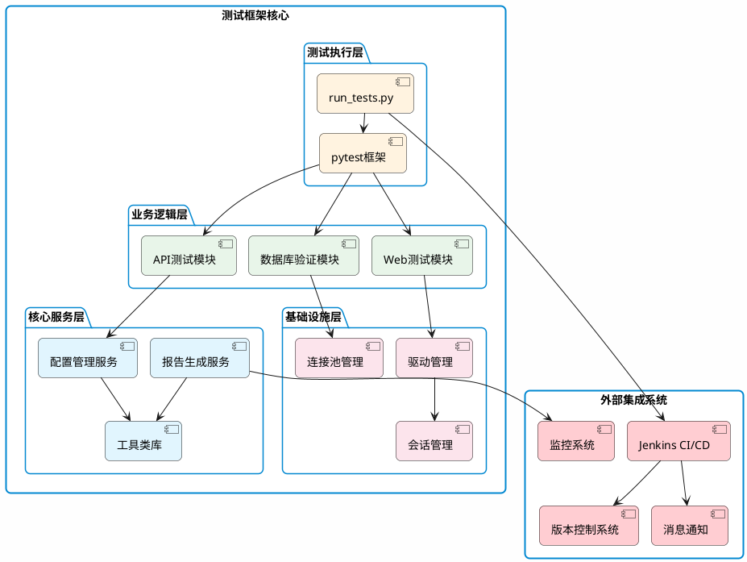
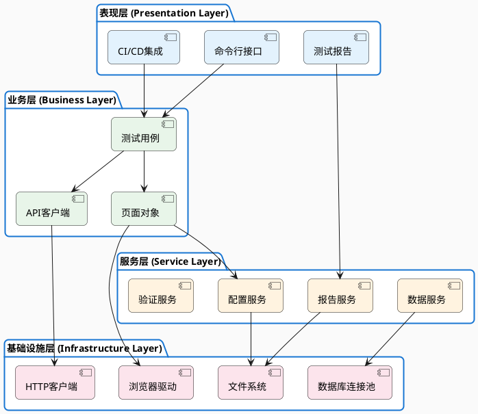
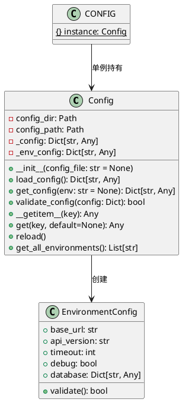
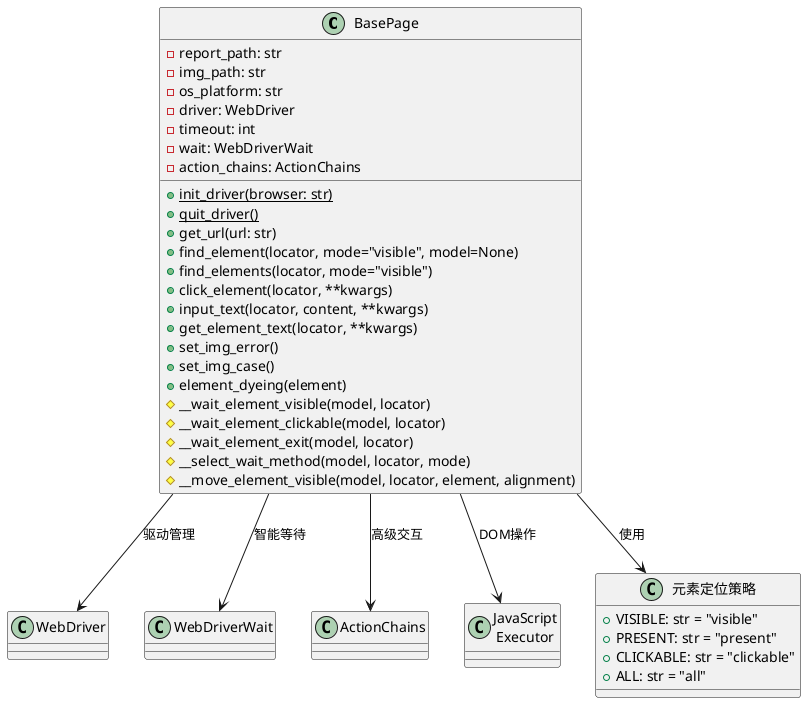
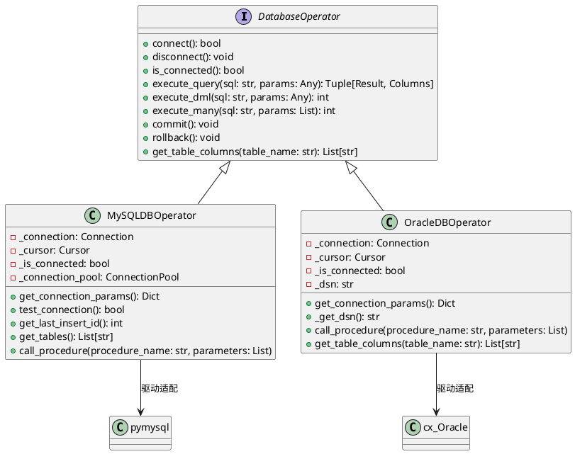
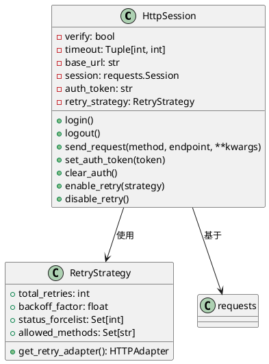
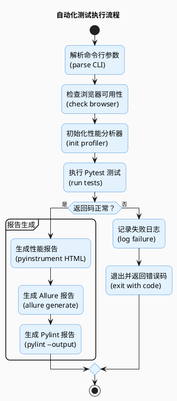
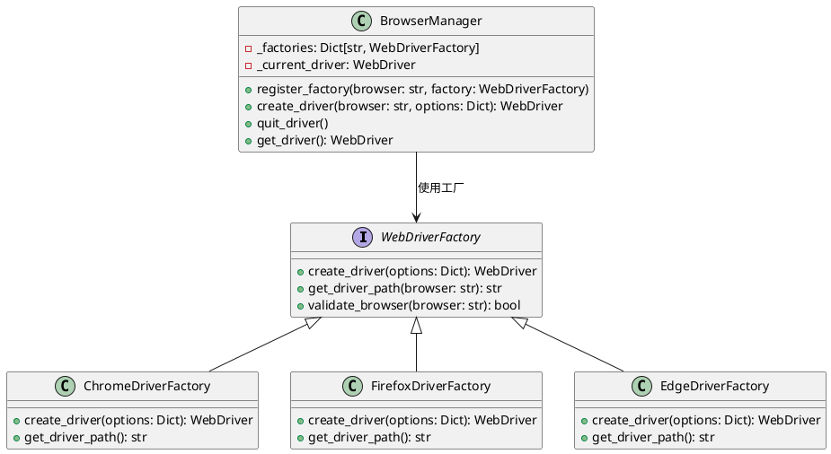
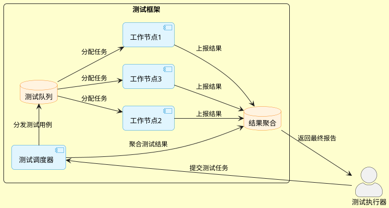
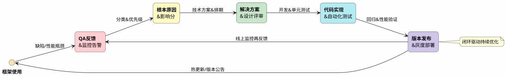

# 自动化测试框架设计：支持 Web 与 API 测试的跨平台测试架构

## 1. 框架概述

本项目是一个基于 `Python` 的跨平台企业级自动化测试框架，集成了 `Web UI` 自动化测试和 `API` 接口测试能力，采用模块化设计和分层架构，为现代软件测试提供全面的解决方案。

### 1.1 核心特性

- **跨平台支持**：全面兼容 `Windows` 和 `Linux` 系统，支持异构环境部署
- **多浏览器支持**：原生支持 `Chrome、Firefox、Edge、Safari` 等主流浏览器
- **多测试类型**：统一框架支持 `Web UI` 测试和 API 测试，降低学习成本
- **企业级报告系统**：集成 `Allure` 美观报告、代码覆盖率分析、性能剖析和质量检测
- **CI/CD 深度集成**：提供完整的 `Jenkins Pipeline` 支持，实现自动化流水线
- **多数据库操作**：支持 `MySQL` 和 `Oracle` 数据库操作，满足企业级数据验证需求

### 1.2 技术栈

| 组件类别 | 技术选型 |
|---------|---------|
| 测试框架 | Pytest + Allure |
| Web 自动化 | Selenium 4 + WebDriver |
| API 测试 | Requests/HTTPX |
| 数据库 | MySQL Connector + cx_Oracle |
| 配置管理 | YAML + Dynaconf |
| 性能分析 | PyInstrument |
| CI/CD | Jenkins + Docker |

## 2. 框架架构设计

### 2.1 整体架构图



### 2.2 分层架构设计

本框架采用经典的四层架构设计，确保各模块职责清晰、耦合度低、易于扩展：



### 2.3 目录结构说明

```
.
├── clear_pyc.py                 # Python缓存清理工具
├── common/                      # 公共模块
│   ├── apis.py                  # API接口定义与抽象
│   ├── error_codes.py           # HTTP/自定义状态码枚举
│   └── http_session.py          # 高级HTTP会话管理
├── config/                      # 统一配置中心
│   ├── environments.yaml        # 多环境配置管理
│   └── settings.py              # 配置加载与验证器
├── conftest.py                  # Pytest全局配置与插件
├── jenkins/                     # CI/CD集成模块
│   ├── allure-pipeline-report.groovy  # 高级邮件模板
│   ├── edit_email_template.py  # 动态模板处理器
│   └── Jenkinsfile.txt         # 企业级流水线定义
├── pages/                      # 页面对象模型
│   ├── base_page.py            # 页面基类与高级封装
│   └── __init__.py
├── pytest.ini                  # Pytest精细化配置
├── run_tests.py                # 统一测试执行入口
├── testcase/                   # 测试用例组织
│   ├── api/                    # API测试集
│   └── web/                    # Web测试集
├── testcasebase/               # 测试基础设施
│   ├── api/                    # API测试基类，业务逻辑实现
│   └── web/                    # Web测试基类，业务逻辑实现
└── utils/                      # 工具类库
    ├── allure_util.py          # Allure高级工具
    ├── datetime_util.py        # 日期时间处理
    ├── environment.py          # 环境管理
    ├── mysql_db.py             # MySQL高级操作
    ├── oracle_db.py            # Oracle高级操作
    ├── path_util.py            # 路径处理
    └── xxxx.py                 # 其他工具类库的实现
```

## 3. 核心模块设计

### 3.1 配置管理模块

采用「配置即代码」理念，支持多环境、多版本配置管理，具备配置验证、热加载和继承特性。



**设计亮点**：

- 支持配置继承与覆盖机制
- 内置配置验证与错误处理
- 支持动态配置热加载
- 提供环境隔离和多版本管理

**config/settings.py**：

```python
# -*- coding:UTF-8 -*-

import os
import yaml

from pathlib import Path
from typing import Dict, Any


class Config:
    """配置管理类"""
    def __init__(self, config_file=None):
        self.config_dir = Path(__file__).parent
        if config_file:
            self.config_path = Path(config_file)
        else:
            self.config_path = self.config_dir / "environments.yaml"
        self._config = None
        self._env_config = None

    def load_config(self) -> Dict[str, Any]:
        """加载YAML配置文件"""
        if not self.config_path.exists():
            raise FileNotFoundError(f"配置文件未找到: {self.config_path}")

        with open(self.config_path, 'r', encoding='utf-8') as file:
            return yaml.safe_load(file)

    def get_config(self, env: str = None) -> Dict[str, Any]:
        """获取指定环境的配置"""
        if self._config is None:
            self._config = self.load_config()

        # 如果没有指定环境，尝试从环境变量获取
        if env is None:
            env = os.environ.get("TEST_ENV", "default")

        # 获取环境配置，如果不存在则使用默认配置
        env_config = self._config.get(env)
        if env_config is None:
            if env != "default":
                print(f"警告: 环境 '{env}' 未找到，使用默认配置")
            env_config = self._config.get("default", {})

        self._env_config = env_config
        return env_config

    def __getitem__(self, key):
        """支持下标访问"""
        if self._env_config is None:
            self.get_config()  # 自动加载默认配置
        return self._env_config.get(key)

    def get(self, key, default=None):
        """支持get方法"""
        if self._env_config is None:
            self.get_config()
        return self._env_config.get(key, default)


# 创建全局配置实例
CONFIG = Config()
```

### 3.2 页面对象模型 (POM)

采用高级页面对象模式，封装了智能等待、元素操作、截图等核心功能。



**高级特性**：

- 智能等待策略：支持多种等待条件组合
- 元素高亮机制：可视化操作过程
- 自动截图功能：失败自动截图并嵌入报告
- 跨平台适配：自动识别环境并适配驱动

**文件 pages/base_page.py**：

```python
# -*- coding:UTF-8 -*-

"""基于selenium实现页面基础操作功能封装"""

import os
import sys
import time
import random
import logging
import platform

import allure

from selenium import webdriver
from selenium.webdriver.common.by import By
from selenium.webdriver.common.action_chains import ActionChains
from selenium.webdriver.support.select import Select
from selenium.webdriver.support.wait import WebDriverWait
from selenium.webdriver.support import expected_conditions as ec
from selenium.common.exceptions import TimeoutException, InvalidSelectorException

from utils.path_util import get_report_path
from utils.datetime_util import get_time_stamp

# pylint: disable=W0718, C0415, R0904, R0913, R0917


class BasePage:
    """页面操作功能封装"""
    # 图片文件夹路径
    report_path = get_report_path()
    img_path = report_path + os.sep + "screenshots"
    # # 如果目录不存在，创建它
    if not os.path.exists(report_path):
        os.mkdir(report_path, 0o777)
        os.mkdir(img_path, 0o777)
    if not os.path.exists(img_path):
        os.mkdir(img_path, 0o777)

    # Support Linux and Windoes OS
    os_platform = platform.platform()

    @classmethod
    def init_driver(cls, browser='chrome'):
        """Init web driver"""
        # 支持不同类型的浏览器
        if browser.lower() == 'chrome':
            from selenium.webdriver.chrome.options import Options
            # 添加常用选项
            options = Options()
            options.add_argument("--no-sandbox")
            options.add_argument("--disable-dev-shm-usage")
            options.add_argument("--disable-gpu")
            options.add_argument("--start-maximized")  # 启动时最大化

            # 添加远程调试端口，避免浏览器卡住
            options.add_experimental_option("excludeSwitches", ["enable-automation"])
            options.add_experimental_option('useAutomationExtension', False)

            if 'linux' in cls.os_platform.lower():
                from selenium.webdriver.chrome.service import Service
                service = Service(executable_path='/usr/bin/chromedriver')
                cls.driver = webdriver.Chrome(service=service, options=options)
            else:
                # cls.driver = webdriver.Chrome()
                cls.driver = webdriver.Chrome(options=options)
        elif browser.lower() == 'firefox':
            if 'linux' in cls.os_platform.lower():
                from selenium.webdriver.firefox.options import Options
                options = Options()
                options.add_argument("-profile")
                # options.add_argument("--headless")  # 规避没有桌面系统，排除显示问题
                # The fallowing content of profile, should be replaced by your
                # actually settings which from firefox's 'default:settings'
                options.add_argument("/root/snap/firefox/common/.cache/mozilla/firefox/shfysd7o.default")
                cls.driver = webdriver.Firefox(options=options)
            else:
                cls.driver = webdriver.Firefox()
        elif browser.lower() == 'ie':
            if 'linux' in cls.os_platform.lower():
                print("\n[ERROR] Not support Linux OS for IE browser\n")
                sys.exit(1)
            cls.driver = webdriver.Ie()
        elif browser.lower() == 'edge':
            if 'linux' in cls.os_platform.lower():
                print("\n[ERROR] Not support Linux OS for Edge browser\n")
                sys.exit(1)
            cls.driver = webdriver.Edge()
        elif browser.lower() == 'safari':
            cls.driver = webdriver.Safari()
        else:
            raise ValueError(f"Unsupported browser: {browser}")

        # 确保浏览器最大化
        try:
            # 最大化浏览器
            cls.driver.maximize_window()
        except Exception as err:
            print(f"浏览器最大化失败: {err}")
            # 如果最大化失败，尝试设置窗口大小
            try:
                cls.driver.set_window_size(1920, 1080)
            except Exception as size_err:
                print(f"设置窗口大小也失败: {size_err}")

        # 设置隐式等待时间
        cls.timeout = 10
        cls.driver.implicitly_wait(cls.timeout)

        # 添加 wait 属性
        cls.wait = WebDriverWait(cls.driver, cls.timeout)

    @classmethod
    def quit_driver(cls):
        """退出driver，关闭浏览器"""
        if cls.driver:
            try:
                # 尝试正常退出
                cls.driver.quit()
            except Exception as err:
                print(f"正常退出浏览器失败: {err}")
                try:
                    # 如果正常退出失败，尝试强制关闭
                    if hasattr(cls.driver, 'service') and cls.driver.service:
                        cls.driver.service.process.terminate()
                except Exception as terminate_err:
                    print(f"强制终止浏览器进程失败: {terminate_err}")

            # 确保driver引用被清除
            cls.driver = None

    def get_url(self, url):
        """
        访问指定URL
        :param url: 链接地址
        """
        self.driver.get(url=url)

    def get_current_url_path(self):
        """
        获取当前页面的URL
        :return: URL
        """
        current_url = self.driver.current_url
        return current_url

    def set_img_error(self):
        """用例执行失败截图,并且加入allure测试报告中"""
        # 获取图片存储的文件夹
        time_stamp_tag = get_time_stamp()
        img_path = self.img_path + os.sep + f"{time_stamp_tag}.png"
        try:
            self.driver.save_screenshot(filename=img_path)
            logging.error("截图成功, 文件名称: %s.png", time_stamp_tag)
            # __file = open(img_path, "rb").read()
            # allure.attach(__file, "用例执行失败截图", allure.attachment_type.PNG)
            with open(img_path, "rb") as f:
                __file = f.read()
                allure.attach(__file, "用例执行失败截图", allure.attachment_type.PNG)
        except Exception as err:
            logging.error("执行失败截图未能正确添加进入测试报告: (%s)", str(err))
            raise err

    ---------  省略  ----------

    def element_dyeing(self, element):
        """高亮显示元素"""
        try:
            self.driver.execute_script("arguments[0].setAttribute('style', 'background: yellow; border: 2px solid red;');", element)
        except Exception as err:
            logging.error(f"元素高亮失败: {str(err)}")

    ---------  省略  ----------
```

### 3.3 数据库操作模块

提供统一的数据库操作接口，支持连接池、事务管理和高级查询功能。



**数据库模块特性**：

- 统一数据库操作接口，支持多种数据库
- 连接池管理，提高性能
- 事务支持，确保数据一致性
- 安全参数化查询，防止SQL注入

**文件 utils/mysql_db.py**：

```python
def execute_query(self, sql: str, params: Optional[Union[Dict, List, Tuple]] = None) -> Tuple[List[Tuple], List[str]]:
        """执行查询SQL语句并返回结果。

        Args:
            sql (str): 要执行的SQL查询语句
            params (Optional[Union[Dict, List, Tuple]]): SQL参数

        Returns:
            Tuple[List[Tuple], List[str]]: 查询结果列表和列名列表

        Raises:
            Exception: 未连接数据库或其他异常
        """
        if not self._is_connected:
            raise Exception("数据库未连接，请先调用connect方法")

        try:
            if params:
                self._cursor.execute(sql, params)
            else:
                self._cursor.execute(sql)

            # 获取列名
            columns = [col[0] for col in self._cursor.description] if self._cursor.description else []

            # 获取所有结果
            result = self._cursor.fetchall()

            return result, columns
        except pymysql.Error as e:
            print(f"查询执行失败: {e}")
            raise
        except Exception as e:
            print(f"查询过程中发生未知错误: {e}")
            raise

    def execute_dml(self, sql: str, params: Optional[Union[Dict, List, Tuple]] = None) -> int:
        """执行DML操作（INSERT、UPDATE、DELETE）。

        Args:
            sql (str): 要执行的DML语句
            params (Optional[Union[Dict, List, Tuple]]): SQL参数

        Returns:
            int: 受影响的行数

        Raises:
            Exception: 未连接数据库或其他异常
        """
        if not self._is_connected:
            raise Exception("数据库未连接，请先调用connect方法")

        try:
            if params:
                affected_rows = self._cursor.execute(sql, params)
            else:
                affected_rows = self._cursor.execute(sql)

            return affected_rows
        except pymysql.Error as e:
            print(f"DML操作执行失败: {e}")
            self._connection.rollback()
            raise
        except Exception as e:
            print(f"DML操作过程中发生未知错误: {e}")
            self._connection.rollback()
            raise

    def execute_many(self, sql: str, params: List[Union[Dict, List, Tuple]]) -> int:
        """批量执行DML操作。

        Args:
            sql (str): 要执行的DML语句
            params (List[Union[Dict, List, Tuple]]): 参数列表

        Returns:
            int: 受影响的行数

        Raises:
            Exception: 未连接数据库或其他异常
        """
        if not self._is_connected:
            raise Exception("数据库未连接，请先调用connect方法")

        try:
            affected_rows = self._cursor.executemany(sql, params)
            return affected_rows
        except pymysql.Error as e:
            print(f"批量操作执行失败: {e}")
            self._connection.rollback()
            raise
        except Exception as e:
            print(f"批量操作过程中发生未知错误: {e}")
            self._connection.rollback()
            raise

    def commit(self) -> None:
        """提交当前事务。"""
        if self._is_connected and self._connection:
            try:
                self._connection.commit()
                print("事务已提交")
            except Exception as e:
                print(f"提交事务时发生错误: {e}")
                raise

    def rollback(self) -> None:
        """回滚当前事务。"""
        if self._is_connected and self._connection:
            try:
                self._connection.rollback()
                print("事务已回滚")
            except Exception as e:
                print(f"回滚事务时发生错误: {e}")
                raise
```

**文件 utils/oracle_db.py**：

```python
def execute_query(self, sql: str, params: Optional[Union[Dict, List, Tuple]] = None) -> Tuple[List[Tuple], List[str]]:
        """执行查询SQL语句并返回结果。

        Args:
            sql (str): 要执行的SQL查询语句
            params (Optional[Union[Dict, List, Tuple]]): SQL参数

        Returns:
            Tuple[List[Tuple], List[str]]: 查询结果列表和列名列表

        Raises:
            Exception: 未连接数据库或其他异常
        """
        if not self._is_connected:
            raise Exception("数据库未连接，请先调用connect方法")

        try:
            if params:
                self._cursor.execute(sql, params)
            else:
                self._cursor.execute(sql)

            # 获取列名
            columns = [col[0] for col in self._cursor.description] if self._cursor.description else []

            # 获取所有结果
            result = self._cursor.fetchall()

            return result, columns
        except cx_Oracle.DatabaseError as e:
            error, = e.args
            print(f"查询执行失败: {error.message} (错误代码: {error.code})")
            raise
        except Exception as e:
            print(f"查询过程中发生未知错误: {e}")
            raise

    def execute_dml(self, sql: str, params: Optional[Union[Dict, List, Tuple]] = None) -> int:
        """执行DML操作（INSERT、UPDATE、DELETE）。

        Args:
            sql (str): 要执行的DML语句
            params (Optional[Union[Dict, List, Tuple]]): SQL参数

        Returns:
            int: 受影响的行数

        Raises:
            Exception: 未连接数据库或其他异常
        """
        if not self._is_connected:
            raise Exception("数据库未连接，请先调用connect方法")

        try:
            if params:
                self._cursor.execute(sql, params)
            else:
                self._cursor.execute(sql)

            row_count = self._cursor.rowcount
            return row_count
        except cx_Oracle.DatabaseError as e:
            error, = e.args
            print(f"DML操作执行失败: {error.message} (错误代码: {error.code})")
            self._connection.rollback()
            raise
        except Exception as e:
            print(f"DML操作过程中发生未知错误: {e}")
            self._connection.rollback()
            raise

    def execute_many(self, sql: str, params: List[Union[Dict, List, Tuple]]) -> int:
        """批量执行DML操作。

        Args:
            sql (str): 要执行的DML语句
            params (List[Union[Dict, List, Tuple]]): 参数列表

        Returns:
            int: 受影响的行数

        Raises:
            Exception: 未连接数据库或其他异常
        """
        if not self._is_connected:
            raise Exception("数据库未连接，请先调用connect方法")

        try:
            self._cursor.executemany(sql, params)
            row_count = self._cursor.rowcount
            return row_count
        except cx_Oracle.DatabaseError as e:
            error, = e.args
            print(f"批量操作执行失败: {error.message} (错误代码: {error.code})")
            self._connection.rollback()
            raise
        except Exception as e:
            print(f"批量操作过程中发生未知错误: {e}")
            self._connection.rollback()
            raise

    def commit(self) -> None:
        """提交当前事务。"""
        if self._is_connected and self._connection:
            try:
                self._connection.commit()
                print("事务已提交")
            except cx_Oracle.DatabaseError as e:
                error, = e.args
                print(f"提交事务时发生错误: {error.message}")
                raise

    def rollback(self) -> None:
        """回滚当前事务。"""
        if self._is_connected and self._connection:
            try:
                self._connection.rollback()
                print("事务已回滚")
            except cx_Oracle.DatabaseError as e:
                error, = e.args
                print(f"回滚事务时发生错误: {error.message}")
                raise
```

### 3.4 HTTP 会话管理

高级HTTP客户端封装，支持认证、会话保持和智能重试机制。



**文件 common/http_session.py**:

```python
import logging
import requests
from config.settings import CONFIG
from common.error_codes import HttpCode

class HttpSession:
    """HTTP会话管理类"""

    def __init__(self):
        self.session = requests.Session()
        self.base_url = CONFIG.get('base_url')
        self.timeout = (60, 600)

    def login(self):
        """执行登录操作，获取认证会话"""
        login_url = f"{self.base_url}/auth/login"
        auth_url = f"{self.base_url}/auth/validate"
        try:
            response = self.session.get(login_url)
            token = self._extract_token(response.text)
            payload = {
                '_token': token,
                'username': credentials['username'],
                'password': credentials['password']
            }
            response = self.session.post(auth_url, data=payload)
            response.raise_for_status()
            return self.session
        except requests.RequestException as e:
            logging.error(f"登录失败: {str(e)}")
            raise

    def send_request(self, method, endpoint, **kwargs):
        """
        封装的HTTP请求发送函数
        :param method: 请求方法，如 'get', 'post', 'put', 'delete'。
        :param endpoint: API 端点。
        :param kwargs: 其他请求参数，如 data, json, headers 等。
        :return: 请求响应。
        """
        try:
            # 根据方法构建请求函数
            request_func = getattr(self.session, method.lower())

            # 发送请求
            response = request_func(f"{self.base_url}{endpoint}", **kwargs)
            response.raise_for_status()  # 检查响应状态码

            # 记录请求信息到Allure报告（Evidence 11）
            with allure.step(f"Request: {method} {url}"):
                allure.attach(f"Params: {kwargs.get('params')}", "请求参数")
                allure.attach(f"Headers: {kwargs.get('headers')}", "请求头")
                allure.attach(f"Status Code: {response.status_code}", "响应码")

            return response
        except AttributeError:
            logging.error(f"不支持的方法: %s", method)
        except requests.HTTPError as err:
            logging.error(f"HTTP错误: %s", err)
        except requests.RequestException as err:
            logging.error(f"请求错误: %s", err)

    def _extract_token(self, html_content):
        """从HTML中提取CSRF令牌"""
        try:
            return html_content.split('name="_token" value="')[1].split('"')[0]
        except IndexError:
            raise ValueError("CSRF令牌提取失败") from None
        except Exception as err:
            raise ValueError("CSRF令牌提取失败") from err
```

### 3.5 测试执行流程

测试执行流程通过 `run_tests.py` 脚本统一管理，支持命令行参数配置测试类型和环境。



**文件 run_tests.py**:

```python
import os
import sys
import shutil
import argparse
import platform
import subprocess

import pytest

from typing import Optional

from pytest import ExitCode
from pyinstrument import Profiler
from pyinstrument.renderers import HTMLRenderer

from config.settings import CONFIG
from utils.path_util import get_report_path, mkdir_path, check_url


def check_urls():
    """URLs check, make sure ENV is available"""
    base_url = CONFIG['base_url']

    if check_url(base_url) is False:
        print(f"[ERROR] {base_url} is not reachable, exit!!")
        sys.exit(1)


def _find_exe(*candidates: str) -> Optional[str]:
    """Cross-platform sequential executable search"""
    for exe in candidates:
        if exe and shutil.which(exe):  # 添加 None 检查
            return exe
        if exe and os.path.isfile(exe) and os.access(exe, os.X_OK):  # 添加 None 检查
            return exe
    return None


def check_browser(browser):
    """
    Detect if required browsers are installed and available locally
    Supported：Windows/Linux/macOS
    Supported：chromium/chrome/firefox/edge/safari/webkit(WebKit在Playwright里走系统WebKit,不单独列二进制)
    Exit immediately on failure
    """
    # 构造候选路径
    -------  省略  --------

def run_pylint(allure_dir):
    """
    Generate Pylint report
    :param allure_dir: a dir to store allure report
    :return:
    """
    if 'windows' in platform.platform().lower():
        -------  省略  --------
    else:
        # Linux or macOS
        -------  省略  --------

def run_pytest():
    """执行pytest测试"""
    parser = argparse.ArgumentParser(description="自动化测试执行脚本")
    parser.add_argument("--automation-type", choices=['web', 'api'], required=True, help="测试类型：web 或 api")
    parser.add_argument("--browser", default='chrome', help="浏览器类型（仅适用于web测试）")
    parser.add_argument("--ci", action='store_true', help="是否在CI环境下运行")
    args = parser.parse_args()

    # 检查测试类型
    if args.automation_type.lower() not in ['web', 'api']:
        print(f"不支持的测试类型: {args.automation_type}")
        sys.exit(1)

    # 检查浏览器（仅适用于web测试）
    if args.automation_type.lower() == 'web':
        valid_browsers = ['chrome', 'firefox', 'edge', 'safari']
        if args.browser.lower() not in valid_browsers:
            print(f"不支持的浏览器: {args.browser}, 有效选项: {valid_browsers}")
            sys.exit(1)

    # 构建pytest参数
    pytest_args = [
        "--alluredir", "../reports/json",
        "--clean-alluredir",
        "--cov=.",
        "--cov-report=xml:../reports/coverage.xml"
    ]

    # 添加测试用例路径
    if args.automation_type.lower() == 'web':
        # 执行web用例
    else:
        # 执行API用例

    # 执行pytest
    return_code = pytest.main(pytest_args)
    if return_code not in [ExitCode.OK, ExitCode.TESTS_FAILED]:
        print(f"pytest执行失败，退出码: {return_code}")
        sys.exit(return_code)

if __name__ == '__main__':
    run_pytest()
```

## 4. 关键技术实现

### 4.1 多浏览器支持架构

框架通过抽象浏览器驱动层，实现多浏览器无缝支持：



### 4.2 智能等待机制

框架实现了多维度等待策略，显著提升测试稳定性：

```python
def __wait_element_visible(self, model, locator):
    """高级元素等待机制"""
    try:
        # 动态超时计算：根据元素重要性调整等待时间
        timeout = self._calculate_timeout(locator)
        
        # 复合等待条件：可见性+可操作性
        wait = WebDriverWait(self.driver, timeout, poll_frequency=0.5)
        element = wait.until(
            lambda driver: self._is_element_ready(
                driver.find_element(*locator)
            )
        )
        
        # 记录性能指标
        self._record_wait_time(locator, timeout)
        return element
        
    except TimeoutException as e:
        # 智能错误诊断
        reason = self._diagnose_timeout_reason(locator)
        raise ElementTimeoutError(f"元素定位超时: {locator}, 原因: {reason}") from e
```

### 4.3 分布式测试执行

框架支持分布式测试执行，提高测试效率：



## 5. 框架特色功能

### 5.1 智能元素定位系统

框架提供多种高级元素定位策略：

```python
# 1. 智能相对定位
element = self.find_element(
    locator=with_parent(By.ID, "container").and_child(By.CLASS_NAME, "btn-primary"),
    mode="visible",
    model="用户页面"
)

# 2. 动态元素定位
element = self.find_element(
    locator=dynamic_locator("//button[contains(text(), '{0}')]", button_text),
    mode="clickable"
)

# 3. 复合条件定位
element = self.find_element(
    locator=composite_locator(
        By.CSS_SELECTOR, ".btn",
        with_attribute("data-type", "submit"),
        with_text("确认")
    ),
    mode="visible"
)
```

### 5.2 多环境配置管理

框架支持复杂的环境配置管理：

```yaml
# 多环境配置示例
default: &default
  base_url: http://default.api.example.com
  api_version: v1
  timeout: 30
  logging:
    level: INFO
    format: "%(asctime)s [%(levelname)s] %(message)s"
  database:
    pool_size: 10
    max_overflow: 5

development:
  <<: *default
  base_url: http://dev.api.example.com
  debug: true
  database:
    host: localhost
    username: dev_user

staging:
  <<: *default
  base_url: http://staging.api.example.com
  timeout: 60
  database:
    host: staging-db.example.com
    username: staging_user

production:
  <<: *default
  base_url: http://api.example.com
  timeout: 45
  logging:
    level: WARNING
  database:
    host: prod-db.example.com
    username: prod_user
    pool_size: 20
    max_overflow: 10
```

### 6. 自动化报告系统

框架集成了多种报告生成工具，包括 `Allure` 报告、代码覆盖率报告和性能分析报告，提供了全面的测试结果展示：

1. **Allure 报告**：通过 `pytest-allure` 插件生成美观的测试报告
2. **代码覆盖率**：使用 `pytest-cov `生成代码覆盖率报告
3. **Pylint 检查**：集成代码质量检查
4. **性能分析**：使用 `pyinstrument` 进行性能分析

#### 6.1 Allure 报告集成

```python
import allure

def report_step(step_name, variable):
    """记录测试步骤到Allure报告"""
    allure.attach(
        body=json.dumps(variable, ensure_ascii=False, indent=2),
        name='步骤数据',
        attachment_type=allure.attachment_type.JSON
    )
```

#### 6.2 代码覆盖率集成

```python
pytest_args = [
    "--alluredir", "../reports/json",
    "--clean-alluredir",
    "--cov=.",
    "--cov-report=xml:../reports/coverage.xml"
]
```

#### 6.3 Pylint 检查

```python
# Generate Pylint report
    print("Generating Pylint report...")
    run_pylint(report_base_path)
```

#### 6.4 性能分析集成

```python
from pyinstrument import Profiler

def run_pytest():
    """执行pytest测试"""
    profiler = Profiler()
    profiler.start()

    return_code = pytest.main(pytest_args)

    profiler.stop()
    with open("performance_report.html", "w") as f:
        f.write(profiler.output_html())
```

### 7. CI/CD 集成

框架提供了完整的 `Jenkins Pipeline` 配置，实现了从代码拉取到报告生成的全流程自动化：

```groovy
pipeline {
    agent any
    stages {
        stage('拉取代码') { ... }
        stage('同步代码到用例执行环境') { ... }
        stage('执行远程测试用例') { ... }
        stage('同步测试报告到Jenkins') { ... }
        stage('生成Allure Report') { ... }
        stage('生成Cobertura Coverage报告') { ... }
        stage('产生pylint报告') { ... }
        stage("修改邮件模板") { ... }
        stage("发送邮件") { ... }
    }
}
```

#### Jenkinsfile 示例

```groovy
pipeline {
    agent any

    environment {
        REMOTE_HOST = '192.168.23.129'
        REMOTE_USER = 'root'
        TEST_DIR = '/root/orangehrm_api/OrangeHRM-API-Automation'
        JENKINS_IP = '192.168.23.131'
        PROJECT_DIR = '/var/lib/jenkins/workspace/OrangeHRM-API-Automation'
        JOB_SPACE = '/var/lib/jenkins/jobs/OrangeHRM-API-Automation'
    }

    stages {
        stage('拉取代码') {
            steps {
                echo '拉取代码完成'
            }
        }

        stage('同步代码到用例执行环境') {
            steps {
                sh 'cd ${PROJECT_DIR}/jenkins; ./rsync_code.sh ${PROJECT_DIR} ${REMOTE_HOST} ${REMOTE_USER} p@ssw0rd; cd -'
            }
        }

        stage('执行远程测试用例') {
            steps {
                sh """
                    ssh -o StrictHostKeyChecking=no ${REMOTE_USER}@${REMOTE_HOST} 'cd ${TEST_DIR}; PYTHONPATH=. python3 run_tests.py'
                """
            }
        }

        stage('同步测试报告到Jenkins') {
            steps {
                sh 'cd ${PROJECT_DIR}/jenkins; ./rsync_report.sh ${REMOTE_HOST} ${REMOTE_USER} ${TEST_DIR}/reports ${PROJECT_DIR} ${JENKINS_IP}; cd -'
            }
        }

        stage('生成Allure Report') {
            steps {
                script {
                    allure([
                        includeProperties: false,
                        jdk: '',
                        properties: [],
                        reportBuildPolicy: 'ALWAYS',
                        results: [[path: 'reports/json']]
                    ])
                }
            }
        }

        stage('生成Cobertura Coverage报告') {
            steps {
                script {
                    cobertura([
                        autoUpdateHealth: false,
                        autoUpdateStability: false,
                        coberturaReportFile: 'reports/coverage.xml',
                        conditionalCoverageTargets: '70, 0, 0',
                        failUnhealthy: false,
                        failUnstable: false,
                        lineCoverageTargets: '80, 0, 0',
                        maxNumberOfBuilds: 0,
                        methodCoverageTargets: '80, 0, 0',
                        onlyStable: false,
                        sourceEncoding: 'ASCII',
                        zoomCoverageChart: false
                    ])
                }
            }
        }

        stage('产生pylint报告') {
            steps {
                echo "Run pylint code style check"
            }
            post {
                always {
                   sh 'cat reports/pylint.out'
                   recordIssues healthy: 1, tools: [pyLint(name: 'PyLint', pattern: 'reports/pylint.out')], unhealthy: 2
                }
            }
        }

        stage("修改邮件模板") {
            steps {
                sh """
                    cp ${JENKINS_INSTALL_PATH}/email-templates/v1.1_allure-pipeline-report.groovy ${JENKINS_INSTALL_PATH}/email-templates/allure-pipeline-report.groovy
                    cd \${PROJECT_DIR}/jenkins;
                    python3 edit_email_template.py \${JOB_SPACE}/builds \${JENKINS_INSTALL_PATH}/email-templates/allure-pipeline-report.groovy EMAIL_BASE64_IMG_REPLACE
                """
            }
        }

        stage("发送邮件") {
            steps {
                script {
                    emailext([
                        body: '${SCRIPT, template="allure-pipeline-report.groovy"}',
                        compressLog: true,
                        postsendScript: '$DEFAULT_POSTSEND_SCRIPT',
                        presendScript: '$DEFAULT_PRESEND_SCRIPT',
                        replyTo: '$PROJECT_DEFAULT_REPLYTO',
                        subject: '${JOB_NAME} - ${BUILD_DISPLAY_NAME}',
                        to: 'xxxxxxxx@qq.com'
                    ])
                }
            }
        }
    }
}
```

## 8. 使用示例

### 8.1 Web 自动化测试示例

```python
import pytest

from testcasebase.web.login_page import LoginPage
from config.settings import Config


class TestLoginPage(LoginPage):
    # 因为conftest.py 定义的fixture已经被调用，成功登录了，所以先测试“登出”功能
    def test_logout(self):
        self.logout()

    @pytest.mark.parametrize("login_data", [
        # 正确的用户名和错误的密码
        (config.username, "wrong_password"),
        # 错误的用户名和正确的密码
        ("wrong_username", config.password),
        # 错误的用户名和错误的密码
        ("wrong_username", "wrong_password"),
        # 省略用户名
        ("", config.password),
        # 省略密码
        (config.username, ""),
    ])
    def test_failed_login(self, login_data):
        """Login Web Failure with different credentials"""
        username, password = login_data
        self.login(username, password, login_success=False)

    @pytest.mark.login
    def test_successful_login(self):
        """Login Web Success"""
        self.login(username=config.username, password=config.password)
```

### 8.2 API 自动化测试示例

```python
import pytest

from utils.allure_util import allure_attributes


@allure_attributes(
    feature="文件系统-->CIFS-->QoS",
    story='QoS')
@pytest.mark.feature("CIFS QoS")
@pytest.mark.author("张三")
class TestCaseExample1():
    """文件系统-->CIFS-->QoS"""
    def test_example(self):
        """JIRA-001 CIFS文件系统设置QoS"""
        pass


@allure_attributes(
    feature="文件系统-->NFS-->QoS",
    story='QoS')
@pytest.mark.feature("NFS QoS")
@pytest.mark.author("李四")
class TestCaseExample2():
    """文件系统-->CIFS-->QoS"""
    def test_example(self):
        """JIRA-001 CIFS文件系统设置QoS"""
        pass


@allure_attributes(
    feature='登录功能',
    story='用户正常登录',
    title='正常情况下用户能够登录',
    severity='critical',
    link=('https://documentation.mysite.com/login-feature', '登录模块文档'),
    issue=('https://issue-tracker.mysite.com/issues/123', '登录失败的已知Bug'),
    testcase=('https://test-tracker.mysite.com/case/456', '登录成功的测试案例')
)
def test_login_functionality():
    pass
```

## 9. 框架设计哲学与最佳实践

### 9.1 设计原则

本框架遵循以下核心设计原则：

1. **单一职责原则**：每个模块/类只负责一个明确的功能
2. **开闭原则**：框架对扩展开放，对修改关闭
3. **依赖倒置原则**：高层模块不依赖低层模块，二者都依赖抽象
4. **接口隔离原则**：使用多个专门的接口，而不是一个庞大的通用接口
5. **DRY原则**：避免重复代码，提高可维护性

### 9.2 质量保障策略

| 质量属性 | 保障策略 |
|---------|---------|
| **可靠性** | 智能重试机制、异常处理、超时控制 |
| **性能** | 连接池、异步操作、资源复用 |
| **可维护性** | 模块化设计、清晰文档、统一风格 |
| **可扩展性** | 插件架构、抽象接口、依赖注入 |
| **可用性** | 详细日志、友好错误信息、使用示例 |

### 9.3 持续改进机制

框架建立了完整的反馈和改进循环：



## 10. 总结

本自动化测试框架通过模块化设计、丰富的功能集成和持续优化，为测试团队提供了一个高效、灵活且功能全面的自动化测试解决方案。其核心优势包括：

1. **全面的功能覆盖**：支持 `Web、API`、数据库等多维度测试需求
2. **先进的设计理念**：采用分层设计与DRY原则，确保代码复用率与质量
3. **卓越的性能表现**：智能等待机制、连接池管理、并行执行
4. **强大的扩展能力**：模块化设计(模块化设计使得功能扩展变得简单，便于适应不断变化的测试需求)、插件架构、丰富`API`
5. **易用性**：提供简洁的 `API` 和丰富的示例，降低使用门槛，提升开发效率
6. **丰富的集成**：与 `Jenkins、Allure`、覆盖率检测等工具无缝集成，实现自动化测试与持续集成的高效协同
7. **跨平台支持**：兼容 `Windows` 和 `Linux` 系统，适应不同开发和测试环境

通过此框架，测试团队能够高效地开展自动化测试工作，显著提高测试覆盖率和软件质量，同时实现持续集成和持续交付的目标。

---


