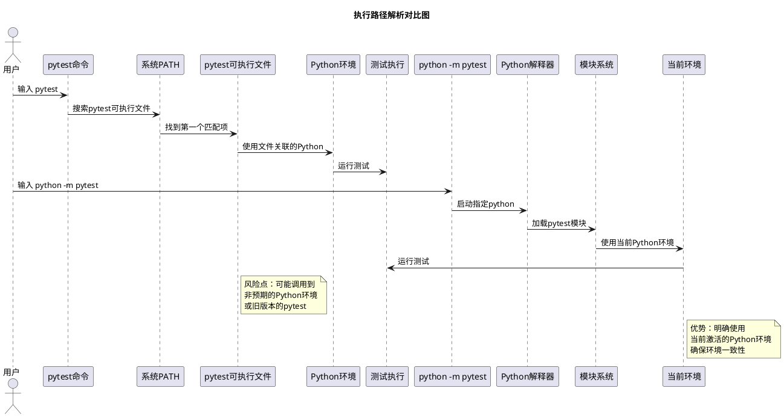
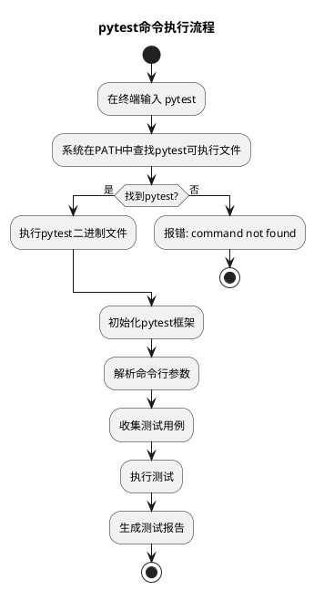
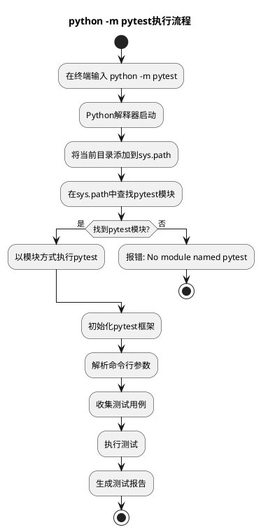
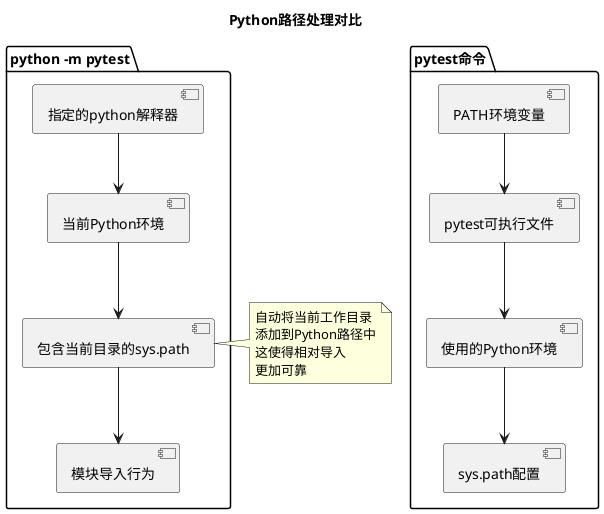
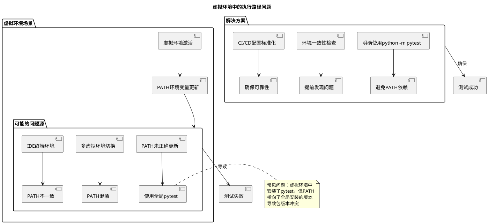
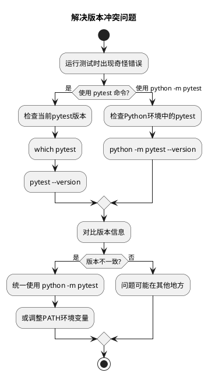
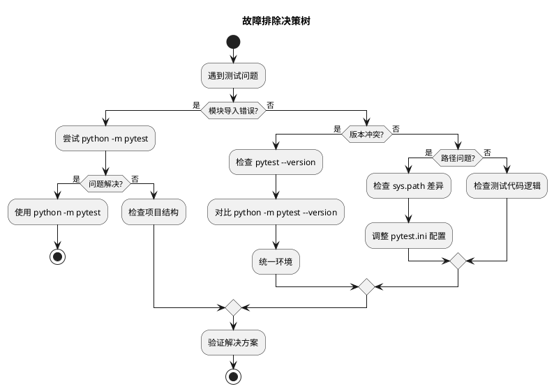

# `python -m pytest` vs `pytest`：深入解析与比较

## 概述

在Python测试中，`pytest`和`python -m pytest`是两种常见的运行测试的方式。虽然它们的功能相似，但在执行机制、环境处理等方面存在重要差异。本文结合实践经验和官方文档，提供全面的比较分析。

## 基本概念详解

### `pytest` 命令：直接执行方式

```bash
pytest
```

**工作机制**：直接调用系统中安装的pytest可执行文件，依赖于系统的PATH环境变量配置。

### `python -m pytest` 命令：模块执行方式

```bash
python -m pytest
```

**工作机制**：通过Python解释器的模块运行机制执行pytest，确保使用当前Python环境。


## 异同点详细比较

### 相同点

1. **核心功能一致**：两者都能运行pytest测试框架
2. **参数兼容**：支持相同的命令行参数
3. **测试发现**：使用相同的测试发现机制

### 不同点

| 特性 | `pytest` | `python -m pytest` |
|------|----------|-------------------|
| 执行方式 | 直接调用可执行文件 | 通过Python模块系统 |
| Python路径 | 使用默认Python环境 | 使用指定Python解释器的环境 |
| 模块搜索路径 | 可能不同 | 包含当前目录在sys.path中 |
| 虚拟环境 | 依赖PATH配置 | 明确使用当前Python环境 |

## 核心差异深度分析

### 执行路径解析差异



### 环境处理机制对比

| 特性 | `pytest` | `python -m pytest` | 影响分析 |
|------|----------|-------------------|----------|
| **Python环境** | 依赖PATH配置 | 使用明确指定的Python | 虚拟环境安全性 |
| **sys.path处理** | 可能不包含当前目录 | 自动包含当前目录 | 模块导入可靠性 |
| **包解析** | 相对导入可能失败 | 支持相对导入 | 项目结构兼容性 |
| **多版本管理** | 可能冲突 | 环境隔离清晰 | 版本管理便利性 |

## 执行流程对比

### `pytest` 命令执行流程



### `python -m pytest` 执行流程



## 实际示例演示

### 项目结构示例

```
my_project/
├── src/
│   └── my_module.py
├── tests/
│   ├── __init__.py
│   └── test_my_module.py
├── requirements.txt
└── pytest.ini
```

### 示例测试文件

```python
# tests/test_my_module.py
import sys
import os

def test_python_path():
    """显示当前Python路径"""
    print("Python路径:", sys.executable)
    print("工作目录:", os.getcwd())
    print("sys.path:", sys.path[:3])  # 显示前3个路径
    
def test_simple():
    """简单测试示例"""
    assert 1 + 1 == 2
```

### 运行对比示例

#### 场景1：基本运行

```bash
# 方式1: 直接使用pytest
pytest -v tests/test_my_module.py::test_python_path

# 方式2: 使用python -m pytest
python -m pytest -v tests/test_my_module.py::test_python_path
```

#### 场景2：带有路径配置的运行

```bash
# 添加src目录到Python路径
# 方式1 - 可能失败，如果PYTHONPATH未正确设置
pytest --tb=short

# 方式2 - 更可靠，使用当前Python环境
python -m pytest --tb=short
```

## 环境差异分析

### Python路径处理差异



### 虚拟环境场景深度分析

#### 虚拟环境中的路径问题



#### 虚拟环境最佳实践

```bash
# 创建和激活虚拟环境
python -m venv myenv

# 激活虚拟环境
# Windows
myenv\Scripts\activate
# Linux/Mac
source myenv/bin/activate

# 安装依赖
pip install pytest requests numpy  # 示例依赖

# ✅ 推荐做法：使用模块方式
python -m pytest tests/

# ❌ 风险做法：依赖PATH
pytest tests/  # 可能使用错误的pytest

# 验证环境一致性
python -c "import pytest; print(pytest.__version__)"
python -m pytest --version
pytest --version  # 对比版本是否一致
```


## 实际应用场景

### 场景1：虚拟环境中的使用

```bash
# 创建虚拟环境
python -m venv venv

# 激活虚拟环境
# Windows:
venv\Scripts\activate
# Linux/Mac:
source venv/bin/activate

# 安装pytest
pip install pytest

# 推荐使用方式 - 确保使用虚拟环境中的pytest
python -m pytest tests/

# 可能有问题的方式 - 如果系统PATH配置不当
pytest tests/  # 可能使用全局pytest
```

### 场景2：持续集成(CI)环境

```yaml
# GitHub Actions示例
jobs:
  test:
    runs-on: ubuntu-latest
    steps:
    - uses: actions/checkout@v2
    - name: Set up Python
      uses: actions/setup-python@v2
      with:
        python-version: '3.9'
    - name: Install dependencies
      run: |
        python -m pip install --upgrade pip
        pip install pytest
    - name: Test with pytest
      # 推荐使用python -m pytest确保环境一致性
      run: |
        python -m pytest --cov=src tests/
```

### 场景3：模块导入问题调试

```python
# 当遇到模块导入问题时，两种方式的差异明显

# 问题示例：tests/test_import.py
import sys
print("Python路径:", sys.path)

# 运行对比
# 方式1: pytest tests/test_import.py
# 方式2: python -m pytest tests/test_import.py

# 观察sys.path的差异，特别是当前目录的位置
```

## 最佳实践建议

### 推荐使用 `python -m pytest` 的情况

1. **虚拟环境项目**：确保使用正确的Python环境
2. **模块导入敏感项目**：需要正确的sys.path配置
3. **跨平台脚本**：避免PATH环境变量差异
4. **持续集成流程**：确保环境一致性

### 推荐使用 `pytest` 的情况

1. **简单脚本测试**：不需要复杂模块导入
2. **全局环境测试**：确认使用系统级pytest安装
3. **快速调试**：命令行输入更简洁

## 故障排除指南

### 常见问题1：ModuleNotFoundError

```bash
# 当遇到模块导入错误时
# 错误方式:
pytest tests/  # 可能失败

# 正确方式:
python -m pytest tests/  # 更可能成功

# 或者显式设置Python路径
PYTHONPATH=src pytest tests/
```

### 常见问题2：使用错误版本的pytest



### 综合排障解决方案



## 性能考虑

在实际使用中，两种方式的性能差异可以忽略不计。主要的时间消耗在测试执行本身，而不是启动方式。

## 总结

通过分析可以看出，`python -m pytest`和`pytest`在功能上等价，但在执行环境和模块处理上存在重要差异：


- **`python -m pytest`**：更可靠，确保使用当前Python环境，适合复杂项目
- **`pytest`**：更简洁，适合简单项目或交互式使用

**核心建议**：

- 生产环境：优先使用 `python -m pytest`
- 个人项目：根据复杂度选择
- 团队规范：统一执行方式
- 故障排除：优先尝试模块方式


对于大多数生产环境项目，推荐使用`python -m pytest`以获得更好的环境一致性和模块导入可靠性。

