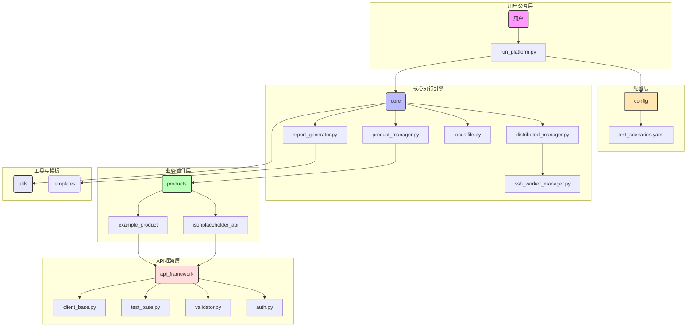

```mermaid
graph TD
    Root[项目根目录] --> APIF[api_framework<br/>认证与API框架层]
    Root --> Config[config<br/>配置管理层]
    Root --> Core[core<br/>核心引擎层]
    Root --> Products[products<br/>产品化测试用例层]
    Root --> Utils[utils<br/>工具集层]
    Root --> Templates[templates<br/>报告模板层]
    Root --> Entry[入口与文档]

    style Root fill:#2C3E50,stroke:#ECF0F1,stroke-width:3px,color:#FFF
    style APIF fill:#3498DB,stroke:#2980B9,stroke-width:2px
    style Config fill:#E74C3C,stroke:#C0392B,stroke-width:2px
    style Core fill:#9B59B6,stroke:#8E44AD,stroke-width:2px
    style Products fill:#F39C12,stroke:#E67E22,stroke-width:2px
    style Utils fill:#27AE60,stroke:#229954,stroke-width:2px
    style Templates fill:#95A5A6,stroke:#7F8C8D,stroke-width:2px
    style Entry fill:#34495E,stroke:#2C3E50,stroke-width:2px
```

# 🏆 基于Locust的分布式API性能测试工具

<div align="left">
一个高度可扩展、模块化的分布式API性能测试工具，让性能测试简单而强大！

[](https://www.python.org/)
[](https://locust.io/)

</div>

## 📖 项目概述

欢迎使用 **Locust** 驱动的**企业级分布式性能测试工具**！

这里提供的不是一个脚本合集，而是一套**工程化、插件化、多产品、多场景**的整体解决方案：  
- **高度可扩展**的插件架构——新认证、新报告、新协议，插拔即可；  
- **模块化**设计——“测什么”与“怎么测”彻底解耦，多团队并行零冲突；  
- **分布式**原生——内置完善协调机制，秒级扩缩容，百万级并发轻松复现；  
- **配置即场景**——YAML 一行切换压测策略，结果可追踪、可回滚、可基线化。

一句话：让复杂系统的性能基准测试，像写配置一样简单，像插件一样自由扩展。

### 🎯 主要功能特性

- **多模式运行支持**：`local`（本地模式）、`master`（分布式主节点模式）、`standalone`（无界面模式）
- **动态产品加载**：插件式架构，支持热插拔测试产品
- **多场景测试**：支持单场景或多场景连续执行，实现完整测试流程
- **分布式协调**：完善的`Master-Worker`架构，支持多机器分布式测试
- **阶梯式压测**：支持多阶段测试配置，自动调整用户数和生成率
- **响应验证框架**：内置强大的`API`响应验证机制，支持状态码、响应头和`JSON Schema`验证
- **实时监控与报告**：提供测试进度实时显示和测试报告自动生成

### 🧱 技术栈

- **核心框架**: Locust
- **编程语言**: Python 3.x
- **Web界面**: Flask (内嵌)
- **数据处理**: pandas, matplotlib, seaborn, plotly
- **配置管理**: pyyaml
- **网络通信**: requests, paramiko
- **任务调度**: gevent
- **模板引擎**: jinja2

### 🌍 环境要求

- **操作系统**: Windows 10+/Linux
- **Python版本**: Python 3.9+
- **内存**: 建议至少4GB RAM，大规模测试推荐8GB+
- **CPU**: 至少2核，大规模测试推荐4核+
- **网络**: 分布式测试需要稳定的网络连接
- **SSH访问权限**：分布式模式下使用

## 🧮 核心设计理念

### 1️⃣ 分层架构与单向依赖

此工具严格遵循分层架构原则，每一层都有明确的职责，且只与相邻层交互：

```shell
run_platform.py (入口)
    ↓ 依赖
core/ (引擎)
    ↓ 依赖
api_framework/, config/, utils/ (基础设施)
    ↓ 依赖
products/ (业务实现)
```

**核心优势**：

- ✅ **高内聚，低耦合**：修改某一层的实现（例如更换报告生成器）不会影响到其他层
- ✅ **易于理解与维护**：开发者可以专注于某一特定层级，降低认知负荷
- ✅ **便于并行开发**：不同团队可以独立负责不同层级的开发

---

### 2️⃣ 产品化隔离

工具引入 `Product` 概念，将不同业务线的测试用例、`API`客户端、配置完全隔离：

```shell
products/
├── example_product/          # 示例产品
├── jsonplaceholder_api/      # REST API产品
└── internal_service/         # 内部服务产品
```

每个产品独立管理：
- `test_cases.py` - 测试用例（`Locust User`类）
- `api_client.py` - 业务API封装
- `api_endpoints.py` - 接口定义

**核心优势**：
- ✅ 不同产品测试代码零耦合
- ✅ 支持多产品并行开发和混合场景测试
- ✅ 权限隔离，避免误操作

---

### 3️⃣ 配置驱动

核心围绕"测试场景"展开，所有行为通过 `test_scenarios.yaml` 控制，无需修改代码即可调整压测策略：

```yaml
scenarios:
  - name: "高峰时段压测"
    host: "https://api.example.com"
    run_time: 1800
    stages:
      - duration: 300   # 5分钟
        users: 100      # 100并发
        spawn_rate: 10  # 每秒启动10个
      - duration: 600
        users: 500
        spawn_rate: 20
```

**阶段控制逻辑**：
```python
# StageManager核心伪代码
for stage in stages:
    runner.start(user_count=stage.users, spawn_rate=stage.spawn_rate)
    sleep(stage.duration)
```

---

### 4️⃣ 插件化扩展

#### 🔌 零侵入式扩展机制
`products` 目录的设计将"测什么"（业务`API`）与"怎么测"（测试框架）彻底分离：

- **新认证方式**：继承 `AuthBase` → 注册到 `AuthFactory`
- **新报告模板**：添加 `templates/*.html`
- **新工具函数**：添加到 `utils/`
- **新产品接入**：遵循接口规范创建新的插件目录，自动发现并加载

#### 🎨 抽象与复用
`api_framework` 中的 `BaseClient` 和 `BaseTest` 定义了核心方法（`request`, `setup`, `teardown` 等）：

- **强制规范**：确保所有插件遵循统一标准，避免代码随意性
- **代码复用**：通用逻辑（认证、错误处理、日志记录）在基类实现，子类直接继承，极大减少重复代码

---

### 5️⃣ 支持分布式与多平台兼容

- **分布式执行** - 支持多节点分布式压力测试，轻松模拟大规模并发
- **多平台兼容** - 支持`Windows`和`Linux`，以及混合环境（`Linux`和`Windows`组合）

---

此架构经过多轮迭代优化，兼顾了 **易用性、扩展性和可维护性**，是企业级性能测试工具的理想选择。


## 🗺️ 架构总览



<p></p>

**架构解读：**

- **用户交互层**: 用户通过命令行工具 `run_platform.py` 发起测试，这是整个流程的起点。
- **配置层**: `config` 目录独立管理所有配置，特别是 `test_scenarios.yaml`，实现了测试逻辑与测试数据的分离，使得同一套测试代码可以应对不同的测试场景。
- **核心执行引擎**: `core` 目录是框架的大脑。
  - `product_manager.py` 负责加载和管理不同的业务产品插件。
  - `distributed_manager.py` 和 `ssh_worker_manager.py` 协同工作，将测试任务分发到远程节点，实现分布式压力。
  - `locustfile.py` 是与 `Locust` 框架的集成点，将我们的测试逻辑转化为`Locust` 可执行的任务。
    - `report_generator.py` 负责在测试结束后，聚合数据并生成可视化`HTML`报告。
- **业务插件层**: `products` 目录是框架扩展性的体现。每个子目录（如 `example_product`）都是一个独立的插件，封装了特定`API`产品的所有测试相关代码。新增一个`API`产品的测试，只需在此处添加一个新插件，无需改动核心代码。
- **API框架层**: `api_framework` 提供了一套标准化的基类和工具，如 `BaseClient` 和 `BaseTest`。它为所有业务插件定义了契约，确保了代码的一致性和复用性。
- **工具与模板**: `utils` 和 `templates` 提供了通用的辅助功能和报告模板，支撑着整个框架的运行。

## 🏗️ 架构设计

### 多场景分布式性能测试工具 - 完整类图

<p></p>


### 🏛️ 核心类关系设计

<p></p>

### 🔗 测试执行序列图

<p></p>

### 🖥️ 物理部署架构图

<p></p>

### 🔌 认证机制类图

<p></p>

### 🚀 系统启动与执行流程

系统启动统一由 `run_platform.py` 入口接管，根据命令行参数选定「运行模式（`local / master / standalone`）+ 产品 + 场景」后，按序完成环境检查 → 配置加载 → 资源初始化 → 测试执行 → 结果收集的完整闭环。  
无论 `Web` 模式还是 `standalone` 模式，都支持多场景连续编排；差异仅在于执行控制粒度与结果收集通道——`Web` 模式额外提供实时仪表盘与历史任务管理，`standalone` 模式则轻量输出本地报告，两者复用同一套核心流程，零切换成本。

<p></p>

## 📒 项目目录结构详解

本项目采用**分层架构设计**，各目录职责清晰、高内聚低耦合。下面详细说明每个目录和文件的设计意图与功能职责。

---

### 🏭 代码结构

```shell
.
├── api_framework
│   ├── auth.py
│   ├── client_base.py
│   ├── error_code.py
│   ├── __init__.py
│   ├── test_base.py
│   └── validator.py
├── config
│   ├── config_manager.py
│   └── test_scenarios.yaml
├── core
│   ├── distributed_manager.py
│   ├── locustfile.py
│   ├── product_manager.py
│   ├── report_generator.py
│   └── ssh_worker_manager.py
├── products
│   ├── example_product
│   │   ├── api_client.py
│   │   ├── api_endpoints.py
│   │   ├── __init__.py
│   │   └── test_cases.py
│   ├── __init__.py
│   ├── jsonplaceholder_api
│   │   ├── api_client.py
│   │   ├── api_endpoints.py
│   │   ├── __init__.py
│   │   └── test_cases.py
├── README.md
├── requirements.txt
├── run_platform.py
├── templates
│   ├── performance_dashboard.html
│   └── template.html
└── utils
    ├── ip_utils.py
    ├── logger.py
    ├── path_utils.py
    └── scenario_utils.py
```

---

### 🏗️ 整体目录架构

---



---

### 🚀 快速导航

| 开发任务           | 目标目录/文件                                                |
| ------------------ | ------------------------------------------------------------ |
| **添加新产品**     | `products/my_product/` + `config/test_scenarios.yaml`        |
| **修改认证逻辑**   | `api_framework/auth.py` （除非现有认证逻辑无法适配被测产品，否则不需要修改） |
| **调整报告样式**   | `templates/performance_dashboard.html` （需要定制化的情况下可进行修改） |
| **新增工具函数**   | `utils/`                                                     |
| **调试分布式问题** | `core/distributed_manager.py` + `core/ssh_worker_manager.py` （目前兼容Linux和Windows，未测试其他操作系统） |
| **扩展场景配置**   | `config/test_scenarios.yaml`                                 |

---

### 📂 详细目录说明

#### 1️⃣ `api_framework/` - 认证与API框架层

**设计意图**：封装`HTTP`请求通用能力，提供插件式认证机制，解耦认证逻辑与业务测试。

| 文件                 | 用途               | 核心功能                                                     |
| -------------------- | ------------------ | ------------------------------------------------------------ |
| **`auth.py`**        | **认证机制抽象层** | 定义`AuthBase`抽象基类，实现5种认证方式（`NoAuth/Basic/Token/JWT/APIKe`y），采用**工厂模式**动态创建认证实例 |
| **`client_base.py`** | **API客户端基类**  | 封装`requests.Session`，提供自动重试、超时控制、401自动重登录、会话管理功能 |
| **`error_code.py`**  | **HTTP状态码常量** | 集中定义`HttpStatusCode`枚举，避免魔法数字                   |
| **`test_base.py`**   | **测试基类**       | 预留的测试工具基类（当前可能为空或用于扩展）                 |
| **`validator.py`**   | **请求验证器**     | 提供响应验证工具，如`JSON Schema`校验、字段断言等            |

**架构价值**：测试用例无需关心认证细节，通过配置即可切换认证方式：

```python
# 在test_cases.py中使用
self.client.auth = AuthFactory.create_auth('jwt', username='admin', password='123456')
# 而username='admin', password='123456'又来源于config目录下YAML配置文件products下对应产品中定义的username和password
```

---

#### 2️⃣ `config/` - 配置管理层

**设计意图**：集中管理所有可变配置，支持热加载与动态更新，实现配置与代码分离。

| 文件                      | 用途             | 核心功能                                                     |
| ------------------------- | ---------------- | ------------------------------------------------------------ |
| **`config_manager.py`**   | **配置中心**     | **`ConfigManager`单例**，封装`ScenarioManager`和`TimeController`，提供统一配置访问接口 |
| **`test_scenarios.yaml`** | **场景配置文件** | 定义测试场景、阶段、分布式节点、`API`端点等所有运行时参数    |

**核心设计**：

- **单例模式**：确保全框架共享同一配置实例
- **线程安全**：`TimeController`使用`Lock`保护共享状态
- **配置校验**：`_validate_scenarios()`自动检查`spawn_rate`和`run_time`合理性

**配置示例**：

```yaml
scenarios:
  - name: "阶梯压测"
    host: "https://api.example.com"
    run_time: 1200
    stages:
      - duration: 300
        users: 100
        spawn_rate: 10
      - duration: 600
        users: 200
        spawn_rate: 20
```

---

#### 3️⃣ `core/` - 核心引擎层

**设计意图**：框架的心脏，负责调度执行、生命周期管理、报告生成。

| 文件                         | 用途               | 核心功能                                                     |
| ---------------------------- | ------------------ | ------------------------------------------------------------ |
| **`locustfile.py`**          | **Locust入口文件** | 动态加载产品`User`类，`StageManager`控制阶段执行，`ApiUser`基类提供通用能力 |
| **`product_manager.py`**     | **产品管理器**     | **`ProductManager`单例**，扫描`products/`目录，动态导入模块，管理产品生命周期 |
| **`distributed_manager.py`** | **分布式协调器**   | 封装`SSHWorkerManager`，提供`check_distributed_environment()`、`Worker`启停、版本一致性检查 |
| **`ssh_worker_manager.py`**  | **SSH工具集**      | 实现`SSH`连接、项目同步、`Locust`进程远程管理                |
| **`report_generator.py`**    | **报告生成器**     | 合并多`Worker`数据，生成`HTML`交互式报告和`CSV`数据文件      |

**关键流程**：

```python
# 运行时动态加载
product_manager.scan_available_products()  # 发现新产品
→ product_manager.get_user_classes()       # 加载User类
→ locustfile.py::_load_and_register_user_classes()  # 注册到Locust
```

---

#### 4️⃣ `products/` - 产品化测试用例层

**设计意图**：**核心创新点**，实现测试用例的产品级隔离，每个产品独立演进。

| 目录/文件                  | 用途             | 核心功能                                     |
| -------------------------- | ---------------- | -------------------------------------------- |
| **`__init__.py`**          | **产品注册入口** | 可在此批量注册产品（当前为空，依赖自动扫描） |
| **`example_product/`**     | **示例产品**     | 提供完整参考实现                             |
| **`jsonplaceholder_api/`** | **真实API产品**  | 可直接运行的真实案例                         |

**单个产品目录结构**：

```shell
my_product/
├── __init__.py           # 产品标识（可为空）
├── api_client.py         # 业务API封装（继承ApiClientBase）
├── api_endpoints.py      # 接口路径常量定义
└── test_cases.py         # Locust User类（核心测试逻辑）
```

**api_client.py职责**：

```python
class MyApiClient(ApiClientBase):
    def get_user(self, user_id):
        return self.get(f"/users/{user_id}")  # 复用重试、认证逻辑
    
    def create_order(self, data):
        return self.post("/orders", json=data)
```

**test_cases.py职责**：

```python
class UserBehavior(ApiUser):
    @task
    def browse_products(self):
        self.client.get("/api/products")  # 使用client_base封装
    
    @task(3)  # 权重3，执行频率更高
    def add_to_cart(self):
        self.client.post("/api/cart", json={"productId": 1})
```

---

#### 5️⃣ `utils/` - 工具集层

**设计意图**：提供通用、无依赖的工具函数，供各层调用。

| 文件                    | 用途         | 核心功能                                       |
| ----------------------- | ------------ | ---------------------------------------------- |
| **`logger.py`**         | **日志系统** | 彩色日志、进度条、日志分级、按场景分文件       |
| **`ip_utils.py`**       | **IP工具**   | `best_ipv4_by_bandwidth()`智能选择最优网络接口 |
| **`path_utils.py`**     | **路径管理** | 统一`logs/`、`reports/`目录路径计算            |
| **`scenario_utils.py`** | **场景辅助** | 场景名称合法化、参数计算、共享文件读写         |

**亮点功能**：

```python
# 自动选择带宽最高的IP（用于分布式Master绑定）
master_ip = best_ipv4_by_bandwidth()
```

---

#### 6️⃣ `templates/` - 报告模板层

**设计意图**：解耦报告格式与生成逻辑，支持自定义主题。

| 文件                             | 用途             | 核心功能                                    |
| -------------------------------- | ---------------- | ------------------------------------------- |
| **`performance_dashboard.html`** | **性能看板模板** | 展示`TPS、RT`、错误率等核心指标的交互式图表 |
| **`template.html`**              | **基础报告模板** | 通用`HTML`报告框架，包含`CSS/JS`静态资源    |

---

#### 7️⃣ 根目录文件

| 文件                   | 用途         | 核心功能                                                 |
| ---------------------- | ------------ | -------------------------------------------------------- |
| **`run_platform.py`**  | **主入口**   | 解析命令行参数，创建`TestOrchestrator`，启动测试生命周期 |
| **`requirements.txt`** | **依赖管理** | `locust>=2.34.0`, `pyyaml`, `psutil`等                   |
| **`README.md`**        | **项目文档** | 使用说明、配置示例、设计文档                             |

**run_platform.py关键逻辑**：

```python
# 命令行参数解析
python run_platform.py --product <product> --mode {local|master|standalone} --scenario <name>

# 早期检查（在导入重模块前）
1. 验证产品是否存在
2. 验证场景是否存在  
3. IP一致性检查（Master模式）
4. 配置一致性检查（host vs base_url）

# 创建编排器并启动
orchestrator = TestOrchestrator(product_name)
orchestrator.run_all_scenarios(mode=args.mode)
```

---


## 🔍 核心模块分析

### 🚪 入口模块 - run_platform.py

作为系统的主入口，`run_platform.py`负责解析命令行参数、初始化环境、协调各模块工作，并最终启动测试执行。

**主要功能：**

- 命令行参数解析，支持模式选择（`local/master/standalone`）
- 早期环境检查（`Master IP`检测、产品验证）
- 初始化配置管理器和产品管理器
- 协调分布式环境设置
- 测试场景执行与结果管理

**关键代码实现：**

```python
def start_services(self, mode='local', csv_prefix=None):
    """启动所有服务"""
    logger.info("启动测试服务 - 模式: %s", mode)
    # 从配置中获取端口
    logger.debug("使用配置的Web端口: %s", self.web_port)

    # 启动Locust
    if not self.locust_manager.start_locust(
        mode=mode,
        csv_prefix=csv_prefix                # CSV文件前缀
    ):
        return False

    # 如果是master模式，启动workers
    if mode == 'master':
        time.sleep(1)
        successful_workers = 0
        for i in range(self.expect_workers):
            worker = self.locust_manager.start_worker(worker_id=i+1)
            if worker is not None:
                successful_workers += 1
            else:
                logger.info("Worker %s 启动失败", i+1)
            time.sleep(1)

        if successful_workers == 0:
            logger.info("所有Worker启动失败")
            return False
        elif successful_workers < self.expect_workers:
            logger.info("部分Worker启动失败: %s/%s", successful_workers, self.expect_workers)

    logger.info("所有服务启动完成")
    return True
```

### 📦 产品管理器 - ProductManager

`ProductManager`实现了产品的动态加载和注册机制，采用插件式架构，使系统能够灵活支持不同产品的测试。

**主要功能：**

- 动态发现和加载产品模块
- 验证产品目录结构和必需文件
- 提供产品信息访问接口
- 支持产品特定配置的加载

**关键代码实现：**

```python
def load_product(self, product_name):
    """加载指定产品"""
    if product_name in self._loaded_products:
        logger.debug("产品 %s 已加载，直接返回", product_name)
        return self._loaded_products[product_name]
    
    # 计算产品路径
    product_path = self._calculate_product_path(product_name)
    
    # 验证产品目录
    if not self._validate_product_directory(product_path):
        logger.error("产品目录验证失败: %s", product_path)
        return None
    
    # 验证必需文件
    if not self._validate_required_files(product_path):
        logger.error("产品必需文件验证失败: %s", product_path)
        return None
    
    # 动态导入产品模块
    product_module = self._import_product_module(product_name, product_path)
    if not product_module:
        return None
    
    # 注册产品
    self._loaded_products[product_name] = product_module
    return product_module
```

### 🕸️ 分布式管理器 - DistributedManager

`DistributedManager`负责协调分布式测试环境，管理`Master`和`Worker`节点的通信和状态同步。

**主要功能：**

- 分布式配置加载与验证
- `Worker`节点环境检查
- `SSH`互信设置
- 网络连通性验证
- 测试进度同步

**关键代码实现：**

```python
def setup_distributed_environment(self, is_master_mode: bool = False) -> bool:
    """设置分布式环境 - 支持版本一致性检测"""
    # 检查是否已经设置过分布式环境
    if hasattr(self, 'distributed_environment_setup') and self.distributed_environment_setup:
        logger.info("分布式环境已经设置，跳过重复设置...")
        return True
    
    # 执行环境检查
    if not self._check_environment():
        logger.error("环境检查失败")
        return False
    
    # 设置SSH互信
    if not self._setup_ssh_trust():
        logger.error("SSH互信设置失败")
        return False
    
    # 验证Worker节点连通性
    if not self._verify_worker_connectivity():
        logger.error("Worker节点连通性验证失败")
        return False
    
    # 检查Locust环境
    if not self._check_locust_environment(is_master_mode):
        logger.error("Locust环境检查失败")
        return False
    
    self.distributed_environment_setup = True
    return True
```

### 🌐 API测试框架

API测试框架由`TestBase`和`ResponseValidator`组成，提供了统一的`HTTP`请求封装和响应验证机制。

**主要功能：**

- `HTTP`请求封装（`GET/POST/PUT/DELETE`等）
- 请求`ID`跟踪和日志记录
- 响应时间计算
- `JSON Schema`验证
- 自定义验证规则支持

**关键代码实现（TestBase）：**

```python
def request(self, method, url, **kwargs):
    """封装Locust请求，添加请求ID和日志记录"""
    # 生成请求ID
    request_id = str(uuid.uuid4())[:8]
    start_time = time.time()
    
    # 发送请求
    with self.client.request(
        method, 
        url, 
        name=f"{method.upper()}:{url}",
        catch_response=True,
        **kwargs
    ) as response:
        # 计算响应时间
        response_time = (time.time() - start_time) * 1000  # 转换为毫秒
        
        # 记录请求日志
        logger.debug("[请求-%s] %s %s, 响应码: %s, 响应时间: %.2fms",
                    request_id, method.upper(), url, response.status_code, response_time)
        
        # 验证响应
        if not self._validate_response(response):
            response.failure(f"请求ID-{request_id}: 响应验证失败")
    
    return response
```

**关键代码实现（ResponseValidator）：**

```python
def validate_response(self, response, expected_status=None, schema=None, rules=None):
    """验证HTTP响应"""
    validation_result = {
        'status': True,
        'errors': []
    }
    
    # 验证HTTP状态码
    if expected_status and not self._validate_status_code(response, expected_status):
        validation_result['status'] = False
        validation_result['errors'].append(f"状态码不匹配，期望: {expected_status}，实际: {response.status_code}")
    
    # 验证JSON Schema
    if schema and response.text:
        try:
            response_json = response.json()
            if not self._validate_json_schema(response_json, schema):
                validation_result['status'] = False
                validation_result['errors'].append("JSON Schema验证失败")
        except ValueError:
            validation_result['status'] = False
            validation_result['errors'].append("响应不是有效的JSON格式")
    
    # 应用自定义规则
    if rules:
        for rule in rules:
            if not rule.apply(response):
                validation_result['status'] = False
                validation_result['errors'].append(f"自定义规则验证失败: {rule.name}")
    
    return validation_result
```

### ⚙️ 配置管理器 - ConfigManager

`ConfigManager`负责加载、验证和管理测试配置，支持多场景配置和动态切换。

**主要功能：**

- 配置文件加载与解析
- 场景验证和切换
- 测试时长计算
- 分布式配置管理
- 环境变量同步

**关键代码实现：**

```python
def load_scenarios(self, mode='default'):
    """加载测试场景配置"""
    # 基础配置路径
    base_config_path = self._get_base_config_path()
    if not base_config_path.exists():
        logger.error("基础配置文件不存在: %s", base_config_path)
        return False
    
    # 加载基础配置
    try:
        with open(base_config_path, 'r', encoding='utf-8') as f:
            base_config = yaml.safe_load(f)
    except Exception as e:
        logger.error("加载配置文件失败: %s", str(e))
        return False
    
    # 如果是补充模式，加载产品特定配置
    if mode == 'supplement' and self.product_name:
        product_config_path = self._get_product_config_path()
        if product_config_path.exists():
            try:
                with open(product_config_path, 'r', encoding='utf-8') as f:
                    product_config = yaml.safe_load(f)
                    # 合并配置
                    base_config = self._merge_configs(base_config, product_config)
            except Exception as e:
                logger.warning("加载产品配置失败: %s", str(e))
    
    # 验证并设置场景
    if 'scenarios' not in base_config:
        logger.error("配置文件中未找到scenarios字段")
        return False
    
    # 验证场景配置
    for scenario in base_config['scenarios']:
        if not self.validate_scenario(scenario):
            logger.error("场景配置验证失败: %s", scenario.get('name', '未命名场景'))
            return False
    
    self.scenarios = base_config['scenarios']
    return True
```

### 🚦 日志系统 - ProgressAwareLogger

日志系统提供了增强的日志功能，支持进度显示、多级别日志控制和文件轮转。

**主要功能：**

- 控制台和文件双路日志
- 动态日志级别调整
- 进度条显示与清除
- 重复日志过滤
- 日志文件自动轮转

**关键代码实现：**

```python
def progress(self, message):
    """显示进度消息"""
    # 保存当前进度消息
    self._current_progress = message
    
    # 清除之前的进度行
    if self._last_progress_length > 0:
        sys.stdout.write('\r' + ' ' * self._last_progress_length + '\r')
        sys.stdout.flush()
    
    # 输出新的进度消息
    sys.stdout.write(f"{message}\r")
    sys.stdout.flush()
    
    # 记录进度消息长度
    self._last_progress_length = len(message)

def clear_progress(self):
    """清除进度显示"""
    if self._last_progress_length > 0:
        sys.stdout.write('\r' + ' ' * self._last_progress_length + '\r')
        sys.stdout.flush()
        self._last_progress_length = 0
        self._current_progress = None
```

## 🧗 技术难点与关键实现

### 🎛️ 多模式运行支持

**难点**：系统需要支持三种不同的运行模式（`local、master、standalone`），每种模式有不同的配置和执行逻辑。

**解决方案**：采用统一的接口设计，在`LocustManager`中实现不同模式的启动逻辑，通过命令行参数动态切换。为每种模式提供专门的配置和参数调整，确保在不同环境下都能正常工作。

```python
def start_locust(self, mode='local', host=None, html_report_path=None, csv_prefix=None, scenario_config=None):
    """启动Locust - 支持多种模式"""
    try:
        logger.info("start_locust参数 - mode: %s", mode)
        cmd = [sys.executable, '-m', 'locust', '-f', self.locustfile_path]
        
        # 根据模式设置不同参数
        if mode == 'master':
            cmd.extend([
                '--master',
                '--master-bind-host', self.master_host,
                '--master-bind-port', str(self.master_port),
                '--expect-workers', str(self.expect_workers)
            ])
        elif mode == 'standalone':
            cmd.extend([
                '--headless',
                '--users', '100',
                '--spawn-rate', '10'
            ])
        else:  # local mode
            cmd.extend([
                '--web-host', '0.0.0.0',
                '--web-port', str(self.web_port)
            ])
        
        # 启动进程
        self.master_process = subprocess.Popen(cmd, cwd=project_root, env=env)
        self.mode = mode
        
        return True
    except Exception as e:
        logger.error("启动Locust失败: %s", str(e))
        return False
```

### 🤝 分布式协调机制

**难点**：在分布式环境中，需要确保`Master`和多个`Worker`节点之间的协同工作，包括环境一致性检查、版本兼容性验证和状态同步。

**解决方案**：实现了多层次的分布式协调机制，包括`SSH`无密码登录配置、项目文件同步、`Locust`版本一致性检查，以及多方法`Worker`连接验证。

```python
def _check_worker_connection_comprehensive(self, web_port, expect_workers):
    """全面的Worker连接检查"""
    # 方法1: 使用多端点API检查
    worker_count = self._check_worker_status_via_api(web_port)
    if worker_count > 0:
        logger.info("API检查: Worker连接成功 %s/%s", worker_count, expect_workers)
        return True
    
    # 方法2: 检查Master进程日志
    if self._check_master_logs_for_workers():
        logger.info("日志检查: Worker连接成功")
        return True
    
    # 方法3: 直接检查Web界面
    if self._check_web_interface(web_port):
        logger.info("Web界面检查: Worker连接成功")
        return True
    
    # 方法4: 直接解析/stats/requests端点
    if self._check_workers_list_directly(web_port):
        logger.info("直接列表检查: Worker连接成功")
        return True
    
    return False
```

### 🔄 动态场景切换

**难点**：系统需要支持多场景连续执行，确保场景间的资源清理和状态隔离，以及环境变量和配置的正确同步。

**解决方案**：实现了完善的场景管理机制，包括场景索引管理、环境变量同步、共享文件更新等，确保在多场景执行过程中不会出现状态污染。

```python
def switch_to_scenario(self, scenario_name):
    """切换到指定场景"""
    # 查找目标场景
    target_scenario = None
    for scenario in config.scenario_manager.scenarios:
        if scenario.get('name') == scenario_name:
            target_scenario = scenario
            break
    
    if not target_scenario:
        logger.error("未找到场景: %s", scenario_name)
        return False
    
    self.current_scenario = target_scenario
    scenario_name = scenario.get('name', '未命名场景')
    
    # 更新配置管理器的当前场景索引
    scenario_index = -1
    for i, s in enumerate(config.scenario_manager.scenarios):
        if s.get('name') == scenario.get('name'):
            scenario_index = i
            break
    
    # 确保配置管理器正确更新
    config.scenario_manager.current_scenario_index = scenario_index
    
    # 强制同步更新环境变量和共享文件
    os.environ['CURRENT_SCENARIO_NAME'] = scenario_name
    os.environ['CURRENT_SCENARIO_INDEX'] = str(scenario_index)
    
    return True
```

### 🧩产品插件架构

**难点**：实现灵活的产品插件系统，支持动态发现、加载和验证产品模块，确保产品模块符合系统规范。

**解决方案**：采用动态导入机制，结合文件系统扫描和模块验证，实现了可扩展的产品插件架构。系统会自动扫描`products`目录，验证产品目录结构和必需文件，然后动态导入产品模块。

```python
def _validate_product_directory(self, product_path):
    """验证产品目录结构"""
    # 检查目录是否存在
    if not product_path.exists() or not product_path.is_dir():
        logger.error("产品目录不存在: %s", product_path)
        return False
    
    # 检查必需子目录
    required_subdirs = ['configs', 'test_data']
    for subdir in required_subdirs:
        if not (product_path / subdir).exists():
            logger.warning("产品目录缺少必需子目录: %s", subdir)
    
    return True

def _validate_required_files(self, product_path):
    """验证产品必需文件"""
    # 检查必需文件
    required_files = ['__init__.py', 'test_cases.py']
    missing_files = []
    
    for file in required_files:
        if not (product_path / file).exists():
            missing_files.append(file)
    
    if missing_files:
        logger.error("产品缺少必需文件: %s", ', '.join(missing_files))
        return False
    
    return True
```

### ✅ 响应验证框架

**难点**：实现灵活、可扩展的API响应验证机制，支持状态码验证、响应头验证和`JSON Schema`验证。

**解决方案**：设计了分层的验证架构，包括基础验证器、`Schema`构建器和自定义验证规则，支持组合使用多种验证方式，提供详细的验证错误报告。

```python
def _validate_json_schema(self, data, schema):
    """验证JSON数据是否符合Schema"""
    try:
        # 如果schema是字符串，解析为Schema对象
        if isinstance(schema, str):
            schema_obj = json.loads(schema)
        else:
            schema_obj = schema
        
        # 使用jsonschema库进行验证
        jsonschema.validate(instance=data, schema=schema_obj)
        return True
    except jsonschema.ValidationError as e:
        logger.error("JSON Schema验证失败: %s", str(e))
        return False
    except Exception as e:
        logger.error("验证过程中发生错误: %s", str(e))
        return False
```


---

## 🧭 快速开始

### 📦 安装步骤

```bash
# 1. 克隆项目
git clone https://github.com/your-org/performance-platform.git
cd performance-platform

# 2. 创建虚拟环境
python -m venv venv
source venv/bin/activate  # Linux/Mac
# venv\Scripts\activate  # Windows

# 3. 安装依赖
pip install -r requirements.txt

# 4. 验证安装
python run_platform.py -h 或者 python run_platform.py --help
```


## 🚩 使用指南

### ❓ 帮助（help）

执行`python run_platform.py -h`，输出参考如下：

```shell
多场景性能测试平台(Base Locust)

options:
  -h, --help, --h        show this help message and exit
  -m, --mode {local,master,standalone}
                        Locust运行模式: local(本地模式), master(主节点模式), standalone(单机无界面模式)
  -p, --product PRODUCT     指定测试的产品名称
  -s, --scenario SCENARIO   指定要运行的场景名称，不指定则运行所有场景
  -l, --list-scenarios      列出所有可用的测试场景和产品
```


目前支持的模式有：`local,master,standalone`
`local`:表示是本地运行，非分布式模式，会启动`locust web`，默认端口8089
`standalone`：表示是本地运行，非分布式模式，而且是无界面，相当于`locust`的`headless`模式
`master`：表示是分布式运行，本地仅能运行`Locust Master`，所有`locust worker`运行在其他节点

### ⚠️ 错误提示

#### 🔤 -m参数传值不对

如果模式不对，提示：

```shell
python run_platform.py -m cluster
usage: run_platform.py [-h] [-m {local,master,standalone}] [-p PRODUCT] [-s SCENARIO] [-l]
run_platform.py: error: argument -m/--mode: invalid choice: 'cluster' (choose from 'local', 'master', 'standalone')
```

#### 👑 Master不能作为worker节点校验

如果是分布式且本地即作为`Master`又是`worker`，会提示：

```shell
python run_platform.py -m master

!!!!!!!!!!!!!!!!!!!!!!!!!!!!!!!!!!!!!!!!!!!!!!!!!!!!!!!!!!!!!!!!!!!!!!!!!!!!!!!!
检测到配置冲突！
!!!!!!!!!!!!!!!!!!!!!!!!!!!!!!!!!!!!!!!!!!!!!!!!!!!!!!!!!!!!!!!!!!!!!!!!!!!!!!!!
================================================================================
Master模式配置错误！
================================================================================
bind_host冲突: 192.168.1.222

错误详情：
  分布式配置中的 bind_host 不能存在于 workers/host 列表中
    • bind_host: 192.168.1.222
    • 冲突的worker hosts: ['192.168.1.222']

具体解决方案：
方法一：修改master的bind_host
   - 打开 config/test_scenarios.yaml
   - 找到 distributed_config.master.bind_host
   - 将 bind_host 修改为不与worker冲突的IP
   - 建议使用: "192.168.1.220" 或其他未使用的IP

方法二：移除冲突的worker配置
   - 从 workers 列表中移除 host 为 192.168.1.222 的worker
   - 或者修改该worker的host为其他IP

方法三：使用本机IP作为bind_host
   - 将 bind_host 设置为当前机器IP: "192.168.1.222"
   - 确保当前机器不作为worker运行

================================================================================
Master模式的bind_host必须独立于所有worker节点！
程序将退出执行，请修复配置后重新运行...
================================================================================

因IP检测失败，程序退出。
```

#### 🌐 Master IP配置与实际运行环境不符

`yaml`配置文件里配置的`bind_host`地址，与实际运行的`IP`地址不同，会提示：

```shell
================================================================================
Master模式IP不一致！
================================================================================
本机IP地址: 192.168.1.222
配置文件bind_host: 192.168.1.226

!!!!!!!!!!!!!!!!!!!!!!!!!!!!!!!!!!!!!!!!!!!!!!!!!!
IP检查失败！配置文件中的bind_host与当前机器IP不匹配
!!!!!!!!!!!!!!!!!!!!!!!!!!!!!!!!!!!!!!!!!!!!!!!!!!

详细错误信息：
• 当前运行机器: 192.168.1.222
• 配置文件要求: 192.168.1.226
• 不匹配项目: bind_host

具体解决方案：
方法一：修改配置文件
   - 打开 config/test_scenarios.yaml
   - 找到 distributed_config.master.bind_host
   - 将 bind_host 修改为: "192.168.1.222"
   - 保存配置文件

方法二：在正确的机器上运行
   - 在IP为 192.168.1.226 的机器上运行此程序
   - 确认目标机器的网络连通性

方法三：检查网络配置
   - 确认本机IP是否正确
   - 检查网络接口状态
   - 验证DNS解析是否正确

==================================================
Master模式的bind_host必须与当前机器IP完全一致！
程序将退出执行，请修复配置后重新运行...
================================================================================

因IP检测失败，程序退出。
```

#### 📋 列出有哪些被测产品和测试场景

执行`python run_platform.py -l`，输出参考如下：

```shell
                                        可用被测产品列表                                        
------------------------------------------------------------------------------------------
  1. example_product
  2. github_api
  3. jsonplaceholder_api

------------------------------------------------------------------------------------------
                                        可用测试场景列表                                        
------------------------------------------------------------------------------------------
  序号   |         场景名称         |                              描述                              |    时长   
------------------------------------------------------------------------------------------
  1    | JSONPlaceholder API负载测试 | JSONPlaceholder API轻量级并发测试，适合快速API性能验... |   30  秒
  2    | JSONPlaceholder API负载测试2 | JSONPlaceholder API轻量级并发测试，适合快速API性能验... |   80  秒
------------------------------------------------------------------------------------------

总共有 2 个测试场景可用

场景详细配置:
------------------------------------------------------------------------------------------

1. JSONPlaceholder API负载测试
   描述: JSONPlaceholder API轻量级并发测试，适合快速API性能验证
   时长: 30秒
   阶段数: 1
     阶段1: 15用户, 30秒

2. JSONPlaceholder API负载测试2
   描述: JSONPlaceholder API轻量级并发测试，适合快速API性能验证2
   时长: 80秒
   阶段数: 2
     阶段1: 15用户, 30秒
     阶段2: 20用户, 50秒
------------------------------------------------------------------------------------------

使用示例:
  python run_platform.py --scenario 1            # 运行第一个场景
  python run_platform.py --scenario 基础测试     # 通过名称运行场景
```

支持指定产品下测试场景信息list，参考命令如下：

```shell
python run_platform.py -p jsonplaceholder_api -l
```

#### 🔗 被测环境URL配置异常

只携带`-p`参数时，全局校验`yaml`配置项中`host`和`base_url`：

执行`python run_platform.py -m master -p jsonplaceholder_api`，输出参考如下：

```shell
==========================================================================================
配置不一致警告!发现以下配置不一致问题:

  测试场景中的host配置与产品配置中的base_url不匹配：

场景: 低负载测试
   当前host: http://192.168.1.222:9999
   期望base_url: https://jsonplaceholder.typicode.com
   产品: jsonplaceholder_api

场景: 中等负载测试
   当前host: http://192.168.1.222:9999
   期望base_url: https://jsonplaceholder.typicode.com
   产品: jsonplaceholder_api

场景: GitHub API压力测试
   当前host: https://api.github.com
   期望base_url: https://jsonplaceholder.typicode.com
   产品: jsonplaceholder_api

请检查并修正以下配置项之一:
  1. config/test_scenarios.yaml 中 scenarios -> host
  2. config/test_scenarios.yaml 中 api_config -> products -> base_url

为避免测试结果异常，建议在运行前修正这些配置不一致问题。
==========================================================================================

是否继续运行？(y/N): n
用户选择终止运行。

```

同时携带`-p` 和 `-s` 参数时，只校验对应产品和此产品场景下的`hsot`与`base_url`：

执行`python run_platform.py -m master -p jsonplaceholder_api -s "GitHub API压力测试"`，输出参考如下：

```shell
==========================================================================================
配置不一致警告!发现以下配置不一致问题:

  测试场景中的host配置与产品配置中的base_url不匹配：

场景: GitHub API压力测试
   当前host: https://api.github.com
   期望base_url: https://jsonplaceholder.typicode.com
   产品: jsonplaceholder_api

请检查并修正以下配置项之一:
  1. config/test_scenarios.yaml 中 scenarios -> host
  2. config/test_scenarios.yaml 中 api_config -> products -> base_url

为避免测试结果异常，建议在运行前修正这些配置不一致问题。
==========================================================================================

是否继续运行？(y/N): n
用户选择终止运行。
```


#### 🌩️ Windows下运行，未安装rsync工具

```shell
[2025-11-18 09:12:46] [INFO] [run_platform.py:1628] - 同步项目到worker节点...
[2025-11-18 09:12:46] [INFO] [ssh_worker_manager.py:1451] - 开始同步项目目录到所有worker节点...
======================================================================
项目同步开始: Perfor_Platform
目标节点数量: 2
======================================================================
[2025-11-18 09:12:46] [WARNING] [ssh_worker_manager.py:1460] - 检测到rsync不可用，所有Linux节点将使用SCP进行同步
注意: 未检测到rsync工具，所有Linux节点将使用SCP进行文件同步
  提示: 可以在Windows上安装Git (https://git-scm.com/downloads) 来获取rsync工具，这将提高同步效率

Linux节点 (2个):
  正在处理节点: 192.168.1.221
[2025-11-18 09:12:46] [INFO] [ssh_worker_manager.py:1498] - 同步项目到Linux节点 192.168.1.221...
开始同步项目到 192.168.1.221...
[2025-11-18 09:12:46] [INFO] [ssh_worker_manager.py:1587] - 使用SCP同步项目到 192.168.1.221:~/Perfor_Platform
[2025-11-18 09:12:47] [INFO] [ssh_worker_manager.py:1669] - Linux目标路径: /home/gavin/Perfor_Platform
[2025-11-18 09:12:47] [INFO] [ssh_worker_manager.py:1747] - 开始上传项目文件到 192.168.1.221
[2025-11-18 09:12:48] [INFO] [ssh_worker_manager.py:1756] - SCP同步完成: 192.168.1.221 (总计上传: 42个文件, 失败: 0个文件, 耗时: 1.81秒)
项目同步成功到 192.168.1.221 (上传: 42个文件, 耗时: 1.81秒)
[2025-11-18 09:12:48] [INFO] [ssh_worker_manager.py:1887] - 项目同步验证成功
[2025-11-18 09:12:48] [INFO] [ssh_worker_manager.py:1503] - Linux节点 192.168.1.221 项目同步成功
  192.168.1.221: 同步成功
  正在处理节点: 192.168.1.222
[2025-11-18 09:12:48] [INFO] [ssh_worker_manager.py:1498] - 同步项目到Linux节点 192.168.1.222...
开始同步项目到 192.168.1.222...
[2025-11-18 09:12:49] [INFO] [ssh_worker_manager.py:1587] - 使用SCP同步项目到 192.168.1.222:~/Perfor_Platform
[2025-11-18 09:12:50] [INFO] [ssh_worker_manager.py:1747] - 开始上传项目文件到 192.168.1.222
[2025-11-18 09:12:51] [INFO] [ssh_worker_manager.py:1756] - SCP同步完成: 192.168.1.222 (总计上传: 42个文件, 失败: 0个文件, 耗时: 2.06秒)
项目同步成功到 192.168.1.222 (上传: 42个文件, 耗时: 2.06秒)
[2025-11-18 09:12:51] [INFO] [ssh_worker_manager.py:1503] - Linux节点 192.168.1.222 项目同步成功
  192.168.1.222: 同步成功

======================================================================
项目同步汇总
  总耗时: 4.99秒
  成功节点: 2/2
  成功节点列表: 192.168.1.221, 192.168.1.222
======================================================================
[2025-11-18 09:12:51] [INFO] [ssh_worker_manager.py:1529] - 项目同步完成: 2/2 个节点成功, 总耗时: 4.99秒
```


Master版本与locust版本不一致提示信息

```shell
[2025-11-18 09:04:11] [INFO] [ssh_worker_manager.py: 752] - 检查Worker节点的Locust环境...
[2025-11-18 09:04:11] [INFO] [ssh_worker_manager.py: 758] - Master Locust版本: 2.42.3
[2025-11-18 09:04:11] [INFO] [ssh_worker_manager.py: 765] - 检查节点 1/2: 192.168.1.221 的Locust环境
[2025-11-18 09:04:13] [ERROR] [ssh_worker_manager.py: 962] - 版本兼容性问题检测失败:
   Worker节点 192.168.1.221: Locust v2.34.0
   Master节点: Locust v2.42.3
   Worker版本低于Master版本，存在兼容性问题！
   解决方案: 请在Worker节点 192.168.1.221 上升级Locust版本:
   pip install locust==2.42.3
   或
   pip3 install locust==2.42.3
[2025-11-18 09:04:13] [ERROR] [ssh_worker_manager.py: 772] - 节点 192.168.1.221 Locust环境异常
[2025-11-18 09:04:13] [INFO] [ssh_worker_manager.py: 765] - 检查节点 2/2: 192.168.1.222 的Locust环境
[2025-11-18 09:04:15] [ERROR] [ssh_worker_manager.py: 962] - 版本兼容性问题检测失败:
   Worker节点 192.168.1.222: Locust v2.34.0
   Master节点: Locust v2.42.3
   Worker版本低于Master版本，存在兼容性问题！
   解决方案: 请在Worker节点 192.168.1.222 上升级Locust版本:
   pip install locust==2.42.3
   或
   pip3 install locust==2.42.3
[2025-11-18 09:04:15] [ERROR] [ssh_worker_manager.py: 772] - 节点 192.168.1.222 Locust环境异常
[2025-11-18 09:04:15] [INFO] [ssh_worker_manager.py: 774] - Locust环境检查完成: 0/2 个节点正常
[2025-11-18 09:04:15] [ERROR] [run_platform.py:1584] - 分布式环境检查失败: 以下节点Locust环境异常: 192.168.1.221, 192.168.1.222
[2025-11-18 09:04:15] [ERROR] [run_platform.py:2668] - 分布式环境设置失败，无法启动Master模式
[2025-11-18 09:04:15] [WARNING] [run_platform.py:3141] - 平台执行完成，但有失败
```

### 🔦 查看可用资源

```shell
# 列出所有产品和场景
python run_platform.py -l 或者 python run_platform.py --list-scenarios
```

输出示例：

```shell
                                        可用被测产品列表                                        
------------------------------------------------------------------------------------------
  1. example_product
  2. github_api
  3. jsonplaceholder_api

------------------------------------------------------------------------------------------
                                        可用测试场景列表                                        
------------------------------------------------------------------------------------------
  序号   |         场景名称         |                     描述                              |    时长   
------------------------------------------------------------------------------------------
  1    | JSONPlaceholder API负载测试 | JSONPlaceholder API轻量级并发测试，适合快速API性能验... |   30  秒
  2    | JSONPlaceholder API负载测试2 | JSONPlaceholder API轻量级并发测试，适合快速API性能验... |   80  秒
------------------------------------------------------------------------------------------

总共有 2 个测试场景可用

场景详细配置:
------------------------------------------------------------------------------------------

1. JSONPlaceholder API负载测试
   描述: JSONPlaceholder API轻量级并发测试，适合快速API性能验证
   时长: 30秒
   阶段数: 1
     阶段1: 15用户, 30秒

2. JSONPlaceholder API负载测试2
   描述: JSONPlaceholder API轻量级并发测试，适合快速API性能验证2
   时长: 80秒
   阶段数: 2
     阶段1: 15用户, 30秒
     阶段2: 20用户, 50秒
------------------------------------------------------------------------------------------

使用示例:
  python run_platform.py --scenario 1            # 运行第一个场景
  python run_platform.py --scenario 基础测试      # 通过名称运行场景
```

### 🛰️ 单机Web模式（推荐初学者）

```bash
# 运行指定产品的全部场景
python run_platform.py --product jsonplaceholder_api --mode local

# 运行指定场景（支持序号或名称）
python run_platform.py --product jsonplaceholder_api --scenario 1
# 或
python run_platform.py --product jsonplaceholder_api --scenario "API基础压测"
```

**访问Web界面**：启动后打开 `http://localhost:8089`

### 🚁 无头模式（CI/CD集成）

```bash
# 无界面执行，适合自动化流水线
python run_platform.py --product jsonplaceholder_api --mode standalone
```

### ♻️ 分布式集群模式

**步骤1：配置Worker节点**

编辑 `config/test_scenarios.yaml`：

```yaml
# 分布式配置
distributed_config:
  master:
    bind_host: "192.168.1.222"   # Master节点IP（必须与当前机器一致）
    bind_port: 5557             # 默认的locust服务端口
    web_port: 8089              # 默认的locust web端口
    expect_workers: 2           # 预期的worker数量
  workers:
    - host: "192.168.1.221"      # worker节点IP
      port: 5557                # worker节点locust服务端口
      ssh_port: 22              # ssh 端口，用户分布式场景下ssh到各个worker端执行指令
      platform: "linux"         # 当前worker节点操作系统类型，支持linux和windows
      username: "Gavin"         # ssh用户名（也支持ssh-key方式）
      password: "Python@123!"   # ssh 密码
    - host: "192.168.1.223"
      port: 5557
      ssh_port: 22              # windows端要安装并启用openssh server
      platform: "windows"
      username: "Administrator"
      password: "Python@123!"

```

**步骤2：启动Master节点**

```bash
python run_platform.py --product jsonplaceholder_api --mode master
```

**步骤3：自动启动Workers**

工具会自动通过`SSH`连接到所有`Worker`节点，同步项目文件并启动`Locust Worker`进程。

**监控Worker状态**：

```shell
[分布式集群] Worker节点连接成功 2/2
[分布式集群] Master Web: http://192.168.1.222:8089
```

### 📊 查看测试报告

测试完成后，自动调用 `report_generator.py`，使用 `templates/` 模板生成一份`HTML`报告。报告将包含响应时间、`TPS`、错误率等关键性能指标，并以图表形式直观展示。报告文件默认保存在 `./reports/` 目录下(配置项详见`config/test_scenarios.yaml`中`global_config`部分)，文件名包含时间戳。

## 🔧 二次开发指南

本工具的设计初衷就是为了易于扩展。以下是如何为其贡献代码的指南。

### 🆕 开发一个新的API产品插件

这是最常见的二次开发场景。假设我们要为 `new_api_service` 添加支持。

1. **创建目录结构**:
   在 `products` 目录下创建一个新的文件夹 `new_api_service`，并创建必要的文件。

   ```shell
   products/
   └── new_api_service/
       ├── __init__.py
       ├── api_client.py       # 实现API调用逻辑
       ├── api_endpoints.py    # 定义API端点
       └── test_cases.py       # 定义测试场景
   ```
2. **实现API客户端 (`api_client.py`)**:
   继承 `api_framework.client_base.BaseClient`，并实现你特有的`API`方法。

   ```python
   # products/new_api_service/api_client.py
   from api_framework.client_base import BaseClient
   
   class NewApiClient(BaseClient):
       def __init__(self, base_url):
           super().__init__(base_url)
   
       def get_specific_data(self, data_id):
           endpoint = f"/data/{data_id}"
           return self.request("GET", endpoint)
   ```
3. **定义测试用例 (`test_cases.py`)**:
   继承 `api_framework.test_base.BaseTest`，并编写您的测试逻辑。

   ```python
   # products/new_api_service/test_cases.py
   from locust import task
   from api_framework.test_base import BaseTest
   from .api_client import NewApiClient
   
   class NewApiTests(BaseTest):
       def __init__(self, *args, **kwargs):
           # 假设base_url从配置中读取
           client = NewApiClient(base_url="https://api.newservice.com")
           super().__init__(client, *args, **kwargs)
   
       @task(3) # Locust task装饰器，权重为3
       def task_get_data_flow(self):
           self.client.get_specific_data("123")
   
       @task(1) # 权重为1
       def task_another_flow(self):
           # ... another test logic
           pass
   ```
4. **注册插件**:
   框架会自动发现 `products` 下的所有模块。你只需在 `config/test_scenarios.yaml` 中像其他产品一样引用它即可。
5. **手工调试：**

   进入项目所在目录，传递被测产品名称，执行`locust`命令，然后查看`locust`日志（关于日志介绍，参考“日志”章节），确保`locust`运行过程中没有错误。

   示例命令参考如下：

   ```shell
   cd D:\\workspace\\Perfor_Platform; $env:PERFOR_PRODUCT='github_api'; python -m locust -f core/locustfile.py --headless -u 1 -r 1 -t 10s --master-host localhost --master-port 8089
   ```

### 🔒 扩展认证机制

框架支持多种认证方式，可以轻松扩展新的认证类型：

```python
# 自定义OAuth2认证
class OAuth2Auth(AuthBase):
    def __init__(self, client_id, client_secret, token_url):
        self.client_id = client_id
        self.client_secret = client_secret
        self.token_url = token_url
        self.access_token = None
        
    def authenticate(self) -> bool:
        # 实现OAuth2认证逻辑
        pass
        
    def get_auth_headers(self) -> Dict[str, str]:
        return {'Authorization': f'Bearer {self.access_token}'}
```

在工厂中注册：

```python
class AuthFactory:
    @staticmethod
    def create_auth(auth_type: str, **kwargs) -> AuthBase:
        auth_map = {
            'none': NoAuth,
            'basic': BasicAuth,
            'jwt': JwtAuth,
            'api_key': ApiKeyAuth,
            'custom': CustomAuth  # 添加自定义认证
        }
        # ...
```

### 📝 扩展报告生成器

```python
# core/report_generator.py

class ReportGenerator:
    def generate_custom_charts(self, stats_data):
        """生成自定义图表"""
        import matplotlib.pyplot as plt
        
        # 响应时间分布图
        response_times = [r['response_time'] for r in stats_data]
        plt.hist(response_times, bins=50, alpha=0.7, color='skyblue')
        plt.title('Response Time Distribution')
        plt.xlabel('Response Time (ms)')
        plt.ylabel('Frequency')
        plt.savefig(self.output_dir / 'response_time_dist.png')
```

### 🧠 扩展核心功能

如果您需要修改核心引擎，例如增加一种新的报告格式（如`PDF`），您可以：

1. 在 `core/report_generator.py` 中添加一个新的方法，如 `generate_pdf(data)`。
2. 在 `run_platform.py` 中添加一个命令行选项，如 `--report-format pdf`。
3. 根据该选项调用相应的生成方法。

**请注意**：修改核心代码需要更全面的测试，并确保不破坏现有插件的兼容性。

### 钩子函数与事件

框架提供了丰富的`Locust`事件钩子：

```python
# 在locustfile.py或测试用例中

from locust import events

@events.request.add_listener
def on_request(request_type, name, response_time, response_length, **kwargs):
    """请求完成后触发"""
    if response_time > 1000:
        logger.warning(f"慢请求告警: {name} 耗时 {response_time}ms")

@events.test_stop.add_listener
def on_test_stop(environment, **kwargs):
    """测试停止后触发"""
    # 发送告警通知
    send_alert("测试完成", environment.stats.total)
```

## 📊 核心功能特性

### 🔌 多模式运行支持

- **Local模式** - 单机`Web`界面测试

- **Standalone模式** - 无界面批量测试

- **Master模式** - 分布式测试，自动启动分布式主节点和分布式工作节点

### 🎛️ 灵活的测试场景配置

```yaml
# 支持阶梯式加压测试
stages:
  - duration: 60    # 持续60秒
    users: 10       # 第一阶段：10个用户
    spawn_rate: 3   # 第一阶段每秒新增的虚拟用户数
  - duration: 120   # 持续120秒
    users: 50       # 第二阶段：50个用户，可以不设置spawn_rate，没设置情况下，此工具会自动计算spawn_rate
  - duration: 120   # 持续120秒
    users: 100      # 第三阶段：100个用户
```

### 🔐 完善的认证支持

- `Basic`认证
- `JWT Token`认证
- `API Key`认证
- `OAuth2`认证（可扩展）
- 自定义认证机制

### 📈 丰富的监控指标

- 响应时间统计（平均、最小、最大、百分位）
- 吞吐量（`RPS`）监控
- 错误率统计
- 资源利用率监控
- 自定义业务指标

## 🛠️ 高级配置指南

### 📖 分布式环境配置

```yaml
distributed_config:
  master:
    bind_host: "192.168.1.100"
    web_port: 8089
    bind_port: 5557
  workers:
    - host: "192.168.1.101"
      username: "testuser"
      password: "password"
      port: 22
    - host: "192.168.1.102" 
      username: "testuser"
      key_file: "/path/to/private_key"
      port: 22
```

### 📋 test_scenarios.yaml完整配置

```yaml
📄 # 测试场景定义
scenarios:
  - name: "核心业务压测"
    description: "模拟工作日高峰期核心业务访问"
    host: "https://api.example.com"
    
    # 总运行时长（秒），包含所有阶段和保持时间
    run_time: 3600
    
    # 加压阶段配置（支持多阶段）
    stages:
      - duration: 300      # 阶段时长
        users: 100         # 虚拟用户数
        spawn_rate: 10     # 每秒启动用户数
        # spawn_rate > users 时，使用此工具内置方法计算spawn_rate

      - duration: 600
        users: 500
        spawn_rate: 20
    
    # 日志级别
    log_level: "INFO"  # DEBUG, INFO, WARNING, ERROR

# API配置（必选）
api_config:
  global_timeout: 30
  enable_retry: true
  validate_responses: true
  log_requests: true

  # 各产品基础配置
  products:
    example_product:
      base_url: "http://api.example.com"
      auth_endpoint: "/api/auth/login"
      refresh_endpoint: "/api/auth/refresh"
      username: "test_user"
      password: "test_password"
      token_header: "Authorization"
      token_prefix: "Bearer"
      timeout: 30
      max_retries: 3

    github_api:
      base_url: "https://api.github.com"
      auth_endpoint: "/user"
      username: "${GITHUB_USERNAME}"
      password: "${GITHUB_TOKEN}"
      token_header: "Authorization"
      token_prefix: "token"
      timeout: 30
      max_retries: 3
      rate_limit: 5000  # GitHub API rate limit per hour

    jsonplaceholder_api:
      base_url: "https://jsonplaceholder.typicode.com"
      auth_endpoint: ""  # No authentication required
      username: ""
      password: ""
      token_header: ""
      token_prefix: ""
      timeout: 30
      max_retries: 3

# 分布式配置（必选）
distributed_config:
  master:
    bind_host: "192.168.1.222"
    bind_port: 5557
    web_port: 8089
    expect_workers: 2
  workers:
    - host: "192.168.1.221"
      port: 5557
      ssh_port: 22
      platform: "linux"       # linux 或 windows
      username: "Gavin"
      password: "Python@123!"
    - host: "192.168.1.223"
      port: 5557
      ssh_port: 22
      platform: "windows"
      username: "Administrator"
      password: "Python@123!"

global_config:
  report:
    output_dir: "reports"     # 默认报告存放路径
  log:
    log_dir: "logs"           # 默认日志存放路径

```

### 📄 自定义验证规则

```python
# 扩展响应验证
class CustomValidator(Validator):
    def validate_response_time(self, response, max_time=1000):
        """验证响应时间不超过阈值"""
        return response.elapsed.total_seconds() * 1000 <= max_time
        
    def validate_business_logic(self, response, expected_value):
        """验证业务逻辑正确性"""
        data = response.json()
        return data.get('status') == expected_value
```


# 🎨 可视化报告

## 📋 报告生成机制

本工具通过自动化流程生成详细的`HTML`性能测试报告，基于`Locust`收集的测试数据提供全面的性能分析。

### 🔄 报告生成流程

<p></p>

## 📊 核心性能指标

### ⏱️ 响应时间分析

**包含指标：**

- **平均响应时间** - 所有请求的平均耗时
- **响应时间趋势** - 随时间变化的响应时间曲线
- **性能状态评估** - 基于响应时间的性能等级（优秀/良好/需优化）

**可视化形式：**

- 响应时间趋势折线图
- 实时性能状态指示器
- 颜色编码的性能等级

### 🚀 吞吐量与负载

**包含指标：**

- **总请求数** - 测试场景的全部请求数
- **峰值TPS** - 系统达到的最高事务处理速率
- **并发用户数** - 加压阶段的虚拟用户配置
- **测试时长** - 包括阶段时长和保持时长

**可视化形式：**

- `TPS`分析趋势图
- 请求数量统计卡片
- 阶段配置详情表格

### ❌ 错误与可靠性

**包含指标：**

- **错误率** - 失败请求占总请求的比例
- **失败请求统计** - 具体的错误数量
- **可靠性状态** - 基于错误率的系统稳定性评估

**可视化形式：**

- 错误率分析图表
- 颜色编码的错误率指示器
- 可靠性状态徽章

### 🔂 测试场景概览

**包含信息：**

- **场景配置** - 测试名称、目标主机、阶段设置
- **运行模式** - 本地或分布式执行模式
- **时间信息** - 报告生成时间戳
- **阶段详情** - 详细的加压阶段配置

## 🎪 报告界面特性

### 🎴现代化视觉设计

- **毛玻璃效果** - 使用`CSS backdrop-filter`实现的玻璃态设计
- **渐变色彩** - 动态渐变背景和卡片设计
- **交互动画** - 平滑的悬停效果和进入动画
- **响应式布局** - 适配桌面端和移动端设备

### 🖱️ 交互功能

- **场景筛选** - 动态过滤显示特定场景数据
- **全屏查看** - 图表和图片的全屏展示模式
- **标签页切换** - 响应时间、`TPS`、错误率等多维度查看
- **详情展开** - 阶段配置的展开/收起功能

### 📈 数据可视化组件

- **指标卡片** - 关键性能数据的可视化展示
- **趋势图表** - 时间序列数据的折线图展示
- **状态徽章** - 性能等级的视觉标识
- **进度条** - 指标相对值的可视化

## 📗 报告文件结构

基于代码实现，报告生成的文件结构如下：

```
reports/
├── report.html                          # 主仪表板报告
├── scenario_1/                          # 场景1报告目录
│   ├── composite_dashboard.html         # 场景综合仪表板
│   ├── locust_report.html               # Locust详细报告
│   ├── response_time.png                # 响应时间图表
│   ├── tps.png                          # TPS分析图表
│   ├── error_rate.png                   # 错误率图表
│   ├── distribution.png                 # 请求分布图表
│   ├── scenario_1_stats.csv             # 统计数据CSV
│   ├── scenario_1_stats_history.csv     # 历史数据CSV
│   ├── scenario_1_failures.csv          # 失败请求CSV
│   └── scenario_1_exceptions.csv        # 异常信息CSV
├── scenario_2/                          # 场景2报告目录
│   └── ...                              # 相同的文件结构
└── ...                                  # 其他场景报告
```

## 🧩 核心界面组件

### 🏷️ 仪表板头部

```html
<header class="dashboard-header">
    <h1><i class="fas fa-tachometer-alt"></i>性能测试仪表板</h1>
    <p>实时监控与分析系统性能指标</p>
</header>
```

### 🔍 场景筛选器

- 所有场景概览
- 单个场景筛选
- 动态数据过滤

### 🃏 指标卡片系统

```html
<div class="metric-card success">
    <div class="metric-value">{{ total_requests }}</div>
    <div class="progress">
        <div class="progress-bar" style="width: 75%"></div>
    </div>
</div>
```

### 📊 图表展示区域

- 响应时间趋势分析
- `TPS`吞吐量监控
- 错误率统计分析
- 全屏查看支持

### 📋 场景详情表格

- 完整的测试配置信息
- 阶段加压详情
- 性能状态评估
- 可点击交互

## ⚖️ 性能评估标准

### 🎯 响应时间等级

- **优秀** (≤200ms) - 🟢 绿色标识
- **良好** (≤500ms) - 🟡 黄色标识
- **需优化** (>500ms) - 🔴 红色标识

### 🚨 错误率等级

- **优秀** (≤1%) - 🟢 绿色标识
- **良好** (≤5%) - 🟡 黄色标识
- **需优化** (>5%) - 🔴 红色标识

### 📈 TPS性能等级

- **优秀** (≥100 TPS) - 🟢 绿色标识
- **良好** (≥50 TPS) - 🟡 黄色标识
- **需优化** (<50 TPS) - 🔴 红色标识

## 🔍 报告解读指南

### 🛸 关键性能洞察

1. **响应时间稳定性** - 观察响应时间曲线是否平稳
2. **TPS增长模式** - 检查`TPS`随并发用户增长的模式
3. **错误率趋势** - 监控错误率是否在可控范围内
4. **资源利用率** - 通过峰值`TPS`评估系统容量

### 🚧 性能瓶颈识别

- **响应时间陡增** - 可能表示系统达到性能极限
- **TPS平台期** - 系统吞吐量达到上限的迹象
- **错误率飙升** - 系统稳定性出现问题的信号
- **阶段过渡异常** - 加压阶段切换时的性能波动

### 🌈 优化建议生成

基于仪表板中显示的性能状态徽章：

- 🟢 **优秀** - 系统性能良好，可考虑进一步压力测试
- 🟡 **良好** - 系统性能可接受，建议监控关键指标
- 🔴 **需优化** - 系统存在性能问题，需要立即优化

## 🛠️ 自定义与扩展

### 🌅 模板定制

平台使用`Jinja2`模板系统，支持通过修改以下文件自定义报告：

- `performance_dashboard.html` - 性能统计概览页面
- `template.html` - 主仪表板模板

### 🌄 样式定制

通过`CSS`变量系统轻松调整视觉风格：

```css
:root {
    --primary-gradient: linear-gradient(135deg, #667eea 0%, #764ba2 100%);
    --glass-bg: rgba(255, 255, 255, 0.1);
    --glass-border: rgba(255, 255, 255, 0.2);
}
```

### ⚡ 功能扩展

支持通过`JavaScript`添加自定义交互功能：

- 额外的图表类型
- 数据导出功能
- 实时数据更新
- 自定义筛选条件

通过这份现代化的可视化报告系统，用户可以直观地理解系统性能状况，快速识别性能瓶颈，并为性能优化决策提供强有力的数据支持。


## 🗂️ 报告示例

### 🟦 性能测试仪表板

<p></p>


### 🟪 综合仪表板

<p></p>

### 🟩 locust报告

<p></p>


## 📜 日志

### 📘 日志路径与分类

日志默认存放在项目顶层目录下的`logs`子目录下，会根据运行模式（`local、standalone、master`）的不同，产生不同的日志文件，包括本工具产生的日志文件（`performance_test.log`，名称固定）和`locust`产生的日志参考如下：

```shell
├── locust_local.log        # -m=local（默认）
├── locust_master.log       # -m=master（分布式运行）
├── locust_standalone.log   # -m=standalone（无头模式）
└── performance_test.log    # 无论哪种模式，本工具运行过程中记录的日志，默认级别是DEBUG
```


对于分布式运行时，各个`worker`产生的日志格式：`locust_worker_ip.log`，参考如下：

```shell
locust_worker_192.168.1.221.log
```


### 📝 运行日志示例

以下日志，为执行`run_platform.py`时，控制台和`locust`日志的输出信息，仅供参考。


#### 🛰️ 本机模式

```shell
# 控制台输出（默认INFO级别，想看更详细日志，查看logs目录下的performance_test.log文件）
[Gavin@QA-APP-92 Perfor_Platform]$ python run_platform.py -p jsonplaceholder_api&& mv reports reports_local
[2025-11-26 10:15:00] [INFO] [logger.py: 136] - ===========================================================================
[2025-11-26 10:15:00] [INFO] [logger.py: 137] - 性能测试平台启动 - 日志系统初始化完成
[2025-11-26 10:15:00] [INFO] [logger.py: 138] - 日志文件: /home/Gavin/tools/Perfor_Platform/logs/performance_test.log
[2025-11-26 10:15:00] [INFO] [logger.py: 139] - 控制台日志级别: INFO
[2025-11-26 10:15:00] [INFO] [logger.py: 140] - 文件日志级别: DEBUG (记录所有日志)
[2025-11-26 10:15:00] [INFO] [logger.py: 141] - ===========================================================================
[2025-11-26 10:15:00] [INFO] [run_platform.py:3512] - 产品 'jsonplaceholder_api' 存在，继续处理
[2025-11-26 10:15:00] [INFO] [run_platform.py:3338] - 检查本机运行环境...
[2025-11-26 10:15:02] [INFO] [run_platform.py:3345] - 命令可用: locust
[2025-11-26 10:15:02] [INFO] [run_platform.py:3359] - 本机基础环境检查通过
[2025-11-26 10:15:02] [INFO] [run_platform.py:1531] - 已加载产品: jsonplaceholder_api
[2025-11-26 10:15:02] [INFO] [run_platform.py:3564] - 启动多场景性能测试平台
[2025-11-26 10:15:02] [INFO] [run_platform.py:3566] - 总场景数: 2
[2025-11-26 10:15:02] [INFO] [run_platform.py:3567] - 运行模式: local
[2025-11-26 10:15:02] [INFO] [run_platform.py:3582] - 运行所有场景
[2025-11-26 10:15:02] [INFO] [run_platform.py:3123] - 开始执行 2 个测试场景 - 模式: local
[2025-11-26 10:15:02] [INFO] [run_platform.py:3139] - 执行场景 1/2: JSONPlaceholder API负载测试
[2025-11-26 10:15:05] [INFO] [run_platform.py:1753] - 场景数据目录: reports/JSONPlaceholder API负载测试
[2025-11-26 10:15:05] [INFO] [run_platform.py:2669] - ★★★★★★★★★★★★★★★★★★ 场景开始 ★★★★★★★★★★★★★★★★★★★★
[2025-11-26 10:15:05] [INFO] [run_platform.py:1674] - ===========================================================================
[2025-11-26 10:15:05] [INFO] [run_platform.py:1675] - 当前测试场景配置 - 模式: Web模式
[2025-11-26 10:15:05] [INFO] [run_platform.py:1676] - ===========================================================================
[2025-11-26 10:15:05] [INFO] [run_platform.py:1677] - 场景名称: JSONPlaceholder API负载测试
[2025-11-26 10:15:05] [INFO] [run_platform.py:1678] - 目标主机: https://jsonplaceholder.typicode.com
[2025-11-26 10:15:05] [INFO] [run_platform.py:1697] - 总测试时长: 30秒
[2025-11-26 10:15:05] [INFO] [run_platform.py:1700] - 加压阶段配置:
[2025-11-26 10:15:05] [INFO] [run_platform.py:1702] -    阶段 1: 15 虚拟用户 × 30 秒
[2025-11-26 10:15:05] [INFO] [run_platform.py:1713] - ===========================================================================
[2025-11-26 10:15:05] [INFO] [run_platform.py:1899] - 启动测试服务 - 模式: local
[2025-11-26 10:15:05] [INFO] [run_platform.py: 797] - start_locust参数 - mode: local
[2025-11-26 10:15:05] [INFO] [run_platform.py: 799] - 使用配置端口 - Web: 8089, Master: 5557
[2025-11-26 10:15:05] [INFO] [run_platform.py:1470] - 正在停止所有Locust服务...
[2025-11-26 10:15:05] [INFO] [run_platform.py:1492] - 所有Locust服务已停止
[2025-11-26 10:15:07] [INFO] [run_platform.py: 877] - 环境变量设置: PERFOR_PRODUCT=jsonplaceholder_api, PERFOR_PROJECT_ROOT=/home/Gavin/tools/Perfor_Platform
[2025-11-26 10:15:07] [INFO] [run_platform.py: 931] - 生成CSV数据文件: reports/test_*.csv
[2025-11-26 10:15:07] [INFO] [run_platform.py: 961] - 启动Locust本地模式，端口: 8089
[2025-11-26 10:15:09] [INFO] [run_platform.py: 976] - Locust local 模式启动成功
[2025-11-26 10:15:09] [INFO] [run_platform.py:1929] - 所有服务启动完成
[2025-11-26 10:15:09] [INFO] [run_platform.py:2886] - 停止可能正在运行的测试...
[2025-11-26 10:15:09] [INFO] [run_platform.py:1430] - 停止当前测试场景...
[2025-11-26 10:15:09] [INFO] [run_platform.py:1436] - 通过API停止测试成功
[2025-11-26 10:15:14] [INFO] [config_manager.py: 722] - [ 场景-JSONPlaceholder API负载测试] 测试总时长: 30s (阶段时长: 30s, 保持时长: 0s)
[2025-11-26 10:15:14] [INFO] [run_platform.py:2911] - 启动第一阶段: 15虚拟用户 × 30秒, 生成率: 3虚拟用户/秒
[2025-11-26 10:15:14] [INFO] [run_platform.py:1151] - 通过API启动测试: 15虚拟用户, 生成率: 3
[2025-11-26 10:15:14] [INFO] [run_platform.py:1164] - API启动测试成功
[2025-11-26 10:15:16] [INFO] [run_platform.py:1202] - 开始验证用户数，等待达到目标值: 15
[2025-11-26 10:15:17] [INFO] [run_platform.py:1225] - 用户数递增中: 9/15 (60.0%)，等待完成...
[2025-11-26 10:15:22] [INFO] [run_platform.py:1215] - 用户数验证成功: 期望=15, 实际=15 (等待 5秒)
[2025-11-26 10:15:22] [INFO] [run_platform.py:2930] - [场景-JSONPlaceholder API负载测试] 开始执行，预期时长: 30秒
[2025-11-26 10:15:22] [INFO] [run_platform.py:2966] - [场景等待-JSONPlaceholder API负载测试] 等待测试执行...
[2025-11-26 10:15:22] [INFO] [run_platform.py:2982] - [场景等待-JSONPlaceholder API负载测试] 检测到测试已开始执行
[2025-11-26 10:15:22] [INFO] [logger.py: 168] - [场景进度-JSONPlaceholder API负载测试] 进度: 0.0% (0/30秒) - 剩余: 29秒 | 阶段1/1: 15虚拟用户 (0.0%)
[2025-11-26 10:15:32] [INFO] [logger.py: 168] - [场景进度-JSONPlaceholder API负载测试] 进度: 33.7% (10/30秒) - 剩余: 19秒 | 阶段1/1: 15虚拟用户 (33.7%)
[2025-11-26 10:15:42] [INFO] [logger.py: 168] - [场景进度-JSONPlaceholder API负载测试] 进度: 67.4% (20/30秒) - 剩余: 9秒 | 阶段1/1: 15虚拟用户 (67.4%)
[2025-11-26 10:15:52] [INFO] [config_manager.py: 110] - [场景计时器-JSONPlaceholder API负载测试] 时间到达!
[2025-11-26 10:15:52] [INFO] [run_platform.py:1430] - 停止当前测试场景...
[2025-11-26 10:15:52] [INFO] [run_platform.py:1436] - 通过API停止测试成功
[2025-11-26 10:15:52] [WARNING] [run_platform.py:2993] - [场景等待-JSONPlaceholder API负载测试] 检测到用户数为0，已连续 1 次
[2025-11-26 10:15:52] [INFO] [run_platform.py:3036] - [场景等待-JSONPlaceholder API负载测试] 测试执行完成，实际用时: 30秒
[2025-11-26 10:15:55] [INFO] [config_manager.py: 114] - [场景计时器-JSONPlaceholder API负载测试] 超时回调执行成功
[2025-11-26 10:15:56] [INFO] [run_platform.py:2942] - 场景结束，移动CSV文件到场景目录...
[2025-11-26 10:16:01] [WARNING] [run_platform.py:1580] - CSV 文件可能仍在写入: test_stats_history.csv (Size: 286235 -> 294372)
[2025-11-26 10:16:05] [INFO] [run_platform.py:2950] - ★★★★★★★★★★★★★★★★★★★ 场景完成 ★★★★★★★★★★★★★★★★★★★★
[2025-11-26 10:16:05] [INFO] [run_platform.py:2951] - [场景-JSONPlaceholder API负载测试] 测试完成
[2025-11-26 10:16:05] [INFO] [run_platform.py:3209] - 为场景 [JSONPlaceholder API负载测试] 处理报告数据...
[2025-11-26 10:16:05] [INFO] [run_platform.py:3250] - 找到数据文件: reports/JSONPlaceholder API负载测试/JSONPlaceholder API负载测试_stats.csv, reports/JSONPlaceholder API负载测试/JSONPlaceholder API负载测试_stats_history.csv
[2025-11-26 10:16:05] [INFO] [report_generator.py: 200] - 使用指定的数据文件: reports/JSONPlaceholder API负载测试/JSONPlaceholder API负载测试_stats.csv, reports/JSONPlaceholder API负载测试/JSONPlaceholder API负载测试_stats_history.csv
[2025-11-26 10:16:05] [INFO] [report_generator.py: 256] - 读取数据文件...
[2025-11-26 10:16:05] [INFO] [report_generator.py: 293] - 从数据文件生成报告到目录: reports/JSONPlaceholder API负载测试
[2025-11-26 10:16:08] [INFO] [report_generator.py:1486] - 性能仪表板生成成功: reports/JSONPlaceholder API负载测试/composite_dashboard.html
[2025-11-26 10:16:08] [INFO] [report_generator.py: 302] - 场景报告生成成功: reports/JSONPlaceholder API负载测试
[2025-11-26 10:16:08] [INFO] [run_platform.py:1787] - 为场景 [JSONPlaceholder API负载测试] 生成Locust HTML报告...
[2025-11-26 10:16:08] [INFO] [run_platform.py:1817] - 通过API下载Locust HTML报告成功: reports/JSONPlaceholder API负载测试/locust_report.html
[2025-11-26 10:16:08] [INFO] [run_platform.py:3278] - 生成最终测试报告...
[2025-11-26 10:16:08] [INFO] [run_platform.py:3289] - 向report_generator传递mode参数: local
[2025-11-26 10:16:08] [INFO] [report_generator.py:1927] - HTML报告生成成功: reports/report.html
[2025-11-26 10:16:08] [INFO] [run_platform.py:3295] - 测试报告已生成: file:/home/Gavin/tools/Perfor_Platform/reports/report.html
[2025-11-26 10:16:08] [INFO] [run_platform.py:3158] - 场景 [JSONPlaceholder API负载测试] 执行成功
[2025-11-26 10:16:08] [INFO] [run_platform.py:3170] - 场景间暂停 5 秒...
[2025-11-26 10:16:13] [INFO] [run_platform.py:3139] - 执行场景 2/2: JSONPlaceholder API负载测试2
[2025-11-26 10:16:16] [INFO] [run_platform.py:1753] - 场景数据目录: reports/JSONPlaceholder API负载测试2
[2025-11-26 10:16:16] [INFO] [run_platform.py:2669] - ★★★★★★★★★★★★★★★★★★★ 场景开始 ★★★★★★★★★★★★★★★★★★★
[2025-11-26 10:16:16] [INFO] [run_platform.py:1674] - ===========================================================================
[2025-11-26 10:16:16] [INFO] [run_platform.py:1675] - 当前测试场景配置 - 模式: Web模式
[2025-11-26 10:16:16] [INFO] [run_platform.py:1676] - ===========================================================================
[2025-11-26 10:16:16] [INFO] [run_platform.py:1677] - 场景名称: JSONPlaceholder API负载测试2
[2025-11-26 10:16:16] [INFO] [run_platform.py:1678] - 目标主机: https://jsonplaceholder.typicode.com
[2025-11-26 10:16:16] [INFO] [run_platform.py:1697] - 总测试时长: 80秒
[2025-11-26 10:16:16] [INFO] [run_platform.py:1700] - 加压阶段配置:
[2025-11-26 10:16:16] [INFO] [run_platform.py:1702] -    阶段 1: 15 虚拟用户 × 30 秒
[2025-11-26 10:16:16] [INFO] [run_platform.py:1702] -    阶段 2: 20 虚拟用户 × 50 秒
[2025-11-26 10:16:16] [INFO] [run_platform.py:1713] - ===========================================================================
[2025-11-26 10:16:16] [INFO] [run_platform.py:2886] - 停止可能正在运行的测试...
[2025-11-26 10:16:16] [INFO] [run_platform.py:1430] - 停止当前测试场景...
[2025-11-26 10:16:16] [INFO] [run_platform.py:1436] - 通过API停止测试成功
[2025-11-26 10:16:21] [INFO] [config_manager.py: 722] - [ 场景-JSONPlaceholder API负载测试2] 测试总时长: 80s (阶段时长: 80s, 保持时长: 0s)
[2025-11-26 10:16:21] [INFO] [run_platform.py:2911] - 启动第一阶段: 15虚拟用户 × 30秒, 生成率: 3虚拟用户/秒
[2025-11-26 10:16:21] [INFO] [run_platform.py:1151] - 通过API启动测试: 15虚拟用户, 生成率: 3
[2025-11-26 10:16:21] [INFO] [run_platform.py:1164] - API启动测试成功
[2025-11-26 10:16:23] [INFO] [run_platform.py:1202] - 开始验证用户数，等待达到目标值: 15
[2025-11-26 10:16:24] [INFO] [run_platform.py:1225] - 用户数递增中: 9/15 (60.0%)，等待完成...
[2025-11-26 10:16:29] [INFO] [run_platform.py:1215] - 用户数验证成功: 期望=15, 实际=15 (等待 5秒)
[2025-11-26 10:16:29] [INFO] [run_platform.py:2930] - [场景-JSONPlaceholder API负载测试2] 开始执行，预期时长: 80秒
[2025-11-26 10:16:29] [INFO] [run_platform.py:2966] - [场景等待-JSONPlaceholder API负载测试2] 等待测试执行...
[2025-11-26 10:16:29] [INFO] [run_platform.py:2982] - [场景等待-JSONPlaceholder API负载测试2] 检测到测试已开始执行
[2025-11-26 10:16:29] [INFO] [logger.py: 168] - [场景进度-JSONPlaceholder API负载测试2] 进度: 0.0% (0/80秒) - 剩余: 1分19秒 | 阶段1/2: 15虚拟用户 (0.0%)
[2025-11-26 10:16:39] [INFO] [logger.py: 168] - [场景进度-JSONPlaceholder API负载测试2] 进度: 12.6% (10/80秒) - 剩余: 1分9秒 | 阶段1/2: 15虚拟用户 (33.7%)
[2025-11-26 10:16:49] [INFO] [logger.py: 168] - [场景进度-JSONPlaceholder API负载测试2] 进度: 25.3% (20/80秒) - 剩余: 59秒 | 阶段1/2: 15虚拟用户 (67.5%)
[2025-11-26 10:16:59] [INFO] [run_platform.py:3018] - [场景等待-JSONPlaceholder API负载测试2] 切换到阶段 2: 20虚拟用户 × 50秒, 生成率: 5虚拟用户/秒
[2025-11-26 10:16:59] [INFO] [run_platform.py:1084] - 切换阶段: 20虚拟用户, 生成率: 5
[2025-11-26 10:16:59] [INFO] [run_platform.py:1098] - 阶段切换成功: 20虚拟用户
[2025-11-26 10:16:59] [INFO] [run_platform.py:3023] - [场景等待-JSONPlaceholder API负载测试2] 阶段切换成功: 20虚拟用户
[2025-11-26 10:16:59] [INFO] [logger.py: 168] - [场景进度-JSONPlaceholder API负载测试2] 进度: 38.2% (30/80秒) - 剩余: 49秒 | 阶段2/2: 20虚拟用户 (0.4%)
[2025-11-26 10:17:09] [INFO] [logger.py: 168] - [场景进度-JSONPlaceholder API负载测试2] 进度: 50.9% (40/80秒) - 剩余: 39秒 | 阶段2/2: 20虚拟用户 (20.6%)
[2025-11-26 10:17:19] [INFO] [logger.py: 168] - [场景进度-JSONPlaceholder API负载测试2] 进度: 63.5% (50/80秒) - 剩余: 29秒 | 阶段2/2: 20虚拟用户 (40.9%)
[2025-11-26 10:17:30] [INFO] [logger.py: 168] - [场景进度-JSONPlaceholder API负载测试2] 进度: 76.2% (60/80秒) - 剩余: 19秒 | 阶段2/2: 20虚拟用户 (61.2%)
[2025-11-26 10:17:40] [INFO] [logger.py: 168] - [场景进度-JSONPlaceholder API负载测试2] 进度: 88.9% (71/80秒) - 剩余: 8秒 | 阶段2/2: 20虚拟用户 (81.5%)
[2025-11-26 10:17:49] [INFO] [config_manager.py: 110] - [场景计时器-JSONPlaceholder API负载测试2] 时间到达!
[2025-11-26 10:17:49] [INFO] [run_platform.py:1430] - 停止当前测试场景...
[2025-11-26 10:17:49] [INFO] [run_platform.py:1436] - 通过API停止测试成功
[2025-11-26 10:17:50] [WARNING] [run_platform.py:2993] - [场景等待-JSONPlaceholder API负载测试2] 检测到用户数为0，已连续 1 次
[2025-11-26 10:17:50] [INFO] [run_platform.py:3036] - [场景等待-JSONPlaceholder API负载测试2] 测试执行完成，实际用时: 81秒
[2025-11-26 10:17:52] [INFO] [config_manager.py: 114] - [场景计时器-JSONPlaceholder API负载测试2] 超时回调执行成功
[2025-11-26 10:17:53] [INFO] [run_platform.py:2942] - 场景结束，移动CSV文件到场景目录...
[2025-11-26 10:17:58] [WARNING] [run_platform.py:1580] - CSV 文件可能仍在写入: test_stats_history.csv (Size: 1352948 -> 1361097)
[2025-11-26 10:18:02] [INFO] [run_platform.py:2950] - ★★★★★★★★★★★★★★★★★★★★★★★★★★★★★★ 场景完成 ★★★★★★★★★★★★★★★★★★★★★★★★★★★★★★
[2025-11-26 10:18:02] [INFO] [run_platform.py:2951] - [场景-JSONPlaceholder API负载测试2] 测试完成
[2025-11-26 10:18:02] [INFO] [run_platform.py:3209] - 为场景 [JSONPlaceholder API负载测试2] 处理报告数据...
[2025-11-26 10:18:02] [INFO] [run_platform.py:3250] - 找到数据文件: reports/JSONPlaceholder API负载测试2/JSONPlaceholder API负载测试2_stats.csv, reports/JSONPlaceholder API负载测试2/JSONPlaceholder API负载测试2_stats_history.csv
[2025-11-26 10:18:02] [INFO] [report_generator.py: 200] - 使用指定的数据文件: reports/JSONPlaceholder API负载测试2/JSONPlaceholder API负载测试2_stats.csv, reports/JSONPlaceholder API负载测试2/JSONPlaceholder API负载测试2_stats_history.csv
[2025-11-26 10:18:02] [INFO] [report_generator.py: 256] - 读取数据文件...
[2025-11-26 10:18:02] [INFO] [report_generator.py: 293] - 从数据文件生成报告到目录: reports/JSONPlaceholder API负载测试2
[2025-11-26 10:18:06] [INFO] [report_generator.py:1486] - 性能仪表板生成成功: reports/JSONPlaceholder API负载测试2/composite_dashboard.html
[2025-11-26 10:18:06] [INFO] [report_generator.py: 302] - 场景报告生成成功: reports/JSONPlaceholder API负载测试2
[2025-11-26 10:18:06] [INFO] [run_platform.py:1787] - 为场景 [JSONPlaceholder API负载测试2] 生成Locust HTML报告...
[2025-11-26 10:18:06] [INFO] [run_platform.py:1817] - 通过API下载Locust HTML报告成功: reports/JSONPlaceholder API负载测试2/locust_report.html
[2025-11-26 10:18:06] [INFO] [run_platform.py:3278] - 生成最终测试报告...
[2025-11-26 10:18:06] [INFO] [run_platform.py:3289] - 向report_generator传递mode参数: local
[2025-11-26 10:18:06] [INFO] [report_generator.py:1927] - HTML报告生成成功: reports/report.html
[2025-11-26 10:18:06] [INFO] [run_platform.py:3295] - 测试报告已生成: file:/home/Gavin/tools/Perfor_Platform/reports/report.html
[2025-11-26 10:18:06] [INFO] [run_platform.py:3158] - 场景 [JSONPlaceholder API负载测试2] 执行成功
[2025-11-26 10:18:07] [INFO] [run_platform.py:3184] - 开始生成最终测试报告...
[2025-11-26 10:18:08] [INFO] [run_platform.py:3189] - ======================================================================
[2025-11-26 10:18:08] [INFO] [run_platform.py:3190] - 测试执行总结
[2025-11-26 10:18:08] [INFO] [run_platform.py:3191] - ======================================================================
[2025-11-26 10:18:08] [INFO] [run_platform.py:3192] - 成功场景: 2/2
[2025-11-26 10:18:08] [INFO] [run_platform.py:3195] - ======================================================================
[2025-11-26 10:18:08] [INFO] [run_platform.py:3199] - 测试执行完成！
[2025-11-26 10:18:08] [INFO] [run_platform.py:3588] - 平台执行完成！
[2025-11-26 10:18:08] [INFO] [run_platform.py:3304] - 停止所有测试服务...
[2025-11-26 10:18:08] [INFO] [run_platform.py:1470] - 正在停止所有Locust服务...
[2025-11-26 10:18:08] [INFO] [run_platform.py:1492] - 所有Locust服务已停止
[2025-11-26 10:18:08] [INFO] [run_platform.py:3617] - 性能测试平台已退出 - 所有服务已停止

# Locust记录的日志
[2025-11-26 10:15:09,510] QA-APP-92/INFO/locust.main: Starting Locust 2.34.0
[2025-11-26 10:15:09,510] QA-APP-92/WARNING/locust.main: Python 3.9 support is deprecated and will be removed soon
[2025-11-26 10:15:09,511] QA-APP-92/INFO/locust.main: Starting web interface at http://0.0.0.0:8089, press enter to open your default browser.
[2025-11-26 10:15:09,873] QA-APP-92/INFO/performance_test: GitHub API comprehensive performance test completed
[2025-11-26 10:15:09,873] QA-APP-92/INFO/performance_test: Test execution completed successfully
[2025-11-26 10:15:09,873] QA-APP-92/INFO/performance_test: ============================================================
[2025-11-26 10:15:09,873] QA-APP-92/INFO/performance_test: JSONPlaceholder API Load Test Completed
[2025-11-26 10:15:09,873] QA-APP-92/INFO/performance_test: Total requests: 0
[2025-11-26 10:15:09,873] QA-APP-92/INFO/performance_test: Failures: 0
[2025-11-26 10:15:09,873] QA-APP-92/INFO/performance_test: Average response time: 0.00ms
[2025-11-26 10:15:09,873] QA-APP-92/INFO/performance_test: Max response time: 0.00ms
[2025-11-26 10:15:09,874] QA-APP-92/INFO/performance_test: ============================================================
[2025-11-26 10:15:09,874] QA-APP-92/INFO/performance_test: ============================================================
[2025-11-26 10:15:09,874] QA-APP-92/INFO/performance_test: JSONPlaceholder API Load Test Completed
[2025-11-26 10:15:09,874] QA-APP-92/INFO/performance_test: Total requests: 0
[2025-11-26 10:15:09,874] QA-APP-92/INFO/performance_test: Failures: 0
[2025-11-26 10:15:09,874] QA-APP-92/INFO/performance_test: Average response time: 0.00ms
[2025-11-26 10:15:09,874] QA-APP-92/INFO/performance_test: Max response time: 0.00ms
[2025-11-26 10:15:09,874] QA-APP-92/INFO/performance_test: ============================================================
[2025-11-26 10:15:14,890] QA-APP-92/INFO/performance_test: ================================================================================
[2025-11-26 10:15:14,890] QA-APP-92/INFO/performance_test: JSONPlaceholder API Load Test Started
[2025-11-26 10:15:14,890] QA-APP-92/INFO/performance_test: Host: https://jsonplaceholder.typicode.com
[2025-11-26 10:15:14,890] QA-APP-92/INFO/performance_test: ================================================================================
[2025-11-26 10:15:14,890] QA-APP-92/INFO/performance_test: ================================================================================
[2025-11-26 10:15:14,890] QA-APP-92/INFO/performance_test: JSONPlaceholder API Load Test Started
[2025-11-26 10:15:14,891] QA-APP-92/INFO/performance_test: Host: https://jsonplaceholder.typicode.com
[2025-11-26 10:15:14,891] QA-APP-92/INFO/performance_test: ================================================================================
[2025-11-26 10:15:14,891] QA-APP-92/INFO/locust.runners: Ramping to 15 users at a rate of 3.00 per second
[2025-11-26 10:15:14,893] QA-APP-92/INFO/performance_test: 产品管理器初始化完成
[2025-11-26 10:15:14,894] QA-APP-92/INFO/performance_test: 使用默认配置文件: /home/Gavin/tools/Perfor_Platform/config/test_scenarios.yaml
[2025-11-26 10:15:14,909] QA-APP-92/INFO/performance_test: 从配置文件加载了 2 个测试场景
[2025-11-26 10:15:14,910] QA-APP-92/INFO/performance_test: 加载分布式配置: 2 个worker节点
[2025-11-26 10:15:14,910] QA-APP-92/INFO/performance_test: 使用环境变量指定的产品目录: /home/Gavin/tools/Perfor_Platform/products
[2025-11-26 10:15:14,910] QA-APP-92/INFO/performance_test: 扫描产品目录: /home/Gavin/tools/Perfor_Platform/products
[2025-11-26 10:15:14,910] QA-APP-92/INFO/performance_test: 扫描到的可用产品: ['another_product', 'example_product', 'github_api', 'jsonplaceholder_api', 'onething']
[2025-11-26 10:15:14,927] QA-APP-92/INFO/performance_test: 从全局配置文件加载产品 'jsonplaceholder_api' 的配置
[2025-11-26 10:15:14,927] QA-APP-92/INFO/performance_test: 从产品配置设置host: https://jsonplaceholder.typicode.com
[2025-11-26 10:15:14,927] QA-APP-92/INFO/performance_test: 初始化前的host设置: self.host=https://jsonplaceholder.typicode.com, environment.host=https://jsonplaceholder.typicode.com
[2025-11-26 10:15:14,942] QA-APP-92/INFO/performance_test: 从全局配置文件加载产品 'jsonplaceholder_api' 的配置
[2025-11-26 10:15:14,942] QA-APP-92/INFO/performance_test: 加载产品 'jsonplaceholder_api' 的配置
[2025-11-26 10:15:14,942] QA-APP-92/INFO/performance_test: 设置host/base_url: https://jsonplaceholder.typicode.com
[2025-11-26 10:15:14,942] QA-APP-92/INFO/performance_test: 检测到认证端点，设置认证方式: jwt
[2025-11-26 10:15:14,942] QA-APP-92/INFO/performance_test: 认证配置加载完成: {'auth_endpoint': '', 'username': '', 'password': '', 'token_header': '', 'token_prefix': ''}
[2025-11-26 10:15:14,956] QA-APP-92/INFO/performance_test: 从全局配置文件加载产品 'jsonplaceholder_api' 的配置
[2025-11-26 10:15:14,956] QA-APP-92/INFO/performance_test: 从产品配置设置host: https://jsonplaceholder.typicode.com
[2025-11-26 10:15:14,956] QA-APP-92/INFO/performance_test: 初始化前的host设置: self.host=https://jsonplaceholder.typicode.com, environment.host=https://jsonplaceholder.typicode.com
[2025-11-26 10:15:14,970] QA-APP-92/INFO/performance_test: 从全局配置文件加载产品 'jsonplaceholder_api' 的配置
[2025-11-26 10:15:14,971] QA-APP-92/INFO/performance_test: 加载产品 'jsonplaceholder_api' 的配置
[2025-11-26 10:15:14,971] QA-APP-92/INFO/performance_test: 设置host/base_url: https://jsonplaceholder.typicode.com
[2025-11-26 10:15:14,971] QA-APP-92/INFO/performance_test: 检测到认证端点，设置认证方式: jwt
[2025-11-26 10:15:14,971] QA-APP-92/INFO/performance_test: 认证配置加载完成: {'auth_endpoint': '', 'username': '', 'password': '', 'token_header': '', 'token_prefix': ''}
[2025-11-26 10:15:14,985] QA-APP-92/INFO/performance_test: 从全局配置文件加载产品 'jsonplaceholder_api' 的配置
[2025-11-26 10:15:14,985] QA-APP-92/INFO/performance_test: 从产品配置设置host: https://jsonplaceholder.typicode.com
[2025-11-26 10:15:14,985] QA-APP-92/INFO/performance_test: 初始化前的host设置: self.host=https://jsonplaceholder.typicode.com, environment.host=https://jsonplaceholder.typicode.com
[2025-11-26 10:15:15,000] QA-APP-92/INFO/performance_test: 从全局配置文件加载产品 'jsonplaceholder_api' 的配置
[2025-11-26 10:15:15,000] QA-APP-92/INFO/performance_test: 加载产品 'jsonplaceholder_api' 的配置
[2025-11-26 10:15:15,000] QA-APP-92/INFO/performance_test: 设置host/base_url: https://jsonplaceholder.typicode.com
[2025-11-26 10:15:15,000] QA-APP-92/INFO/performance_test: 检测到认证端点，设置认证方式: jwt
[2025-11-26 10:15:15,000] QA-APP-92/INFO/performance_test: 认证配置加载完成: {'auth_endpoint': '', 'username': '', 'password': '', 'token_header': '', 'token_prefix': ''}
[2025-11-26 10:15:15,001] QA-APP-92/INFO/performance_test: JSONPlaceholder client initialized with host: https://jsonplaceholder.typicode.com
[2025-11-26 10:15:15,016] QA-APP-92/INFO/performance_test: JSONPlaceholder client initialized with host: https://jsonplaceholder.typicode.com
[2025-11-26 10:15:15,030] QA-APP-92/INFO/performance_test: JSONPlaceholder client initialized with host: https://jsonplaceholder.typicode.com
[2025-11-26 10:15:15,907] QA-APP-92/INFO/performance_test: 从全局配置文件加载产品 'jsonplaceholder_api' 的配置
[2025-11-26 10:15:15,907] QA-APP-92/INFO/performance_test: 从产品配置设置host: https://jsonplaceholder.typicode.com
[2025-11-26 10:15:15,907] QA-APP-92/INFO/performance_test: 初始化前的host设置: self.host=https://jsonplaceholder.typicode.com, environment.host=https://jsonplaceholder.typicode.com
[2025-11-26 10:15:15,921] QA-APP-92/INFO/performance_test: 从全局配置文件加载产品 'jsonplaceholder_api' 的配置
[2025-11-26 10:15:15,921] QA-APP-92/INFO/performance_test: 加载产品 'jsonplaceholder_api' 的配置
[2025-11-26 10:15:15,921] QA-APP-92/INFO/performance_test: 设置host/base_url: https://jsonplaceholder.typicode.com
[2025-11-26 10:15:15,921] QA-APP-92/INFO/performance_test: 检测到认证端点，设置认证方式: jwt
[2025-11-26 10:15:15,921] QA-APP-92/INFO/performance_test: 认证配置加载完成: {'auth_endpoint': '', 'username': '', 'password': '', 'token_header': '', 'token_prefix': ''}
[2025-11-26 10:15:15,935] QA-APP-92/INFO/performance_test: 从全局配置文件加载产品 'jsonplaceholder_api' 的配置
[2025-11-26 10:15:15,936] QA-APP-92/INFO/performance_test: 从产品配置设置host: https://jsonplaceholder.typicode.com
[2025-11-26 10:15:15,936] QA-APP-92/INFO/performance_test: 初始化前的host设置: self.host=https://jsonplaceholder.typicode.com, environment.host=https://jsonplaceholder.typicode.com
[2025-11-26 10:15:15,949] QA-APP-92/INFO/performance_test: 从全局配置文件加载产品 'jsonplaceholder_api' 的配置
[2025-11-26 10:15:15,949] QA-APP-92/INFO/performance_test: 加载产品 'jsonplaceholder_api' 的配置
[2025-11-26 10:15:15,950] QA-APP-92/INFO/performance_test: 设置host/base_url: https://jsonplaceholder.typicode.com
[2025-11-26 10:15:15,950] QA-APP-92/INFO/performance_test: 检测到认证端点，设置认证方式: jwt
[2025-11-26 10:15:15,950] QA-APP-92/INFO/performance_test: 认证配置加载完成: {'auth_endpoint': '', 'username': '', 'password': '', 'token_header': '', 'token_prefix': ''}
[2025-11-26 10:15:15,964] QA-APP-92/INFO/performance_test: 从全局配置文件加载产品 'jsonplaceholder_api' 的配置
[2025-11-26 10:15:15,964] QA-APP-92/INFO/performance_test: 从产品配置设置host: https://jsonplaceholder.typicode.com
[2025-11-26 10:15:15,964] QA-APP-92/INFO/performance_test: 初始化前的host设置: self.host=https://jsonplaceholder.typicode.com, environment.host=https://jsonplaceholder.typicode.com
[2025-11-26 10:15:15,977] QA-APP-92/INFO/performance_test: 从全局配置文件加载产品 'jsonplaceholder_api' 的配置
[2025-11-26 10:15:15,978] QA-APP-92/INFO/performance_test: 加载产品 'jsonplaceholder_api' 的配置
[2025-11-26 10:15:15,978] QA-APP-92/INFO/performance_test: 设置host/base_url: https://jsonplaceholder.typicode.com
[2025-11-26 10:15:15,978] QA-APP-92/INFO/performance_test: 检测到认证端点，设置认证方式: jwt
[2025-11-26 10:15:15,978] QA-APP-92/INFO/performance_test: 认证配置加载完成: {'auth_endpoint': '', 'username': '', 'password': '', 'token_header': '', 'token_prefix': ''}
[2025-11-26 10:15:15,978] QA-APP-92/INFO/performance_test: JSONPlaceholder client initialized with host: https://jsonplaceholder.typicode.com
[2025-11-26 10:15:15,979] QA-APP-92/INFO/performance_test: JSONPlaceholder client initialized with host: https://jsonplaceholder.typicode.com
[2025-11-26 10:15:15,994] QA-APP-92/INFO/performance_test: JSONPlaceholder client initialized with host: https://jsonplaceholder.typicode.com
[2025-11-26 10:15:16,907] QA-APP-92/INFO/performance_test: 从全局配置文件加载产品 'jsonplaceholder_api' 的配置
[2025-11-26 10:15:16,907] QA-APP-92/INFO/performance_test: 从产品配置设置host: https://jsonplaceholder.typicode.com
[2025-11-26 10:15:16,907] QA-APP-92/INFO/performance_test: 初始化前的host设置: self.host=https://jsonplaceholder.typicode.com, environment.host=https://jsonplaceholder.typicode.com
[2025-11-26 10:15:16,921] QA-APP-92/INFO/performance_test: 从全局配置文件加载产品 'jsonplaceholder_api' 的配置
[2025-11-26 10:15:16,921] QA-APP-92/INFO/performance_test: 加载产品 'jsonplaceholder_api' 的配置
[2025-11-26 10:15:16,921] QA-APP-92/INFO/performance_test: 设置host/base_url: https://jsonplaceholder.typicode.com
[2025-11-26 10:15:16,921] QA-APP-92/INFO/performance_test: 检测到认证端点，设置认证方式: jwt
[2025-11-26 10:15:16,921] QA-APP-92/INFO/performance_test: 认证配置加载完成: {'auth_endpoint': '', 'username': '', 'password': '', 'token_header': '', 'token_prefix': ''}
[2025-11-26 10:15:16,935] QA-APP-92/INFO/performance_test: 从全局配置文件加载产品 'jsonplaceholder_api' 的配置
[2025-11-26 10:15:16,935] QA-APP-92/INFO/performance_test: 从产品配置设置host: https://jsonplaceholder.typicode.com
[2025-11-26 10:15:16,935] QA-APP-92/INFO/performance_test: 初始化前的host设置: self.host=https://jsonplaceholder.typicode.com, environment.host=https://jsonplaceholder.typicode.com
[2025-11-26 10:15:16,949] QA-APP-92/INFO/performance_test: 从全局配置文件加载产品 'jsonplaceholder_api' 的配置
[2025-11-26 10:15:16,950] QA-APP-92/INFO/performance_test: 加载产品 'jsonplaceholder_api' 的配置
[2025-11-26 10:15:16,950] QA-APP-92/INFO/performance_test: 设置host/base_url: https://jsonplaceholder.typicode.com
[2025-11-26 10:15:16,950] QA-APP-92/INFO/performance_test: 检测到认证端点，设置认证方式: jwt
[2025-11-26 10:15:16,950] QA-APP-92/INFO/performance_test: 认证配置加载完成: {'auth_endpoint': '', 'username': '', 'password': '', 'token_header': '', 'token_prefix': ''}
[2025-11-26 10:15:16,963] QA-APP-92/INFO/performance_test: 从全局配置文件加载产品 'jsonplaceholder_api' 的配置
[2025-11-26 10:15:16,963] QA-APP-92/INFO/performance_test: 从产品配置设置host: https://jsonplaceholder.typicode.com
[2025-11-26 10:15:16,964] QA-APP-92/INFO/performance_test: 初始化前的host设置: self.host=https://jsonplaceholder.typicode.com, environment.host=https://jsonplaceholder.typicode.com
[2025-11-26 10:15:16,977] QA-APP-92/INFO/performance_test: 从全局配置文件加载产品 'jsonplaceholder_api' 的配置
[2025-11-26 10:15:16,978] QA-APP-92/INFO/performance_test: 加载产品 'jsonplaceholder_api' 的配置
[2025-11-26 10:15:16,978] QA-APP-92/INFO/performance_test: 设置host/base_url: https://jsonplaceholder.typicode.com
[2025-11-26 10:15:16,978] QA-APP-92/INFO/performance_test: 检测到认证端点，设置认证方式: jwt
[2025-11-26 10:15:16,978] QA-APP-92/INFO/performance_test: 认证配置加载完成: {'auth_endpoint': '', 'username': '', 'password': '', 'token_header': '', 'token_prefix': ''}
[2025-11-26 10:15:16,978] QA-APP-92/INFO/performance_test: JSONPlaceholder client initialized with host: https://jsonplaceholder.typicode.com
[2025-11-26 10:15:16,992] QA-APP-92/INFO/performance_test: JSONPlaceholder client initialized with host: https://jsonplaceholder.typicode.com
[2025-11-26 10:15:17,008] QA-APP-92/INFO/performance_test: JSONPlaceholder client initialized with host: https://jsonplaceholder.typicode.com
[2025-11-26 10:15:17,915] QA-APP-92/INFO/performance_test: 从全局配置文件加载产品 'jsonplaceholder_api' 的配置
[2025-11-26 10:15:17,915] QA-APP-92/INFO/performance_test: 从产品配置设置host: https://jsonplaceholder.typicode.com
[2025-11-26 10:15:17,915] QA-APP-92/INFO/performance_test: 初始化前的host设置: self.host=https://jsonplaceholder.typicode.com, environment.host=https://jsonplaceholder.typicode.com
[2025-11-26 10:15:17,929] QA-APP-92/INFO/performance_test: 从全局配置文件加载产品 'jsonplaceholder_api' 的配置
[2025-11-26 10:15:17,930] QA-APP-92/INFO/performance_test: 加载产品 'jsonplaceholder_api' 的配置
[2025-11-26 10:15:17,930] QA-APP-92/INFO/performance_test: 设置host/base_url: https://jsonplaceholder.typicode.com
[2025-11-26 10:15:17,930] QA-APP-92/INFO/performance_test: 检测到认证端点，设置认证方式: jwt
[2025-11-26 10:15:17,930] QA-APP-92/INFO/performance_test: 认证配置加载完成: {'auth_endpoint': '', 'username': '', 'password': '', 'token_header': '', 'token_prefix': ''}
[2025-11-26 10:15:17,944] QA-APP-92/INFO/performance_test: 从全局配置文件加载产品 'jsonplaceholder_api' 的配置
[2025-11-26 10:15:17,944] QA-APP-92/INFO/performance_test: 从产品配置设置host: https://jsonplaceholder.typicode.com
[2025-11-26 10:15:17,944] QA-APP-92/INFO/performance_test: 初始化前的host设置: self.host=https://jsonplaceholder.typicode.com, environment.host=https://jsonplaceholder.typicode.com
[2025-11-26 10:15:17,965] QA-APP-92/INFO/performance_test: 从全局配置文件加载产品 'jsonplaceholder_api' 的配置
[2025-11-26 10:15:17,965] QA-APP-92/INFO/performance_test: 加载产品 'jsonplaceholder_api' 的配置
[2025-11-26 10:15:17,965] QA-APP-92/INFO/performance_test: 设置host/base_url: https://jsonplaceholder.typicode.com
[2025-11-26 10:15:17,966] QA-APP-92/INFO/performance_test: 检测到认证端点，设置认证方式: jwt
[2025-11-26 10:15:17,966] QA-APP-92/INFO/performance_test: 认证配置加载完成: {'auth_endpoint': '', 'username': '', 'password': '', 'token_header': '', 'token_prefix': ''}
[2025-11-26 10:15:17,980] QA-APP-92/INFO/performance_test: 从全局配置文件加载产品 'jsonplaceholder_api' 的配置
[2025-11-26 10:15:17,980] QA-APP-92/INFO/performance_test: 从产品配置设置host: https://jsonplaceholder.typicode.com
[2025-11-26 10:15:17,980] QA-APP-92/INFO/performance_test: 初始化前的host设置: self.host=https://jsonplaceholder.typicode.com, environment.host=https://jsonplaceholder.typicode.com
[2025-11-26 10:15:17,994] QA-APP-92/INFO/performance_test: 从全局配置文件加载产品 'jsonplaceholder_api' 的配置
[2025-11-26 10:15:17,994] QA-APP-92/INFO/performance_test: 加载产品 'jsonplaceholder_api' 的配置
[2025-11-26 10:15:17,994] QA-APP-92/INFO/performance_test: 设置host/base_url: https://jsonplaceholder.typicode.com
[2025-11-26 10:15:17,994] QA-APP-92/INFO/performance_test: 检测到认证端点，设置认证方式: jwt
[2025-11-26 10:15:17,994] QA-APP-92/INFO/performance_test: 认证配置加载完成: {'auth_endpoint': '', 'username': '', 'password': '', 'token_header': '', 'token_prefix': ''}
[2025-11-26 10:15:17,995] QA-APP-92/INFO/performance_test: JSONPlaceholder client initialized with host: https://jsonplaceholder.typicode.com
[2025-11-26 10:15:18,009] QA-APP-92/INFO/performance_test: JSONPlaceholder client initialized with host: https://jsonplaceholder.typicode.com
[2025-11-26 10:15:18,022] QA-APP-92/INFO/performance_test: JSONPlaceholder client initialized with host: https://jsonplaceholder.typicode.com
[2025-11-26 10:15:18,801] QA-APP-92/INFO/performance_test: Found 11 completed todos for user 8
[2025-11-26 10:15:18,809] QA-APP-92/INFO/performance_test: Explored 10 posts from user 2
[2025-11-26 10:15:18,849] QA-APP-92/INFO/performance_test: Explored 10 posts from user 8
[2025-11-26 10:15:18,908] QA-APP-92/INFO/performance_test: 从全局配置文件加载产品 'jsonplaceholder_api' 的配置
[2025-11-26 10:15:18,908] QA-APP-92/INFO/performance_test: 从产品配置设置host: https://jsonplaceholder.typicode.com
[2025-11-26 10:15:18,908] QA-APP-92/INFO/performance_test: 初始化前的host设置: self.host=https://jsonplaceholder.typicode.com, environment.host=https://jsonplaceholder.typicode.com
[2025-11-26 10:15:18,922] QA-APP-92/INFO/performance_test: 从全局配置文件加载产品 'jsonplaceholder_api' 的配置
[2025-11-26 10:15:18,922] QA-APP-92/INFO/performance_test: 加载产品 'jsonplaceholder_api' 的配置
[2025-11-26 10:15:18,922] QA-APP-92/INFO/performance_test: 设置host/base_url: https://jsonplaceholder.typicode.com
[2025-11-26 10:15:18,923] QA-APP-92/INFO/performance_test: 检测到认证端点，设置认证方式: jwt
[2025-11-26 10:15:18,923] QA-APP-92/INFO/performance_test: 认证配置加载完成: {'auth_endpoint': '', 'username': '', 'password': '', 'token_header': '', 'token_prefix': ''}
[2025-11-26 10:15:18,955] QA-APP-92/INFO/performance_test: 从全局配置文件加载产品 'jsonplaceholder_api' 的配置
[2025-11-26 10:15:18,956] QA-APP-92/INFO/performance_test: 从产品配置设置host: https://jsonplaceholder.typicode.com
[2025-11-26 10:15:18,956] QA-APP-92/INFO/performance_test: 初始化前的host设置: self.host=https://jsonplaceholder.typicode.com, environment.host=https://jsonplaceholder.typicode.com
[2025-11-26 10:15:18,970] QA-APP-92/INFO/performance_test: 从全局配置文件加载产品 'jsonplaceholder_api' 的配置
[2025-11-26 10:15:18,971] QA-APP-92/INFO/performance_test: 加载产品 'jsonplaceholder_api' 的配置
[2025-11-26 10:15:18,971] QA-APP-92/INFO/performance_test: 设置host/base_url: https://jsonplaceholder.typicode.com
[2025-11-26 10:15:18,971] QA-APP-92/INFO/performance_test: 检测到认证端点，设置认证方式: jwt
[2025-11-26 10:15:18,971] QA-APP-92/INFO/performance_test: 认证配置加载完成: {'auth_endpoint': '', 'username': '', 'password': '', 'token_header': '', 'token_prefix': ''}
[2025-11-26 10:15:18,986] QA-APP-92/INFO/performance_test: 从全局配置文件加载产品 'jsonplaceholder_api' 的配置
[2025-11-26 10:15:18,986] QA-APP-92/INFO/performance_test: 从产品配置设置host: https://jsonplaceholder.typicode.com
[2025-11-26 10:15:18,986] QA-APP-92/INFO/performance_test: 初始化前的host设置: self.host=https://jsonplaceholder.typicode.com, environment.host=https://jsonplaceholder.typicode.com
[2025-11-26 10:15:19,000] QA-APP-92/INFO/performance_test: 从全局配置文件加载产品 'jsonplaceholder_api' 的配置
[2025-11-26 10:15:19,000] QA-APP-92/INFO/performance_test: 加载产品 'jsonplaceholder_api' 的配置
[2025-11-26 10:15:19,000] QA-APP-92/INFO/performance_test: 设置host/base_url: https://jsonplaceholder.typicode.com
[2025-11-26 10:15:19,000] QA-APP-92/INFO/performance_test: 检测到认证端点，设置认证方式: jwt
[2025-11-26 10:15:19,000] QA-APP-92/INFO/performance_test: 认证配置加载完成: {'auth_endpoint': '', 'username': '', 'password': '', 'token_header': '', 'token_prefix': ''}
[2025-11-26 10:15:19,000] QA-APP-92/INFO/locust.runners: All users spawned: {"AdminScenario": 5, "JsonPlaceholderTestScenario": 5, "UserInteractionScenario": 5} (15 total users)
[2025-11-26 10:15:19,001] QA-APP-92/INFO/performance_test: JSONPlaceholder client initialized with host: https://jsonplaceholder.typicode.com
[2025-11-26 10:15:19,013] QA-APP-92/INFO/performance_test: JSONPlaceholder client initialized with host: https://jsonplaceholder.typicode.com
[2025-11-26 10:15:19,026] QA-APP-92/INFO/performance_test: JSONPlaceholder client initialized with host: https://jsonplaceholder.typicode.com
[2025-11-26 10:15:19,028] QA-APP-92/WARNING/performance_test: Slow request detected: GET /todos?userId=7 took 2035.709550138563ms
[2025-11-26 10:15:19,068] QA-APP-92/WARNING/performance_test: Slow request detected: GET /posts/12/comments took 3089.275846024975ms
[2025-11-26 10:15:19,074] QA-APP-92/WARNING/performance_test: Slow request detected: GET /posts took 1064.020545920357ms
[2025-11-26 10:15:19,076] QA-APP-92/WARNING/performance_test: Slow request detected: GET /posts took 1080.9839619323611ms
[2025-11-26 10:15:19,236] QA-APP-92/WARNING/performance_test: Slow request detected: POST /todos took 4235.139634925872ms
[2025-11-26 10:15:19,237] QA-APP-92/INFO/performance_test: User todo created: ID 201
[2025-11-26 10:15:19,328] QA-APP-92/INFO/performance_test: Browsed content from user 4
[2025-11-26 10:15:19,485] QA-APP-92/INFO/performance_test: System health check: {'active_posts': 20, 'registered_users': 10, 'pending_todos': 20, 'timestamp': '2025-11-26T10:15:19.485933'}
[2025-11-26 10:15:19,640] QA-APP-92/WARNING/performance_test: Slow request detected: GET /posts took 2661.653928924352ms
[2025-11-26 10:15:19,798] QA-APP-92/WARNING/performance_test: Slow request detected: GET /users/4 took 4780.759318033233ms
[2025-11-26 10:15:19,870] QA-APP-92/INFO/performance_test: Todo created: ID 201
[2025-11-26 10:15:20,092] QA-APP-92/INFO/performance_test: Explored 10 posts from user 7
[2025-11-26 10:15:20,238] QA-APP-92/INFO/performance_test: System health check: {'active_posts': 20, 'registered_users': 10, 'pending_todos': 20, 'timestamp': '2025-11-26T10:15:20.238002'}
[2025-11-26 10:15:21,253] QA-APP-92/INFO/performance_test: Audited 5 user activities
[2025-11-26 10:15:21,666] QA-APP-92/WARNING/performance_test: Slow request detected: POST /todos took 1548.247013008222ms
[2025-11-26 10:15:21,666] QA-APP-92/INFO/performance_test: User todo created: ID 201
[2025-11-26 10:15:23,110] QA-APP-92/INFO/performance_test: Explored 10 posts from user 4
[2025-11-26 10:15:23,521] QA-APP-92/INFO/performance_test: Found 6 completed todos for user 4
[2025-11-26 10:15:24,728] QA-APP-92/INFO/performance_test: Created comment on post 11
[2025-11-26 10:15:25,233] QA-APP-92/INFO/performance_test: User todo created: ID 201
[2025-11-26 10:15:25,357] QA-APP-92/INFO/performance_test: Explored 10 posts from user 4
[2025-11-26 10:15:25,361] QA-APP-92/INFO/performance_test: Browsed content from user 8
[2025-11-26 10:15:25,985] QA-APP-92/INFO/performance_test: Found 6 completed todos for user 4
[2025-11-26 10:15:26,243] QA-APP-92/INFO/performance_test: Created comment on post 12
[2025-11-26 10:15:28,602] QA-APP-92/INFO/performance_test: Browsed content from user 6
[2025-11-26 10:15:28,638] QA-APP-92/INFO/performance_test: Browsed content from user 2
[2025-11-26 10:15:28,821] QA-APP-92/INFO/performance_test: Explored 10 posts from user 4
[2025-11-26 10:15:29,386] QA-APP-92/INFO/performance_test: Completed todo 97
[2025-11-26 10:15:31,176] QA-APP-92/WARNING/performance_test: Slow request detected: GET /posts took 4093.3755869045854ms
[2025-11-26 10:15:31,295] QA-APP-92/INFO/performance_test: System health check: {'active_posts': 20, 'registered_users': 10, 'pending_todos': 20, 'timestamp': '2025-11-26T10:15:31.295491'}
[2025-11-26 10:15:31,685] QA-APP-92/INFO/performance_test: System health check: {'active_posts': 20, 'registered_users': 10, 'pending_todos': 20, 'timestamp': '2025-11-26T10:15:31.685930'}
[2025-11-26 10:15:31,828] QA-APP-92/WARNING/performance_test: Slow request detected: GET /todos?userId=10 took 1607.5122021138668ms
[2025-11-26 10:15:32,111] QA-APP-92/INFO/performance_test: Found 11 completed todos for user 8
[2025-11-26 10:15:32,775] QA-APP-92/INFO/performance_test: Browsed content from user 7
[2025-11-26 10:15:33,469] QA-APP-92/INFO/performance_test: Explored 10 posts from user 2
[2025-11-26 10:15:33,539] QA-APP-92/INFO/performance_test: Created comment on post 10
[2025-11-26 10:15:33,886] QA-APP-92/INFO/performance_test: Explored 10 posts from user 9
[2025-11-26 10:15:35,914] QA-APP-92/INFO/performance_test: Completed todo 95
[2025-11-26 10:15:35,940] QA-APP-92/INFO/performance_test: Comment created on post 29
[2025-11-26 10:15:36,156] QA-APP-92/INFO/performance_test: Explored 10 posts from user 8
[2025-11-26 10:15:36,226] QA-APP-92/WARNING/performance_test: Slow request detected: GET /posts/3/comments took 1305.3786719683558ms
[2025-11-26 10:15:37,016] QA-APP-92/INFO/performance_test: Created comment on post 8
[2025-11-26 10:15:37,024] QA-APP-92/INFO/performance_test: Browsed content from user 10
[2025-11-26 10:15:37,577] QA-APP-92/INFO/performance_test: Browsed content from user 10
[2025-11-26 10:15:37,655] QA-APP-92/WARNING/performance_test: Slow request detected: GET /users took 1765.7092970330268ms
[2025-11-26 10:15:37,914] QA-APP-92/INFO/performance_test: System health check: {'active_posts': 20, 'registered_users': 10, 'pending_todos': 20, 'timestamp': '2025-11-26T10:15:37.914054'}
[2025-11-26 10:15:38,701] QA-APP-92/INFO/performance_test: Post created: ID 101
[2025-11-26 10:15:39,636] QA-APP-92/INFO/performance_test: Completed todo 107
[2025-11-26 10:15:39,692] QA-APP-92/INFO/performance_test: User todo created: ID 201
[2025-11-26 10:15:41,222] QA-APP-92/INFO/performance_test: Created comment on post 5
[2025-11-26 10:15:41,407] QA-APP-92/INFO/performance_test: User todo created: ID 201
[2025-11-26 10:15:41,792] QA-APP-92/INFO/performance_test: Found 11 completed todos for user 1
[2025-11-26 10:15:42,148] QA-APP-92/INFO/performance_test: Explored 10 posts from user 7
[2025-11-26 10:15:42,533] QA-APP-92/INFO/performance_test: Explored 10 posts from user 4
[2025-11-26 10:15:42,725] QA-APP-92/INFO/performance_test: Created comment on post 8
[2025-11-26 10:15:43,997] QA-APP-92/INFO/performance_test: Found 11 completed todos
[2025-11-26 10:15:45,765] QA-APP-92/INFO/performance_test: Explored 10 posts from user 4
[2025-11-26 10:15:46,303] QA-APP-92/WARNING/performance_test: Slow request detected: GET /posts took 1400.2548628486693ms
[2025-11-26 10:15:46,484] QA-APP-92/INFO/performance_test: Browsed content from user 4
[2025-11-26 10:15:46,555] QA-APP-92/INFO/performance_test: Explored 10 posts from user 5
[2025-11-26 10:15:46,613] QA-APP-92/INFO/performance_test: Browsed content from user 2
[2025-11-26 10:15:47,281] QA-APP-92/INFO/performance_test: Found 11 completed todos for user 8
[2025-11-26 10:15:49,004] QA-APP-92/INFO/performance_test: Created comment on post 3
[2025-11-26 10:15:49,269] QA-APP-92/INFO/performance_test: System health check: {'active_posts': 20, 'registered_users': 10, 'pending_todos': 20, 'timestamp': '2025-11-26T10:15:49.269413'}
[2025-11-26 10:15:49,532] QA-APP-92/WARNING/performance_test: Slow request detected: GET /posts/20 took 1723.0053299572319ms
[2025-11-26 10:15:49,970] QA-APP-92/INFO/performance_test: Browsed content from user 4
[2025-11-26 10:15:50,153] QA-APP-92/INFO/performance_test: Browsed content from user 4
[2025-11-26 10:15:50,406] QA-APP-92/INFO/performance_test: Found 6 completed todos for user 4
[2025-11-26 10:15:50,691] QA-APP-92/INFO/performance_test: Browsed content from user 10
[2025-11-26 10:15:52,070] QA-APP-92/INFO/performance_test: API客户端会话已关闭
[2025-11-26 10:15:52,070] QA-APP-92/INFO/performance_test: API客户端会话已关闭
[2025-11-26 10:15:52,070] QA-APP-92/INFO/performance_test: API客户端会话已关闭
[2025-11-26 10:15:52,071] QA-APP-92/INFO/performance_test: API客户端会话已关闭
[2025-11-26 10:15:52,071] QA-APP-92/INFO/performance_test: API客户端会话已关闭
[2025-11-26 10:15:52,071] QA-APP-92/INFO/performance_test: API客户端会话已关闭
[2025-11-26 10:15:52,071] QA-APP-92/INFO/performance_test: User interaction scenario completed with metrics: {'bookmarked_users': 5, 'viewed_posts': 10, 'completed_todos': 11, 'primary_user_id': 1}
[2025-11-26 10:15:52,071] QA-APP-92/INFO/performance_test: API客户端会话已关闭
[2025-11-26 10:15:52,072] QA-APP-92/INFO/performance_test: User interaction scenario completed with metrics: {'bookmarked_users': 1, 'viewed_posts': 70, 'completed_todos': 0, 'primary_user_id': 5}
[2025-11-26 10:15:52,072] QA-APP-92/INFO/performance_test: API客户端会话已关闭
[2025-11-26 10:15:52,072] QA-APP-92/INFO/performance_test: User interaction scenario completed with metrics: {'bookmarked_users': 2, 'viewed_posts': 30, 'completed_todos': 18, 'primary_user_id': 4}
[2025-11-26 10:15:52,072] QA-APP-92/INFO/performance_test: API客户端会话已关闭
[2025-11-26 10:15:52,073] QA-APP-92/INFO/performance_test: User interaction scenario completed with metrics: {'bookmarked_users': 2, 'viewed_posts': 10, 'completed_todos': 0, 'primary_user_id': 1}
[2025-11-26 10:15:52,073] QA-APP-92/INFO/performance_test: API客户端会话已关闭
[2025-11-26 10:15:52,073] QA-APP-92/INFO/performance_test: User interaction scenario completed with metrics: {'bookmarked_users': 2, 'viewed_posts': 10, 'completed_todos': 33, 'primary_user_id': 8}
[2025-11-26 10:15:52,073] QA-APP-92/INFO/performance_test: API客户端会话已关闭
[2025-11-26 10:15:52,073] QA-APP-92/INFO/performance_test: Admin scenario completed successfully
[2025-11-26 10:15:52,073] QA-APP-92/INFO/performance_test: Duration: 33.1s | Success Rate: 100.0%
[2025-11-26 10:15:52,074] QA-APP-92/INFO/performance_test: API客户端会话已关闭
[2025-11-26 10:15:52,074] QA-APP-92/INFO/performance_test: Admin scenario completed successfully
[2025-11-26 10:15:52,074] QA-APP-92/INFO/performance_test: Duration: 36.1s | Success Rate: 100.0%
[2025-11-26 10:15:52,074] QA-APP-92/INFO/performance_test: API客户端会话已关闭
[2025-11-26 10:15:52,074] QA-APP-92/INFO/performance_test: Admin scenario completed successfully
[2025-11-26 10:15:52,074] QA-APP-92/INFO/performance_test: Duration: 35.1s | Success Rate: 100.0%
[2025-11-26 10:15:52,074] QA-APP-92/INFO/performance_test: API客户端会话已关闭
[2025-11-26 10:15:52,074] QA-APP-92/INFO/performance_test: Admin scenario completed successfully
[2025-11-26 10:15:52,074] QA-APP-92/INFO/performance_test: Duration: 34.1s | Success Rate: 100.0%
[2025-11-26 10:15:52,075] QA-APP-92/INFO/performance_test: API客户端会话已关闭
[2025-11-26 10:15:52,075] QA-APP-92/INFO/performance_test: Admin scenario completed successfully
[2025-11-26 10:15:52,075] QA-APP-92/INFO/performance_test: Duration: 37.1s | Success Rate: 100.0%
[2025-11-26 10:15:52,075] QA-APP-92/INFO/performance_test: GitHub API comprehensive performance test completed
[2025-11-26 10:15:52,075] QA-APP-92/INFO/performance_test: Test execution completed successfully
[2025-11-26 10:15:52,075] QA-APP-92/INFO/performance_test: ============================================================
[2025-11-26 10:15:52,075] QA-APP-92/INFO/performance_test: JSONPlaceholder API Load Test Completed
[2025-11-26 10:15:52,075] QA-APP-92/INFO/performance_test: Total requests: 170
[2025-11-26 10:15:52,075] QA-APP-92/INFO/performance_test: Failures: 0
[2025-11-26 10:15:52,075] QA-APP-92/INFO/performance_test: Average response time: 435.19ms
[2025-11-26 10:15:52,075] QA-APP-92/INFO/performance_test: Max response time: 4780.76ms
[2025-11-26 10:15:52,076] QA-APP-92/INFO/performance_test: ============================================================
[2025-11-26 10:15:52,076] QA-APP-92/INFO/performance_test: ============================================================
[2025-11-26 10:15:52,076] QA-APP-92/INFO/performance_test: JSONPlaceholder API Load Test Completed
[2025-11-26 10:15:52,076] QA-APP-92/INFO/performance_test: Total requests: 170
[2025-11-26 10:15:52,076] QA-APP-92/INFO/performance_test: Failures: 0
[2025-11-26 10:15:52,076] QA-APP-92/INFO/performance_test: Average response time: 435.19ms
[2025-11-26 10:15:52,076] QA-APP-92/INFO/performance_test: Max response time: 4780.76ms
[2025-11-26 10:15:52,076] QA-APP-92/INFO/performance_test: ============================================================
[2025-11-26 10:16:21,995] QA-APP-92/INFO/performance_test: ================================================================================
[2025-11-26 10:16:21,995] QA-APP-92/INFO/performance_test: JSONPlaceholder API Load Test Started
[2025-11-26 10:16:21,996] QA-APP-92/INFO/performance_test: Host: https://jsonplaceholder.typicode.com
[2025-11-26 10:16:21,996] QA-APP-92/INFO/performance_test: ================================================================================
[2025-11-26 10:16:21,996] QA-APP-92/INFO/performance_test: ================================================================================
[2025-11-26 10:16:21,996] QA-APP-92/INFO/performance_test: JSONPlaceholder API Load Test Started
[2025-11-26 10:16:21,996] QA-APP-92/INFO/performance_test: Host: https://jsonplaceholder.typicode.com
[2025-11-26 10:16:21,996] QA-APP-92/INFO/performance_test: ================================================================================
[2025-11-26 10:16:21,997] QA-APP-92/INFO/locust.runners: Ramping to 15 users at a rate of 3.00 per second
[2025-11-26 10:16:22,025] QA-APP-92/INFO/performance_test: 从全局配置文件加载产品 'jsonplaceholder_api' 的配置
[2025-11-26 10:16:22,026] QA-APP-92/INFO/performance_test: 从产品配置设置host: https://jsonplaceholder.typicode.com
[2025-11-26 10:16:22,026] QA-APP-92/INFO/performance_test: 初始化前的host设置: self.host=https://jsonplaceholder.typicode.com, environment.host=https://jsonplaceholder.typicode.com
[2025-11-26 10:16:22,053] QA-APP-92/INFO/performance_test: 从全局配置文件加载产品 'jsonplaceholder_api' 的配置
[2025-11-26 10:16:22,054] QA-APP-92/INFO/performance_test: 加载产品 'jsonplaceholder_api' 的配置
[2025-11-26 10:16:22,054] QA-APP-92/INFO/performance_test: 设置host/base_url: https://jsonplaceholder.typicode.com
[2025-11-26 10:16:22,054] QA-APP-92/INFO/performance_test: 检测到认证端点，设置认证方式: jwt
[2025-11-26 10:16:22,054] QA-APP-92/INFO/performance_test: 认证配置加载完成: {'auth_endpoint': '', 'username': '', 'password': '', 'token_header': '', 'token_prefix': ''}
[2025-11-26 10:16:22,083] QA-APP-92/INFO/performance_test: 从全局配置文件加载产品 'jsonplaceholder_api' 的配置
[2025-11-26 10:16:22,083] QA-APP-92/INFO/performance_test: 从产品配置设置host: https://jsonplaceholder.typicode.com
[2025-11-26 10:16:22,083] QA-APP-92/INFO/performance_test: 初始化前的host设置: self.host=https://jsonplaceholder.typicode.com, environment.host=https://jsonplaceholder.typicode.com
[2025-11-26 10:16:22,111] QA-APP-92/INFO/performance_test: 从全局配置文件加载产品 'jsonplaceholder_api' 的配置
[2025-11-26 10:16:22,111] QA-APP-92/INFO/performance_test: 加载产品 'jsonplaceholder_api' 的配置
[2025-11-26 10:16:22,111] QA-APP-92/INFO/performance_test: 设置host/base_url: https://jsonplaceholder.typicode.com
[2025-11-26 10:16:22,112] QA-APP-92/INFO/performance_test: 检测到认证端点，设置认证方式: jwt
[2025-11-26 10:16:22,112] QA-APP-92/INFO/performance_test: 认证配置加载完成: {'auth_endpoint': '', 'username': '', 'password': '', 'token_header': '', 'token_prefix': ''}
[2025-11-26 10:16:22,137] QA-APP-92/INFO/performance_test: 从全局配置文件加载产品 'jsonplaceholder_api' 的配置
[2025-11-26 10:16:22,137] QA-APP-92/INFO/performance_test: 从产品配置设置host: https://jsonplaceholder.typicode.com
[2025-11-26 10:16:22,138] QA-APP-92/INFO/performance_test: 初始化前的host设置: self.host=https://jsonplaceholder.typicode.com, environment.host=https://jsonplaceholder.typicode.com
[2025-11-26 10:16:22,164] QA-APP-92/INFO/performance_test: 从全局配置文件加载产品 'jsonplaceholder_api' 的配置
[2025-11-26 10:16:22,165] QA-APP-92/INFO/performance_test: 加载产品 'jsonplaceholder_api' 的配置
[2025-11-26 10:16:22,165] QA-APP-92/INFO/performance_test: 设置host/base_url: https://jsonplaceholder.typicode.com
[2025-11-26 10:16:22,165] QA-APP-92/INFO/performance_test: 检测到认证端点，设置认证方式: jwt
[2025-11-26 10:16:22,165] QA-APP-92/INFO/performance_test: 认证配置加载完成: {'auth_endpoint': '', 'username': '', 'password': '', 'token_header': '', 'token_prefix': ''}
[2025-11-26 10:16:22,166] QA-APP-92/INFO/performance_test: JSONPlaceholder client initialized with host: https://jsonplaceholder.typicode.com
[2025-11-26 10:16:22,189] QA-APP-92/INFO/performance_test: JSONPlaceholder client initialized with host: https://jsonplaceholder.typicode.com
[2025-11-26 10:16:22,211] QA-APP-92/INFO/performance_test: JSONPlaceholder client initialized with host: https://jsonplaceholder.typicode.com
[2025-11-26 10:16:23,012] QA-APP-92/INFO/performance_test: 从全局配置文件加载产品 'jsonplaceholder_api' 的配置
[2025-11-26 10:16:23,012] QA-APP-92/INFO/performance_test: 从产品配置设置host: https://jsonplaceholder.typicode.com
[2025-11-26 10:16:23,012] QA-APP-92/INFO/performance_test: 初始化前的host设置: self.host=https://jsonplaceholder.typicode.com, environment.host=https://jsonplaceholder.typicode.com
[2025-11-26 10:16:23,026] QA-APP-92/INFO/performance_test: 从全局配置文件加载产品 'jsonplaceholder_api' 的配置
[2025-11-26 10:16:23,026] QA-APP-92/INFO/performance_test: 加载产品 'jsonplaceholder_api' 的配置
[2025-11-26 10:16:23,026] QA-APP-92/INFO/performance_test: 设置host/base_url: https://jsonplaceholder.typicode.com
[2025-11-26 10:16:23,026] QA-APP-92/INFO/performance_test: 检测到认证端点，设置认证方式: jwt
[2025-11-26 10:16:23,026] QA-APP-92/INFO/performance_test: 认证配置加载完成: {'auth_endpoint': '', 'username': '', 'password': '', 'token_header': '', 'token_prefix': ''}
[2025-11-26 10:16:23,041] QA-APP-92/INFO/performance_test: 从全局配置文件加载产品 'jsonplaceholder_api' 的配置
[2025-11-26 10:16:23,041] QA-APP-92/INFO/performance_test: 从产品配置设置host: https://jsonplaceholder.typicode.com
[2025-11-26 10:16:23,041] QA-APP-92/INFO/performance_test: 初始化前的host设置: self.host=https://jsonplaceholder.typicode.com, environment.host=https://jsonplaceholder.typicode.com
[2025-11-26 10:16:23,055] QA-APP-92/INFO/performance_test: 从全局配置文件加载产品 'jsonplaceholder_api' 的配置
[2025-11-26 10:16:23,055] QA-APP-92/INFO/performance_test: 加载产品 'jsonplaceholder_api' 的配置
[2025-11-26 10:16:23,055] QA-APP-92/INFO/performance_test: 设置host/base_url: https://jsonplaceholder.typicode.com
[2025-11-26 10:16:23,055] QA-APP-92/INFO/performance_test: 检测到认证端点，设置认证方式: jwt
[2025-11-26 10:16:23,055] QA-APP-92/INFO/performance_test: 认证配置加载完成: {'auth_endpoint': '', 'username': '', 'password': '', 'token_header': '', 'token_prefix': ''}
[2025-11-26 10:16:23,069] QA-APP-92/INFO/performance_test: 从全局配置文件加载产品 'jsonplaceholder_api' 的配置
[2025-11-26 10:16:23,069] QA-APP-92/INFO/performance_test: 从产品配置设置host: https://jsonplaceholder.typicode.com
[2025-11-26 10:16:23,069] QA-APP-92/INFO/performance_test: 初始化前的host设置: self.host=https://jsonplaceholder.typicode.com, environment.host=https://jsonplaceholder.typicode.com
[2025-11-26 10:16:23,083] QA-APP-92/INFO/performance_test: 从全局配置文件加载产品 'jsonplaceholder_api' 的配置
[2025-11-26 10:16:23,083] QA-APP-92/INFO/performance_test: 加载产品 'jsonplaceholder_api' 的配置
[2025-11-26 10:16:23,083] QA-APP-92/INFO/performance_test: 设置host/base_url: https://jsonplaceholder.typicode.com
[2025-11-26 10:16:23,083] QA-APP-92/INFO/performance_test: 检测到认证端点，设置认证方式: jwt
[2025-11-26 10:16:23,083] QA-APP-92/INFO/performance_test: 认证配置加载完成: {'auth_endpoint': '', 'username': '', 'password': '', 'token_header': '', 'token_prefix': ''}
[2025-11-26 10:16:23,084] QA-APP-92/INFO/performance_test: JSONPlaceholder client initialized with host: https://jsonplaceholder.typicode.com
[2025-11-26 10:16:23,096] QA-APP-92/INFO/performance_test: JSONPlaceholder client initialized with host: https://jsonplaceholder.typicode.com
[2025-11-26 10:16:23,108] QA-APP-92/INFO/performance_test: JSONPlaceholder client initialized with host: https://jsonplaceholder.typicode.com
[2025-11-26 10:16:24,012] QA-APP-92/INFO/performance_test: 从全局配置文件加载产品 'jsonplaceholder_api' 的配置
[2025-11-26 10:16:24,012] QA-APP-92/INFO/performance_test: 从产品配置设置host: https://jsonplaceholder.typicode.com
[2025-11-26 10:16:24,012] QA-APP-92/INFO/performance_test: 初始化前的host设置: self.host=https://jsonplaceholder.typicode.com, environment.host=https://jsonplaceholder.typicode.com
[2025-11-26 10:16:24,026] QA-APP-92/INFO/performance_test: 从全局配置文件加载产品 'jsonplaceholder_api' 的配置
[2025-11-26 10:16:24,027] QA-APP-92/INFO/performance_test: 加载产品 'jsonplaceholder_api' 的配置
[2025-11-26 10:16:24,027] QA-APP-92/INFO/performance_test: 设置host/base_url: https://jsonplaceholder.typicode.com
[2025-11-26 10:16:24,027] QA-APP-92/INFO/performance_test: 检测到认证端点，设置认证方式: jwt
[2025-11-26 10:16:24,027] QA-APP-92/INFO/performance_test: 认证配置加载完成: {'auth_endpoint': '', 'username': '', 'password': '', 'token_header': '', 'token_prefix': ''}
[2025-11-26 10:16:24,041] QA-APP-92/INFO/performance_test: 从全局配置文件加载产品 'jsonplaceholder_api' 的配置
[2025-11-26 10:16:24,041] QA-APP-92/INFO/performance_test: 从产品配置设置host: https://jsonplaceholder.typicode.com
[2025-11-26 10:16:24,041] QA-APP-92/INFO/performance_test: 初始化前的host设置: self.host=https://jsonplaceholder.typicode.com, environment.host=https://jsonplaceholder.typicode.com
[2025-11-26 10:16:24,055] QA-APP-92/INFO/performance_test: 从全局配置文件加载产品 'jsonplaceholder_api' 的配置
[2025-11-26 10:16:24,055] QA-APP-92/INFO/performance_test: 加载产品 'jsonplaceholder_api' 的配置
[2025-11-26 10:16:24,055] QA-APP-92/INFO/performance_test: 设置host/base_url: https://jsonplaceholder.typicode.com
[2025-11-26 10:16:24,055] QA-APP-92/INFO/performance_test: 检测到认证端点，设置认证方式: jwt
[2025-11-26 10:16:24,055] QA-APP-92/INFO/performance_test: 认证配置加载完成: {'auth_endpoint': '', 'username': '', 'password': '', 'token_header': '', 'token_prefix': ''}
[2025-11-26 10:16:24,069] QA-APP-92/INFO/performance_test: 从全局配置文件加载产品 'jsonplaceholder_api' 的配置
[2025-11-26 10:16:24,069] QA-APP-92/INFO/performance_test: 从产品配置设置host: https://jsonplaceholder.typicode.com
[2025-11-26 10:16:24,069] QA-APP-92/INFO/performance_test: 初始化前的host设置: self.host=https://jsonplaceholder.typicode.com, environment.host=https://jsonplaceholder.typicode.com
[2025-11-26 10:16:24,083] QA-APP-92/INFO/performance_test: 从全局配置文件加载产品 'jsonplaceholder_api' 的配置
[2025-11-26 10:16:24,083] QA-APP-92/INFO/performance_test: 加载产品 'jsonplaceholder_api' 的配置
[2025-11-26 10:16:24,083] QA-APP-92/INFO/performance_test: 设置host/base_url: https://jsonplaceholder.typicode.com
[2025-11-26 10:16:24,083] QA-APP-92/INFO/performance_test: 检测到认证端点，设置认证方式: jwt
[2025-11-26 10:16:24,083] QA-APP-92/INFO/performance_test: 认证配置加载完成: {'auth_endpoint': '', 'username': '', 'password': '', 'token_header': '', 'token_prefix': ''}
[2025-11-26 10:16:24,084] QA-APP-92/INFO/performance_test: JSONPlaceholder client initialized with host: https://jsonplaceholder.typicode.com
[2025-11-26 10:16:24,097] QA-APP-92/INFO/performance_test: JSONPlaceholder client initialized with host: https://jsonplaceholder.typicode.com
[2025-11-26 10:16:24,110] QA-APP-92/INFO/performance_test: JSONPlaceholder client initialized with host: https://jsonplaceholder.typicode.com
[2025-11-26 10:16:25,013] QA-APP-92/INFO/performance_test: 从全局配置文件加载产品 'jsonplaceholder_api' 的配置
[2025-11-26 10:16:25,014] QA-APP-92/INFO/performance_test: 从产品配置设置host: https://jsonplaceholder.typicode.com
[2025-11-26 10:16:25,014] QA-APP-92/INFO/performance_test: 初始化前的host设置: self.host=https://jsonplaceholder.typicode.com, environment.host=https://jsonplaceholder.typicode.com
[2025-11-26 10:16:25,027] QA-APP-92/INFO/performance_test: 从全局配置文件加载产品 'jsonplaceholder_api' 的配置
[2025-11-26 10:16:25,028] QA-APP-92/INFO/performance_test: 加载产品 'jsonplaceholder_api' 的配置
[2025-11-26 10:16:25,028] QA-APP-92/INFO/performance_test: 设置host/base_url: https://jsonplaceholder.typicode.com
[2025-11-26 10:16:25,028] QA-APP-92/INFO/performance_test: 检测到认证端点，设置认证方式: jwt
[2025-11-26 10:16:25,028] QA-APP-92/INFO/performance_test: 认证配置加载完成: {'auth_endpoint': '', 'username': '', 'password': '', 'token_header': '', 'token_prefix': ''}
[2025-11-26 10:16:25,041] QA-APP-92/INFO/performance_test: 从全局配置文件加载产品 'jsonplaceholder_api' 的配置
[2025-11-26 10:16:25,042] QA-APP-92/INFO/performance_test: 从产品配置设置host: https://jsonplaceholder.typicode.com
[2025-11-26 10:16:25,042] QA-APP-92/INFO/performance_test: 初始化前的host设置: self.host=https://jsonplaceholder.typicode.com, environment.host=https://jsonplaceholder.typicode.com
[2025-11-26 10:16:25,055] QA-APP-92/INFO/performance_test: 从全局配置文件加载产品 'jsonplaceholder_api' 的配置
[2025-11-26 10:16:25,056] QA-APP-92/INFO/performance_test: 加载产品 'jsonplaceholder_api' 的配置
[2025-11-26 10:16:25,056] QA-APP-92/INFO/performance_test: 设置host/base_url: https://jsonplaceholder.typicode.com
[2025-11-26 10:16:25,056] QA-APP-92/INFO/performance_test: 检测到认证端点，设置认证方式: jwt
[2025-11-26 10:16:25,056] QA-APP-92/INFO/performance_test: 认证配置加载完成: {'auth_endpoint': '', 'username': '', 'password': '', 'token_header': '', 'token_prefix': ''}
[2025-11-26 10:16:25,070] QA-APP-92/INFO/performance_test: 从全局配置文件加载产品 'jsonplaceholder_api' 的配置
[2025-11-26 10:16:25,070] QA-APP-92/INFO/performance_test: 从产品配置设置host: https://jsonplaceholder.typicode.com
[2025-11-26 10:16:25,070] QA-APP-92/INFO/performance_test: 初始化前的host设置: self.host=https://jsonplaceholder.typicode.com, environment.host=https://jsonplaceholder.typicode.com
[2025-11-26 10:16:25,084] QA-APP-92/INFO/performance_test: 从全局配置文件加载产品 'jsonplaceholder_api' 的配置
[2025-11-26 10:16:25,084] QA-APP-92/INFO/performance_test: 加载产品 'jsonplaceholder_api' 的配置
[2025-11-26 10:16:25,084] QA-APP-92/INFO/performance_test: 设置host/base_url: https://jsonplaceholder.typicode.com
[2025-11-26 10:16:25,084] QA-APP-92/INFO/performance_test: 检测到认证端点，设置认证方式: jwt
[2025-11-26 10:16:25,084] QA-APP-92/INFO/performance_test: 认证配置加载完成: {'auth_endpoint': '', 'username': '', 'password': '', 'token_header': '', 'token_prefix': ''}
[2025-11-26 10:16:25,084] QA-APP-92/INFO/performance_test: JSONPlaceholder client initialized with host: https://jsonplaceholder.typicode.com
[2025-11-26 10:16:25,096] QA-APP-92/INFO/performance_test: JSONPlaceholder client initialized with host: https://jsonplaceholder.typicode.com
[2025-11-26 10:16:25,111] QA-APP-92/INFO/performance_test: JSONPlaceholder client initialized with host: https://jsonplaceholder.typicode.com
[2025-11-26 10:16:25,819] QA-APP-92/INFO/performance_test: Found 8 completed todos for user 9
[2025-11-26 10:16:25,852] QA-APP-92/INFO/performance_test: Browsed content from user 6
[2025-11-26 10:16:26,014] QA-APP-92/INFO/performance_test: 从全局配置文件加载产品 'jsonplaceholder_api' 的配置
[2025-11-26 10:16:26,014] QA-APP-92/INFO/performance_test: 从产品配置设置host: https://jsonplaceholder.typicode.com
[2025-11-26 10:16:26,014] QA-APP-92/INFO/performance_test: 初始化前的host设置: self.host=https://jsonplaceholder.typicode.com, environment.host=https://jsonplaceholder.typicode.com
[2025-11-26 10:16:26,028] QA-APP-92/INFO/performance_test: 从全局配置文件加载产品 'jsonplaceholder_api' 的配置
[2025-11-26 10:16:26,028] QA-APP-92/INFO/performance_test: 加载产品 'jsonplaceholder_api' 的配置
[2025-11-26 10:16:26,028] QA-APP-92/INFO/performance_test: 设置host/base_url: https://jsonplaceholder.typicode.com
[2025-11-26 10:16:26,028] QA-APP-92/INFO/performance_test: 检测到认证端点，设置认证方式: jwt
[2025-11-26 10:16:26,028] QA-APP-92/INFO/performance_test: 认证配置加载完成: {'auth_endpoint': '', 'username': '', 'password': '', 'token_header': '', 'token_prefix': ''}
[2025-11-26 10:16:26,042] QA-APP-92/INFO/performance_test: 从全局配置文件加载产品 'jsonplaceholder_api' 的配置
[2025-11-26 10:16:26,042] QA-APP-92/INFO/performance_test: 从产品配置设置host: https://jsonplaceholder.typicode.com
[2025-11-26 10:16:26,042] QA-APP-92/INFO/performance_test: 初始化前的host设置: self.host=https://jsonplaceholder.typicode.com, environment.host=https://jsonplaceholder.typicode.com
[2025-11-26 10:16:26,056] QA-APP-92/INFO/performance_test: 从全局配置文件加载产品 'jsonplaceholder_api' 的配置
[2025-11-26 10:16:26,056] QA-APP-92/INFO/performance_test: 加载产品 'jsonplaceholder_api' 的配置
[2025-11-26 10:16:26,056] QA-APP-92/INFO/performance_test: 设置host/base_url: https://jsonplaceholder.typicode.com
[2025-11-26 10:16:26,056] QA-APP-92/INFO/performance_test: 检测到认证端点，设置认证方式: jwt
[2025-11-26 10:16:26,056] QA-APP-92/INFO/performance_test: 认证配置加载完成: {'auth_endpoint': '', 'username': '', 'password': '', 'token_header': '', 'token_prefix': ''}
[2025-11-26 10:16:26,070] QA-APP-92/INFO/performance_test: 从全局配置文件加载产品 'jsonplaceholder_api' 的配置
[2025-11-26 10:16:26,070] QA-APP-92/INFO/performance_test: 从产品配置设置host: https://jsonplaceholder.typicode.com
[2025-11-26 10:16:26,070] QA-APP-92/INFO/performance_test: 初始化前的host设置: self.host=https://jsonplaceholder.typicode.com, environment.host=https://jsonplaceholder.typicode.com
[2025-11-26 10:16:26,084] QA-APP-92/INFO/performance_test: 从全局配置文件加载产品 'jsonplaceholder_api' 的配置
[2025-11-26 10:16:26,084] QA-APP-92/INFO/performance_test: 加载产品 'jsonplaceholder_api' 的配置
[2025-11-26 10:16:26,084] QA-APP-92/INFO/performance_test: 设置host/base_url: https://jsonplaceholder.typicode.com
[2025-11-26 10:16:26,084] QA-APP-92/INFO/performance_test: 检测到认证端点，设置认证方式: jwt
[2025-11-26 10:16:26,084] QA-APP-92/INFO/performance_test: 认证配置加载完成: {'auth_endpoint': '', 'username': '', 'password': '', 'token_header': '', 'token_prefix': ''}
[2025-11-26 10:16:26,085] QA-APP-92/INFO/locust.runners: All users spawned: {"AdminScenario": 5, "JsonPlaceholderTestScenario": 5, "UserInteractionScenario": 5} (15 total users)
[2025-11-26 10:16:26,085] QA-APP-92/INFO/performance_test: JSONPlaceholder client initialized with host: https://jsonplaceholder.typicode.com
[2025-11-26 10:16:26,097] QA-APP-92/INFO/performance_test: JSONPlaceholder client initialized with host: https://jsonplaceholder.typicode.com
[2025-11-26 10:16:26,110] QA-APP-92/INFO/performance_test: JSONPlaceholder client initialized with host: https://jsonplaceholder.typicode.com
[2025-11-26 10:16:26,112] QA-APP-92/WARNING/performance_test: Slow request detected: GET /posts took 1015.4779059812427ms
[2025-11-26 10:16:26,114] QA-APP-92/INFO/performance_test: Browsed content from user 6
[2025-11-26 10:16:26,114] QA-APP-92/WARNING/performance_test: Slow request detected: GET /posts took 3030.031719012186ms
[2025-11-26 10:16:26,115] QA-APP-92/WARNING/performance_test: Slow request detected: GET /users/5 took 3925.4741529002786ms
[2025-11-26 10:16:26,116] QA-APP-92/WARNING/performance_test: Slow request detected: GET /users/8 took 2017.855711048469ms
[2025-11-26 10:16:26,116] QA-APP-92/WARNING/performance_test: Slow request detected: GET /posts took 3949.76144307293ms
[2025-11-26 10:16:26,117] QA-APP-92/WARNING/performance_test: Slow request detected: GET /users/1 took 2032.895385986194ms
[2025-11-26 10:16:26,503] QA-APP-92/WARNING/performance_test: Slow request detected: GET /users took 3406.2176200095564ms
[2025-11-26 10:16:26,506] QA-APP-92/INFO/performance_test: System health check: {'active_posts': 20, 'registered_users': 10, 'pending_todos': 20, 'timestamp': '2025-11-26T10:16:26.506068'}
[2025-11-26 10:16:26,511] QA-APP-92/INFO/performance_test: System health check: {'active_posts': 20, 'registered_users': 10, 'pending_todos': 20, 'timestamp': '2025-11-26T10:16:26.511683'}
[2025-11-26 10:16:26,517] QA-APP-92/WARNING/performance_test: Slow request detected: GET /posts took 1432.4635108932853ms
[2025-11-26 10:16:26,902] QA-APP-92/INFO/performance_test: Browsed content from user 8
[2025-11-26 10:16:27,017] QA-APP-92/INFO/performance_test: Todo created: ID 201
[2025-11-26 10:16:27,128] QA-APP-92/INFO/performance_test: Found 11 completed todos for user 1
[2025-11-26 10:16:27,171] QA-APP-92/INFO/performance_test: Completed todo 143
[2025-11-26 10:16:27,854] QA-APP-92/INFO/performance_test: Exported data for 10 users
[2025-11-26 10:16:29,361] QA-APP-92/INFO/performance_test: Browsed content from user 7
[2025-11-26 10:16:29,937] QA-APP-92/INFO/performance_test: Explored 10 posts from user 7
[2025-11-26 10:16:30,179] QA-APP-92/INFO/performance_test: Explored 10 posts from user 6
[2025-11-26 10:16:30,286] QA-APP-92/INFO/performance_test: Explored 10 posts from user 1
[2025-11-26 10:16:30,321] QA-APP-92/INFO/performance_test: Explored 10 posts from user 8
[2025-11-26 10:16:31,826] QA-APP-92/INFO/performance_test: System health check: {'active_posts': 20, 'registered_users': 10, 'pending_todos': 20, 'timestamp': '2025-11-26T10:16:31.826636'}
[2025-11-26 10:16:32,381] QA-APP-92/INFO/performance_test: User post created: ID 101
[2025-11-26 10:16:32,709] QA-APP-92/INFO/performance_test: Explored 10 posts from user 3
[2025-11-26 10:16:32,724] QA-APP-92/INFO/performance_test: Found 8 completed todos for user 9
[2025-11-26 10:16:32,781] QA-APP-92/INFO/performance_test: System health check: {'active_posts': 20, 'registered_users': 10, 'pending_todos': 20, 'timestamp': '2025-11-26T10:16:32.781910'}
[2025-11-26 10:16:33,076] QA-APP-92/INFO/performance_test: Browsed content from user 4
[2025-11-26 10:16:33,414] QA-APP-92/INFO/performance_test: Explored 10 posts from user 1
[2025-11-26 10:16:34,075] QA-APP-92/INFO/performance_test: Completed todo 155
[2025-11-26 10:16:34,336] QA-APP-92/INFO/performance_test: Browsed content from user 7
[2025-11-26 10:16:35,410] QA-APP-92/INFO/performance_test: Explored 10 posts from user 2
[2025-11-26 10:16:36,031] QA-APP-92/INFO/performance_test: Exported data for 10 users
[2025-11-26 10:16:36,085] QA-APP-92/INFO/performance_test: Browsed content from user 2
[2025-11-26 10:16:37,252] QA-APP-92/INFO/performance_test: Explored 10 posts from user 8
[2025-11-26 10:16:37,268] QA-APP-92/INFO/performance_test: Browsed content from user 3
[2025-11-26 10:16:37,640] QA-APP-92/INFO/performance_test: Comment created on post 21
[2025-11-26 10:16:39,615] QA-APP-92/INFO/performance_test: Found 6 completed todos for user 6
[2025-11-26 10:16:39,870] QA-APP-92/INFO/performance_test: Browsed content from user 2
[2025-11-26 10:16:40,284] QA-APP-92/INFO/performance_test: Found 11 completed todos for user 1
[2025-11-26 10:16:40,579] QA-APP-92/INFO/performance_test: Completed todo 150
[2025-11-26 10:16:41,917] QA-APP-92/INFO/performance_test: Browsed content from user 7
[2025-11-26 10:16:42,128] QA-APP-92/WARNING/performance_test: Slow request detected: GET /users/5 took 1363.3447270840406ms
[2025-11-26 10:16:42,392] QA-APP-92/INFO/performance_test: System health check: {'active_posts': 20, 'registered_users': 10, 'pending_todos': 20, 'timestamp': '2025-11-26T10:16:42.392551'}
[2025-11-26 10:16:43,250] QA-APP-92/INFO/performance_test: Created comment on post 15
[2025-11-26 10:16:43,475] QA-APP-92/INFO/performance_test: Exported data for 10 users
[2025-11-26 10:16:43,494] QA-APP-92/INFO/performance_test: Created comment on post 6
[2025-11-26 10:16:44,014] QA-APP-92/INFO/performance_test: Created comment on post 3
[2025-11-26 10:16:44,072] QA-APP-92/INFO/performance_test: Browsed content from user 3
[2025-11-26 10:16:44,309] QA-APP-92/INFO/performance_test: Browsed content from user 10
[2025-11-26 10:16:45,670] QA-APP-92/INFO/performance_test: Explored 10 posts from user 4
[2025-11-26 10:16:46,287] QA-APP-92/WARNING/performance_test: Slow request detected: GET /posts/15/comments took 1107.0620270911604ms
[2025-11-26 10:16:46,298] QA-APP-92/INFO/performance_test: Found 8 completed todos for user 9
[2025-11-26 10:16:46,379] QA-APP-92/INFO/performance_test: Audited 5 user activities
[2025-11-26 10:16:46,585] QA-APP-92/INFO/performance_test: Audited 5 user activities
[2025-11-26 10:16:47,236] QA-APP-92/INFO/performance_test: Exported data for 10 users
[2025-11-26 10:16:47,341] QA-APP-92/INFO/performance_test: Browsed content from user 7
[2025-11-26 10:16:47,592] QA-APP-92/INFO/performance_test: Post created: ID 101
[2025-11-26 10:16:47,834] QA-APP-92/INFO/performance_test: System health check: {'active_posts': 20, 'registered_users': 10, 'pending_todos': 20, 'timestamp': '2025-11-26T10:16:47.834757'}
[2025-11-26 10:16:48,008] QA-APP-92/INFO/performance_test: Created comment on post 11
[2025-11-26 10:16:48,061] QA-APP-92/INFO/performance_test: Found 6 completed todos for user 6
[2025-11-26 10:16:49,847] QA-APP-92/INFO/performance_test: System health check: {'active_posts': 20, 'registered_users': 10, 'pending_todos': 20, 'timestamp': '2025-11-26T10:16:49.846998'}
[2025-11-26 10:16:50,248] QA-APP-92/INFO/performance_test: Browsed content from user 4
[2025-11-26 10:16:50,919] QA-APP-92/INFO/performance_test: User todo created: ID 201
[2025-11-26 10:16:50,941] QA-APP-92/INFO/performance_test: Found 8 completed todos for user 9
[2025-11-26 10:16:51,107] QA-APP-92/INFO/performance_test: System health check: {'active_posts': 20, 'registered_users': 10, 'pending_todos': 20, 'timestamp': '2025-11-26T10:16:51.107344'}
[2025-11-26 10:16:51,551] QA-APP-92/INFO/performance_test: Created comment on post 3
[2025-11-26 10:16:52,619] QA-APP-92/INFO/performance_test: Explored 10 posts from user 5
[2025-11-26 10:16:52,790] QA-APP-92/INFO/performance_test: Explored 10 posts from user 3
[2025-11-26 10:16:52,861] QA-APP-92/INFO/performance_test: System health check: {'active_posts': 20, 'registered_users': 10, 'pending_todos': 20, 'timestamp': '2025-11-26T10:16:52.861144'}
[2025-11-26 10:16:54,075] QA-APP-92/INFO/performance_test: Explored 10 posts from user 10
[2025-11-26 10:16:55,068] QA-APP-92/INFO/performance_test: Found 8 completed todos for user 9
[2025-11-26 10:16:55,231] QA-APP-92/INFO/performance_test: Post created: ID 101
[2025-11-26 10:16:55,625] QA-APP-92/INFO/performance_test: Found 6 completed todos for user 6
[2025-11-26 10:16:55,902] QA-APP-92/INFO/performance_test: Created comment on post 3
[2025-11-26 10:16:56,471] QA-APP-92/INFO/performance_test: Audited 5 user activities
[2025-11-26 10:16:56,769] QA-APP-92/INFO/performance_test: Completed todo 82
[2025-11-26 10:16:57,308] QA-APP-92/INFO/performance_test: Explored 10 posts from user 3
[2025-11-26 10:16:57,466] QA-APP-92/INFO/performance_test: Audited 5 user activities
[2025-11-26 10:16:58,152] QA-APP-92/INFO/performance_test: Found 11 completed todos for user 1
[2025-11-26 10:16:58,937] QA-APP-92/INFO/performance_test: Comment created on post 69
[2025-11-26 10:16:59,506] QA-APP-92/INFO/locust.runners: Ramping to 20 users at a rate of 5.00 per second
[2025-11-26 10:16:59,520] QA-APP-92/INFO/performance_test: 从全局配置文件加载产品 'jsonplaceholder_api' 的配置
[2025-11-26 10:16:59,521] QA-APP-92/INFO/performance_test: 从产品配置设置host: https://jsonplaceholder.typicode.com
[2025-11-26 10:16:59,521] QA-APP-92/INFO/performance_test: 初始化前的host设置: self.host=https://jsonplaceholder.typicode.com, environment.host=https://jsonplaceholder.typicode.com
[2025-11-26 10:16:59,535] QA-APP-92/INFO/performance_test: 从全局配置文件加载产品 'jsonplaceholder_api' 的配置
[2025-11-26 10:16:59,535] QA-APP-92/INFO/performance_test: 加载产品 'jsonplaceholder_api' 的配置
[2025-11-26 10:16:59,535] QA-APP-92/INFO/performance_test: 设置host/base_url: https://jsonplaceholder.typicode.com
[2025-11-26 10:16:59,535] QA-APP-92/INFO/performance_test: 检测到认证端点，设置认证方式: jwt
[2025-11-26 10:16:59,535] QA-APP-92/INFO/performance_test: 认证配置加载完成: {'auth_endpoint': '', 'username': '', 'password': '', 'token_header': '', 'token_prefix': ''}
[2025-11-26 10:16:59,549] QA-APP-92/INFO/performance_test: 从全局配置文件加载产品 'jsonplaceholder_api' 的配置
[2025-11-26 10:16:59,549] QA-APP-92/INFO/performance_test: 从产品配置设置host: https://jsonplaceholder.typicode.com
[2025-11-26 10:16:59,549] QA-APP-92/INFO/performance_test: 初始化前的host设置: self.host=https://jsonplaceholder.typicode.com, environment.host=https://jsonplaceholder.typicode.com
[2025-11-26 10:16:59,563] QA-APP-92/INFO/performance_test: 从全局配置文件加载产品 'jsonplaceholder_api' 的配置
[2025-11-26 10:16:59,563] QA-APP-92/INFO/performance_test: 加载产品 'jsonplaceholder_api' 的配置
[2025-11-26 10:16:59,563] QA-APP-92/INFO/performance_test: 设置host/base_url: https://jsonplaceholder.typicode.com
[2025-11-26 10:16:59,564] QA-APP-92/INFO/performance_test: 检测到认证端点，设置认证方式: jwt
[2025-11-26 10:16:59,564] QA-APP-92/INFO/performance_test: 认证配置加载完成: {'auth_endpoint': '', 'username': '', 'password': '', 'token_header': '', 'token_prefix': ''}
[2025-11-26 10:16:59,579] QA-APP-92/INFO/performance_test: 从全局配置文件加载产品 'jsonplaceholder_api' 的配置
[2025-11-26 10:16:59,579] QA-APP-92/INFO/performance_test: 从产品配置设置host: https://jsonplaceholder.typicode.com
[2025-11-26 10:16:59,579] QA-APP-92/INFO/performance_test: 初始化前的host设置: self.host=https://jsonplaceholder.typicode.com, environment.host=https://jsonplaceholder.typicode.com
[2025-11-26 10:16:59,593] QA-APP-92/INFO/performance_test: 从全局配置文件加载产品 'jsonplaceholder_api' 的配置
[2025-11-26 10:16:59,593] QA-APP-92/INFO/performance_test: 加载产品 'jsonplaceholder_api' 的配置
[2025-11-26 10:16:59,593] QA-APP-92/INFO/performance_test: 设置host/base_url: https://jsonplaceholder.typicode.com
[2025-11-26 10:16:59,593] QA-APP-92/INFO/performance_test: 检测到认证端点，设置认证方式: jwt
[2025-11-26 10:16:59,593] QA-APP-92/INFO/performance_test: 认证配置加载完成: {'auth_endpoint': '', 'username': '', 'password': '', 'token_header': '', 'token_prefix': ''}
[2025-11-26 10:16:59,607] QA-APP-92/INFO/performance_test: 从全局配置文件加载产品 'jsonplaceholder_api' 的配置
[2025-11-26 10:16:59,607] QA-APP-92/INFO/performance_test: 从产品配置设置host: https://jsonplaceholder.typicode.com
[2025-11-26 10:16:59,607] QA-APP-92/INFO/performance_test: 初始化前的host设置: self.host=https://jsonplaceholder.typicode.com, environment.host=https://jsonplaceholder.typicode.com
[2025-11-26 10:16:59,621] QA-APP-92/INFO/performance_test: 从全局配置文件加载产品 'jsonplaceholder_api' 的配置
[2025-11-26 10:16:59,621] QA-APP-92/INFO/performance_test: 加载产品 'jsonplaceholder_api' 的配置
[2025-11-26 10:16:59,621] QA-APP-92/INFO/performance_test: 设置host/base_url: https://jsonplaceholder.typicode.com
[2025-11-26 10:16:59,621] QA-APP-92/INFO/performance_test: 检测到认证端点，设置认证方式: jwt
[2025-11-26 10:16:59,622] QA-APP-92/INFO/performance_test: 认证配置加载完成: {'auth_endpoint': '', 'username': '', 'password': '', 'token_header': '', 'token_prefix': ''}
[2025-11-26 10:16:59,636] QA-APP-92/INFO/performance_test: 从全局配置文件加载产品 'jsonplaceholder_api' 的配置
[2025-11-26 10:16:59,636] QA-APP-92/INFO/performance_test: 从产品配置设置host: https://jsonplaceholder.typicode.com
[2025-11-26 10:16:59,636] QA-APP-92/INFO/performance_test: 初始化前的host设置: self.host=https://jsonplaceholder.typicode.com, environment.host=https://jsonplaceholder.typicode.com
[2025-11-26 10:16:59,650] QA-APP-92/INFO/performance_test: 从全局配置文件加载产品 'jsonplaceholder_api' 的配置
[2025-11-26 10:16:59,650] QA-APP-92/INFO/performance_test: 加载产品 'jsonplaceholder_api' 的配置
[2025-11-26 10:16:59,650] QA-APP-92/INFO/performance_test: 设置host/base_url: https://jsonplaceholder.typicode.com
[2025-11-26 10:16:59,650] QA-APP-92/INFO/performance_test: 检测到认证端点，设置认证方式: jwt
[2025-11-26 10:16:59,650] QA-APP-92/INFO/performance_test: 认证配置加载完成: {'auth_endpoint': '', 'username': '', 'password': '', 'token_header': '', 'token_prefix': ''}
[2025-11-26 10:16:59,651] QA-APP-92/INFO/locust.runners: All users spawned: {"AdminScenario": 7, "JsonPlaceholderTestScenario": 7, "UserInteractionScenario": 6} (20 total users)
[2025-11-26 10:16:59,651] QA-APP-92/INFO/performance_test: JSONPlaceholder client initialized with host: https://jsonplaceholder.typicode.com
[2025-11-26 10:16:59,651] QA-APP-92/INFO/performance_test: JSONPlaceholder client initialized with host: https://jsonplaceholder.typicode.com
[2025-11-26 10:16:59,664] QA-APP-92/INFO/performance_test: JSONPlaceholder client initialized with host: https://jsonplaceholder.typicode.com
[2025-11-26 10:16:59,676] QA-APP-92/INFO/performance_test: JSONPlaceholder client initialized with host: https://jsonplaceholder.typicode.com
[2025-11-26 10:16:59,688] QA-APP-92/INFO/performance_test: JSONPlaceholder client initialized with host: https://jsonplaceholder.typicode.com
[2025-11-26 10:17:00,163] QA-APP-92/INFO/performance_test: Browsed content from user 2
[2025-11-26 10:17:00,360] QA-APP-92/INFO/performance_test: Created comment on post 2
[2025-11-26 10:17:00,787] QA-APP-92/WARNING/performance_test: Slow request detected: GET /posts/17 took 1110.3321861010045ms
[2025-11-26 10:17:00,816] QA-APP-92/INFO/performance_test: Explored 10 posts from user 4
[2025-11-26 10:17:00,886] QA-APP-92/INFO/performance_test: Found 8 completed todos for user 9
[2025-11-26 10:17:01,038] QA-APP-92/INFO/performance_test: System health check: {'active_posts': 20, 'registered_users': 10, 'pending_todos': 20, 'timestamp': '2025-11-26T10:17:01.038908'}
[2025-11-26 10:17:01,304] QA-APP-92/INFO/performance_test: Created comment on post 13
[2025-11-26 10:17:01,559] QA-APP-92/INFO/performance_test: User todo created: ID 201
[2025-11-26 10:17:01,780] QA-APP-92/INFO/performance_test: Browsed content from user 10
[2025-11-26 10:17:02,616] QA-APP-92/INFO/performance_test: Created comment on post 10
[2025-11-26 10:17:03,849] QA-APP-92/INFO/performance_test: Cleaned up 5 orphaned items
[2025-11-26 10:17:04,556] QA-APP-92/INFO/performance_test: Audited 5 user activities
[2025-11-26 10:17:05,412] QA-APP-92/INFO/performance_test: Explored 10 posts from user 6
[2025-11-26 10:17:05,548] QA-APP-92/INFO/performance_test: Browsed content from user 10
[2025-11-26 10:17:05,604] QA-APP-92/INFO/performance_test: Found 8 completed todos for user 9
[2025-11-26 10:17:05,717] QA-APP-92/INFO/performance_test: System health check: {'active_posts': 20, 'registered_users': 10, 'pending_todos': 20, 'timestamp': '2025-11-26T10:17:05.717409'}
[2025-11-26 10:17:06,033] QA-APP-92/INFO/performance_test: Todo created: ID 201
[2025-11-26 10:17:06,177] QA-APP-92/INFO/performance_test: Found 8 completed todos for user 9
[2025-11-26 10:17:07,131] QA-APP-92/INFO/performance_test: Explored 10 posts from user 3
[2025-11-26 10:17:07,446] QA-APP-92/INFO/performance_test: System health check: {'active_posts': 20, 'registered_users': 10, 'pending_todos': 20, 'timestamp': '2025-11-26T10:17:07.446765'}
[2025-11-26 10:17:08,236] QA-APP-92/INFO/performance_test: Explored 10 posts from user 10
[2025-11-26 10:17:08,476] QA-APP-92/INFO/performance_test: System health check: {'active_posts': 20, 'registered_users': 10, 'pending_todos': 20, 'timestamp': '2025-11-26T10:17:08.476808'}
[2025-11-26 10:17:09,625] QA-APP-92/INFO/performance_test: Found 8 completed todos for user 9
[2025-11-26 10:17:09,856] QA-APP-92/INFO/performance_test: User post created: ID 101
[2025-11-26 10:17:10,384] QA-APP-92/INFO/performance_test: Browsed content from user 5
[2025-11-26 10:17:10,665] QA-APP-92/INFO/performance_test: Found 8 completed todos for user 9
[2025-11-26 10:17:10,741] QA-APP-92/INFO/performance_test: Created comment on post 5
[2025-11-26 10:17:12,797] QA-APP-92/INFO/performance_test: System health check: {'active_posts': 20, 'registered_users': 10, 'pending_todos': 20, 'timestamp': '2025-11-26T10:17:12.797307'}
[2025-11-26 10:17:13,041] QA-APP-92/INFO/performance_test: Browsed content from user 5
[2025-11-26 10:17:13,051] QA-APP-92/INFO/performance_test: Found 6 completed todos for user 6
[2025-11-26 10:17:13,399] QA-APP-92/INFO/performance_test: User post created: ID 101
[2025-11-26 10:17:13,400] QA-APP-92/INFO/performance_test: Browsed content from user 6
[2025-11-26 10:17:14,278] QA-APP-92/INFO/performance_test: Found 8 completed todos for user 9
[2025-11-26 10:17:14,464] QA-APP-92/INFO/performance_test: Audited 5 user activities
[2025-11-26 10:17:14,487] QA-APP-92/INFO/performance_test: Created comment on post 1
[2025-11-26 10:17:15,631] QA-APP-92/INFO/performance_test: Audited 5 user activities
[2025-11-26 10:17:15,934] QA-APP-92/INFO/performance_test: Browsed content from user 6
[2025-11-26 10:17:16,238] QA-APP-92/INFO/performance_test: Audited 5 user activities
[2025-11-26 10:17:16,318] QA-APP-92/INFO/performance_test: Exported data for 10 users
[2025-11-26 10:17:16,866] QA-APP-92/INFO/performance_test: Browsed content from user 10
[2025-11-26 10:17:18,453] QA-APP-92/INFO/performance_test: Explored 10 posts from user 2
[2025-11-26 10:17:18,463] QA-APP-92/INFO/performance_test: Browsed content from user 2
[2025-11-26 10:17:18,537] QA-APP-92/INFO/performance_test: Found 6 completed todos for user 6
[2025-11-26 10:17:18,732] QA-APP-92/INFO/performance_test: Audited 5 user activities
[2025-11-26 10:17:19,369] QA-APP-92/INFO/performance_test: Browsed content from user 5
[2025-11-26 10:17:20,289] QA-APP-92/INFO/performance_test: Found 8 completed todos for user 9
[2025-11-26 10:17:20,573] QA-APP-92/INFO/performance_test: User todo created: ID 201
[2025-11-26 10:17:20,578] QA-APP-92/INFO/performance_test: Comment created on post 31
[2025-11-26 10:17:21,058] QA-APP-92/INFO/performance_test: Audited 5 user activities
[2025-11-26 10:17:21,358] QA-APP-92/INFO/performance_test: User todo created: ID 201
[2025-11-26 10:17:21,542] QA-APP-92/INFO/performance_test: Explored 10 posts from user 3
[2025-11-26 10:17:22,706] QA-APP-92/INFO/performance_test: Browsed content from user 2
[2025-11-26 10:17:24,326] QA-APP-92/INFO/performance_test: Browsed content from user 8
[2025-11-26 10:17:24,606] QA-APP-92/INFO/performance_test: Found 6 completed todos for user 6
[2025-11-26 10:17:24,700] QA-APP-92/INFO/performance_test: System health check: {'active_posts': 20, 'registered_users': 10, 'pending_todos': 20, 'timestamp': '2025-11-26T10:17:24.700156'}
[2025-11-26 10:17:25,141] QA-APP-92/INFO/performance_test: Browsed content from user 5
[2025-11-26 10:17:25,610] QA-APP-92/INFO/performance_test: Audited 5 user activities
[2025-11-26 10:17:26,003] QA-APP-92/INFO/performance_test: System health check: {'active_posts': 20, 'registered_users': 10, 'pending_todos': 20, 'timestamp': '2025-11-26T10:17:26.003060'}
[2025-11-26 10:17:26,230] QA-APP-92/INFO/performance_test: Found 7 completed todos for user 3
[2025-11-26 10:17:27,383] QA-APP-92/INFO/performance_test: Browsed content from user 1
[2025-11-26 10:17:27,839] QA-APP-92/INFO/performance_test: System health check: {'active_posts': 20, 'registered_users': 10, 'pending_todos': 20, 'timestamp': '2025-11-26T10:17:27.839835'}
[2025-11-26 10:17:27,851] QA-APP-92/INFO/performance_test: Explored 10 posts from user 5
[2025-11-26 10:17:28,122] QA-APP-92/INFO/performance_test: Explored 10 posts from user 6
[2025-11-26 10:17:28,253] QA-APP-92/INFO/performance_test: Browsed content from user 8
[2025-11-26 10:17:28,670] QA-APP-92/INFO/performance_test: Audited 5 user activities
[2025-11-26 10:17:29,103] QA-APP-92/WARNING/performance_test: Slow request detected: GET /users/2 took 1021.8172098975629ms
[2025-11-26 10:17:29,711] QA-APP-92/INFO/performance_test: System health check: {'active_posts': 20, 'registered_users': 10, 'pending_todos': 20, 'timestamp': '2025-11-26T10:17:29.711065'}
[2025-11-26 10:17:29,994] QA-APP-92/INFO/performance_test: Browsed content from user 4
[2025-11-26 10:17:30,056] QA-APP-92/INFO/performance_test: Audited 5 user activities
[2025-11-26 10:17:30,646] QA-APP-92/INFO/performance_test: Found 6 completed todos for user 6
[2025-11-26 10:17:31,193] QA-APP-92/WARNING/performance_test: Slow request detected: GET /users took 1376.1757879983634ms
[2025-11-26 10:17:31,483] QA-APP-92/INFO/performance_test: Created comment on post 5
[2025-11-26 10:17:31,597] QA-APP-92/INFO/performance_test: Explored 10 posts from user 7
[2025-11-26 10:17:32,486] QA-APP-92/INFO/performance_test: Created comment on post 13
[2025-11-26 10:17:32,629] QA-APP-92/WARNING/performance_test: Slow request detected: GET /posts/8 took 1095.5767640843987ms
[2025-11-26 10:17:32,631] QA-APP-92/INFO/performance_test: Explored 10 posts from user 6
[2025-11-26 10:17:32,828] QA-APP-92/INFO/performance_test: User post created: ID 101
[2025-11-26 10:17:33,126] QA-APP-92/INFO/performance_test: User post created: ID 101
[2025-11-26 10:17:33,372] QA-APP-92/INFO/performance_test: Audited 5 user activities
[2025-11-26 10:17:33,730] QA-APP-92/WARNING/performance_test: Slow request detected: GET /posts/10 took 1100.8581391070038ms
[2025-11-26 10:17:33,797] QA-APP-92/INFO/performance_test: User post created: ID 101
[2025-11-26 10:17:34,251] QA-APP-92/INFO/performance_test: Browsed content from user 7
[2025-11-26 10:17:35,144] QA-APP-92/INFO/performance_test: Found 8 completed todos for user 9
[2025-11-26 10:17:35,185] QA-APP-92/INFO/performance_test: Found 6 completed todos for user 6
[2025-11-26 10:17:36,428] QA-APP-92/INFO/performance_test: Explored 10 posts from user 10
[2025-11-26 10:17:36,829] QA-APP-92/INFO/performance_test: Audited 5 user activities
[2025-11-26 10:17:37,132] QA-APP-92/INFO/performance_test: Created comment on post 8
[2025-11-26 10:17:38,469] QA-APP-92/INFO/performance_test: Browsed content from user 9
[2025-11-26 10:17:38,803] QA-APP-92/INFO/performance_test: Audited 5 user activities
[2025-11-26 10:17:39,348] QA-APP-92/INFO/performance_test: Audited 5 user activities
[2025-11-26 10:17:39,610] QA-APP-92/INFO/performance_test: Created comment on post 20
[2025-11-26 10:17:39,634] QA-APP-92/WARNING/performance_test: Slow request detected: GET /comments took 1228.1044928822666ms
[2025-11-26 10:17:39,726] QA-APP-92/INFO/performance_test: Explored 10 posts from user 4
[2025-11-26 10:17:40,032] QA-APP-92/INFO/performance_test: Found 8 completed todos for user 9
[2025-11-26 10:17:40,494] QA-APP-92/INFO/performance_test: Created comment on post 18
[2025-11-26 10:17:40,656] QA-APP-92/INFO/performance_test: System health check: {'active_posts': 20, 'registered_users': 10, 'pending_todos': 20, 'timestamp': '2025-11-26T10:17:40.656653'}
[2025-11-26 10:17:41,405] QA-APP-92/INFO/performance_test: Created comment on post 13
[2025-11-26 10:17:41,593] QA-APP-92/INFO/performance_test: System health check: {'active_posts': 20, 'registered_users': 10, 'pending_todos': 20, 'timestamp': '2025-11-26T10:17:41.593247'}
[2025-11-26 10:17:41,769] QA-APP-92/INFO/performance_test: Audited 5 user activities
[2025-11-26 10:17:42,486] QA-APP-92/INFO/performance_test: Exported data for 10 users
[2025-11-26 10:17:43,483] QA-APP-92/INFO/performance_test: Created comment on post 13
[2025-11-26 10:17:43,575] QA-APP-92/INFO/performance_test: Created comment on post 1
[2025-11-26 10:17:43,772] QA-APP-92/INFO/performance_test: Created comment on post 2
[2025-11-26 10:17:44,927] QA-APP-92/INFO/performance_test: Browsed content from user 7
[2025-11-26 10:17:45,286] QA-APP-92/INFO/performance_test: Exported data for 10 users
[2025-11-26 10:17:46,027] QA-APP-92/INFO/performance_test: Browsed content from user 1
[2025-11-26 10:17:46,154] QA-APP-92/INFO/performance_test: Audited 5 user activities
[2025-11-26 10:17:46,412] QA-APP-92/INFO/performance_test: Explored 10 posts from user 8
[2025-11-26 10:17:46,821] QA-APP-92/INFO/performance_test: Browsed content from user 4
[2025-11-26 10:17:46,906] QA-APP-92/INFO/performance_test: Explored 10 posts from user 9
[2025-11-26 10:17:47,612] QA-APP-92/INFO/performance_test: Post created: ID 101
[2025-11-26 10:17:48,266] QA-APP-92/INFO/performance_test: Audited 5 user activities
[2025-11-26 10:17:48,819] QA-APP-92/INFO/performance_test: Found 8 completed todos for user 9
[2025-11-26 10:17:49,233] QA-APP-92/INFO/performance_test: API客户端会话已关闭
[2025-11-26 10:17:49,234] QA-APP-92/INFO/performance_test: API客户端会话已关闭
[2025-11-26 10:17:49,234] QA-APP-92/INFO/performance_test: API客户端会话已关闭
[2025-11-26 10:17:49,234] QA-APP-92/INFO/performance_test: API客户端会话已关闭
[2025-11-26 10:17:49,234] QA-APP-92/INFO/performance_test: API客户端会话已关闭
[2025-11-26 10:17:49,235] QA-APP-92/INFO/performance_test: API客户端会话已关闭
[2025-11-26 10:17:49,235] QA-APP-92/INFO/performance_test: API客户端会话已关闭
[2025-11-26 10:17:49,235] QA-APP-92/INFO/performance_test: API客户端会话已关闭
[2025-11-26 10:17:49,235] QA-APP-92/INFO/performance_test: User interaction scenario completed with metrics: {'bookmarked_users': 4, 'viewed_posts': 10, 'completed_todos': 7, 'primary_user_id': 3}
[2025-11-26 10:17:49,236] QA-APP-92/INFO/performance_test: API客户端会话已关闭
[2025-11-26 10:17:49,236] QA-APP-92/INFO/performance_test: User interaction scenario completed with metrics: {'bookmarked_users': 8, 'viewed_posts': 50, 'completed_todos': 33, 'primary_user_id': 1}
[2025-11-26 10:17:49,236] QA-APP-92/INFO/performance_test: API客户端会话已关闭
[2025-11-26 10:17:49,236] QA-APP-92/INFO/performance_test: User interaction scenario completed with metrics: {'bookmarked_users': 7, 'viewed_posts': 90, 'completed_todos': 32, 'primary_user_id': 9}
[2025-11-26 10:17:49,237] QA-APP-92/INFO/performance_test: API客户端会话已关闭
[2025-11-26 10:17:49,237] QA-APP-92/INFO/performance_test: User interaction scenario completed with metrics: {'bookmarked_users': 7, 'viewed_posts': 40, 'completed_todos': 16, 'primary_user_id': 9}
[2025-11-26 10:17:49,237] QA-APP-92/INFO/performance_test: API客户端会话已关闭
[2025-11-26 10:17:49,237] QA-APP-92/INFO/performance_test: User interaction scenario completed with metrics: {'bookmarked_users': 4, 'viewed_posts': 40, 'completed_todos': 72, 'primary_user_id': 9}
[2025-11-26 10:17:49,237] QA-APP-92/INFO/performance_test: API客户端会话已关闭
[2025-11-26 10:17:49,238] QA-APP-92/INFO/performance_test: User interaction scenario completed with metrics: {'bookmarked_users': 5, 'viewed_posts': 40, 'completed_todos': 48, 'primary_user_id': 6}
[2025-11-26 10:17:49,238] QA-APP-92/INFO/performance_test: API客户端会话已关闭
[2025-11-26 10:17:49,238] QA-APP-92/INFO/performance_test: Admin scenario completed successfully
[2025-11-26 10:17:49,238] QA-APP-92/INFO/performance_test: Duration: 85.2s | Success Rate: 100.0%
[2025-11-26 10:17:49,238] QA-APP-92/INFO/performance_test: API客户端会话已关闭
[2025-11-26 10:17:49,238] QA-APP-92/INFO/performance_test: Admin scenario completed successfully
[2025-11-26 10:17:49,238] QA-APP-92/INFO/performance_test: Duration: 49.6s | Success Rate: 100.0%
[2025-11-26 10:17:49,238] QA-APP-92/INFO/performance_test: API客户端会话已关闭
[2025-11-26 10:17:49,238] QA-APP-92/INFO/performance_test: Admin scenario completed successfully
[2025-11-26 10:17:49,239] QA-APP-92/INFO/performance_test: Duration: 49.6s | Success Rate: 100.0%
[2025-11-26 10:17:49,239] QA-APP-92/INFO/performance_test: API客户端会话已关闭
[2025-11-26 10:17:49,239] QA-APP-92/INFO/performance_test: Admin scenario completed successfully
[2025-11-26 10:17:49,239] QA-APP-92/INFO/performance_test: Duration: 86.2s | Success Rate: 100.0%
[2025-11-26 10:17:49,239] QA-APP-92/INFO/performance_test: API客户端会话已关闭
[2025-11-26 10:17:49,239] QA-APP-92/INFO/performance_test: Admin scenario completed successfully
[2025-11-26 10:17:49,239] QA-APP-92/INFO/performance_test: Duration: 84.2s | Success Rate: 100.0%
[2025-11-26 10:17:49,239] QA-APP-92/INFO/performance_test: API客户端会话已关闭
[2025-11-26 10:17:49,239] QA-APP-92/INFO/performance_test: Admin scenario completed successfully
[2025-11-26 10:17:49,239] QA-APP-92/INFO/performance_test: Duration: 83.2s | Success Rate: 100.0%
[2025-11-26 10:17:49,239] QA-APP-92/INFO/performance_test: API客户端会话已关闭
[2025-11-26 10:17:49,240] QA-APP-92/INFO/performance_test: Admin scenario completed successfully
[2025-11-26 10:17:49,240] QA-APP-92/INFO/performance_test: Duration: 87.1s | Success Rate: 100.0%
[2025-11-26 10:17:49,240] QA-APP-92/INFO/performance_test: GitHub API comprehensive performance test completed
[2025-11-26 10:17:49,240] QA-APP-92/INFO/performance_test: Test execution completed successfully
[2025-11-26 10:17:49,240] QA-APP-92/INFO/performance_test: ============================================================
[2025-11-26 10:17:49,240] QA-APP-92/INFO/performance_test: JSONPlaceholder API Load Test Completed
[2025-11-26 10:17:49,240] QA-APP-92/INFO/performance_test: Total requests: 680
[2025-11-26 10:17:49,240] QA-APP-92/INFO/performance_test: Failures: 0
[2025-11-26 10:17:49,240] QA-APP-92/INFO/performance_test: Average response time: 267.71ms
[2025-11-26 10:17:49,241] QA-APP-92/INFO/performance_test: Max response time: 3949.76ms
[2025-11-26 10:17:49,241] QA-APP-92/INFO/performance_test: ============================================================
[2025-11-26 10:17:49,241] QA-APP-92/INFO/performance_test: ============================================================
[2025-11-26 10:17:49,241] QA-APP-92/INFO/performance_test: JSONPlaceholder API Load Test Completed
[2025-11-26 10:17:49,241] QA-APP-92/INFO/performance_test: Total requests: 680
[2025-11-26 10:17:49,241] QA-APP-92/INFO/performance_test: Failures: 0
[2025-11-26 10:17:49,241] QA-APP-92/INFO/performance_test: Average response time: 267.71ms
[2025-11-26 10:17:49,241] QA-APP-92/INFO/performance_test: Max response time: 3949.76ms
[2025-11-26 10:17:49,241] QA-APP-92/INFO/performance_test: ============================================================
[2025-11-26 10:18:08,009] QA-APP-92/INFO/locust.main: Got SIGTERM signal
[2025-11-26 10:18:08,009] QA-APP-92/INFO/performance_test: GitHub API test execution terminated
[2025-11-26 10:18:08,010] QA-APP-92/INFO/locust.main: Shutting down (exit code 0)
```


#### 🚁 无头模式

```shell
# 控制台输出
[gavin@QA-APP-92 Perfor_Platform]$ python run_platform.py -m standalone -p jsonplaceholder_api&& mv reports reports_standalone
[2025-11-26 10:25:58] [INFO] [logger.py: 136] - ===========================================================================
[2025-11-26 10:25:58] [INFO] [logger.py: 137] - 性能测试平台启动 - 日志系统初始化完成
[2025-11-26 10:25:58] [INFO] [logger.py: 138] - 日志文件: /home/gavin/tools/Perfor_Platform/logs/performance_test.log
[2025-11-26 10:25:58] [INFO] [logger.py: 139] - 控制台日志级别: INFO
[2025-11-26 10:25:58] [INFO] [logger.py: 140] - 文件日志级别: DEBUG (记录所有日志)
[2025-11-26 10:25:58] [INFO] [logger.py: 141] - ===========================================================================
[2025-11-26 10:25:58] [INFO] [run_platform.py:3512] - 产品 'jsonplaceholder_api' 存在，继续处理
[2025-11-26 10:25:58] [INFO] [run_platform.py:3338] - 检查本机运行环境...
[2025-11-26 10:25:59] [INFO] [run_platform.py:3345] - 命令可用: locust
[2025-11-26 10:25:59] [INFO] [run_platform.py:3359] - 本机基础环境检查通过
[2025-11-26 10:25:59] [INFO] [run_platform.py:1531] - 已加载产品: jsonplaceholder_api
[2025-11-26 10:25:59] [INFO] [run_platform.py:3564] - 启动多场景性能测试平台
[2025-11-26 10:25:59] [INFO] [run_platform.py:3566] - 总场景数: 2
[2025-11-26 10:25:59] [INFO] [run_platform.py:3567] - 运行模式: standalone
[2025-11-26 10:25:59] [INFO] [run_platform.py:3582] - 运行所有场景
[2025-11-26 10:25:59] [INFO] [run_platform.py:3123] - 开始执行 2 个测试场景 - 模式: standalone
[2025-11-26 10:25:59] [INFO] [run_platform.py:3139] - 执行场景 1/2: JSONPlaceholder API负载测试
[2025-11-26 10:26:03] [INFO] [run_platform.py:1753] - 场景数据目录: reports/JSONPlaceholder API负载测试
[2025-11-26 10:26:03] [INFO] [run_platform.py:2669] - ★★★★★★★★★★★★★★★★★★★★★★★★★★★★★★ 场景开始 ★★★★★★★★★★★★★★★★★★★★★★★★★★★★★★
[2025-11-26 10:26:03] [INFO] [run_platform.py:1674] - ===========================================================================
[2025-11-26 10:26:03] [INFO] [run_platform.py:1675] - 当前测试场景配置 - 模式: Web模式
[2025-11-26 10:26:03] [INFO] [run_platform.py:1676] - ===========================================================================
[2025-11-26 10:26:03] [INFO] [run_platform.py:1677] - 场景名称: JSONPlaceholder API负载测试
[2025-11-26 10:26:03] [INFO] [run_platform.py:1678] - 目标主机: https://jsonplaceholder.typicode.com
[2025-11-26 10:26:03] [INFO] [run_platform.py:1697] - 总测试时长: 30秒
[2025-11-26 10:26:03] [INFO] [run_platform.py:1700] - 加压阶段配置:
[2025-11-26 10:26:03] [INFO] [run_platform.py:1702] -    阶段 1: 15 虚拟用户 × 30 秒
[2025-11-26 10:26:03] [INFO] [run_platform.py:1713] - ===========================================================================
[2025-11-26 10:26:03] [INFO] [run_platform.py:2688] - standalone模式启动场景 1 [JSONPlaceholder API负载测试]
[2025-11-26 10:26:03] [INFO] [run_platform.py: 797] - start_locust参数 - mode: standalone
[2025-11-26 10:26:03] [INFO] [run_platform.py: 799] - 使用配置端口 - Web: 8089, Master: 5557
[2025-11-26 10:26:03] [INFO] [run_platform.py:1470] - 正在停止所有Locust服务...
[2025-11-26 10:26:03] [INFO] [run_platform.py:1492] - 所有Locust服务已停止
[2025-11-26 10:26:05] [INFO] [run_platform.py: 877] - 环境变量设置: PERFOR_PRODUCT=jsonplaceholder_api, PERFOR_PROJECT_ROOT=/home/gavin/tools/Perfor_Platform
[2025-11-26 10:26:05] [INFO] [run_platform.py: 899] - headless模式配置, 虚拟用户数: 15, 生成率: 3, 运行时长: 30s
[2025-11-26 10:26:05] [INFO] [run_platform.py: 931] - 生成CSV数据文件: reports/test_*.csv
[2025-11-26 10:26:05] [INFO] [run_platform.py: 936] - 将生成Locust HTML报告: reports/JSONPlaceholder API负载测试/locust_report.html
[2025-11-26 10:26:05] [INFO] [run_platform.py: 954] - 启动Locust headless模式，使用固定虚拟用户数
[2025-11-26 10:26:08] [INFO] [run_platform.py: 988] - Locust standalone 模式启动成功
[2025-11-26 10:26:08] [INFO] [run_platform.py:2777] - [standalone-JSONPlaceholder API负载测试] 开始执行
[2025-11-26 10:26:08] [INFO] [run_platform.py:2820] - [standalone等待-JSONPlaceholder API负载测试] 等待测试执行...
[2025-11-26 10:26:08] [INFO] [logger.py: 168] - [standalone进度-JSONPlaceholder API负载测试] 完成: 0.0% (0/30秒) - 剩余: 29秒
[2025-11-26 10:26:18] [INFO] [logger.py: 168] - [standalone进度-JSONPlaceholder API负载测试] 完成: 33.4% (10/30秒) - 剩余: 19秒
[2025-11-26 10:26:28] [INFO] [logger.py: 168] - [standalone进度-JSONPlaceholder API负载测试] 完成: 66.7% (20/30秒) - 剩余: 9秒
[2025-11-26 10:26:37] [INFO] [run_platform.py:2857] - [standalone等待-JSONPlaceholder API负载测试] 测试执行完成，实际用时: 29秒
[2025-11-26 10:26:40] [WARNING] [config_manager.py: 139] - [场景计时器-JSONPlaceholder API负载测试] 计时器线程未及时停止，强制继续
[2025-11-26 10:26:41] [INFO] [run_platform.py:2798] - 场景 [JSONPlaceholder API负载测试] 结束，处理数据文件...
[2025-11-26 10:26:48] [INFO] [run_platform.py:2802] - 场景 [JSONPlaceholder API负载测试] 测试完成
[2025-11-26 10:26:48] [INFO] [run_platform.py:3209] - 为场景 [JSONPlaceholder API负载测试] 处理报告数据...
[2025-11-26 10:26:48] [INFO] [run_platform.py:3250] - 找到数据文件: reports/JSONPlaceholder API负载测试/JSONPlaceholder API负载测试_stats.csv, reports/JSONPlaceholder API负载测试/JSONPlaceholder API负载测试_stats_history.csv
[2025-11-26 10:26:48] [INFO] [report_generator.py: 200] - 使用指定的数据文件: reports/JSONPlaceholder API负载测试/JSONPlaceholder API负载测试_stats.csv, reports/JSONPlaceholder API负载测试/JSONPlaceholder API负载测试_stats_history.csv
[2025-11-26 10:26:48] [INFO] [report_generator.py: 256] - 读取数据文件...
[2025-11-26 10:26:48] [INFO] [report_generator.py: 293] - 从数据文件生成报告到目录: reports/JSONPlaceholder API负载测试
[2025-11-26 10:26:51] [INFO] [report_generator.py:1486] - 性能仪表板生成成功: reports/JSONPlaceholder API负载测试/composite_dashboard.html
[2025-11-26 10:26:51] [INFO] [report_generator.py: 302] - 场景报告生成成功: reports/JSONPlaceholder API负载测试
[2025-11-26 10:26:51] [INFO] [run_platform.py:2808] - standalone场景完成，停止Locust服务
[2025-11-26 10:26:51] [INFO] [run_platform.py:1470] - 正在停止所有Locust服务...
[2025-11-26 10:26:51] [INFO] [run_platform.py:1492] - 所有Locust服务已停止
[2025-11-26 10:26:51] [INFO] [run_platform.py:3278] - 生成最终测试报告...
[2025-11-26 10:26:51] [INFO] [run_platform.py:3289] - 向report_generator传递mode参数: standalone
[2025-11-26 10:26:51] [INFO] [report_generator.py:1927] - HTML报告生成成功: reports/report.html
[2025-11-26 10:26:51] [INFO] [run_platform.py:3295] - 测试报告已生成: file:/home/gavin/tools/Perfor_Platform/reports/report.html
[2025-11-26 10:26:51] [INFO] [run_platform.py:3158] - 场景 [JSONPlaceholder API负载测试] 执行成功
[2025-11-26 10:26:51] [INFO] [run_platform.py:3170] - 场景间暂停 5 秒...
[2025-11-26 10:26:56] [INFO] [run_platform.py:3139] - 执行场景 2/2: JSONPlaceholder API负载测试2
[2025-11-26 10:26:59] [INFO] [run_platform.py:1753] - 场景数据目录: reports/JSONPlaceholder API负载测试2
[2025-11-26 10:26:59] [INFO] [run_platform.py:2669] - ★★★★★★★★★★★★★★★★★★★★★★★★★★★★★★ 场景开始 ★★★★★★★★★★★★★★★★★★★★★★★★★★★★★★
[2025-11-26 10:26:59] [INFO] [run_platform.py:1674] - ===========================================================================
[2025-11-26 10:26:59] [INFO] [run_platform.py:1675] - 当前测试场景配置 - 模式: 无头模式
[2025-11-26 10:26:59] [INFO] [run_platform.py:1676] - ===========================================================================
[2025-11-26 10:26:59] [INFO] [run_platform.py:1677] - 场景名称: JSONPlaceholder API负载测试2
[2025-11-26 10:26:59] [INFO] [run_platform.py:1678] - 目标主机: https://jsonplaceholder.typicode.com
[2025-11-26 10:26:59] [INFO] [run_platform.py:1685] - 无头模式参数:
[2025-11-26 10:26:59] [INFO] [run_platform.py:1686] -   虚拟用户数: 20 (取最大阶段虚拟用户数)
[2025-11-26 10:26:59] [INFO] [run_platform.py:1687] -   生成率: 4 虚拟用户/秒
[2025-11-26 10:26:59] [INFO] [run_platform.py:1688] -   运行时长: 80秒
[2025-11-26 10:26:59] [INFO] [run_platform.py:1690] - 原始阶段配置:
[2025-11-26 10:26:59] [INFO] [run_platform.py:1692] -    阶段 1: 15 虚拟用户 × 30 秒
[2025-11-26 10:26:59] [INFO] [run_platform.py:1692] -    阶段 2: 20 虚拟用户 × 50 秒
[2025-11-26 10:26:59] [INFO] [run_platform.py:1713] - ===========================================================================
[2025-11-26 10:26:59] [INFO] [run_platform.py:2688] - standalone模式启动场景 2 [JSONPlaceholder API负载测试2]
[2025-11-26 10:26:59] [INFO] [run_platform.py: 797] - start_locust参数 - mode: standalone
[2025-11-26 10:26:59] [INFO] [run_platform.py: 799] - 使用配置端口 - Web: 8089, Master: 5557
[2025-11-26 10:26:59] [INFO] [run_platform.py:1470] - 正在停止所有Locust服务...
[2025-11-26 10:26:59] [INFO] [run_platform.py:1492] - 所有Locust服务已停止
[2025-11-26 10:27:01] [INFO] [run_platform.py: 877] - 环境变量设置: PERFOR_PRODUCT=jsonplaceholder_api, PERFOR_PROJECT_ROOT=/home/gavin/tools/Perfor_Platform
[2025-11-26 10:27:01] [INFO] [run_platform.py: 899] - headless模式配置, 虚拟用户数: 20, 生成率: 4, 运行时长: 80s
[2025-11-26 10:27:01] [INFO] [run_platform.py: 931] - 生成CSV数据文件: reports/test_*.csv
[2025-11-26 10:27:01] [INFO] [run_platform.py: 936] - 将生成Locust HTML报告: reports/JSONPlaceholder API负载测试2/locust_report.html
[2025-11-26 10:27:01] [INFO] [run_platform.py: 954] - 启动Locust headless模式，使用固定虚拟用户数
[2025-11-26 10:27:04] [INFO] [run_platform.py: 988] - Locust standalone 模式启动成功
[2025-11-26 10:27:05] [INFO] [run_platform.py:2777] - [standalone-JSONPlaceholder API负载测试2] 开始执行
[2025-11-26 10:27:05] [INFO] [run_platform.py:2820] - [standalone等待-JSONPlaceholder API负载测试2] 等待测试执行...
[2025-11-26 10:27:05] [INFO] [logger.py: 168] - [standalone进度-JSONPlaceholder API负载测试2] 完成: 0.0% (0/80秒) - 剩余: 1分19秒
[2025-11-26 10:27:15] [INFO] [logger.py: 168] - [standalone进度-JSONPlaceholder API负载测试2] 完成: 12.5% (10/80秒) - 剩余: 1分9秒
[2025-11-26 10:27:25] [INFO] [logger.py: 168] - [standalone进度-JSONPlaceholder API负载测试2] 完成: 25.0% (20/80秒) - 剩余: 59秒
[2025-11-26 10:27:35] [INFO] [logger.py: 168] - [standalone进度-JSONPlaceholder API负载测试2] 完成: 37.5% (30/80秒) - 剩余: 49秒
[2025-11-26 10:27:45] [INFO] [logger.py: 168] - [standalone进度-JSONPlaceholder API负载测试2] 完成: 50.1% (40/80秒) - 剩余: 39秒
[2025-11-26 10:27:55] [INFO] [logger.py: 168] - [standalone进度-JSONPlaceholder API负载测试2] 完成: 62.6% (50/80秒) - 剩余: 29秒
[2025-11-26 10:28:05] [INFO] [logger.py: 168] - [standalone进度-JSONPlaceholder API负载测试2] 完成: 75.1% (60/80秒) - 剩余: 19秒
[2025-11-26 10:28:15] [INFO] [logger.py: 168] - [standalone进度-JSONPlaceholder API负载测试2] 完成: 87.6% (70/80秒) - 剩余: 9秒
[2025-11-26 10:28:24] [INFO] [run_platform.py:2857] - [standalone等待-JSONPlaceholder API负载测试2] 测试执行完成，实际用时: 79秒
[2025-11-26 10:28:27] [WARNING] [config_manager.py: 139] - [场景计时器-JSONPlaceholder API负载测试2] 计时器线程未及时停止，强制继续
[2025-11-26 10:28:28] [INFO] [run_platform.py:2798] - 场景 [JSONPlaceholder API负载测试2] 结束，处理数据文件...
[2025-11-26 10:28:35] [INFO] [run_platform.py:2802] - 场景 [JSONPlaceholder API负载测试2] 测试完成
[2025-11-26 10:28:35] [INFO] [run_platform.py:3209] - 为场景 [JSONPlaceholder API负载测试2] 处理报告数据...
[2025-11-26 10:28:35] [INFO] [run_platform.py:3250] - 找到数据文件: reports/JSONPlaceholder API负载测试2/JSONPlaceholder API负载测试2_stats.csv, reports/JSONPlaceholder API负载测试2/JSONPlaceholder API负载测试2_stats_history.csv
[2025-11-26 10:28:35] [INFO] [report_generator.py: 200] - 使用指定的数据文件: reports/JSONPlaceholder API负载测试2/JSONPlaceholder API负载测试2_stats.csv, reports/JSONPlaceholder API负载测试2/JSONPlaceholder API负载测试2_stats_history.csv
[2025-11-26 10:28:35] [INFO] [report_generator.py: 256] - 读取数据文件...
[2025-11-26 10:28:35] [INFO] [report_generator.py: 293] - 从数据文件生成报告到目录: reports/JSONPlaceholder API负载测试2
[2025-11-26 10:28:38] [INFO] [report_generator.py:1486] - 性能仪表板生成成功: reports/JSONPlaceholder API负载测试2/composite_dashboard.html
[2025-11-26 10:28:38] [INFO] [report_generator.py: 302] - 场景报告生成成功: reports/JSONPlaceholder API负载测试2
[2025-11-26 10:28:38] [INFO] [run_platform.py:2808] - standalone场景完成，停止Locust服务
[2025-11-26 10:28:38] [INFO] [run_platform.py:1470] - 正在停止所有Locust服务...
[2025-11-26 10:28:38] [INFO] [run_platform.py:1492] - 所有Locust服务已停止
[2025-11-26 10:28:38] [INFO] [run_platform.py:3278] - 生成最终测试报告...
[2025-11-26 10:28:38] [INFO] [run_platform.py:3289] - 向report_generator传递mode参数: standalone
[2025-11-26 10:28:38] [INFO] [report_generator.py:1927] - HTML报告生成成功: reports/report.html
[2025-11-26 10:28:38] [INFO] [run_platform.py:3295] - 测试报告已生成: file:/home/gavin/tools/Perfor_Platform/reports/report.html
[2025-11-26 10:28:38] [INFO] [run_platform.py:3158] - 场景 [JSONPlaceholder API负载测试2] 执行成功
[2025-11-26 10:28:39] [INFO] [run_platform.py:3184] - 开始生成最终测试报告...
[2025-11-26 10:28:39] [INFO] [run_platform.py:3189] - ======================================================================
[2025-11-26 10:28:39] [INFO] [run_platform.py:3190] - 测试执行总结
[2025-11-26 10:28:39] [INFO] [run_platform.py:3191] - ======================================================================
[2025-11-26 10:28:39] [INFO] [run_platform.py:3192] - 成功场景: 2/2
[2025-11-26 10:28:39] [INFO] [run_platform.py:3195] - ======================================================================
[2025-11-26 10:28:39] [INFO] [run_platform.py:3199] - 测试执行完成！
[2025-11-26 10:28:39] [INFO] [run_platform.py:3588] - 平台执行完成！
[2025-11-26 10:28:39] [INFO] [run_platform.py:3304] - 停止所有测试服务...
[2025-11-26 10:28:39] [INFO] [run_platform.py:3615] - 性能测试平台已退出


# Locust记录的日志
《略》，内容和本地模式(local)基本相差无几
```


#### ♻️ 分布式模式

```shell
# 控制台输出
[gavin@QA-APP-92 Perfor_Platform]$ python run_platform.py -m master -p jsonplaceholder_api&& mv reports reports_master
[2025-11-26 10:35:21] [INFO] [logger.py: 136] - ===========================================================================
[2025-11-26 10:35:21] [INFO] [logger.py: 137] - 性能测试平台启动 - 日志系统初始化完成
[2025-11-26 10:35:21] [INFO] [logger.py: 138] - 日志文件: /home/gavin/tools/Perfor_Platform/logs/performance_test.log
[2025-11-26 10:35:21] [INFO] [logger.py: 139] - 控制台日志级别: INFO
[2025-11-26 10:35:21] [INFO] [logger.py: 140] - 文件日志级别: DEBUG (记录所有日志)
[2025-11-26 10:35:21] [INFO] [logger.py: 141] - ===========================================================================
[2025-11-26 10:35:21] [INFO] [run_platform.py:3512] - 产品 'jsonplaceholder_api' 存在，继续处理
[2025-11-26 10:35:21] [INFO] [run_platform.py:3338] - 检查本机运行环境...
[2025-11-26 10:35:23] [INFO] [run_platform.py:3345] - 命令可用: locust
[2025-11-26 10:35:23] [INFO] [run_platform.py:3359] - 本机基础环境检查通过
[2025-11-26 10:35:23] [INFO] [run_platform.py:1531] - 已加载产品: jsonplaceholder_api
[2025-11-26 10:35:23] [INFO] [run_platform.py:3564] - 启动多场景性能测试平台
[2025-11-26 10:35:23] [INFO] [run_platform.py:3566] - 总场景数: 2
[2025-11-26 10:35:23] [INFO] [run_platform.py:3567] - 运行模式: master
[2025-11-26 10:35:23] [INFO] [run_platform.py:3582] - 运行所有场景
[2025-11-26 10:35:23] [INFO] [run_platform.py:3117] - 预设置分布式环境...
[2025-11-26 10:35:23] [INFO] [run_platform.py:1944] - 设置分布式环境...
[2025-11-26 10:35:23] [INFO] [ssh_worker_manager.py:  49] - 初始化了 2 个工作节点
[2025-11-26 10:35:23] [INFO] [ssh_worker_manager.py:  54] - 节点 192.168.1.221 (linux) - 认证方式: 密码认证 (用户: gavin)
[2025-11-26 10:35:23] [INFO] [ssh_worker_manager.py:  54] - 节点 192.168.1.223 (windows) - 认证方式: 密码认证 (用户: gavin)
[2025-11-26 10:35:23] [INFO] [distributed_manager.py:  93] - 预先接受所有worker节点的主机密钥...
[2025-11-26 10:35:23] [INFO] [ssh_worker_manager.py: 715] - 预先接受所有worker节点的主机密钥...
[2025-11-26 10:35:24] [INFO] [ssh_worker_manager.py:  74] - 检查 2 个worker节点的网络连通性...
[2025-11-26 10:35:24] [INFO] [ssh_worker_manager.py:  81] - 检测节点 1/2: 192.168.1.221
[2025-11-26 10:35:24] [INFO] [ssh_worker_manager.py:  85] - 节点 192.168.1.221 网络连通正常
[2025-11-26 10:35:24] [INFO] [ssh_worker_manager.py:  81] - 检测节点 2/2: 192.168.1.223
[2025-11-26 10:35:24] [INFO] [ssh_worker_manager.py:  85] - 节点 192.168.1.223 网络连通正常
[2025-11-26 10:35:24] [INFO] [ssh_worker_manager.py:  90] - 网络检测完成: 2/2 个节点正常
[2025-11-26 10:35:24] [INFO] [ssh_worker_manager.py: 131] - 检查SSH端口连通性...
[2025-11-26 10:35:24] [INFO] [ssh_worker_manager.py: 210] - 测试SSH认证...
[2025-11-26 10:35:24] [INFO] [ssh_worker_manager.py: 220] - 节点 192.168.1.221 SSH认证成功
[2025-11-26 10:35:25] [INFO] [ssh_worker_manager.py: 220] - 节点 192.168.1.223 SSH认证成功
[2025-11-26 10:35:25] [INFO] [ssh_worker_manager.py: 225] - SSH认证测试完成: 2/2 个节点成功
[2025-11-26 10:35:25] [INFO] [distributed_manager.py: 112] - 设置SSH互信关系...
[2025-11-26 10:35:25] [INFO] [ssh_worker_manager.py: 286] - 开始设置跨平台SSH互信关系...
[2025-11-26 10:35:25] [INFO] [ssh_worker_manager.py: 307] - 为节点 192.168.1.221 (linux) 设置SSH互信...
[2025-11-26 10:35:25] [INFO] [ssh_worker_manager.py: 462] - 验证节点 192.168.1.221 的SSH互信状态...
[2025-11-26 10:35:25] [INFO] [ssh_worker_manager.py: 464] - 节点 192.168.1.221 SSH互信已存在，跳过设置
[2025-11-26 10:35:25] [INFO] [ssh_worker_manager.py: 311] - 节点 192.168.1.221 SSH互信设置成功
[2025-11-26 10:35:25] [INFO] [ssh_worker_manager.py: 307] - 为节点 192.168.1.223 (windows) 设置SSH互信...
[2025-11-26 10:35:25] [INFO] [ssh_worker_manager.py: 462] - 验证节点 192.168.1.223 的SSH互信状态...
[2025-11-26 10:35:28] [INFO] [ssh_worker_manager.py: 464] - 节点 192.168.1.223 SSH互信已存在，跳过设置
[2025-11-26 10:35:28] [INFO] [ssh_worker_manager.py: 311] - 节点 192.168.1.223 SSH互信设置成功
[2025-11-26 10:35:28] [INFO] [ssh_worker_manager.py: 317] - SSH互信设置完成: 2/2 个节点成功
[2025-11-26 10:35:28] [INFO] [distributed_manager.py: 117] - 验证SSH互信设置...
[2025-11-26 10:35:28] [INFO] [ssh_worker_manager.py: 750] - 检查Worker节点的Locust环境...
[2025-11-26 10:35:28] [INFO] [ssh_worker_manager.py: 758] - Master节点Locust版本: 2.34.0
[2025-11-26 10:35:28] [INFO] [ssh_worker_manager.py: 768] - 检查节点 1/2: 192.168.1.221 的Locust环境
[2025-11-26 10:35:30] [WARNING] [ssh_worker_manager.py: 776] - 节点 192.168.1.221 Locust版本与Master不一致: Worker=版本: 2.34.0, Master=2.34.0
[2025-11-26 10:35:30] [INFO] [ssh_worker_manager.py: 768] - 检查节点 2/2: 192.168.1.223 的Locust环境
[2025-11-26 10:35:40] [WARNING] [ssh_worker_manager.py: 943] - 节点 192.168.1.223 版本不一致: Master(2.34.0) vs Worker(2.42.3) - 存在潜在兼容风险，但程序将继续执行
[2025-11-26 10:35:40] [WARNING] [ssh_worker_manager.py: 776] - 节点 192.168.1.223 Locust版本与Master不一致: Worker=版本不一致: Master(2.34.0) vs Worker(2.42.3), Master=2.34.0
[2025-11-26 10:35:40] [INFO] [ssh_worker_manager.py: 784] - Locust环境检查完成: 2/2 个节点正常
[2025-11-26 10:35:40] [WARNING] [ssh_worker_manager.py: 788] - ================================================================================
[2025-11-26 10:35:40] [WARNING] [ssh_worker_manager.py: 789] - Locust版本不一致友情提示
[2025-11-26 10:35:40] [WARNING] [ssh_worker_manager.py: 790] - ================================================================================
[2025-11-26 10:35:40] [WARNING] [ssh_worker_manager.py: 791] - 检测到以下Worker节点与Master节点Locust版本不一致:
[2025-11-26 10:35:40] [WARNING] [ssh_worker_manager.py: 793] -   - 192.168.1.221(Worker:版本: 2.34.0 vs Master:2.34.0)
[2025-11-26 10:35:40] [WARNING] [ssh_worker_manager.py: 793] -   - 192.168.1.223(Worker:版本不一致: Master(2.34.0) vs Worker(2.42.3) vs Master:2.34.0)
[2025-11-26 10:35:40] [WARNING] [ssh_worker_manager.py: 794] - 
[2025-11-26 10:35:40] [WARNING] [ssh_worker_manager.py: 795] - 潜在风险:
[2025-11-26 10:35:40] [WARNING] [ssh_worker_manager.py: 796] -   • 不同版本的Locust可能存在兼容性问题
[2025-11-26 10:35:40] [WARNING] [ssh_worker_manager.py: 797] -   • 可能导致分布式测试结果不准确
[2025-11-26 10:35:40] [WARNING] [ssh_worker_manager.py: 798] -   • 建议统一所有节点的Locust版本
[2025-11-26 10:35:40] [WARNING] [ssh_worker_manager.py: 799] - 
[2025-11-26 10:35:40] [WARNING] [ssh_worker_manager.py: 800] - 建议解决方案:
[2025-11-26 10:35:40] [WARNING] [ssh_worker_manager.py: 801] -   在版本不一致的节点上执行:
[2025-11-26 10:35:40] [WARNING] [ssh_worker_manager.py: 802] -     pip install locust==2.34.0
[2025-11-26 10:35:40] [WARNING] [ssh_worker_manager.py: 803] -   或
[2025-11-26 10:35:40] [WARNING] [ssh_worker_manager.py: 804] -     pip3 install locust==2.34.0
[2025-11-26 10:35:40] [WARNING] [ssh_worker_manager.py: 805] - 
[2025-11-26 10:35:40] [WARNING] [ssh_worker_manager.py: 806] - 注意: 程序将继续执行，但请注意潜在的兼容性风险
[2025-11-26 10:35:40] [WARNING] [ssh_worker_manager.py: 807] - ================================================================================
[2025-11-26 10:35:40] [INFO] [run_platform.py:1953] - 同步项目到worker节点...
[2025-11-26 10:35:40] [INFO] [ssh_worker_manager.py:1213] - 开始同步项目目录到所有worker节点...
======================================================================
项目同步开始: Perfor_Platform
目标节点数量: 2
======================================================================
Windows节点 (1个):
  正在处理节点: 192.168.1.223
[2025-11-26 10:35:40] [INFO] [ssh_worker_manager.py:1242] - 同步项目到Windows节点 192.168.1.223...
开始同步项目到 192.168.1.223...
[2025-11-26 10:35:40] [INFO] [ssh_worker_manager.py:1350] - 使用SCP同步项目到 192.168.1.223:~/Perfor_Platform
[2025-11-26 10:35:41] [INFO] [ssh_worker_manager.py:1374] - Windows目标路径: C:/Users/gavin/Perfor_Platform
[2025-11-26 10:35:41] [INFO] [ssh_worker_manager.py:1473] - 开始上传项目文件到 192.168.1.223
  已上传 10 个文件...
  已上传 50 个文件...
  已上传 10 个文件...
  已上传 10 个文件...
  已上传 10 个文件...
  已上传 10 个文件...
[2025-11-26 10:35:48] [INFO] [ssh_worker_manager.py:1482] - SCP同步完成: 192.168.1.223 (总计上传: 106个文件, 失败: 0个文件, 耗时: 7.12秒)
项目同步成功到 192.168.1.223 (上传: 106个文件, 耗时: 7.12秒)
[2025-11-26 10:35:48] [INFO] [ssh_worker_manager.py:1247] - Windows节点 192.168.1.223 项目同步成功
  192.168.1.223: 同步成功

Linux节点 (1个):
  正在处理节点: 192.168.1.221
[2025-11-26 10:35:48] [INFO] [ssh_worker_manager.py:1260] - 同步项目到Linux节点 192.168.1.221...
[2025-11-26 10:35:48] [INFO] [ssh_worker_manager.py:1557] - 使用rsync同步项目到 192.168.1.221:~/Perfor_Platform
[2025-11-26 10:35:48] [INFO] [ssh_worker_manager.py:1575] - rsync同步成功
[2025-11-26 10:35:49] [INFO] [ssh_worker_manager.py:1613] - 项目同步验证成功
[2025-11-26 10:35:49] [INFO] [ssh_worker_manager.py:1265] - Linux节点 192.168.1.221 项目同步成功
  192.168.1.221: 同步成功

======================================================================
项目同步汇总
  总耗时: 8.05秒
  成功节点: 2/2
  成功节点列表: 192.168.1.223, 192.168.1.221
======================================================================
[2025-11-26 10:35:49] [INFO] [ssh_worker_manager.py:1291] - 项目同步完成: 2/2 个节点成功, 总耗时: 8.05秒
[2025-11-26 10:35:49] [INFO] [run_platform.py:1958] - 分布式环境设置完成!
[2025-11-26 10:35:49] [INFO] [run_platform.py:3123] - 开始执行 2 个测试场景 - 模式: master
[2025-11-26 10:35:49] [INFO] [run_platform.py:2137] - 启动分布式Master集群...
[2025-11-26 10:35:49] [INFO] [run_platform.py:2156] - 清理环境...
[2025-11-26 10:35:49] [INFO] [ssh_worker_manager.py:1766] - 强制停止所有worker节点上的Locust worker进程...
[2025-11-26 10:35:49] [INFO] [ssh_worker_manager.py:1777] - 停止Worker， 1/3 次尝试
[2025-11-26 10:35:49] [INFO] [ssh_worker_manager.py:1787] - 强制停止Worker 192.168.1.221...
[2025-11-26 10:35:54] [INFO] [ssh_worker_manager.py:1795] - Worker 192.168.1.221 停止成功
[2025-11-26 10:35:54] [INFO] [ssh_worker_manager.py:1787] - 强制停止Worker 192.168.1.223...
[2025-11-26 10:36:03] [INFO] [ssh_worker_manager.py:1795] - Worker 192.168.1.223 停止成功
[2025-11-26 10:36:03] [INFO] [ssh_worker_manager.py:1805] - 所有Worker已完全停止
[2025-11-26 10:36:03] [INFO] [ssh_worker_manager.py:1816] - Locust worker停止完成:
[2025-11-26 10:36:03] [INFO] [ssh_worker_manager.py:1817] - 成功停止: 2/2 个节点
[2025-11-26 10:36:03] [INFO] [ssh_worker_manager.py:1819] -    成功节点: ['192.168.1.221', '192.168.1.223']
[2025-11-26 10:36:06] [INFO] [run_platform.py:2163] - 启动Master节点...
[2025-11-26 10:36:06] [INFO] [run_platform.py:2464] - 等待Master服务启动...
[2025-11-26 10:36:11] [INFO] [run_platform.py:2466] - Locust Master服务启动成功 - 场景: JSONPlaceholder API负载测试
[2025-11-26 10:36:16] [INFO] [run_platform.py:2170] - 启动Worker节点...
[2025-11-26 10:36:16] [INFO] [ssh_worker_manager.py: 970] - 在所有worker节点上启动Locust worker...
[2025-11-26 10:36:16] [INFO] [ssh_worker_manager.py: 984] - 启动worker 1/2: 192.168.1.221 (linux)
[2025-11-26 10:36:17] [INFO] [ssh_worker_manager.py:1760] - Worker启动 - 节点: 192.168.1.221, 场景: JSONPlaceholder API负载测试 (索引: 0), 产品: jsonplaceholder_api
[2025-11-26 10:36:25] [INFO] [ssh_worker_manager.py:1129] -   Worker 192.168.1.221 Locust服务启动成功
[2025-11-26 10:36:25] [INFO] [ssh_worker_manager.py: 996] - Worker 192.168.1.221 启动成功
[2025-11-26 10:36:25] [INFO] [ssh_worker_manager.py: 984] - 启动worker 2/2: 192.168.1.223 (windows)
[2025-11-26 10:36:25] [INFO] [ssh_worker_manager.py:1760] - Worker启动 - 节点: 192.168.1.223, 场景: JSONPlaceholder API负载测试 (索引: 0), 产品: jsonplaceholder_api
[2025-11-26 10:36:34] [INFO] [ssh_worker_manager.py:1129] -   Worker 192.168.1.223 Locust服务启动成功
[2025-11-26 10:36:34] [INFO] [ssh_worker_manager.py: 996] - Worker 192.168.1.223 启动成功
[2025-11-26 10:36:34] [INFO] [ssh_worker_manager.py:1022] - Locust worker启动完成: 2/2 个节点成功
[2025-11-26 10:36:34] [INFO] [run_platform.py:2220] - 等待Worker连接（带调试信息）...
[2025-11-26 10:36:34] [INFO] [run_platform.py:2194] - 收集调试信息...
[2025-11-26 10:36:34] [INFO] [run_platform.py:2033] - API检查: Worker连接成功 2/2
[2025-11-26 10:36:34] [INFO] [run_platform.py:2179] - 分布式集群启动完成! 场景: JSONPlaceholder API负载测试
[2025-11-26 10:36:34] [INFO] [run_platform.py:2180] - Master Web界面: http://192.168.1.222:8089
[2025-11-26 10:36:34] [INFO] [run_platform.py:3139] - 执行场景 1/2: JSONPlaceholder API负载测试
[2025-11-26 10:36:37] [INFO] [run_platform.py:2581] - Master模式 - 当前worker配置数量: 2
[2025-11-26 10:36:37] [INFO] [run_platform.py:2584] - Master模式 - 确保分布式环境设置并重启Worker以同步场景信息
[2025-11-26 10:36:37] [INFO] [run_platform.py:1940] - 分布式环境已经设置，跳过重复设置...
[2025-11-26 10:36:37] [INFO] [run_platform.py:1753] - 场景数据目录: reports/JSONPlaceholder API负载测试
[2025-11-26 10:36:37] [INFO] [run_platform.py:2669] - ★★★★★★★★★★★★★★★★★★★ 场景开始 ★★★★★★★★★★★★★★★★★★★
[2025-11-26 10:36:37] [INFO] [run_platform.py:1674] - ===========================================================================
[2025-11-26 10:36:37] [INFO] [run_platform.py:1675] - 当前测试场景配置 - 模式: Web模式
[2025-11-26 10:36:37] [INFO] [run_platform.py:1676] - ===========================================================================
[2025-11-26 10:36:37] [INFO] [run_platform.py:1677] - 场景名称: JSONPlaceholder API负载测试
[2025-11-26 10:36:37] [INFO] [run_platform.py:1678] - 目标主机: https://jsonplaceholder.typicode.com
[2025-11-26 10:36:37] [INFO] [run_platform.py:1697] - 总测试时长: 30秒
[2025-11-26 10:36:37] [INFO] [run_platform.py:1700] - 加压阶段配置:
[2025-11-26 10:36:37] [INFO] [run_platform.py:1702] -    阶段 1: 15 虚拟用户 × 30 秒
[2025-11-26 10:36:37] [INFO] [run_platform.py:1713] - ===========================================================================
[2025-11-26 10:36:37] [INFO] [run_platform.py:2680] - 分布式Master模式运行场景 1 [JSONPlaceholder API负载测试]
[2025-11-26 10:36:37] [INFO] [run_platform.py:2886] - 停止可能正在运行的测试...
[2025-11-26 10:36:37] [INFO] [run_platform.py:1430] - 停止当前测试场景...
[2025-11-26 10:36:37] [INFO] [run_platform.py:1436] - 通过API停止测试成功
[2025-11-26 10:36:42] [INFO] [config_manager.py: 722] - [ 场景-JSONPlaceholder API负载测试] 测试总时长: 30s (阶段时长: 30s, 保持时长: 0s)
[2025-11-26 10:36:42] [INFO] [run_platform.py:2902] - Master模式：启用自动测试开始
[2025-11-26 10:36:42] [INFO] [run_platform.py:2911] - 启动第一阶段: 15虚拟用户 × 30秒, 生成率: 3虚拟用户/秒
[2025-11-26 10:36:42] [INFO] [run_platform.py:1151] - 通过API启动测试: 15虚拟用户, 生成率: 3
[2025-11-26 10:36:42] [INFO] [run_platform.py:1164] - API启动测试成功
[2025-11-26 10:36:42] [INFO] [run_platform.py:1168] - 分布式模式：验证Worker分布和用户数分配...
[2025-11-26 10:36:42] [INFO] [run_platform.py:1280] - 开始验证Worker分布状态...
[2025-11-26 10:36:42] [INFO] [run_platform.py:1310] - Worker状态统计: running=0, missing=0, other=2
[2025-11-26 10:36:42] [WARNING] [run_platform.py:1319] - Worker状态不理想，等待重试... (已等待 0秒)
[2025-11-26 10:36:47] [INFO] [run_platform.py:1310] - Worker状态统计: running=2, missing=0, other=0
[2025-11-26 10:36:47] [INFO] [run_platform.py:1316] - 所有Worker状态正常，继续用户数分配验证
[2025-11-26 10:36:47] [INFO] [run_platform.py:1338] - Worker状态正常，等待虚拟用户分配...
[2025-11-26 10:36:49] [INFO] [run_platform.py:1377] - 用户数分配验证: 期望=15, 实际=15, 运行中Worker=2
[2025-11-26 10:36:49] [INFO] [run_platform.py:1177] - Worker分布验证通过，继续测试执行
[2025-11-26 10:36:49] [INFO] [run_platform.py:2930] - [场景-JSONPlaceholder API负载测试] 开始执行，预期时长: 30秒
[2025-11-26 10:36:49] [INFO] [run_platform.py:2966] - [场景等待-JSONPlaceholder API负载测试] 等待测试执行...
[2025-11-26 10:36:49] [INFO] [run_platform.py:2982] - [场景等待-JSONPlaceholder API负载测试] 检测到测试已开始执行
[2025-11-26 10:36:49] [INFO] [logger.py: 168] - [场景进度-JSONPlaceholder API负载测试] 进度: 0.0% (0/30秒) - 剩余: 29秒 | 阶段1/1: 15虚拟用户 (0.0%)
[2025-11-26 10:36:59] [INFO] [logger.py: 168] - [场景进度-JSONPlaceholder API负载测试] 进度: 33.8% (10/30秒) - 剩余: 19秒 | 阶段1/1: 15虚拟用户 (33.8%)
[2025-11-26 10:37:09] [INFO] [logger.py: 168] - [场景进度-JSONPlaceholder API负载测试] 进度: 67.6% (20/30秒) - 剩余: 9秒 | 阶段1/1: 15虚拟用户 (67.6%)
[2025-11-26 10:37:19] [INFO] [config_manager.py: 110] - [场景计时器-JSONPlaceholder API负载测试] 时间到达!
[2025-11-26 10:37:19] [INFO] [run_platform.py:1430] - 停止当前测试场景...
[2025-11-26 10:37:19] [INFO] [logger.py: 168] - [场景进度-JSONPlaceholder API负载测试] 进度: 100.0% (30/30秒) - 剩余: 0秒 | 阶段1/1: 15虚拟用户 (100.0%)
[2025-11-26 10:37:20] [INFO] [run_platform.py:1436] - 通过API停止测试成功
[2025-11-26 10:37:21] [WARNING] [run_platform.py:2993] - [场景等待-JSONPlaceholder API负载测试] 检测到用户数为0，已连续 1 次
[2025-11-26 10:37:21] [INFO] [run_platform.py:3036] - [场景等待-JSONPlaceholder API负载测试] 测试执行完成，实际用时: 32秒
[2025-11-26 10:37:23] [INFO] [config_manager.py: 114] - [场景计时器-JSONPlaceholder API负载测试] 超时回调执行成功
[2025-11-26 10:37:24] [INFO] [run_platform.py:2942] - 场景结束，移动CSV文件到场景目录...
[2025-11-26 10:37:29] [WARNING] [run_platform.py:1580] - CSV 文件可能仍在写入: test_stats_history.csv (Size: 266354 -> 276597)
[2025-11-26 10:37:33] [INFO] [run_platform.py:2950] - ★★★★★★★★★★★★★★★★★★★ 场景完成 ★★★★★★★★★★★★★★★★★★★
[2025-11-26 10:37:33] [INFO] [run_platform.py:2951] - [场景-JSONPlaceholder API负载测试] 测试完成
[2025-11-26 10:37:33] [INFO] [run_platform.py:3209] - 为场景 [JSONPlaceholder API负载测试] 处理报告数据...
[2025-11-26 10:37:33] [INFO] [run_platform.py:3250] - 找到数据文件: reports/JSONPlaceholder API负载测试/JSONPlaceholder API负载测试_stats.csv, reports/JSONPlaceholder API负载测试/JSONPlaceholder API负载测试_stats_history.csv
[2025-11-26 10:37:33] [INFO] [report_generator.py: 200] - 使用指定的数据文件: reports/JSONPlaceholder API负载测试/JSONPlaceholder API负载测试_stats.csv, reports/JSONPlaceholder API负载测试/JSONPlaceholder API负载测试_stats_history.csv
[2025-11-26 10:37:33] [INFO] [report_generator.py: 256] - 读取数据文件...
[2025-11-26 10:37:33] [INFO] [report_generator.py: 293] - 从数据文件生成报告到目录: reports/JSONPlaceholder API负载测试
[2025-11-26 10:37:36] [INFO] [report_generator.py:1486] - 性能仪表板生成成功: reports/JSONPlaceholder API负载测试/composite_dashboard.html
[2025-11-26 10:37:36] [INFO] [report_generator.py: 302] - 场景报告生成成功: reports/JSONPlaceholder API负载测试
[2025-11-26 10:37:36] [INFO] [run_platform.py:1787] - 为场景 [JSONPlaceholder API负载测试] 生成Locust HTML报告...
[2025-11-26 10:37:36] [INFO] [run_platform.py:1817] - 通过API下载Locust HTML报告成功: reports/JSONPlaceholder API负载测试/locust_report.html
[2025-11-26 10:37:36] [INFO] [run_platform.py:3278] - 生成最终测试报告...
[2025-11-26 10:37:36] [INFO] [run_platform.py:3289] - 向report_generator传递mode参数: master
[2025-11-26 10:37:36] [INFO] [report_generator.py:1927] - HTML报告生成成功: reports/report.html
[2025-11-26 10:37:36] [INFO] [run_platform.py:3295] - 测试报告已生成: file:/home/gavin/tools/Perfor_Platform/reports/report.html
[2025-11-26 10:37:36] [INFO] [run_platform.py:3158] - 场景 [JSONPlaceholder API负载测试] 执行成功
[2025-11-26 10:37:36] [INFO] [run_platform.py:3170] - 场景间暂停 5 秒...
[2025-11-26 10:37:41] [INFO] [run_platform.py:3139] - 执行场景 2/2: JSONPlaceholder API负载测试2
[2025-11-26 10:37:44] [INFO] [run_platform.py:2581] - Master模式 - 当前worker配置数量: 2
[2025-11-26 10:37:44] [INFO] [run_platform.py:2584] - Master模式 - 确保分布式环境设置并重启Worker以同步场景信息
[2025-11-26 10:37:44] [INFO] [run_platform.py:1940] - 分布式环境已经设置，跳过重复设置...
[2025-11-26 10:37:44] [INFO] [ssh_worker_manager.py:1766] - 强制停止所有worker节点上的Locust worker进程...
[2025-11-26 10:37:44] [INFO] [ssh_worker_manager.py:1777] - 停止Worker， 1/3 次尝试
[2025-11-26 10:37:44] [INFO] [ssh_worker_manager.py:1787] - 强制停止Worker 192.168.1.221...
[2025-11-26 10:37:50] [INFO] [ssh_worker_manager.py:1795] - Worker 192.168.1.221 停止成功
[2025-11-26 10:37:50] [INFO] [ssh_worker_manager.py:1787] - 强制停止Worker 192.168.1.223...
[2025-11-26 10:37:58] [INFO] [ssh_worker_manager.py:1795] - Worker 192.168.1.223 停止成功
[2025-11-26 10:37:58] [INFO] [ssh_worker_manager.py:1805] - 所有Worker已完全停止
[2025-11-26 10:37:58] [INFO] [ssh_worker_manager.py:1816] - Locust worker停止完成:
[2025-11-26 10:37:58] [INFO] [ssh_worker_manager.py:1817] - 成功停止: 2/2 个节点
[2025-11-26 10:37:58] [INFO] [ssh_worker_manager.py:1819] -    成功节点: ['192.168.1.221', '192.168.1.223']
[2025-11-26 10:37:58] [INFO] [run_platform.py:2600] - 等待Worker进程完全停止...
[2025-11-26 10:38:04] [INFO] [run_platform.py:2624] - 所有Worker已确认停止
[2025-11-26 10:38:04] [INFO] [ssh_worker_manager.py: 970] - 在所有worker节点上启动Locust worker...
[2025-11-26 10:38:04] [INFO] [ssh_worker_manager.py: 984] - 启动worker 1/2: 192.168.1.221 (linux)
[2025-11-26 10:38:05] [INFO] [ssh_worker_manager.py:1760] - Worker启动 - 节点: 192.168.1.221, 场景: JSONPlaceholder API负载测试2 (索引: 1), 产品: jsonplaceholder_api
[2025-11-26 10:38:13] [INFO] [ssh_worker_manager.py:1129] -   Worker 192.168.1.221 Locust服务启动成功
[2025-11-26 10:38:13] [INFO] [ssh_worker_manager.py: 996] - Worker 192.168.1.221 启动成功
[2025-11-26 10:38:13] [INFO] [ssh_worker_manager.py: 984] - 启动worker 2/2: 192.168.1.223 (windows)
[2025-11-26 10:38:13] [INFO] [ssh_worker_manager.py:1760] - Worker启动 - 节点: 192.168.1.223, 场景: JSONPlaceholder API负载测试2 (索引: 1), 产品: jsonplaceholder_api
[2025-11-26 10:38:22] [INFO] [ssh_worker_manager.py:1129] -   Worker 192.168.1.223 Locust服务启动成功
[2025-11-26 10:38:22] [INFO] [ssh_worker_manager.py: 996] - Worker 192.168.1.223 启动成功
[2025-11-26 10:38:22] [INFO] [ssh_worker_manager.py:1022] - Locust worker启动完成: 2/2 个节点成功
[2025-11-26 10:38:22] [INFO] [run_platform.py:1753] - 场景数据目录: reports/JSONPlaceholder API负载测试2
[2025-11-26 10:38:22] [INFO] [run_platform.py:2669] - ★★★★★★★★★★★★★★★★★★★ 场景开始 ★★★★★★★★★★★★★★★★★★★
[2025-11-26 10:38:22] [INFO] [run_platform.py:1674] - ===========================================================================
[2025-11-26 10:38:22] [INFO] [run_platform.py:1675] - 当前测试场景配置 - 模式: Web模式
[2025-11-26 10:38:22] [INFO] [run_platform.py:1676] - ===========================================================================
[2025-11-26 10:38:22] [INFO] [run_platform.py:1677] - 场景名称: JSONPlaceholder API负载测试2
[2025-11-26 10:38:22] [INFO] [run_platform.py:1678] - 目标主机: https://jsonplaceholder.typicode.com
[2025-11-26 10:38:22] [INFO] [run_platform.py:1697] - 总测试时长: 80秒
[2025-11-26 10:38:22] [INFO] [run_platform.py:1700] - 加压阶段配置:
[2025-11-26 10:38:22] [INFO] [run_platform.py:1702] -    阶段 1: 15 虚拟用户 × 30 秒
[2025-11-26 10:38:22] [INFO] [run_platform.py:1702] -    阶段 2: 20 虚拟用户 × 50 秒
[2025-11-26 10:38:22] [INFO] [run_platform.py:1713] - ===========================================================================
[2025-11-26 10:38:22] [INFO] [run_platform.py:2680] - 分布式Master模式运行场景 2 [JSONPlaceholder API负载测试2]
[2025-11-26 10:38:22] [INFO] [run_platform.py:2886] - 停止可能正在运行的测试...
[2025-11-26 10:38:22] [INFO] [run_platform.py:1430] - 停止当前测试场景...
[2025-11-26 10:38:22] [INFO] [run_platform.py:1436] - 通过API停止测试成功
[2025-11-26 10:38:27] [INFO] [config_manager.py: 722] - [ 场景-JSONPlaceholder API负载测试2] 测试总时长: 80s (阶段时长: 80s, 保持时长: 0s)
[2025-11-26 10:38:27] [INFO] [run_platform.py:2902] - Master模式：启用自动测试开始
[2025-11-26 10:38:27] [INFO] [run_platform.py:2911] - 启动第一阶段: 15虚拟用户 × 30秒, 生成率: 3虚拟用户/秒
[2025-11-26 10:38:27] [INFO] [run_platform.py:1151] - 通过API启动测试: 15虚拟用户, 生成率: 3
[2025-11-26 10:38:27] [INFO] [run_platform.py:1164] - API启动测试成功
[2025-11-26 10:38:27] [INFO] [run_platform.py:1168] - 分布式模式：验证Worker分布和用户数分配...
[2025-11-26 10:38:27] [INFO] [run_platform.py:1280] - 开始验证Worker分布状态...
[2025-11-26 10:38:27] [INFO] [run_platform.py:1310] - Worker状态统计: running=0, missing=1, other=2
[2025-11-26 10:38:27] [WARNING] [run_platform.py:1319] - Worker状态不理想，等待重试... (已等待 0秒)
[2025-11-26 10:38:27] [WARNING] [run_platform.py:1322] -   - Missing Worker: DESKTOP-R8FJBN4_7ec28d3cebf04ddeb93049774676822f
[2025-11-26 10:38:32] [INFO] [run_platform.py:1310] - Worker状态统计: running=2, missing=1, other=0
[2025-11-26 10:38:32] [WARNING] [run_platform.py:1319] - Worker状态不理想，等待重试... (已等待 5秒)
[2025-11-26 10:38:32] [WARNING] [run_platform.py:1322] -   - Missing Worker: DESKTOP-R8FJBN4_7ec28d3cebf04ddeb93049774676822f
[2025-11-26 10:38:37] [INFO] [run_platform.py:1310] - Worker状态统计: running=2, missing=1, other=0
[2025-11-26 10:38:37] [WARNING] [run_platform.py:1319] - Worker状态不理想，等待重试... (已等待 10秒)
[2025-11-26 10:38:37] [WARNING] [run_platform.py:1322] -   - Missing Worker: DESKTOP-R8FJBN4_7ec28d3cebf04ddeb93049774676822f
[2025-11-26 10:38:42] [INFO] [run_platform.py:1310] - Worker状态统计: running=2, missing=1, other=0
[2025-11-26 10:38:42] [WARNING] [run_platform.py:1319] - Worker状态不理想，等待重试... (已等待 15秒)
[2025-11-26 10:38:42] [WARNING] [run_platform.py:1322] -   - Missing Worker: DESKTOP-R8FJBN4_7ec28d3cebf04ddeb93049774676822f
[2025-11-26 10:38:47] [INFO] [run_platform.py:1310] - Worker状态统计: running=2, missing=1, other=0
[2025-11-26 10:38:47] [WARNING] [run_platform.py:1319] - Worker状态不理想，等待重试... (已等待 20秒)
[2025-11-26 10:38:47] [WARNING] [run_platform.py:1322] -   - Missing Worker: DESKTOP-R8FJBN4_7ec28d3cebf04ddeb93049774676822f
[2025-11-26 10:38:52] [INFO] [run_platform.py:1310] - Worker状态统计: running=2, missing=1, other=0
[2025-11-26 10:38:52] [WARNING] [run_platform.py:1319] - Worker状态不理想，等待重试... (已等待 25秒)
[2025-11-26 10:38:52] [WARNING] [run_platform.py:1322] -   - Missing Worker: DESKTOP-R8FJBN4_7ec28d3cebf04ddeb93049774676822f
[2025-11-26 10:38:57] [INFO] [run_platform.py:1310] - Worker状态统计: running=2, missing=0, other=0
[2025-11-26 10:38:57] [INFO] [run_platform.py:1316] - 所有Worker状态正常，继续用户数分配验证
[2025-11-26 10:38:57] [INFO] [run_platform.py:1338] - Worker状态正常，等待虚拟用户分配...
[2025-11-26 10:38:59] [INFO] [run_platform.py:1377] - 用户数分配验证: 期望=15, 实际=15, 运行中Worker=2
[2025-11-26 10:38:59] [INFO] [run_platform.py:1177] - Worker分布验证通过，继续测试执行
[2025-11-26 10:38:59] [INFO] [run_platform.py:2930] - [场景-JSONPlaceholder API负载测试2] 开始执行，预期时长: 80秒
[2025-11-26 10:38:59] [INFO] [run_platform.py:2966] - [场景等待-JSONPlaceholder API负载测试2] 等待测试执行...
[2025-11-26 10:38:59] [INFO] [run_platform.py:2982] - [场景等待-JSONPlaceholder API负载测试2] 检测到测试已开始执行
[2025-11-26 10:38:59] [INFO] [logger.py: 168] - [场景进度-JSONPlaceholder API负载测试2] 进度: 0.0% (0/80秒) - 剩余: 1分19秒 | 阶段1/2: 15虚拟用户 (0.0%)
[2025-11-26 10:39:09] [INFO] [logger.py: 168] - [场景进度-JSONPlaceholder API负载测试2] 进度: 12.7% (10/80秒) - 剩余: 1分9秒 | 阶段1/2: 15虚拟用户 (33.8%)
[2025-11-26 10:39:19] [INFO] [logger.py: 168] - [场景进度-JSONPlaceholder API负载测试2] 进度: 25.3% (20/80秒) - 剩余: 59秒 | 阶段1/2: 15虚拟用户 (67.5%)
[2025-11-26 10:39:29] [INFO] [run_platform.py:3018] - [场景等待-JSONPlaceholder API负载测试2] 切换到阶段 2: 20虚拟用户 × 50秒, 生成率: 5虚拟用户/秒
[2025-11-26 10:39:29] [INFO] [run_platform.py:1084] - 切换阶段: 20虚拟用户, 生成率: 5
[2025-11-26 10:39:29] [INFO] [run_platform.py:1098] - 阶段切换成功: 20虚拟用户
[2025-11-26 10:39:29] [INFO] [run_platform.py:3023] - [场景等待-JSONPlaceholder API负载测试2] 阶段切换成功: 20虚拟用户
[2025-11-26 10:39:29] [INFO] [logger.py: 168] - [场景进度-JSONPlaceholder API负载测试2] 进度: 38.0% (30/80秒) - 剩余: 49秒 | 阶段2/2: 20虚拟用户 (0.0%)
[2025-11-26 10:39:39] [INFO] [logger.py: 168] - [场景进度-JSONPlaceholder API负载测试2] 进度: 50.6% (40/80秒) - 剩余: 39秒 | 阶段2/2: 20虚拟用户 (20.3%)
[2025-11-26 10:39:50] [INFO] [logger.py: 168] - [场景进度-JSONPlaceholder API负载测试2] 进度: 63.3% (50/80秒) - 剩余: 29秒 | 阶段2/2: 20虚拟用户 (40.5%)
[2025-11-26 10:40:00] [INFO] [logger.py: 168] - [场景进度-JSONPlaceholder API负载测试2] 进度: 76.0% (60/80秒) - 剩余: 19秒 | 阶段2/2: 20虚拟用户 (60.8%)
[2025-11-26 10:40:10] [INFO] [logger.py: 168] - [场景进度-JSONPlaceholder API负载测试2] 进度: 88.7% (70/80秒) - 剩余: 9秒 | 阶段2/2: 20虚拟用户 (81.1%)
[2025-11-26 10:40:19] [INFO] [config_manager.py: 110] - [场景计时器-JSONPlaceholder API负载测试2] 时间到达!
[2025-11-26 10:40:19] [INFO] [run_platform.py:1430] - 停止当前测试场景...
[2025-11-26 10:40:20] [WARNING] [run_platform.py:2993] - [场景等待-JSONPlaceholder API负载测试2] 检测到用户数为0，已连续 1 次
[2025-11-26 10:40:20] [INFO] [run_platform.py:3036] - [场景等待-JSONPlaceholder API负载测试2] 测试执行完成，实际用时: 81秒
[2025-11-26 10:40:20] [INFO] [run_platform.py:1436] - 通过API停止测试成功
[2025-11-26 10:40:23] [INFO] [config_manager.py: 114] - [场景计时器-JSONPlaceholder API负载测试2] 超时回调执行成功
[2025-11-26 10:40:24] [INFO] [run_platform.py:2942] - 场景结束，移动CSV文件到场景目录...
[2025-11-26 10:40:29] [WARNING] [run_platform.py:1580] - CSV 文件可能仍在写入: test_stats_history.csv (Size: 1680656 -> 1688795)
[2025-11-26 10:40:33] [INFO] [run_platform.py:2950] - ★★★★★★★★★★★★★★★★★★★ 场景完成 ★★★★★★★★★★★★★★★★★★★
[2025-11-26 10:40:33] [INFO] [run_platform.py:2951] - [场景-JSONPlaceholder API负载测试2] 测试完成
[2025-11-26 10:40:33] [INFO] [run_platform.py:3209] - 为场景 [JSONPlaceholder API负载测试2] 处理报告数据...
[2025-11-26 10:40:33] [INFO] [run_platform.py:3250] - 找到数据文件: reports/JSONPlaceholder API负载测试2/JSONPlaceholder API负载测试2_stats.csv, reports/JSONPlaceholder API负载测试2/JSONPlaceholder API负载测试2_stats_history.csv
[2025-11-26 10:40:33] [INFO] [report_generator.py: 200] - 使用指定的数据文件: reports/JSONPlaceholder API负载测试2/JSONPlaceholder API负载测试2_stats.csv, reports/JSONPlaceholder API负载测试2/JSONPlaceholder API负载测试2_stats_history.csv
[2025-11-26 10:40:33] [INFO] [report_generator.py: 256] - 读取数据文件...
[2025-11-26 10:40:33] [INFO] [report_generator.py: 293] - 从数据文件生成报告到目录: reports/JSONPlaceholder API负载测试2
[2025-11-26 10:40:37] [INFO] [report_generator.py:1486] - 性能仪表板生成成功: reports/JSONPlaceholder API负载测试2/composite_dashboard.html
[2025-11-26 10:40:37] [INFO] [report_generator.py: 302] - 场景报告生成成功: reports/JSONPlaceholder API负载测试2
[2025-11-26 10:40:37] [INFO] [run_platform.py:1787] - 为场景 [JSONPlaceholder API负载测试2] 生成Locust HTML报告...
[2025-11-26 10:40:37] [INFO] [run_platform.py:1817] - 通过API下载Locust HTML报告成功: reports/JSONPlaceholder API负载测试2/locust_report.html
[2025-11-26 10:40:37] [INFO] [run_platform.py:3278] - 生成最终测试报告...
[2025-11-26 10:40:37] [INFO] [run_platform.py:3289] - 向report_generator传递mode参数: master
[2025-11-26 10:40:37] [INFO] [report_generator.py:1927] - HTML报告生成成功: reports/report.html
[2025-11-26 10:40:37] [INFO] [run_platform.py:3295] - 测试报告已生成: file:/home/gavin/tools/Perfor_Platform/reports/report.html
[2025-11-26 10:40:37] [INFO] [run_platform.py:3158] - 场景 [JSONPlaceholder API负载测试2] 执行成功
[2025-11-26 10:40:37] [INFO] [run_platform.py:3176] - 所有场景完成，停止分布式worker...
[2025-11-26 10:40:37] [INFO] [ssh_worker_manager.py:1766] - 强制停止所有worker节点上的Locust worker进程...
[2025-11-26 10:40:37] [INFO] [ssh_worker_manager.py:1777] - 停止Worker， 1/3 次尝试
[2025-11-26 10:40:37] [INFO] [ssh_worker_manager.py:1787] - 强制停止Worker 192.168.1.221...
[2025-11-26 10:40:43] [INFO] [ssh_worker_manager.py:1795] - Worker 192.168.1.221 停止成功
[2025-11-26 10:40:43] [INFO] [ssh_worker_manager.py:1787] - 强制停止Worker 192.168.1.223...
[2025-11-26 10:40:52] [INFO] [ssh_worker_manager.py:1795] - Worker 192.168.1.223 停止成功
[2025-11-26 10:40:52] [INFO] [ssh_worker_manager.py:1805] - 所有Worker已完全停止
[2025-11-26 10:40:52] [INFO] [ssh_worker_manager.py:1816] - Locust worker停止完成:
[2025-11-26 10:40:52] [INFO] [ssh_worker_manager.py:1817] - 成功停止: 2/2 个节点
[2025-11-26 10:40:52] [INFO] [ssh_worker_manager.py:1819] -    成功节点: ['192.168.1.221', '192.168.1.223']
[2025-11-26 10:40:52] [INFO] [distributed_manager.py: 186] - 分布式worker停止完成
[2025-11-26 10:40:53] [INFO] [run_platform.py:3184] - 开始生成最终测试报告...
[2025-11-26 10:40:53] [INFO] [run_platform.py:3278] - 生成最终测试报告...
[2025-11-26 10:40:53] [INFO] [run_platform.py:3289] - 向report_generator传递mode参数: master
[2025-11-26 10:40:53] [INFO] [report_generator.py:1927] - HTML报告生成成功: reports/report.html
[2025-11-26 10:40:53] [INFO] [run_platform.py:3295] - 测试报告已生成: file:/home/gavin/tools/Perfor_Platform/reports/report.html
[2025-11-26 10:40:53] [INFO] [run_platform.py:3189] - ======================================================================
[2025-11-26 10:40:53] [INFO] [run_platform.py:3190] - 测试执行总结
[2025-11-26 10:40:53] [INFO] [run_platform.py:3191] - ======================================================================
[2025-11-26 10:40:53] [INFO] [run_platform.py:3192] - 成功场景: 2/2
[2025-11-26 10:40:53] [INFO] [run_platform.py:3195] - ======================================================================
[2025-11-26 10:40:53] [INFO] [run_platform.py:3199] - 测试执行完成！
[2025-11-26 10:40:53] [INFO] [run_platform.py:3588] - 平台执行完成！
[2025-11-26 10:40:53] [INFO] [run_platform.py:3315] - 执行清理操作...
[2025-11-26 10:40:54] [INFO] [run_platform.py:3327] - 分布式模式：保持Worker运行
[2025-11-26 10:40:54] [INFO] [run_platform.py:3333] - 清理完成
[2025-11-26 10:40:54] [INFO] [run_platform.py:3619] - 性能测试平台已退出 - Locust服务仍在运行

# Locust记录的日志
# 其中一个worker节点
[2025-11-26 10:36:18,284] QA-APP-91/INFO/locust.main: Starting Locust 2.34.0
[2025-11-26 10:36:18,285] QA-APP-91/WARNING/locust.main: Python 3.9 support is deprecated and will be removed soon
[2025-11-26 10:36:18,298] QA-APP-91/INFO/performance_test: Locust初始化完成 - 模式: WorkerRunner
[2025-11-26 10:36:18,298] QA-APP-91/INFO/performance_test: Locust目标主机设置为: https://jsonplaceholder.typicode.com
[2025-11-26 10:36:42,339] QA-APP-91/INFO/performance_test: ================================================================================
[2025-11-26 10:36:42,339] QA-APP-91/INFO/performance_test: JSONPlaceholder API Load Test Started
[2025-11-26 10:36:42,339] QA-APP-91/INFO/performance_test: Host: https://jsonplaceholder.typicode.com
[2025-11-26 10:36:42,339] QA-APP-91/INFO/performance_test: ================================================================================
[2025-11-26 10:36:42,339] QA-APP-91/INFO/performance_test: 发现用户类: JsonPlaceholderTestScenario (继承自 FastHttpUser)
[2025-11-26 10:36:42,340] QA-APP-91/INFO/performance_test: 发现用户类: UserInteractionScenario (继承自 FastHttpUser)
[2025-11-26 10:36:42,340] QA-APP-91/INFO/performance_test: 产品 jsonplaceholder_api 的用户类数量: 2, 类名: ['JsonPlaceholderTestScenario', 'UserInteractionScenario']
[2025-11-26 10:36:42,340] QA-APP-91/WARNING/performance_test: 环境变量场景名称与配置不匹配: 环境变量=JSONPlaceholder, 配置=JSONPlaceholder API负载测试
[2025-11-26 10:36:42,340] QA-APP-91/INFO/performance_test: 分布式Worker节点场景信息 - 从Master获取: JSONPlaceholder API负载测试 (索引: 0)
[2025-11-26 10:36:42,340] QA-APP-91/INFO/performance_test: 最终使用的场景: JSONPlaceholder API负载测试 (索引: 0)
[2025-11-26 10:36:42,340] QA-APP-91/INFO/performance_test: ╔════════════════════════════════════════════════════════════════════╗
[2025-11-26 10:36:42,340] QA-APP-91/INFO/performance_test: ║ 性能测试开始 - 场景: JSONPlaceholder API负载测试                        ║
[2025-11-26 10:36:42,340] QA-APP-91/INFO/performance_test: ╠════════════════════════════════════════════════════════════════════╣
[2025-11-26 10:36:42,340] QA-APP-91/INFO/performance_test: ║ 场景名称: JSONPlaceholder API负载测试                            ║
[2025-11-26 10:36:42,340] QA-APP-91/INFO/performance_test: ║ 目标主机: https://jsonplaceholder.typicode.com               ║
[2025-11-26 10:36:42,340] QA-APP-91/INFO/performance_test: ║ 总测试时长: 30 秒                                           ║
[2025-11-26 10:36:42,341] QA-APP-91/INFO/performance_test: ║ 加压阶段配置:                                               ║
[2025-11-26 10:36:42,341] QA-APP-91/INFO/performance_test: ║    阶段 1: 15 虚拟用户 × 30 秒                                     ║
[2025-11-26 10:36:42,341] QA-APP-91/INFO/performance_test: ╚════════════════════════════════════════════════════════════════════╝
[2025-11-26 10:36:42,357] QA-APP-91/INFO/performance_test: 从全局配置文件加载产品 'jsonplaceholder_api' 的配置
[2025-11-26 10:36:42,358] QA-APP-91/INFO/performance_test: 从产品配置设置host: https://jsonplaceholder.typicode.com
[2025-11-26 10:36:42,358] QA-APP-91/INFO/performance_test: 初始化前的host设置: self.host=https://jsonplaceholder.typicode.com, environment.host=https://jsonplaceholder.typicode.com
[2025-11-26 10:36:42,373] QA-APP-91/INFO/performance_test: 从全局配置文件加载产品 'jsonplaceholder_api' 的配置
[2025-11-26 10:36:42,373] QA-APP-91/INFO/performance_test: 加载产品 'jsonplaceholder_api' 的配置
[2025-11-26 10:36:42,373] QA-APP-91/INFO/performance_test: 设置host/base_url: https://jsonplaceholder.typicode.com
[2025-11-26 10:36:42,373] QA-APP-91/INFO/performance_test: 检测到认证端点，设置认证方式: jwt
[2025-11-26 10:36:42,373] QA-APP-91/INFO/performance_test: 认证配置加载完成: {'auth_endpoint': '', 'username': '', 'password': '', 'token_header': '', 'token_prefix': ''}
[2025-11-26 10:36:42,374] QA-APP-91/INFO/performance_test: JSONPlaceholder client initialized with host: https://jsonplaceholder.typicode.com
[2025-11-26 10:36:43,335] QA-APP-91/INFO/performance_test: 从全局配置文件加载产品 'jsonplaceholder_api' 的配置
[2025-11-26 10:36:43,335] QA-APP-91/INFO/performance_test: 从产品配置设置host: https://jsonplaceholder.typicode.com
[2025-11-26 10:36:43,335] QA-APP-91/INFO/performance_test: 初始化前的host设置: self.host=https://jsonplaceholder.typicode.com, environment.host=https://jsonplaceholder.typicode.com
[2025-11-26 10:36:43,353] QA-APP-91/INFO/performance_test: 从全局配置文件加载产品 'jsonplaceholder_api' 的配置
[2025-11-26 10:36:43,353] QA-APP-91/INFO/performance_test: 加载产品 'jsonplaceholder_api' 的配置
[2025-11-26 10:36:43,353] QA-APP-91/INFO/performance_test: 设置host/base_url: https://jsonplaceholder.typicode.com
[2025-11-26 10:36:43,353] QA-APP-91/INFO/performance_test: 检测到认证端点，设置认证方式: jwt
[2025-11-26 10:36:43,353] QA-APP-91/INFO/performance_test: 认证配置加载完成: {'auth_endpoint': '', 'username': '', 'password': '', 'token_header': '', 'token_prefix': ''}
[2025-11-26 10:36:43,379] QA-APP-91/INFO/performance_test: 从全局配置文件加载产品 'jsonplaceholder_api' 的配置
[2025-11-26 10:36:43,379] QA-APP-91/INFO/performance_test: 从产品配置设置host: https://jsonplaceholder.typicode.com
[2025-11-26 10:36:43,379] QA-APP-91/INFO/performance_test: 初始化前的host设置: self.host=https://jsonplaceholder.typicode.com, environment.host=https://jsonplaceholder.typicode.com
[2025-11-26 10:36:43,412] QA-APP-91/INFO/performance_test: 从全局配置文件加载产品 'jsonplaceholder_api' 的配置
[2025-11-26 10:36:43,413] QA-APP-91/INFO/performance_test: 加载产品 'jsonplaceholder_api' 的配置
[2025-11-26 10:36:43,413] QA-APP-91/INFO/performance_test: 设置host/base_url: https://jsonplaceholder.typicode.com
[2025-11-26 10:36:43,413] QA-APP-91/INFO/performance_test: 检测到认证端点，设置认证方式: jwt
[2025-11-26 10:36:43,413] QA-APP-91/INFO/performance_test: 认证配置加载完成: {'auth_endpoint': '', 'username': '', 'password': '', 'token_header': '', 'token_prefix': ''}
[2025-11-26 10:36:43,414] QA-APP-91/INFO/performance_test: JSONPlaceholder client initialized with host: https://jsonplaceholder.typicode.com
[2025-11-26 10:36:43,417] QA-APP-91/INFO/performance_test: JSONPlaceholder client initialized with host: https://jsonplaceholder.typicode.com
[2025-11-26 10:36:44,335] QA-APP-91/INFO/performance_test: 从全局配置文件加载产品 'jsonplaceholder_api' 的配置
[2025-11-26 10:36:44,335] QA-APP-91/INFO/performance_test: 从产品配置设置host: https://jsonplaceholder.typicode.com
[2025-11-26 10:36:44,335] QA-APP-91/INFO/performance_test: 初始化前的host设置: self.host=https://jsonplaceholder.typicode.com, environment.host=https://jsonplaceholder.typicode.com
[2025-11-26 10:36:44,350] QA-APP-91/INFO/performance_test: 从全局配置文件加载产品 'jsonplaceholder_api' 的配置
[2025-11-26 10:36:44,350] QA-APP-91/INFO/performance_test: 加载产品 'jsonplaceholder_api' 的配置
[2025-11-26 10:36:44,350] QA-APP-91/INFO/performance_test: 设置host/base_url: https://jsonplaceholder.typicode.com
[2025-11-26 10:36:44,350] QA-APP-91/INFO/performance_test: 检测到认证端点，设置认证方式: jwt
[2025-11-26 10:36:44,350] QA-APP-91/INFO/performance_test: 认证配置加载完成: {'auth_endpoint': '', 'username': '', 'password': '', 'token_header': '', 'token_prefix': ''}
[2025-11-26 10:36:44,351] QA-APP-91/INFO/performance_test: JSONPlaceholder client initialized with host: https://jsonplaceholder.typicode.com
[2025-11-26 10:36:45,348] QA-APP-91/INFO/performance_test: 从全局配置文件加载产品 'jsonplaceholder_api' 的配置
[2025-11-26 10:36:45,348] QA-APP-91/INFO/performance_test: 从产品配置设置host: https://jsonplaceholder.typicode.com
[2025-11-26 10:36:45,348] QA-APP-91/INFO/performance_test: 初始化前的host设置: self.host=https://jsonplaceholder.typicode.com, environment.host=https://jsonplaceholder.typicode.com
[2025-11-26 10:36:45,363] QA-APP-91/INFO/performance_test: 从全局配置文件加载产品 'jsonplaceholder_api' 的配置
[2025-11-26 10:36:45,363] QA-APP-91/INFO/performance_test: 加载产品 'jsonplaceholder_api' 的配置
[2025-11-26 10:36:45,363] QA-APP-91/INFO/performance_test: 设置host/base_url: https://jsonplaceholder.typicode.com
[2025-11-26 10:36:45,364] QA-APP-91/INFO/performance_test: 检测到认证端点，设置认证方式: jwt
[2025-11-26 10:36:45,364] QA-APP-91/INFO/performance_test: 认证配置加载完成: {'auth_endpoint': '', 'username': '', 'password': '', 'token_header': '', 'token_prefix': ''}
[2025-11-26 10:36:45,379] QA-APP-91/INFO/performance_test: 从全局配置文件加载产品 'jsonplaceholder_api' 的配置
[2025-11-26 10:36:45,379] QA-APP-91/INFO/performance_test: 从产品配置设置host: https://jsonplaceholder.typicode.com
[2025-11-26 10:36:45,379] QA-APP-91/INFO/performance_test: 初始化前的host设置: self.host=https://jsonplaceholder.typicode.com, environment.host=https://jsonplaceholder.typicode.com
[2025-11-26 10:36:45,394] QA-APP-91/INFO/performance_test: 从全局配置文件加载产品 'jsonplaceholder_api' 的配置
[2025-11-26 10:36:45,394] QA-APP-91/INFO/performance_test: 加载产品 'jsonplaceholder_api' 的配置
[2025-11-26 10:36:45,394] QA-APP-91/INFO/performance_test: 设置host/base_url: https://jsonplaceholder.typicode.com
[2025-11-26 10:36:45,394] QA-APP-91/INFO/performance_test: 检测到认证端点，设置认证方式: jwt
[2025-11-26 10:36:45,394] QA-APP-91/INFO/performance_test: 认证配置加载完成: {'auth_endpoint': '', 'username': '', 'password': '', 'token_header': '', 'token_prefix': ''}
[2025-11-26 10:36:45,395] QA-APP-91/INFO/performance_test: JSONPlaceholder client initialized with host: https://jsonplaceholder.typicode.com
[2025-11-26 10:36:45,396] QA-APP-91/INFO/performance_test: JSONPlaceholder client initialized with host: https://jsonplaceholder.typicode.com
[2025-11-26 10:36:46,454] QA-APP-91/INFO/performance_test: 从全局配置文件加载产品 'jsonplaceholder_api' 的配置
[2025-11-26 10:36:46,455] QA-APP-91/INFO/performance_test: 从产品配置设置host: https://jsonplaceholder.typicode.com
[2025-11-26 10:36:46,455] QA-APP-91/INFO/performance_test: 初始化前的host设置: self.host=https://jsonplaceholder.typicode.com, environment.host=https://jsonplaceholder.typicode.com
[2025-11-26 10:36:46,470] QA-APP-91/INFO/performance_test: 从全局配置文件加载产品 'jsonplaceholder_api' 的配置
[2025-11-26 10:36:46,470] QA-APP-91/INFO/performance_test: 加载产品 'jsonplaceholder_api' 的配置
[2025-11-26 10:36:46,470] QA-APP-91/INFO/performance_test: 设置host/base_url: https://jsonplaceholder.typicode.com
[2025-11-26 10:36:46,470] QA-APP-91/INFO/performance_test: 检测到认证端点，设置认证方式: jwt
[2025-11-26 10:36:46,470] QA-APP-91/INFO/performance_test: 认证配置加载完成: {'auth_endpoint': '', 'username': '', 'password': '', 'token_header': '', 'token_prefix': ''}
[2025-11-26 10:36:46,471] QA-APP-91/INFO/performance_test: JSONPlaceholder client initialized with host: https://jsonplaceholder.typicode.com
[2025-11-26 10:36:46,515] QA-APP-91/INFO/performance_test: Explored 10 posts from user 7
[2025-11-26 10:36:46,710] QA-APP-91/INFO/performance_test: Browsed content from user 3
[2025-11-26 10:36:46,732] QA-APP-91/INFO/performance_test: Found 11 completed todos for user 8
[2025-11-26 10:36:46,735] QA-APP-91/INFO/performance_test: Found 11 completed todos for user 8
[2025-11-26 10:36:47,086] QA-APP-91/INFO/performance_test: Explored 10 posts from user 8
[2025-11-26 10:36:48,300] QA-APP-91/WARNING/locust.runners: The worker attempted to send more than 10 log lines in one interval. Further log sending was disabled for this worker.
[2025-11-26 10:36:49,385] QA-APP-91/INFO/performance_test: Explored 10 posts from user 4
[2025-11-26 10:36:49,476] QA-APP-91/INFO/performance_test: Explored 10 posts from user 1
[2025-11-26 10:36:49,675] QA-APP-91/INFO/performance_test: Explored 10 posts from user 6
[2025-11-26 10:36:49,830] QA-APP-91/INFO/performance_test: Browsed content from user 10
[2025-11-26 10:36:49,929] QA-APP-91/INFO/performance_test: Explored 10 posts from user 7
[2025-11-26 10:36:51,268] QA-APP-91/INFO/performance_test: Explored 10 posts from user 1
[2025-11-26 10:36:52,320] QA-APP-91/INFO/performance_test: Explored 10 posts from user 5
[2025-11-26 10:36:52,410] QA-APP-91/INFO/performance_test: Browsed content from user 1
[2025-11-26 10:36:52,908] QA-APP-91/INFO/performance_test: Explored 10 posts from user 1
[2025-11-26 10:36:53,894] QA-APP-91/INFO/performance_test: Explored 10 posts from user 1
[2025-11-26 10:36:54,375] QA-APP-91/INFO/performance_test: Created comment on post 10
[2025-11-26 10:36:54,935] QA-APP-91/INFO/performance_test: Browsed content from user 2
[2025-11-26 10:36:55,531] QA-APP-91/INFO/performance_test: Explored 10 posts from user 7
[2025-11-26 10:36:56,766] QA-APP-91/INFO/performance_test: Browsed content from user 6
[2025-11-26 10:36:57,118] QA-APP-91/INFO/performance_test: Browsed content from user 5
[2025-11-26 10:36:58,358] QA-APP-91/INFO/performance_test: Created comment on post 15
[2025-11-26 10:36:58,840] QA-APP-91/INFO/performance_test: Found 6 completed todos for user 4
[2025-11-26 10:37:01,307] QA-APP-91/INFO/performance_test: Browsed content from user 1
[2025-11-26 10:37:01,938] QA-APP-91/INFO/performance_test: Explored 10 posts from user 2
[2025-11-26 10:37:02,558] QA-APP-91/INFO/performance_test: Explored 10 posts from user 7
[2025-11-26 10:37:02,640] QA-APP-91/INFO/performance_test: Explored 10 posts from user 4
[2025-11-26 10:37:03,124] QA-APP-91/INFO/performance_test: Explored 10 posts from user 2
[2025-11-26 10:37:04,661] QA-APP-91/INFO/performance_test: Explored 10 posts from user 8
[2025-11-26 10:37:05,263] QA-APP-91/INFO/performance_test: Found 11 completed todos for user 8
[2025-11-26 10:37:05,495] QA-APP-91/INFO/performance_test: Browsed content from user 8
[2025-11-26 10:37:05,681] QA-APP-91/INFO/performance_test: Found 11 completed todos for user 8
[2025-11-26 10:37:05,939] QA-APP-91/INFO/performance_test: Found 8 completed todos for user 9
[2025-11-26 10:37:08,167] QA-APP-91/INFO/performance_test: Browsed content from user 1
[2025-11-26 10:37:08,831] QA-APP-91/INFO/performance_test: Explored 10 posts from user 4
[2025-11-26 10:37:08,985] QA-APP-91/INFO/performance_test: Explored 10 posts from user 6
[2025-11-26 10:37:09,787] QA-APP-91/INFO/performance_test: Explored 10 posts from user 5
[2025-11-26 10:37:10,248] QA-APP-91/INFO/performance_test: Found 11 completed todos for user 8
[2025-11-26 10:37:12,245] QA-APP-91/INFO/performance_test: Created comment on post 12
[2025-11-26 10:37:12,503] QA-APP-91/INFO/performance_test: Found 8 completed todos for user 9
[2025-11-26 10:37:12,962] QA-APP-91/INFO/performance_test: Created comment on post 7
[2025-11-26 10:37:13,208] QA-APP-91/INFO/performance_test: Browsed content from user 7
[2025-11-26 10:37:13,432] QA-APP-91/INFO/performance_test: Browsed content from user 7
[2025-11-26 10:37:13,516] QA-APP-91/INFO/performance_test: Browsed content from user 1
[2025-11-26 10:37:13,943] QA-APP-91/INFO/performance_test: Browsed content from user 7
[2025-11-26 10:37:15,666] QA-APP-91/INFO/performance_test: Explored 10 posts from user 4
[2025-11-26 10:37:16,531] QA-APP-91/INFO/performance_test: Browsed content from user 6
[2025-11-26 10:37:16,576] QA-APP-91/INFO/performance_test: Found 11 completed todos for user 8
[2025-11-26 10:37:16,944] QA-APP-91/INFO/performance_test: Found 11 completed todos for user 8
[2025-11-26 10:37:17,553] QA-APP-91/INFO/performance_test: Created comment on post 9
[2025-11-26 10:37:18,379] QA-APP-91/INFO/performance_test: Browsed content from user 6
[2025-11-26 10:37:19,309] QA-APP-91/INFO/performance_test: API客户端会话已关闭
[2025-11-26 10:37:19,309] QA-APP-91/INFO/performance_test: User interaction scenario completed with metrics: {'bookmarked_users': 1, 'viewed_posts': 30, 'completed_todos': 8, 'primary_user_id': 9}
[2025-11-26 10:37:19,312] QA-APP-91/INFO/performance_test: API客户端会话已关闭
[2025-11-26 10:37:19,313] QA-APP-91/INFO/performance_test: User interaction scenario completed with metrics: {'bookmarked_users': 3, 'viewed_posts': 30, 'completed_todos': 22, 'primary_user_id': 8}
[2025-11-26 10:37:19,314] QA-APP-91/INFO/performance_test: API客户端会话已关闭
[2025-11-26 10:37:19,315] QA-APP-91/INFO/performance_test: User interaction scenario completed with metrics: {'bookmarked_users': 2, 'viewed_posts': 30, 'completed_todos': 6, 'primary_user_id': 4}
[2025-11-26 10:37:19,316] QA-APP-91/INFO/performance_test: API客户端会话已关闭
[2025-11-26 10:37:19,317] QA-APP-91/INFO/performance_test: User interaction scenario completed with metrics: {'bookmarked_users': 1, 'viewed_posts': 30, 'completed_todos': 33, 'primary_user_id': 8}
[2025-11-26 10:37:19,318] QA-APP-91/INFO/performance_test: API客户端会话已关闭
[2025-11-26 10:37:19,319] QA-APP-91/INFO/performance_test: User interaction scenario completed with metrics: {'bookmarked_users': 4, 'viewed_posts': 30, 'completed_todos': 8, 'primary_user_id': 9}
[2025-11-26 10:37:19,320] QA-APP-91/INFO/performance_test: API客户端会话已关闭
[2025-11-26 10:37:19,321] QA-APP-91/INFO/performance_test: User interaction scenario completed with metrics: {'bookmarked_users': 2, 'viewed_posts': 40, 'completed_todos': 0, 'primary_user_id': 10}
[2025-11-26 10:37:19,322] QA-APP-91/INFO/performance_test: API客户端会话已关闭
[2025-11-26 10:37:19,323] QA-APP-91/INFO/performance_test: User interaction scenario completed with metrics: {'bookmarked_users': 2, 'viewed_posts': 10, 'completed_todos': 22, 'primary_user_id': 8}
[2025-11-26 10:37:19,323] QA-APP-91/INFO/performance_test: GitHub API comprehensive performance test completed
[2025-11-26 10:37:19,323] QA-APP-91/INFO/performance_test: Test execution completed successfully
[2025-11-26 10:37:19,323] QA-APP-91/INFO/performance_test: ============================================================
[2025-11-26 10:37:19,323] QA-APP-91/INFO/performance_test: JSONPlaceholder API Load Test Completed
[2025-11-26 10:37:19,323] QA-APP-91/INFO/performance_test: Total requests: 0
[2025-11-26 10:37:19,323] QA-APP-91/INFO/performance_test: Failures: 0
[2025-11-26 10:37:19,323] QA-APP-91/INFO/performance_test: Average response time: 0.00ms
[2025-11-26 10:37:19,324] QA-APP-91/INFO/performance_test: Max response time: 0.00ms
[2025-11-26 10:37:19,324] QA-APP-91/INFO/performance_test: ============================================================
[2025-11-26 10:37:44,809] QA-APP-91/INFO/locust.main: Got SIGTERM signal
[2025-11-26 10:37:44,810] QA-APP-91/INFO/performance_test: GitHub API test execution terminated
[2025-11-26 10:37:44,810] QA-APP-91/INFO/locust.main: Shutting down (exit code 0)
[2025-11-26 10:37:44,811] QA-APP-91/INFO/performance_test: Locust清理完成
[2025-11-26 10:38:06,406] QA-APP-91/INFO/locust.main: Starting Locust 2.34.0
[2025-11-26 10:38:06,406] QA-APP-91/WARNING/locust.main: Python 3.9 support is deprecated and will be removed soon
[2025-11-26 10:38:06,418] QA-APP-91/INFO/performance_test: Locust初始化完成 - 模式: WorkerRunner
[2025-11-26 10:38:06,418] QA-APP-91/INFO/performance_test: Locust目标主机设置为: https://jsonplaceholder.typicode.com
[2025-11-26 10:38:27,480] QA-APP-91/INFO/performance_test: ================================================================================
[2025-11-26 10:38:27,481] QA-APP-91/INFO/performance_test: JSONPlaceholder API Load Test Started
[2025-11-26 10:38:27,481] QA-APP-91/INFO/performance_test: Host: https://jsonplaceholder.typicode.com
[2025-11-26 10:38:27,481] QA-APP-91/INFO/performance_test: ================================================================================
[2025-11-26 10:38:27,481] QA-APP-91/INFO/performance_test: 发现用户类: JsonPlaceholderTestScenario (继承自 FastHttpUser)
[2025-11-26 10:38:27,481] QA-APP-91/INFO/performance_test: 发现用户类: UserInteractionScenario (继承自 FastHttpUser)
[2025-11-26 10:38:27,481] QA-APP-91/INFO/performance_test: 产品 jsonplaceholder_api 的用户类数量: 2, 类名: ['JsonPlaceholderTestScenario', 'UserInteractionScenario']
[2025-11-26 10:38:27,481] QA-APP-91/WARNING/performance_test: 环境变量场景名称与配置不匹配: 环境变量=JSONPlaceholder, 配置=JSONPlaceholder API负载测试2
[2025-11-26 10:38:27,482] QA-APP-91/INFO/performance_test: 分布式Worker节点场景信息 - 从Master获取: JSONPlaceholder API负载测试2 (索引: 1)
[2025-11-26 10:38:27,482] QA-APP-91/INFO/performance_test: 最终使用的场景: JSONPlaceholder API负载测试2 (索引: 1)
[2025-11-26 10:38:27,482] QA-APP-91/INFO/performance_test: ╔════════════════════════════════════════════════════════════════════╗
[2025-11-26 10:38:27,482] QA-APP-91/INFO/performance_test: ║ 性能测试开始 - 场景: JSONPlaceholder API负载测试2                       ║
[2025-11-26 10:38:27,482] QA-APP-91/INFO/performance_test: ╠════════════════════════════════════════════════════════════════════╣
[2025-11-26 10:38:27,482] QA-APP-91/INFO/performance_test: ║ 场景名称: JSONPlaceholder API负载测试2                           ║
[2025-11-26 10:38:27,482] QA-APP-91/INFO/performance_test: ║ 目标主机: https://jsonplaceholder.typicode.com               ║
[2025-11-26 10:38:27,482] QA-APP-91/INFO/performance_test: ║ 总测试时长: 80 秒                                           ║
[2025-11-26 10:38:27,482] QA-APP-91/INFO/performance_test: ║ 加压阶段配置:                                               ║
[2025-11-26 10:38:27,482] QA-APP-91/INFO/performance_test: ║    阶段 1: 15 虚拟用户 × 30 秒                                     ║
[2025-11-26 10:38:27,482] QA-APP-91/INFO/performance_test: ║    阶段 2: 20 虚拟用户 × 50 秒                                     ║
[2025-11-26 10:38:27,482] QA-APP-91/INFO/performance_test: ╚════════════════════════════════════════════════════════════════════╝
[2025-11-26 10:38:27,498] QA-APP-91/INFO/performance_test: 从全局配置文件加载产品 'jsonplaceholder_api' 的配置
[2025-11-26 10:38:27,498] QA-APP-91/INFO/performance_test: 从产品配置设置host: https://jsonplaceholder.typicode.com
[2025-11-26 10:38:27,498] QA-APP-91/INFO/performance_test: 初始化前的host设置: self.host=https://jsonplaceholder.typicode.com, environment.host=https://jsonplaceholder.typicode.com
[2025-11-26 10:38:27,514] QA-APP-91/INFO/performance_test: 从全局配置文件加载产品 'jsonplaceholder_api' 的配置
[2025-11-26 10:38:27,514] QA-APP-91/INFO/performance_test: 加载产品 'jsonplaceholder_api' 的配置
[2025-11-26 10:38:27,514] QA-APP-91/INFO/performance_test: 设置host/base_url: https://jsonplaceholder.typicode.com
[2025-11-26 10:38:27,514] QA-APP-91/INFO/performance_test: 检测到认证端点，设置认证方式: jwt
[2025-11-26 10:38:27,514] QA-APP-91/INFO/performance_test: 认证配置加载完成: {'auth_endpoint': '', 'username': '', 'password': '', 'token_header': '', 'token_prefix': ''}
[2025-11-26 10:38:27,515] QA-APP-91/INFO/performance_test: JSONPlaceholder client initialized with host: https://jsonplaceholder.typicode.com
[2025-11-26 10:38:28,168] QA-APP-91/INFO/performance_test: Browsed content from user 6
[2025-11-26 10:38:28,472] QA-APP-91/INFO/performance_test: 从全局配置文件加载产品 'jsonplaceholder_api' 的配置
[2025-11-26 10:38:28,472] QA-APP-91/INFO/performance_test: 从产品配置设置host: https://jsonplaceholder.typicode.com
[2025-11-26 10:38:28,472] QA-APP-91/INFO/performance_test: 初始化前的host设置: self.host=https://jsonplaceholder.typicode.com, environment.host=https://jsonplaceholder.typicode.com
[2025-11-26 10:38:28,487] QA-APP-91/INFO/performance_test: 从全局配置文件加载产品 'jsonplaceholder_api' 的配置
[2025-11-26 10:38:28,487] QA-APP-91/INFO/performance_test: 加载产品 'jsonplaceholder_api' 的配置
[2025-11-26 10:38:28,487] QA-APP-91/INFO/performance_test: 设置host/base_url: https://jsonplaceholder.typicode.com
[2025-11-26 10:38:28,487] QA-APP-91/INFO/performance_test: 检测到认证端点，设置认证方式: jwt
[2025-11-26 10:38:28,487] QA-APP-91/INFO/performance_test: 认证配置加载完成: {'auth_endpoint': '', 'username': '', 'password': '', 'token_header': '', 'token_prefix': ''}
[2025-11-26 10:38:28,488] QA-APP-91/INFO/performance_test: JSONPlaceholder client initialized with host: https://jsonplaceholder.typicode.com
[2025-11-26 10:38:29,475] QA-APP-91/INFO/performance_test: 从全局配置文件加载产品 'jsonplaceholder_api' 的配置
[2025-11-26 10:38:29,475] QA-APP-91/INFO/performance_test: 从产品配置设置host: https://jsonplaceholder.typicode.com
[2025-11-26 10:38:29,475] QA-APP-91/INFO/performance_test: 初始化前的host设置: self.host=https://jsonplaceholder.typicode.com, environment.host=https://jsonplaceholder.typicode.com
[2025-11-26 10:38:29,490] QA-APP-91/INFO/performance_test: 从全局配置文件加载产品 'jsonplaceholder_api' 的配置
[2025-11-26 10:38:29,490] QA-APP-91/INFO/performance_test: 加载产品 'jsonplaceholder_api' 的配置
[2025-11-26 10:38:29,491] QA-APP-91/INFO/performance_test: 设置host/base_url: https://jsonplaceholder.typicode.com
[2025-11-26 10:38:29,491] QA-APP-91/INFO/performance_test: 检测到认证端点，设置认证方式: jwt
[2025-11-26 10:38:29,491] QA-APP-91/INFO/performance_test: 认证配置加载完成: {'auth_endpoint': '', 'username': '', 'password': '', 'token_header': '', 'token_prefix': ''}
[2025-11-26 10:38:29,491] QA-APP-91/INFO/performance_test: JSONPlaceholder client initialized with host: https://jsonplaceholder.typicode.com
[2025-11-26 10:38:29,493] QA-APP-91/WARNING/performance_test: Slow request detected: POST /todos took 1005.3312950767577ms
[2025-11-26 10:38:29,494] QA-APP-91/INFO/performance_test: Todo created: ID 201
[2025-11-26 10:38:30,217] QA-APP-91/INFO/performance_test: Created comment on post 20
[2025-11-26 10:38:30,478] QA-APP-91/INFO/performance_test: 从全局配置文件加载产品 'jsonplaceholder_api' 的配置
[2025-11-26 10:38:30,479] QA-APP-91/INFO/performance_test: 从产品配置设置host: https://jsonplaceholder.typicode.com
[2025-11-26 10:38:30,479] QA-APP-91/INFO/performance_test: 初始化前的host设置: self.host=https://jsonplaceholder.typicode.com, environment.host=https://jsonplaceholder.typicode.com
[2025-11-26 10:38:30,494] QA-APP-91/INFO/performance_test: 从全局配置文件加载产品 'jsonplaceholder_api' 的配置
[2025-11-26 10:38:30,494] QA-APP-91/INFO/performance_test: 加载产品 'jsonplaceholder_api' 的配置
[2025-11-26 10:38:30,494] QA-APP-91/INFO/performance_test: 设置host/base_url: https://jsonplaceholder.typicode.com
[2025-11-26 10:38:30,494] QA-APP-91/INFO/performance_test: 检测到认证端点，设置认证方式: jwt
[2025-11-26 10:38:30,494] QA-APP-91/INFO/performance_test: 认证配置加载完成: {'auth_endpoint': '', 'username': '', 'password': '', 'token_header': '', 'token_prefix': ''}
[2025-11-26 10:38:30,495] QA-APP-91/INFO/performance_test: JSONPlaceholder client initialized with host: https://jsonplaceholder.typicode.com
[2025-11-26 10:38:31,493] QA-APP-91/INFO/performance_test: 从全局配置文件加载产品 'jsonplaceholder_api' 的配置
[2025-11-26 10:38:31,493] QA-APP-91/INFO/performance_test: 从产品配置设置host: https://jsonplaceholder.typicode.com
[2025-11-26 10:38:31,493] QA-APP-91/INFO/performance_test: 初始化前的host设置: self.host=https://jsonplaceholder.typicode.com, environment.host=https://jsonplaceholder.typicode.com
[2025-11-26 10:38:31,510] QA-APP-91/INFO/performance_test: 从全局配置文件加载产品 'jsonplaceholder_api' 的配置
[2025-11-26 10:38:31,510] QA-APP-91/INFO/performance_test: 加载产品 'jsonplaceholder_api' 的配置
[2025-11-26 10:38:31,510] QA-APP-91/INFO/performance_test: 设置host/base_url: https://jsonplaceholder.typicode.com
[2025-11-26 10:38:31,511] QA-APP-91/INFO/performance_test: 检测到认证端点，设置认证方式: jwt
[2025-11-26 10:38:31,511] QA-APP-91/INFO/performance_test: 认证配置加载完成: {'auth_endpoint': '', 'username': '', 'password': '', 'token_header': '', 'token_prefix': ''}
[2025-11-26 10:38:31,511] QA-APP-91/INFO/performance_test: JSONPlaceholder client initialized with host: https://jsonplaceholder.typicode.com
[2025-11-26 10:38:32,136] QA-APP-91/INFO/performance_test: Browsed content from user 9
[2025-11-26 10:38:32,937] QA-APP-91/INFO/performance_test: Browsed content from user 6
[2025-11-26 10:38:34,644] QA-APP-91/INFO/performance_test: Created comment on post 20
[2025-11-26 10:38:36,422] QA-APP-91/WARNING/locust.runners: The worker attempted to send more than 10 log lines in one interval. Further log sending was disabled for this worker.
[2025-11-26 10:38:37,140] QA-APP-91/INFO/performance_test: Found 8 completed todos for user 2
[2025-11-26 10:38:37,247] QA-APP-91/INFO/performance_test: Browsed content from user 10
[2025-11-26 10:38:39,802] QA-APP-91/INFO/performance_test: Browsed content from user 1
[2025-11-26 10:38:41,797] QA-APP-91/INFO/performance_test: Explored 10 posts from user 5
[2025-11-26 10:38:44,949] QA-APP-91/INFO/performance_test: Browsed content from user 9
[2025-11-26 10:38:46,965] QA-APP-91/INFO/performance_test: Explored 10 posts from user 4
[2025-11-26 10:38:49,171] QA-APP-91/INFO/performance_test: Created comment on post 12
[2025-11-26 10:38:50,224] QA-APP-91/INFO/performance_test: Browsed content from user 10
[2025-11-26 10:38:51,430] QA-APP-91/INFO/performance_test: Browsed content from user 7
[2025-11-26 10:38:53,672] QA-APP-91/INFO/performance_test: Found 6 completed todos for user 6
[2025-11-26 10:38:54,549] QA-APP-91/INFO/performance_test: API客户端会话已关闭
[2025-11-26 10:38:54,550] QA-APP-91/INFO/performance_test: API客户端会话已关闭
[2025-11-26 10:38:54,551] QA-APP-91/INFO/performance_test: API客户端会话已关闭
[2025-11-26 10:38:54,552] QA-APP-91/INFO/performance_test: User interaction scenario completed with metrics: {'bookmarked_users': 3, 'viewed_posts': 10, 'completed_todos': 6, 'primary_user_id': 6}
[2025-11-26 10:38:54,553] QA-APP-91/INFO/performance_test: API客户端会话已关闭
[2025-11-26 10:38:54,553] QA-APP-91/INFO/performance_test: User interaction scenario completed with metrics: {'bookmarked_users': 2, 'viewed_posts': 10, 'completed_todos': 8, 'primary_user_id': 2}
[2025-11-26 10:38:55,227] QA-APP-91/INFO/performance_test: Explored 10 posts from user 1
[2025-11-26 10:38:55,566] QA-APP-91/INFO/performance_test: 从全局配置文件加载产品 'jsonplaceholder_api' 的配置
[2025-11-26 10:38:55,566] QA-APP-91/INFO/performance_test: 从产品配置设置host: https://jsonplaceholder.typicode.com
[2025-11-26 10:38:55,566] QA-APP-91/INFO/performance_test: 初始化前的host设置: self.host=https://jsonplaceholder.typicode.com, environment.host=https://jsonplaceholder.typicode.com
[2025-11-26 10:38:55,582] QA-APP-91/INFO/performance_test: 从全局配置文件加载产品 'jsonplaceholder_api' 的配置
[2025-11-26 10:38:55,582] QA-APP-91/INFO/performance_test: 加载产品 'jsonplaceholder_api' 的配置
[2025-11-26 10:38:55,582] QA-APP-91/INFO/performance_test: 设置host/base_url: https://jsonplaceholder.typicode.com
[2025-11-26 10:38:55,582] QA-APP-91/INFO/performance_test: 检测到认证端点，设置认证方式: jwt
[2025-11-26 10:38:55,582] QA-APP-91/INFO/performance_test: 认证配置加载完成: {'auth_endpoint': '', 'username': '', 'password': '', 'token_header': '', 'token_prefix': ''}
[2025-11-26 10:38:55,597] QA-APP-91/INFO/performance_test: 从全局配置文件加载产品 'jsonplaceholder_api' 的配置
[2025-11-26 10:38:55,597] QA-APP-91/INFO/performance_test: 从产品配置设置host: https://jsonplaceholder.typicode.com
[2025-11-26 10:38:55,597] QA-APP-91/INFO/performance_test: 初始化前的host设置: self.host=https://jsonplaceholder.typicode.com, environment.host=https://jsonplaceholder.typicode.com
[2025-11-26 10:38:55,612] QA-APP-91/INFO/performance_test: 从全局配置文件加载产品 'jsonplaceholder_api' 的配置
[2025-11-26 10:38:55,613] QA-APP-91/INFO/performance_test: 加载产品 'jsonplaceholder_api' 的配置
[2025-11-26 10:38:55,613] QA-APP-91/INFO/performance_test: 设置host/base_url: https://jsonplaceholder.typicode.com
[2025-11-26 10:38:55,613] QA-APP-91/INFO/performance_test: 检测到认证端点，设置认证方式: jwt
[2025-11-26 10:38:55,613] QA-APP-91/INFO/performance_test: 认证配置加载完成: {'auth_endpoint': '', 'username': '', 'password': '', 'token_header': '', 'token_prefix': ''}
[2025-11-26 10:38:55,614] QA-APP-91/INFO/performance_test: JSONPlaceholder client initialized with host: https://jsonplaceholder.typicode.com
[2025-11-26 10:38:55,616] QA-APP-91/INFO/performance_test: JSONPlaceholder client initialized with host: https://jsonplaceholder.typicode.com
[2025-11-26 10:38:56,246] QA-APP-91/INFO/performance_test: Explored 10 posts from user 6
[2025-11-26 10:38:56,284] QA-APP-91/INFO/performance_test: Explored 10 posts from user 6
[2025-11-26 10:38:56,569] QA-APP-91/INFO/performance_test: 从全局配置文件加载产品 'jsonplaceholder_api' 的配置
[2025-11-26 10:38:56,569] QA-APP-91/INFO/performance_test: 从产品配置设置host: https://jsonplaceholder.typicode.com
[2025-11-26 10:38:56,569] QA-APP-91/INFO/performance_test: 初始化前的host设置: self.host=https://jsonplaceholder.typicode.com, environment.host=https://jsonplaceholder.typicode.com
[2025-11-26 10:38:56,585] QA-APP-91/INFO/performance_test: 从全局配置文件加载产品 'jsonplaceholder_api' 的配置
[2025-11-26 10:38:56,585] QA-APP-91/INFO/performance_test: 加载产品 'jsonplaceholder_api' 的配置
[2025-11-26 10:38:56,585] QA-APP-91/INFO/performance_test: 设置host/base_url: https://jsonplaceholder.typicode.com
[2025-11-26 10:38:56,585] QA-APP-91/INFO/performance_test: 检测到认证端点，设置认证方式: jwt
[2025-11-26 10:38:56,585] QA-APP-91/INFO/performance_test: 认证配置加载完成: {'auth_endpoint': '', 'username': '', 'password': '', 'token_header': '', 'token_prefix': ''}
[2025-11-26 10:38:56,586] QA-APP-91/INFO/performance_test: JSONPlaceholder client initialized with host: https://jsonplaceholder.typicode.com
[2025-11-26 10:38:57,573] QA-APP-91/INFO/performance_test: 从全局配置文件加载产品 'jsonplaceholder_api' 的配置
[2025-11-26 10:38:57,573] QA-APP-91/INFO/performance_test: 从产品配置设置host: https://jsonplaceholder.typicode.com
[2025-11-26 10:38:57,573] QA-APP-91/INFO/performance_test: 初始化前的host设置: self.host=https://jsonplaceholder.typicode.com, environment.host=https://jsonplaceholder.typicode.com
[2025-11-26 10:38:57,589] QA-APP-91/INFO/performance_test: 从全局配置文件加载产品 'jsonplaceholder_api' 的配置
[2025-11-26 10:38:57,589] QA-APP-91/INFO/performance_test: 加载产品 'jsonplaceholder_api' 的配置
[2025-11-26 10:38:57,589] QA-APP-91/INFO/performance_test: 设置host/base_url: https://jsonplaceholder.typicode.com
[2025-11-26 10:38:57,589] QA-APP-91/INFO/performance_test: 检测到认证端点，设置认证方式: jwt
[2025-11-26 10:38:57,589] QA-APP-91/INFO/performance_test: 认证配置加载完成: {'auth_endpoint': '', 'username': '', 'password': '', 'token_header': '', 'token_prefix': ''}
[2025-11-26 10:38:57,605] QA-APP-91/INFO/performance_test: 从全局配置文件加载产品 'jsonplaceholder_api' 的配置
[2025-11-26 10:38:57,605] QA-APP-91/INFO/performance_test: 从产品配置设置host: https://jsonplaceholder.typicode.com
[2025-11-26 10:38:57,605] QA-APP-91/INFO/performance_test: 初始化前的host设置: self.host=https://jsonplaceholder.typicode.com, environment.host=https://jsonplaceholder.typicode.com
[2025-11-26 10:38:57,620] QA-APP-91/INFO/performance_test: 从全局配置文件加载产品 'jsonplaceholder_api' 的配置
[2025-11-26 10:38:57,620] QA-APP-91/INFO/performance_test: 加载产品 'jsonplaceholder_api' 的配置
[2025-11-26 10:38:57,620] QA-APP-91/INFO/performance_test: 设置host/base_url: https://jsonplaceholder.typicode.com
[2025-11-26 10:38:57,620] QA-APP-91/INFO/performance_test: 检测到认证端点，设置认证方式: jwt
[2025-11-26 10:38:57,621] QA-APP-91/INFO/performance_test: 认证配置加载完成: {'auth_endpoint': '', 'username': '', 'password': '', 'token_header': '', 'token_prefix': ''}
[2025-11-26 10:38:57,621] QA-APP-91/INFO/performance_test: JSONPlaceholder client initialized with host: https://jsonplaceholder.typicode.com
[2025-11-26 10:38:57,623] QA-APP-91/INFO/performance_test: JSONPlaceholder client initialized with host: https://jsonplaceholder.typicode.com
[2025-11-26 10:38:58,570] QA-APP-91/INFO/performance_test: 从全局配置文件加载产品 'jsonplaceholder_api' 的配置
[2025-11-26 10:38:58,571] QA-APP-91/INFO/performance_test: 从产品配置设置host: https://jsonplaceholder.typicode.com
[2025-11-26 10:38:58,571] QA-APP-91/INFO/performance_test: 初始化前的host设置: self.host=https://jsonplaceholder.typicode.com, environment.host=https://jsonplaceholder.typicode.com
[2025-11-26 10:38:58,586] QA-APP-91/INFO/performance_test: 从全局配置文件加载产品 'jsonplaceholder_api' 的配置
[2025-11-26 10:38:58,586] QA-APP-91/INFO/performance_test: 加载产品 'jsonplaceholder_api' 的配置
[2025-11-26 10:38:58,587] QA-APP-91/INFO/performance_test: 设置host/base_url: https://jsonplaceholder.typicode.com
[2025-11-26 10:38:58,587] QA-APP-91/INFO/performance_test: 检测到认证端点，设置认证方式: jwt
[2025-11-26 10:38:58,587] QA-APP-91/INFO/performance_test: 认证配置加载完成: {'auth_endpoint': '', 'username': '', 'password': '', 'token_header': '', 'token_prefix': ''}
[2025-11-26 10:38:58,587] QA-APP-91/INFO/performance_test: JSONPlaceholder client initialized with host: https://jsonplaceholder.typicode.com
[2025-11-26 10:38:58,590] QA-APP-91/INFO/performance_test: Created comment on post 8
[2025-11-26 10:38:59,275] QA-APP-91/INFO/performance_test: Created comment on post 9
[2025-11-26 10:38:59,642] QA-APP-91/INFO/performance_test: Explored 10 posts from user 3
[2025-11-26 10:39:00,181] QA-APP-91/INFO/performance_test: Explored 10 posts from user 2
[2025-11-26 10:39:00,853] QA-APP-91/INFO/performance_test: Found 9 completed todos for user 7
[2025-11-26 10:39:01,919] QA-APP-91/INFO/performance_test: Created comment on post 19
[2025-11-26 10:39:02,540] QA-APP-91/INFO/performance_test: Browsed content from user 3
[2025-11-26 10:39:02,963] QA-APP-91/INFO/performance_test: Browsed content from user 9
[2025-11-26 10:39:04,430] QA-APP-91/INFO/performance_test: Explored 10 posts from user 7
[2025-11-26 10:39:05,257] QA-APP-91/INFO/performance_test: Browsed content from user 9
[2025-11-26 10:39:05,459] QA-APP-91/INFO/performance_test: Browsed content from user 10
[2025-11-26 10:39:05,690] QA-APP-91/INFO/performance_test: Explored 10 posts from user 3
[2025-11-26 10:39:06,185] QA-APP-91/INFO/performance_test: Found 8 completed todos for user 9
[2025-11-26 10:39:06,233] QA-APP-91/INFO/performance_test: Browsed content from user 6
[2025-11-26 10:39:07,524] QA-APP-91/INFO/performance_test: Explored 10 posts from user 1
[2025-11-26 10:39:08,175] QA-APP-91/INFO/performance_test: Browsed content from user 9
[2025-11-26 10:39:08,825] QA-APP-91/INFO/performance_test: Created comment on post 17
[2025-11-26 10:39:09,717] QA-APP-91/INFO/performance_test: Browsed content from user 2
[2025-11-26 10:39:09,725] QA-APP-91/INFO/performance_test: Found 6 completed todos for user 4
[2025-11-26 10:39:10,791] QA-APP-91/INFO/performance_test: Explored 10 posts from user 9
[2025-11-26 10:39:10,943] QA-APP-91/INFO/performance_test: Explored 10 posts from user 2
[2025-11-26 10:39:11,297] QA-APP-91/INFO/performance_test: Found 8 completed todos for user 9
[2025-11-26 10:39:12,726] QA-APP-91/INFO/performance_test: Browsed content from user 10
[2025-11-26 10:39:13,350] QA-APP-91/INFO/performance_test: Created comment on post 3
[2025-11-26 10:39:14,044] QA-APP-91/INFO/performance_test: Browsed content from user 7
[2025-11-26 10:39:14,351] QA-APP-91/INFO/performance_test: Found 6 completed todos for user 4
[2025-11-26 10:39:14,990] QA-APP-91/INFO/performance_test: Browsed content from user 2
[2025-11-26 10:39:17,199] QA-APP-91/INFO/performance_test: Found 6 completed todos for user 4
[2025-11-26 10:39:17,234] QA-APP-91/INFO/performance_test: Browsed content from user 1
[2025-11-26 10:39:18,631] QA-APP-91/INFO/performance_test: Explored 10 posts from user 1
[2025-11-26 10:39:19,622] QA-APP-91/INFO/performance_test: Created comment on post 9
[2025-11-26 10:39:19,984] QA-APP-91/INFO/performance_test: Created comment on post 13
[2025-11-26 10:39:20,070] QA-APP-91/INFO/performance_test: Explored 10 posts from user 5
[2025-11-26 10:39:20,280] QA-APP-91/INFO/performance_test: Browsed content from user 9
[2025-11-26 10:39:21,151] QA-APP-91/INFO/performance_test: Browsed content from user 6
[2025-11-26 10:39:21,325] QA-APP-91/INFO/performance_test: Browsed content from user 3
[2025-11-26 10:39:23,379] QA-APP-91/INFO/performance_test: Browsed content from user 6
[2025-11-26 10:39:23,926] QA-APP-91/INFO/performance_test: Browsed content from user 2
[2025-11-26 10:39:24,657] QA-APP-91/INFO/performance_test: Found 9 completed todos for user 7
[2025-11-26 10:39:24,907] QA-APP-91/INFO/performance_test: Found 8 completed todos for user 9
[2025-11-26 10:39:25,207] QA-APP-91/INFO/performance_test: Explored 10 posts from user 1
[2025-11-26 10:39:25,539] QA-APP-91/INFO/performance_test: Explored 10 posts from user 2
[2025-11-26 10:39:27,693] QA-APP-91/INFO/performance_test: Found 8 completed todos for user 9
[2025-11-26 10:39:27,920] QA-APP-91/INFO/performance_test: Found 6 completed todos for user 4
[2025-11-26 10:39:28,973] QA-APP-91/INFO/performance_test: Found 9 completed todos for user 7
[2025-11-26 10:39:29,129] QA-APP-91/INFO/performance_test: Created comment on post 5
[2025-11-26 10:39:29,966] QA-APP-91/INFO/performance_test: 从全局配置文件加载产品 'jsonplaceholder_api' 的配置
[2025-11-26 10:39:29,967] QA-APP-91/INFO/performance_test: 从产品配置设置host: https://jsonplaceholder.typicode.com
[2025-11-26 10:39:29,967] QA-APP-91/INFO/performance_test: 初始化前的host设置: self.host=https://jsonplaceholder.typicode.com, environment.host=https://jsonplaceholder.typicode.com
[2025-11-26 10:39:29,982] QA-APP-91/INFO/performance_test: 从全局配置文件加载产品 'jsonplaceholder_api' 的配置
[2025-11-26 10:39:29,983] QA-APP-91/INFO/performance_test: 加载产品 'jsonplaceholder_api' 的配置
[2025-11-26 10:39:29,983] QA-APP-91/INFO/performance_test: 设置host/base_url: https://jsonplaceholder.typicode.com
[2025-11-26 10:39:29,983] QA-APP-91/INFO/performance_test: 检测到认证端点，设置认证方式: jwt
[2025-11-26 10:39:29,983] QA-APP-91/INFO/performance_test: 认证配置加载完成: {'auth_endpoint': '', 'username': '', 'password': '', 'token_header': '', 'token_prefix': ''}
[2025-11-26 10:39:29,998] QA-APP-91/INFO/performance_test: 从全局配置文件加载产品 'jsonplaceholder_api' 的配置
[2025-11-26 10:39:29,998] QA-APP-91/INFO/performance_test: 从产品配置设置host: https://jsonplaceholder.typicode.com
[2025-11-26 10:39:29,998] QA-APP-91/INFO/performance_test: 初始化前的host设置: self.host=https://jsonplaceholder.typicode.com, environment.host=https://jsonplaceholder.typicode.com
[2025-11-26 10:39:30,013] QA-APP-91/INFO/performance_test: 从全局配置文件加载产品 'jsonplaceholder_api' 的配置
[2025-11-26 10:39:30,013] QA-APP-91/INFO/performance_test: 加载产品 'jsonplaceholder_api' 的配置
[2025-11-26 10:39:30,013] QA-APP-91/INFO/performance_test: 设置host/base_url: https://jsonplaceholder.typicode.com
[2025-11-26 10:39:30,013] QA-APP-91/INFO/performance_test: 检测到认证端点，设置认证方式: jwt
[2025-11-26 10:39:30,013] QA-APP-91/INFO/performance_test: 认证配置加载完成: {'auth_endpoint': '', 'username': '', 'password': '', 'token_header': '', 'token_prefix': ''}
[2025-11-26 10:39:30,028] QA-APP-91/INFO/performance_test: 从全局配置文件加载产品 'jsonplaceholder_api' 的配置
[2025-11-26 10:39:30,028] QA-APP-91/INFO/performance_test: 从产品配置设置host: https://jsonplaceholder.typicode.com
[2025-11-26 10:39:30,028] QA-APP-91/INFO/performance_test: 初始化前的host设置: self.host=https://jsonplaceholder.typicode.com, environment.host=https://jsonplaceholder.typicode.com
[2025-11-26 10:39:30,042] QA-APP-91/INFO/performance_test: 从全局配置文件加载产品 'jsonplaceholder_api' 的配置
[2025-11-26 10:39:30,042] QA-APP-91/INFO/performance_test: 加载产品 'jsonplaceholder_api' 的配置
[2025-11-26 10:39:30,043] QA-APP-91/INFO/performance_test: 设置host/base_url: https://jsonplaceholder.typicode.com
[2025-11-26 10:39:30,043] QA-APP-91/INFO/performance_test: 检测到认证端点，设置认证方式: jwt
[2025-11-26 10:39:30,043] QA-APP-91/INFO/performance_test: 认证配置加载完成: {'auth_endpoint': '', 'username': '', 'password': '', 'token_header': '', 'token_prefix': ''}
[2025-11-26 10:39:30,043] QA-APP-91/INFO/performance_test: JSONPlaceholder client initialized with host: https://jsonplaceholder.typicode.com
[2025-11-26 10:39:30,045] QA-APP-91/INFO/performance_test: JSONPlaceholder client initialized with host: https://jsonplaceholder.typicode.com
[2025-11-26 10:39:30,047] QA-APP-91/INFO/performance_test: JSONPlaceholder client initialized with host: https://jsonplaceholder.typicode.com
[2025-11-26 10:39:30,593] QA-APP-91/INFO/performance_test: Found 8 completed todos for user 9
[2025-11-26 10:39:30,663] QA-APP-91/INFO/performance_test: Explored 10 posts from user 4
[2025-11-26 10:39:30,669] QA-APP-91/INFO/performance_test: Browsed content from user 10
[2025-11-26 10:39:30,754] QA-APP-91/INFO/performance_test: Explored 10 posts from user 5
[2025-11-26 10:39:30,798] QA-APP-91/INFO/performance_test: Created comment on post 9
[2025-11-26 10:39:31,245] QA-APP-91/INFO/performance_test: Created comment on post 1
[2025-11-26 10:39:32,316] QA-APP-91/INFO/performance_test: Explored 10 posts from user 2
[2025-11-26 10:39:33,369] QA-APP-91/INFO/performance_test: Browsed content from user 7
[2025-11-26 10:39:33,655] QA-APP-91/INFO/performance_test: Created comment on post 8
[2025-11-26 10:39:33,832] QA-APP-91/INFO/performance_test: Browsed content from user 5
[2025-11-26 10:39:34,718] QA-APP-91/INFO/performance_test: Found 8 completed todos for user 9
[2025-11-26 10:39:35,188] QA-APP-91/INFO/performance_test: Found 9 completed todos for user 7
[2025-11-26 10:39:35,266] QA-APP-91/INFO/performance_test: Explored 10 posts from user 7
[2025-11-26 10:39:35,915] QA-APP-91/INFO/performance_test: Explored 10 posts from user 8
[2025-11-26 10:39:36,013] QA-APP-91/INFO/performance_test: Explored 10 posts from user 4
[2025-11-26 10:39:36,164] QA-APP-91/INFO/performance_test: Created comment on post 7
[2025-11-26 10:39:38,323] QA-APP-91/INFO/performance_test: Found 6 completed todos for user 4
[2025-11-26 10:39:38,363] QA-APP-91/INFO/performance_test: Explored 10 posts from user 6
[2025-11-26 10:39:38,565] QA-APP-91/INFO/performance_test: Explored 10 posts from user 5
[2025-11-26 10:39:38,726] QA-APP-91/INFO/performance_test: Created comment on post 5
[2025-11-26 10:39:38,999] QA-APP-91/INFO/performance_test: Browsed content from user 5
[2025-11-26 10:39:39,083] QA-APP-91/INFO/performance_test: Explored 10 posts from user 7
[2025-11-26 10:39:40,294] QA-APP-91/INFO/performance_test: Explored 10 posts from user 2
[2025-11-26 10:39:40,934] QA-APP-91/INFO/performance_test: Explored 10 posts from user 6
[2025-11-26 10:39:41,290] QA-APP-91/INFO/performance_test: Explored 10 posts from user 9
[2025-11-26 10:39:41,337] QA-APP-91/INFO/performance_test: Created comment on post 10
[2025-11-26 10:39:41,658] QA-APP-91/INFO/performance_test: Found 6 completed todos for user 4
[2025-11-26 10:39:42,085] QA-APP-91/INFO/performance_test: Found 8 completed todos for user 9
[2025-11-26 10:39:42,242] QA-APP-91/INFO/performance_test: Browsed content from user 10
[2025-11-26 10:39:42,691] QA-APP-91/INFO/performance_test: Browsed content from user 10
[2025-11-26 10:39:43,206] QA-APP-91/INFO/performance_test: Browsed content from user 9
[2025-11-26 10:39:44,258] QA-APP-91/INFO/performance_test: Explored 10 posts from user 7
[2025-11-26 10:39:44,930] QA-APP-91/INFO/performance_test: Found 8 completed todos for user 9
[2025-11-26 10:39:44,935] QA-APP-91/INFO/performance_test: Explored 10 posts from user 10
[2025-11-26 10:39:45,340] QA-APP-91/INFO/performance_test: Explored 10 posts from user 5
[2025-11-26 10:39:45,731] QA-APP-91/INFO/performance_test: Explored 10 posts from user 3
[2025-11-26 10:39:46,450] QA-APP-91/INFO/performance_test: Explored 10 posts from user 3
[2025-11-26 10:39:47,117] QA-APP-91/INFO/performance_test: Browsed content from user 6
[2025-11-26 10:39:47,870] QA-APP-91/INFO/performance_test: Browsed content from user 1
[2025-11-26 10:39:48,312] QA-APP-91/INFO/performance_test: Browsed content from user 10
[2025-11-26 10:39:48,856] QA-APP-91/INFO/performance_test: Browsed content from user 9
[2025-11-26 10:39:49,002] QA-APP-91/INFO/performance_test: Found 8 completed todos for user 9
[2025-11-26 10:39:49,157] QA-APP-91/INFO/performance_test: Browsed content from user 7
[2025-11-26 10:39:49,281] QA-APP-91/INFO/performance_test: Found 8 completed todos for user 9
[2025-11-26 10:39:49,342] QA-APP-91/INFO/performance_test: Found 6 completed todos for user 4
[2025-11-26 10:39:49,526] QA-APP-91/INFO/performance_test: Created comment on post 12
[2025-11-26 10:39:51,822] QA-APP-91/INFO/performance_test: Created comment on post 11
[2025-11-26 10:39:51,871] QA-APP-91/INFO/performance_test: Explored 10 posts from user 7
[2025-11-26 10:39:52,102] QA-APP-91/INFO/performance_test: Explored 10 posts from user 6
[2025-11-26 10:39:52,763] QA-APP-91/INFO/performance_test: Browsed content from user 9
[2025-11-26 10:39:53,528] QA-APP-91/INFO/performance_test: Found 9 completed todos for user 7
[2025-11-26 10:39:53,574] QA-APP-91/INFO/performance_test: Found 6 completed todos for user 4
[2025-11-26 10:39:54,315] QA-APP-91/INFO/performance_test: Found 6 completed todos for user 4
[2025-11-26 10:39:55,273] QA-APP-91/INFO/performance_test: Browsed content from user 3
[2025-11-26 10:39:55,292] QA-APP-91/INFO/performance_test: Explored 10 posts from user 9
[2025-11-26 10:39:55,578] QA-APP-91/INFO/performance_test: Found 8 completed todos for user 9
[2025-11-26 10:39:56,370] QA-APP-91/INFO/performance_test: Explored 10 posts from user 2
[2025-11-26 10:39:56,428] QA-APP-91/INFO/performance_test: Created comment on post 9
[2025-11-26 10:39:56,467] QA-APP-91/INFO/performance_test: Explored 10 posts from user 7
[2025-11-26 10:39:57,402] QA-APP-91/INFO/performance_test: Created comment on post 1
[2025-11-26 10:39:57,925] QA-APP-91/INFO/performance_test: Explored 10 posts from user 1
[2025-11-26 10:39:58,044] QA-APP-91/INFO/performance_test: Browsed content from user 9
[2025-11-26 10:39:58,768] QA-APP-91/INFO/performance_test: Browsed content from user 7
[2025-11-26 10:39:58,843] QA-APP-91/INFO/performance_test: Created comment on post 11
[2025-11-26 10:39:59,114] QA-APP-91/INFO/performance_test: Found 8 completed todos for user 9
[2025-11-26 10:39:59,641] QA-APP-91/INFO/performance_test: Found 8 completed todos for user 9
[2025-11-26 10:40:00,235] QA-APP-91/INFO/performance_test: Found 11 completed todos for user 1
[2025-11-26 10:40:00,630] QA-APP-91/INFO/performance_test: Explored 10 posts from user 4
[2025-11-26 10:40:01,665] QA-APP-91/INFO/performance_test: Browsed content from user 7
[2025-11-26 10:40:03,087] QA-APP-91/INFO/performance_test: Created comment on post 15
[2025-11-26 10:40:03,585] QA-APP-91/INFO/performance_test: Explored 10 posts from user 9
[2025-11-26 10:40:03,679] QA-APP-91/INFO/performance_test: Created comment on post 17
[2025-11-26 10:40:03,807] QA-APP-91/INFO/performance_test: Found 12 completed todos for user 10
[2025-11-26 10:40:04,148] QA-APP-91/INFO/performance_test: Explored 10 posts from user 4
[2025-11-26 10:40:04,298] QA-APP-91/INFO/performance_test: Explored 10 posts from user 5
[2025-11-26 10:40:04,997] QA-APP-91/INFO/performance_test: Browsed content from user 8
[2025-11-26 10:40:06,214] QA-APP-91/INFO/performance_test: Found 8 completed todos for user 9
[2025-11-26 10:40:06,714] QA-APP-91/INFO/performance_test: Found 9 completed todos for user 7
[2025-11-26 10:40:06,756] QA-APP-91/INFO/performance_test: Found 6 completed todos for user 4
[2025-11-26 10:40:07,088] QA-APP-91/INFO/performance_test: Created comment on post 2
[2025-11-26 10:40:07,526] QA-APP-91/INFO/performance_test: Browsed content from user 8
[2025-11-26 10:40:07,814] QA-APP-91/INFO/performance_test: Explored 10 posts from user 1
[2025-11-26 10:40:09,199] QA-APP-91/INFO/performance_test: Explored 10 posts from user 1
[2025-11-26 10:40:10,186] QA-APP-91/INFO/performance_test: Browsed content from user 3
[2025-11-26 10:40:10,358] QA-APP-91/INFO/performance_test: Explored 10 posts from user 1
[2025-11-26 10:40:10,400] QA-APP-91/INFO/performance_test: Explored 10 posts from user 8
[2025-11-26 10:40:10,573] QA-APP-91/INFO/performance_test: Explored 10 posts from user 10
[2025-11-26 10:40:10,590] QA-APP-91/INFO/performance_test: Created comment on post 3
[2025-11-26 10:40:11,183] QA-APP-91/INFO/performance_test: Created comment on post 18
[2025-11-26 10:40:12,858] QA-APP-91/INFO/performance_test: Browsed content from user 10
[2025-11-26 10:40:12,935] QA-APP-91/INFO/performance_test: Explored 10 posts from user 3
[2025-11-26 10:40:13,776] QA-APP-91/INFO/performance_test: Explored 10 posts from user 8
[2025-11-26 10:40:14,026] QA-APP-91/INFO/performance_test: Browsed content from user 1
[2025-11-26 10:40:14,354] QA-APP-91/INFO/performance_test: Browsed content from user 1
[2025-11-26 10:40:15,172] QA-APP-91/INFO/performance_test: Browsed content from user 3
[2025-11-26 10:40:15,649] QA-APP-91/INFO/performance_test: Browsed content from user 6
[2025-11-26 10:40:15,779] QA-APP-91/INFO/performance_test: Browsed content from user 7
[2025-11-26 10:40:16,624] QA-APP-91/INFO/performance_test: Browsed content from user 8
[2025-11-26 10:40:17,148] QA-APP-91/INFO/performance_test: Found 11 completed todos for user 1
[2025-11-26 10:40:17,785] QA-APP-91/INFO/performance_test: Found 6 completed todos for user 4
[2025-11-26 10:40:18,735] QA-APP-91/INFO/performance_test: Browsed content from user 7
[2025-11-26 10:40:19,517] QA-APP-91/INFO/performance_test: Browsed content from user 1
[2025-11-26 10:40:19,526] QA-APP-91/INFO/performance_test: Browsed content from user 3
[2025-11-26 10:40:19,569] QA-APP-91/INFO/performance_test: API客户端会话已关闭
[2025-11-26 10:40:19,570] QA-APP-91/INFO/performance_test: User interaction scenario completed with metrics: {'bookmarked_users': 3, 'viewed_posts': 20, 'completed_todos': 48, 'primary_user_id': 9}
[2025-11-26 10:40:19,571] QA-APP-91/INFO/performance_test: API客户端会话已关闭
[2025-11-26 10:40:19,572] QA-APP-91/INFO/performance_test: User interaction scenario completed with metrics: {'bookmarked_users': 6, 'viewed_posts': 50, 'completed_todos': 30, 'primary_user_id': 4}
[2025-11-26 10:40:19,573] QA-APP-91/INFO/performance_test: API客户端会话已关闭
[2025-11-26 10:40:19,573] QA-APP-91/INFO/performance_test: User interaction scenario completed with metrics: {'bookmarked_users': 1, 'viewed_posts': 40, 'completed_todos': 24, 'primary_user_id': 9}
[2025-11-26 10:40:19,575] QA-APP-91/INFO/performance_test: API客户端会话已关闭
[2025-11-26 10:40:19,575] QA-APP-91/INFO/performance_test: User interaction scenario completed with metrics: {'bookmarked_users': 6, 'viewed_posts': 80, 'completed_todos': 36, 'primary_user_id': 4}
[2025-11-26 10:40:19,576] QA-APP-91/INFO/performance_test: API客户端会话已关闭
[2025-11-26 10:40:19,577] QA-APP-91/INFO/performance_test: User interaction scenario completed with metrics: {'bookmarked_users': 7, 'viewed_posts': 40, 'completed_todos': 27, 'primary_user_id': 7}
[2025-11-26 10:40:19,578] QA-APP-91/INFO/performance_test: API客户端会话已关闭
[2025-11-26 10:40:19,578] QA-APP-91/INFO/performance_test: User interaction scenario completed with metrics: {'bookmarked_users': 5, 'viewed_posts': 50, 'completed_todos': 12, 'primary_user_id': 10}
[2025-11-26 10:40:19,580] QA-APP-91/INFO/performance_test: API客户端会话已关闭
[2025-11-26 10:40:19,580] QA-APP-91/INFO/performance_test: User interaction scenario completed with metrics: {'bookmarked_users': 2, 'viewed_posts': 40, 'completed_todos': 27, 'primary_user_id': 7}
[2025-11-26 10:40:19,580] QA-APP-91/INFO/performance_test: API客户端会话已关闭
[2025-11-26 10:40:19,581] QA-APP-91/INFO/performance_test: User interaction scenario completed with metrics: {'bookmarked_users': 4, 'viewed_posts': 80, 'completed_todos': 40, 'primary_user_id': 9}
[2025-11-26 10:40:19,582] QA-APP-91/INFO/performance_test: API客户端会话已关闭
[2025-11-26 10:40:19,582] QA-APP-91/INFO/performance_test: User interaction scenario completed with metrics: {'bookmarked_users': 4, 'viewed_posts': 40, 'completed_todos': 22, 'primary_user_id': 1}
[2025-11-26 10:40:19,585] QA-APP-91/INFO/performance_test: API客户端会话已关闭
[2025-11-26 10:40:19,585] QA-APP-91/INFO/performance_test: User interaction scenario completed with metrics: {'bookmarked_users': 11, 'viewed_posts': 40, 'completed_todos': 0, 'primary_user_id': 4}
[2025-11-26 10:40:19,585] QA-APP-91/INFO/performance_test: GitHub API comprehensive performance test completed
[2025-11-26 10:40:19,585] QA-APP-91/INFO/performance_test: Test execution completed successfully
[2025-11-26 10:40:19,586] QA-APP-91/INFO/performance_test: ============================================================
[2025-11-26 10:40:19,586] QA-APP-91/INFO/performance_test: JSONPlaceholder API Load Test Completed
[2025-11-26 10:40:19,586] QA-APP-91/INFO/performance_test: Total requests: 0
[2025-11-26 10:40:19,586] QA-APP-91/INFO/performance_test: Failures: 0
[2025-11-26 10:40:19,586] QA-APP-91/INFO/performance_test: Average response time: 0.00ms
[2025-11-26 10:40:19,586] QA-APP-91/INFO/performance_test: Max response time: 0.00ms
[2025-11-26 10:40:19,586] QA-APP-91/INFO/performance_test: ============================================================
[2025-11-26 10:40:38,336] QA-APP-91/INFO/locust.main: Got SIGTERM signal
[2025-11-26 10:40:38,337] QA-APP-91/INFO/performance_test: GitHub API test execution terminated
[2025-11-26 10:40:38,337] QA-APP-91/INFO/locust.main: Shutting down (exit code 0)
[2025-11-26 10:40:38,338] QA-APP-91/INFO/performance_test: Locust清理完成
```


## 🛡️ 最佳实践

### 🎭 场景设计原则

**✅ 推荐**：

```yaml
stages:
  - duration: 300
    users: 100
    spawn_rate: 10  # 渐进式加压，观察系统反应
```

**❌ 避免**：

```yaml
stages:
  - duration: 60
    users: 1000
    spawn_rate: 1000  # 瞬间启动，不符合真实场景
```

### ⚠️ 分布式模式注意事项

1. **Master节点必须独立**：`bind_host` 不能出现在`Worker`列表中
2. **预配置SSH互信**：建议提前手动配置`SSH`免密登录
3. **统一Python环境**：所有节点使用相同`Python`版本和依赖
4. **带宽检查**：`Master`节点需要足够带宽处理`Worker`上报数据

### 📣 监控告警集成

在 `utils/logger.py` 中扩展：

```python
class AlertHandler(logging.Handler):
    """告警处理器"""
    def emit(self, record):
        if record.levelno >= logging.ERROR:
            # 发送企业微信/钉钉告警
            send_wecom_alert(record.getMessage())
```

## 🔍 故障排查与调试

### 🆘 常见问题解决

1. **Worker节点连接失败**

```bash
# 检查SSH连接
ssh testuser@192.168.1.101

# 验证Python环境
ssh testuser@192.168.1.101 "python --version && pip list | grep locust"
```

2. **认证失败**

```bash
# 检查认证配置
python run_platform.py --product example_product --list-scenarios
```

3. **性能数据异常**

```bash
# 启用详细日志
# 修改config目录下test_scenarios.yaml文件，调整“scenarios:”下“log_level”
log_level DEBUG
```

### 🤝 性能优化建议

1. **调整Locust配置**

```python
# 在locustfile.py中优化配置
class OptimizedUser(FastHttpUser):
    wait_time = between(0.1, 0.5)  # 减少等待时间
    network_timeout = 30           # 调整超时设置
```

2. **优化测试数据**

```python
# 使用数据池避免重复
class DataDrivenTest(BaseTest):
    def __init__(self, *args, **kwargs):
        super().__init__(*args, **kwargs)
        self.test_data = self.load_test_data()

    def load_test_data(self):
        # 从文件或数据库加载测试数据
        return ["data1", "data2", "data3"]
```

## 📌 常见问题

**Q1: 启动时报错"产品未找到"**

```bash
# 检查产品目录结构
ls -la products/my_product/
# 必须包含 __init__.py
```

**Q2: Worker节点连接失败**

```bash
# 1. 检查SSH连通性
ssh testuser@worker_ip

# 2. 检查端口占用
netstat -tlnp | grep 5557

# 3. 查看Master日志
tail -f logs/locust_master.log
```

**Q3: 场景配置不生效**

```bash
# 1. 验证YAML语法
python -c "import yaml; yaml.safe_load(open('config/test_scenarios.yaml'))"

# 2. 检查场景索引
python run_platform.py --list-scenarios
```


---


## 🎉 总结

这个分布式`API`性能测试工具，其价值远不止于执行测试。它是一个思想的载体，体现了软件的模块化、可扩展性和可维护性的最佳实践。

通过将复杂性封装在清晰的边界之内，它赋予了开发者强大的能力，同时又保持了系统的简洁与优雅。
